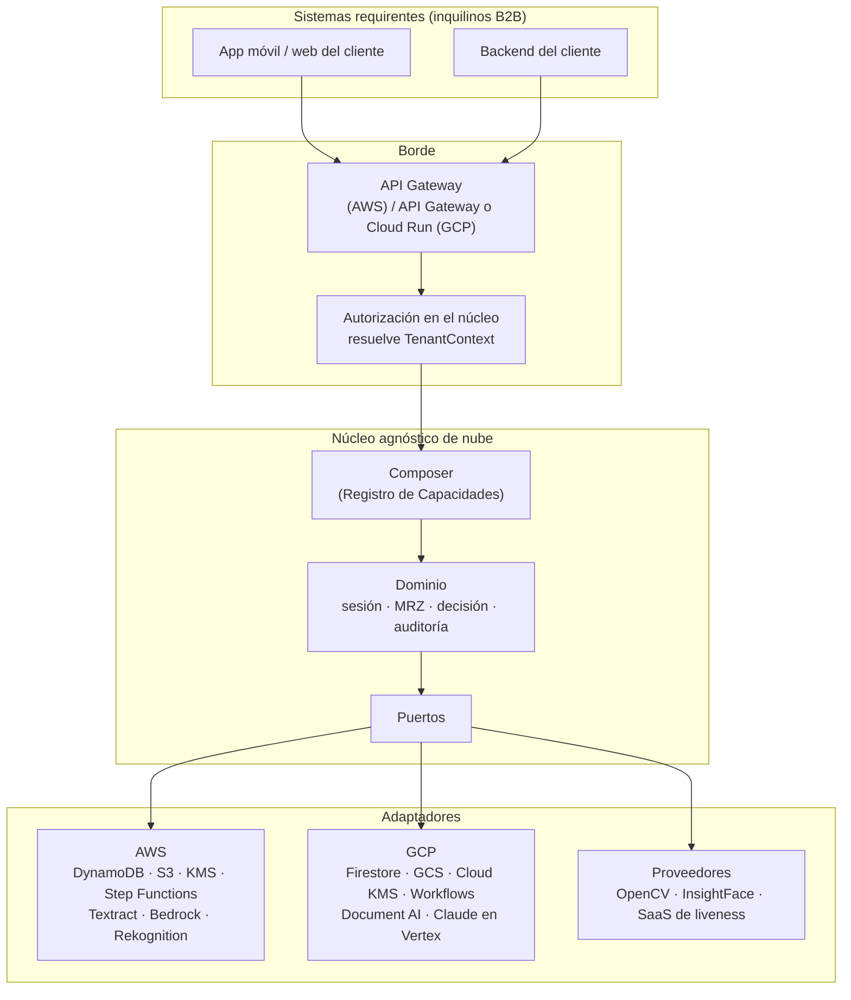

# Onboarding Genérico

**Middleware B2B transaccional y serverless para la orquestación dinámica de onboarding e identidad digital.**

Actúa como intermediario entre sistemas **requirentes** de onboarding (fintechs, neobancos, marketplaces, banca regulada) y **proveedores** de capacidades de verificación de identidad —SaaS corporativos, componentes de código abierto y modelos de IA—, componiendo dinámicamente los pasos de cada transacción según el inquilino, el país y el tipo de documento.

> **Estado:** andamiaje de arquitectura y base de implementación. La documentación, la infraestructura como código y el núcleo del dominio están completos y probados; los adaptadores de nube y de proveedores externos son esqueletos con la firma y el mapeo definidos. Ver [`docs/19-roadmap.md`](docs/19-roadmap.md).

---

## Índice rápido

| Quiero… | Ir a |
|---|---|
| Entender qué es y para qué sirve | [`docs/01-vision-y-alcance.md`](docs/01-vision-y-alcance.md) |
| Ver la arquitectura completa | [`docs/02-arquitectura.md`](docs/02-arquitectura.md) |
| Saber por qué se decidió cada cosa | [`docs/adr/`](docs/adr/) |
| Desplegar en AWS | [`docs/16-guia-de-despliegue-aws.md`](docs/16-guia-de-despliegue-aws.md) |
| Desplegar en GCP | [`docs/17-guia-de-despliegue-gcp.md`](docs/17-guia-de-despliegue-gcp.md) |
| Levantar el entorno local | [`docs/18-desarrollo-local.md`](docs/18-desarrollo-local.md) |
| Añadir un proveedor nuevo | [`docs/18-desarrollo-local.md`](docs/18-desarrollo-local.md) |
| Revisar licencias de terceros antes de integrar | [`docs/15-catalogo-de-proveedores-y-licencias.md`](docs/15-catalogo-de-proveedores-y-licencias.md) |
| Ver qué afirmaciones del spec original eran falsas | [`docs/20-fe-de-erratas-del-spec-original.md`](docs/20-fe-de-erratas-del-spec-original.md) |
| El mapa de lectura completo por rol | [`docs/00-indice.md`](docs/00-indice.md) |

---

## Capacidades

El middleware no implementa la verificación: la **orquesta**. Cada capacidad es un puerto del núcleo con uno o más adaptadores intercambiables por configuración.

| Capacidad | Qué hace | Estado |
|---|---|---|
| `document_alignment` | Rectificación de perspectiva de capturas móviles | Núcleo listo, adaptador OpenCV esqueleto |
| `data_extraction_ocr` | OCR espacial del documento de identidad | Puerto listo, adaptadores Textract / Document AI / Tesseract esqueleto |
| `semantic_extraction` | Normalización multipaís del texto crudo a un esquema canónico mediante LLM multimodal | Puerto listo, adaptadores Bedrock / Claude en Vertex esqueleto |
| `mrz_reading` | Lectura y validación matemática de la zona de lectura mecánica ICAO 9303 | **Implementado y probado** (TD1/TD2/TD3, dígitos 7-3-1 y compuesto) |
| `cross_field_validation` | Validación cruzada OCR ↔ MRZ ↔ datos declarados | **Implementado y probado** |
| `biometric_matching` | Comparación facial 1:1 documento ↔ selfie | Puerto listo, adaptadores esqueleto |
| `liveness_check` | Detección de vivacidad y de ataques de presentación | Puerto listo; ver [ADR-0009](docs/adr/0009-liveness-mediante-proveedor-certificado-unico.md) |
| `forgery_detection` | Detección de manipulación digital del documento | Puerto definido, planificada |
| `manual_review` | Derivación a analista de cumplimiento con log WORM | Puerto listo, servicio propio; ver [ADR-0010](docs/adr/0010-revision-humana-construida-a-medida.md) |
| `decision` | Agregación de evidencias y decisión auditable por umbrales del inquilino | **Implementado y probado** |
| `gdpr_purge` | Purga asíncrona, mutex distribuido y destrucción criptográfica | **Implementado y probado** (núcleo) |

---

## Arquitectura en una página



Tres reglas estructurales gobiernan el diseño y explican casi todo lo demás:

1. **El núcleo no sabe en qué nube corre.** Los puertos exponen operaciones de dominio (`guardar_sesión`, `esperar_decisión_manual`), nunca primitivas de infraestructura (`PK`, `SK`, `begins_with`, `waitForTaskToken`). Un puerto acoplado a DynamoDB hace inviable el adaptador de Firestore.
2. **Cuando GCP es más restrictivo, GCP dicta la forma del puerto.** Si la interfaz se diseña asumiendo que la plataforma aplica el aislamiento —el modelo de AWS con `dynamodb:LeadingKeys`—, el adaptador de GCP queda estructuralmente inseguro, porque GCP **no tiene equivalente**. Ver [ADR-0005](docs/adr/0005-aislamiento-multitenant-en-capas.md).
3. **El cifrado por inquilino es el control primario de aislamiento, no una defensa en profundidad opcional.** El `tenant_id` es Associated Data del cifrado de sobre: un error de alcance produce un fallo de descifrado, no una fuga. Ver [ADR-0006](docs/adr/0006-hierarchical-keyring-en-lugar-de-cachingcryptomaterialsmanager.md).

---

## Estructura del repositorio

```
.
├── api/                    Contratos: OpenAPI y esquemas JSON
├── deploy/docker/          Imágenes de contenedor y compose local
├── docs/                   Documentación de arquitectura, cumplimiento y operación
│   ├── adr/                Registros de decisión de arquitectura (ADR-0001..0015)
│   └── referencias/        Investigación verificada que respalda las decisiones
├── infra/terraform/        IaC para AWS y GCP (módulos + entornos dev/stg/prd)
├── scripts/                Utilidades de desarrollo y operación
├── src/onboarding_generico/
│   ├── domain/             Entidades, MRZ ICAO 9303, decisión, auditoría encadenada
│   ├── ports/              Interfaces del núcleo
│   ├── composer/           Motor de composición dirigido por especificación
│   ├── application/        Casos de uso
│   ├── crypto/             Cifrado de sobre, caché de material, política por campo
│   ├── adapters/           inmemory · aws · gcp · providers
│   └── handlers/           Puntos de entrada de Lambda y Cloud Run
└── tests/                  unit · contract · fixtures · run_smoke.py
```

---

## Arranque rápido

Requiere Python 3.14 (el código es compatible con 3.11 en adelante). No hace falta ninguna nube para ejecutar el núcleo y las pruebas: los adaptadores en memoria implementan todos los puertos.

```bash
git clone https://github.com/segurolotengopy/OnboardingGenerico.git
cd OnboardingGenerico

make install          # entorno virtual + dependencias de desarrollo
make test             # 362 pruebas sobre el núcleo y los adaptadores en memoria
make lint             # ruff + mypy estricto sobre el núcleo
```

Sin `make` ni dependencias externas:

```bash
PYTHONPATH=src python tests/run_smoke.py
```

Detalle completo en [`docs/18-desarrollo-local.md`](docs/18-desarrollo-local.md).

---

## Multi-nube: qué significa exactamente

El sistema **puede residir en AWS, en GCP o en ambas**. Eso no significa paridad ciega: significa que las diferencias están inventariadas y que el diseño las absorbe en los adaptadores.

| Puertos que se portan sin fricción | Puertos donde GCP dicta la interfaz | Puertos construidos a medida en ambas nubes |
|---|---|---|
| Almacenamiento de objetos, LLM, registro de contenedores, observabilidad, red privada | Aislamiento por inquilino, repositorio, autorización, saga | Revisión humana, liveness, configuración |

Nueve brechas de paridad están documentadas con su impacto y su mitigación en [`docs/10-multicloud-aws-gcp.md`](docs/10-multicloud-aws-gcp.md). Las tres críticas:

- **Liveness facial gestionado**: GCP no tiene equivalente a Amazon Rekognition Face Liveness. La respuesta del proyecto es un proveedor SaaS certificado único para ambas nubes, no un adaptador asimétrico.
- **`dynamodb:LeadingKeys`**: GCP no ofrece aislamiento del plano de datos aplicado por IAM. Es la brecha más peligrosa porque es *silenciosa*: el código funciona, simplemente no aísla.
- **Revisión humana gestionada**: Amazon SageMaker A2I está cerrado a nuevos clientes y los equivalentes de Google están apagados. Se construye a medida.

---

## Cumplimiento

El middleware se posiciona como **encargado del tratamiento** (Art. 28 del GDPR), no como responsable: el cliente B2B fija los umbrales de decisión y los plazos de retención, y el middleware los implementa. Ver [ADR-0014](docs/adr/0014-el-middleware-es-encargado-del-tratamiento.md).

Marcos cubiertos en [`docs/11-cumplimiento-normativo.md`](docs/11-cumplimiento-normativo.md): ICAO Doc 9303, ISO/IEC 30107-3, NIST SP 800-63-4 (IAL2), eIDAS 2.0 / EUDI Wallet, GDPR, GAFI R.10, y el estado real de la normativa de México, Bolivia y Paraguay a agosto de 2026.

> Esa documentación es una guía de ingeniería, no asesoría legal. Los puntos que exigen verificación en fuente primaria están inventariados y marcados.

---

## Una advertencia sobre el documento fuente

Este repositorio se construyó a partir de una especificación previa cuyas afirmaciones fueron verificadas contra documentación oficial. **Ocho de ellas resultaron falsas, obsoletas o mal atribuidas** —entre otras, el límite de 3 008 MB de memoria en Lambda "para AVX-512", el ahorro del 72,5 % con Express Workflows, y la atribución del 77 % de reducción de costo de KMS al `CachingCryptoMaterialsManager`, que el artículo original describe como *la causa* del problema—.

La corrección de cada una, con evidencia y con la redacción que debe usarse en su lugar, está en [`docs/20-fe-de-erratas-del-spec-original.md`](docs/20-fe-de-erratas-del-spec-original.md). Conviene leerlo antes de reutilizar el spec original en cualquier otro contexto.

---

## Contribuir

Ver [`CONTRIBUTING.md`](CONTRIBUTING.md). Antes de integrar cualquier componente de terceros, es obligatorio pasar por la política de licencias de [ADR-0012](docs/adr/0012-politica-de-licencias-de-terceros.md): el proyecto **prohíbe** AGPL y código sin licencia, exige revisión legal para Elastic License 2.0, y evalúa la licencia de los *pesos de los modelos* por separado de la del código.

Vulnerabilidades: [`SECURITY.md`](SECURITY.md). No abrir issues públicos.

## Licencia

[Apache License 2.0](LICENSE).
