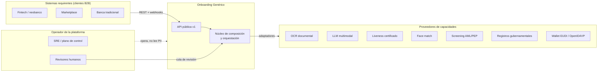
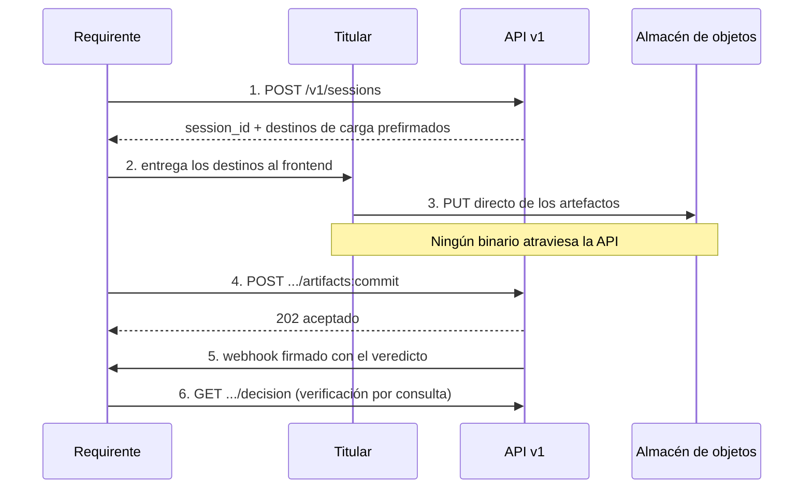

# 01 — Visión y alcance

| Campo | Valor |
|---|---|
| **Estado** | Aprobado |
| **Versión** | 1.1.0 |
| **Última actualización** | 2026-08-21 |
| **Responsable** | Producto y arquitectura |
| **Audiencia** | Arquitectura, producto, comercial, cumplimiento |
| **Documentos relacionados** | [00 — Índice](00-indice.md) · [02 — Arquitectura](02-arquitectura.md) · [11 — Cumplimiento normativo](11-cumplimiento-normativo.md) · [19 — Roadmap](19-roadmap.md) |

**Resumen ejecutivo.** Este documento fija **qué es y qué no es** Onboarding Genérico: el problema de negocio de un requirente que debe incorporar clientes de forma remota en cuatro jurisdicciones con proveedores fragmentados, la propuesta de valor de un middleware que trata el flujo como dato y al proveedor como intercambiable, y el reparto de responsabilidades entre requirente, titular, proveedor, operador y analista de cumplimiento. Contiene los doce casos de uso CU-01..CU-12, los requisitos funcionales RF-01..RF-26 y los no funcionales RNF-01..RNF-15 con sus métricas objetivo de latencia, disponibilidad y recuperación, y una lista explícita de lo que queda **fuera de alcance**, que es la parte del documento que más discusiones evita.

---

## 1. El problema

Una entidad que necesita incorporar clientes de forma remota —un neobanco en México, una fintech de crédito en Paraguay, un marketplace con vendedores en Bolivia, un banco europeo sujeto a eIDAS 2.0— se enfrenta a tres problemas simultáneos que rara vez se resuelven bien al mismo tiempo:

1. **Fragmentación de proveedores.** No existe un proveedor único que cubra OCR de documentos latinoamericanos, detección de vida certificada, cotejo contra registros gubernamentales locales (SEGIP en Bolivia; INE, SRE y SAT en México), listas de sanciones y PEP, y presentación de credenciales EUDI. Cada uno tiene su propio contrato, su propio SDK, su propio modelo de errores y su propio perímetro de datos.
2. **Fragmentación regulatoria.** El mismo flujo funcional tiene requisitos distintos por jurisdicción. México exige prueba de vida certificada con detección de *deepfakes*, máscaras, fotos estáticas y **ataques de inyección**, y desde la reforma de la CNBV publicada en el DOF el 1 de julio de 2026 incorpora expresamente la biometría facial a la CUB, prohibiendo transferir bases biométricas a terceros. Bolivia prohíbe delegar la ejecución de la debida diligencia del cliente (art. 32(II) del Instructivo UIF para EIF, R.A. N° 16). Paraguay pasó a un régimen tipo GDPR con la Ley 7593/2025, exigible hacia noviembre de 2027. La UE obliga al sector privado regulado a aceptar el EUDI Wallet el 6 de diciembre de 2027. Ver [11 — Cumplimiento normativo](11-cumplimiento-normativo.md).
3. **Coste de cambio.** Integrar un proveedor cuesta semanas; cambiarlo cuesta un proyecto. La lógica de negocio queda incrustada en el código de integración, y la organización queda cautiva de decisiones tomadas al inicio con información incompleta.

El resultado habitual es un *hairball* de integraciones punto a punto en el que la política de onboarding —qué se pide, a quién, en qué orden, con qué umbrales— vive dispersa entre condicionales de código, variables de entorno y conocimiento tácito.

## 2. Propuesta de valor

**Onboarding Genérico** es un middleware B2B transaccional y serverless que se interpone entre los sistemas **requirentes** de onboarding y los **proveedores** de capacidades de verificación, y que **compone dinámicamente el flujo** en función del tenant, el país del titular, el tipo de documento y el nivel de aseguramiento (*tier*) requerido.

Tres afirmaciones definen el producto:

| Afirmación | Consecuencia técnica |
|---|---|
| **El flujo es dato, no código.** | Una especificación de flujo versionada (JSON/YAML) se resuelve y compila en tiempo de despliegue de la especificación, no de la aplicación. Añadir un país o cambiar un umbral no requiere desplegar código. Ver [04 — Motor de composición](04-motor-de-composicion.md). |
| **El proveedor es intercambiable.** | Cada capacidad se expresa como un **puerto** del núcleo hexagonal, con adaptadores por proveedor y por nube. Sustituir un proveedor de OCR es un cambio de configuración de tenant más un adaptador nuevo. Ver [02 — Arquitectura](02-arquitectura.md). |
| **La nube es un detalle de despliegue.** | AWS es la implementación de referencia; GCP es una alternativa completa por adaptadores. Las brechas de paridad son conocidas, están documentadas y tienen mitigación explícita. Ver [10 — Multinube](10-multicloud-aws-gcp.md). |

### 2.1 Qué NO es la propuesta de valor

Un producto honesto se define también por lo que rehúsa prometer:

- **No es un proveedor de identidad.** No emite credenciales, no mantiene un registro de identidades verificadas, no opera una base antifraude compartida entre clientes. Este último punto no es una decisión de producto sino una restricción regulatoria en México (prohibición expresa de transferir o comercializar bases biométricas entre instituciones o a terceros) y una consecuencia del régimen de encargado del tratamiento del art. 28 del GDPR.
- **No decide el onboarding.** El middleware emite **señales y evidencias**; la decisión de aceptar o rechazar al cliente la toma el requirente. En Bolivia esto es condición de viabilidad legal, no una preferencia arquitectónica (art. 32(II) del Instructivo UIF).
- **No es un producto de liveness.** El `LivenessPort` se implementa con un proveedor certificado. Construir detección de vida con modelos abiertos para producción regulada es una decisión que este documento desaconseja expresamente. Ver [09 — Biometría y liveness](09-biometria-y-liveness.md).

## 3. Actores

| Actor | Rol | Responsabilidad legal (GDPR / equivalentes) |
|---|---|---|
| **Requirente** | Sistema cliente que inicia sesiones de onboarding y consume veredictos. | **Responsable del tratamiento.** Define finalidades, política de retención, umbrales de aceptación y decide el alta. |
| **Titular** | Persona física (o representante de persona jurídica en KYB) que aporta documento y biometría. | Interesado. Ejerce derechos de acceso, rectificación, supresión y portabilidad frente al requirente. |
| **Proveedor de capacidad** | SaaS corporativo, componente open source o modelo de IA que ejecuta un paso concreto. | **Subencargado.** Debe declararse en el registro público de subencargados y quedar cubierto por el DPA. |
| **Operador de la plataforma** | Equipo que opera el middleware. | **Encargado del tratamiento.** Trata datos únicamente según instrucciones documentadas del requirente. |
| **Revisor humano** | Analista de cumplimiento que resuelve casos derivados. | Personal autorizado del requirente o BPO contratado por él; sujeto a compromisos de confidencialidad. |

> **Nota de reparto.** Un revisor humano puede ser personal del operador solo si el requirente lo instruye por escrito y el DPA lo contempla. En Bolivia, el revisor que emite el veredicto de DDC debe pertenecer a la entidad obligada.

## 4. Casos de uso

### CU-01 — Onboarding de persona física, remoto y desatendido (LATAM)

El caso base. Sesión iniciada por el requirente, captura de anverso y reverso del documento, lectura MRZ cuando existe, extracción semántica de campos, detección de vida, cotejo facial 1:1 contra la foto del documento, cotejo contra registro gubernamental cuando el país lo ofrece, *screening* AML/PEP, y emisión de veredicto con evidencias. Corresponde a *remote unattended identity proofing* en la terminología de NIST SP 800-63A-4.

### CU-02 — Onboarding con derivación a revisión humana

Idéntico a CU-01 hasta que un paso produce confianza por debajo del umbral configurado o una señal de riesgo. El caso pasa a `ReviewCase`, se suspende la ejecución con `.waitForTaskToken` (AWS) o el patrón de persistencia y relanzamiento (GCP), y se reanuda con la decisión del revisor. Ver [07 — Orquestación](07-orquestacion.md).

### CU-03 — Verificación por presentación de credencial EUDI

El titular presenta una credencial de su EUDI Wallet mediante OpenID4VP. El middleware actúa como *Relying Party*: valida la presentación contra las Trusted Lists / Lists of Trusted Entities, verifica la divulgación selectiva y emite veredicto **sin capturar biometría ni leer MRZ**. Es un flujo estructuralmente distinto, no un paso más. Fecha de obligatoriedad para el sector privado regulado en la UE: **6 de diciembre de 2027**.

### CU-04 — KYB: alta de persona jurídica

Verificación de la entidad (documento constitutivo, registro mercantil, RUC/RFC/NIT) más verificación de identidad de representantes legales y beneficiarios finales. GAFI R.10 exige *"identificar al beneficiario final y tomar medidas razonables para verificar su identidad"*. En Paraguay, la Resolución SEPRELAD 70/2019 art. 25 fija el umbral de participación en **>10 %** para la nómina de socios.

### CU-05 — Re-verificación y DDC continuada

GAFI R.10 exige DDC *"al inicio y durante la relación comercial"* (recogido literalmente en el art. 33(a) y (b) del Instructivo UIF boliviano). El middleware soporta sesiones de re-verificación que reutilizan el expediente existente y ejecutan solo los pasos caducados.

### CU-06 — Purga por fin de relación o por derecho de supresión

El requirente notifica el fin de la relación comercial, lo que **arranca el reloj** de retención AML. Separadamente, puede solicitar la supresión de datos biométricos conservando el expediente KYC. Ver [12 — Retención y borrado](12-retencion-y-borrado.md).

### CU-07 — Onboarding remoto atendido

Variante de CU-01 en la que un operador del requirente supervisa la captura en tiempo real por videollamada. El middleware no provee el canal de vídeo: recibe los artefactos capturados durante la sesión atendida, registra la identidad del operador supervisor como actor en el `AuditEvent`, y aplica la política de umbrales del tenant para el modo atendido, que puede diferir de la del modo desatendido. Corresponde a *remote attended identity proofing* en NIST SP 800-63A-4. Es el modo que algunos supervisores latinoamericanos aceptan cuando el desatendido genera reparos.

### CU-08 — Recaptura por calidad insuficiente

La capacidad `capture.quality.v1` rechaza un artefacto antes de gastar en pasos facturables (reflejos, recorte, resolución, oclusión, desenfoque). La sesión no falla: emite un evento de recaptura con el motivo estructurado, mantiene el resto de artefactos ya validados, y admite la sustitución del artefacto defectuoso conservando el `session_id`. La cuota de recapturas por sesión es política del tenant. Ver [09 §6](09-biometria-y-liveness.md).

### CU-09 — Degradación controlada por caída de proveedor

Un proveedor primario supera su umbral de error o de latencia y el disyuntor se abre. La sesión continúa con el `fallback_provider` declarado en la especificación, la `Evidence` registra qué proveedor ejecutó realmente el paso, y si no hay fallback apto la sesión se deriva a revisión humana en lugar de aprobarse o rechazarse automáticamente. Ver [04 §9](04-motor-de-composicion.md).

### CU-10 — Alta y configuración de un tenant

Operación del plano de control: creación de la clave gestionada del tenant, alta en el proveedor de identidad, vinculación de capacidades y proveedores, política de retención instruida por el responsable, configuración de webhooks y límites de tasa. Es un caso de uso de primer orden porque su corrección determina el aislamiento de todo lo demás. Ver [16 §5](16-guia-de-despliegue-aws.md) y [17](17-guia-de-despliegue-gcp.md).

### CU-11 — Publicación canaria de una especificación de flujo

Un cambio de política —un umbral, un proveedor, un paso nuevo— se publica como versión nueva de la especificación, se valida contra el Registro de Capacidades y se activa para un porcentaje de sesiones del tenant. Las sesiones en vuelo mantienen congelada la versión con la que empezaron. Ver [04 §8](04-motor-de-composicion.md).

### CU-12 — Reconstrucción de expediente para auditoría

Un supervisor, un auditor o el propio requirente solicitan la reconstrucción completa de una decisión: qué pasos se ejecutaron, con qué proveedor y versión de modelo, con qué umbrales, con qué puntuaciones, quién decidió y cuándo. El middleware devuelve el manifiesto de evidencias con la cadena de `AuditEvent` encadenada por hash. Es la razón de ser del sello WORM y del log inmutable. Ver [13 §2.4](13-observabilidad-y-sre.md) y [11 §7](11-cumplimiento-normativo.md).

### 4.1 Trazabilidad de casos de uso

| Caso de uso | Actor que lo inicia | Documento donde se detalla | Fase |
|---|---|---|---|
| CU-01 Onboarding remoto desatendido | Requirente | [02 §7](02-arquitectura.md) | F1 |
| CU-02 Derivación a revisión humana | Motor de decisión | [08 §6](08-ia-y-extraccion-semantica.md), [07 §4](07-orquestacion.md) | F1 |
| CU-03 Presentación de credencial EUDI | Titular | [11 §3.1](11-cumplimiento-normativo.md) | F4 |
| CU-04 KYB de persona jurídica | Requirente | [11 §5.1](11-cumplimiento-normativo.md) | F5 |
| CU-05 Re-verificación y DDC continuada | Requirente o calendario | [12 §5](12-retencion-y-borrado.md) | F3 |
| CU-06 Purga | Requirente o calendario | [12 §6](12-retencion-y-borrado.md) | F1 |
| CU-07 Onboarding remoto atendido | Operador del requirente | [09 §2.2](09-biometria-y-liveness.md) | F3 |
| CU-08 Recaptura por calidad | Middleware | [09 §6.2](09-biometria-y-liveness.md) | F1 |
| CU-09 Degradación por caída de proveedor | Middleware | [04 §9](04-motor-de-composicion.md) | F1 |
| CU-10 Alta de tenant | Operador de la plataforma | [16 §5](16-guia-de-despliegue-aws.md) | F0 |
| CU-11 Publicación canaria de especificación | Operador o requirente | [04 §8.2](04-motor-de-composicion.md) | F1 |
| CU-12 Reconstrucción de expediente | Auditor o requirente | [13 §2.4](13-observabilidad-y-sre.md) | F1 |

Las fases se definen en [19 — Roadmap](19-roadmap.md) §2.

## 5. Alcance

### 5.1 Dentro del alcance

| Área | Contenido |
|---|---|
| **Composición de flujos** | Registro de capacidades, especificación declarativa, resolución por tenant/país/documento/tier, compilación a ASL y a YAML de Cloud Workflows, versionado y despliegue de especificaciones sin desplegar código. |
| **Orquestación** | Saga transaccional con esperas largas, reintentos, idempotencia, compensación, derivación a revisión humana. |
| **Extracción documental** | OCR espacial genérico + razonamiento semántico con LLM multimodal, validación MRZ conforme a ICAO Doc 9303 (algoritmo 7-3-1, formatos TD1/TD2/TD3), validación cruzada frontal ↔ MRZ. |
| **Biometría** | Cotejo facial 1:1 con umbrales conformes a SP 800-63A-4, integración con proveedor de liveness certificado, calidad de imagen. |
| **Multi-tenancy** | Aislamiento por recurso (modelos silo/pool/bridge), cadena de identidad de tenant, ABAC, cifrado de sobre por tenant con `tenant_id` como AAD. |
| **Cumplimiento** | Trazabilidad de evidencias, log de auditoría inmutable, matriz de retención por jurisdicción, purga verificable, paquete de asistencia para DPIA. |
| **Multinube** | Implementación de referencia en AWS; alternativa completa en GCP con brechas documentadas y suite de pruebas de contrato compartida. |
| **Operación** | Observabilidad, SLI/SLO, runbooks, IaC con Terraform/OpenTofu, guías de despliegue paso a paso. |

### 5.2 Fuera del alcance

| Excluido | Motivo |
|---|---|
| SDK de captura móvil/web propio | El SDK de captura del proveedor de liveness es parte de su certificación. Un SDK propio invalidaría la cadena de evidencia. Se documenta la integración, no se construye el SDK. |
| Motor de decisión de riesgo crediticio | Distinto dominio. El middleware emite señales; el *scoring* crediticio es del requirente. |
| Base antifraude compartida entre tenants | Prohibida en México; incompatible con el art. 28 del GDPR sin instrucción expresa; reclasificaría al operador como corresponsable (art. 26). |
| Entrenamiento de modelos con datos de clientes | Idéntico motivo. Solo con instrucción documentada y acuerdo expreso. |
| Emisión de credenciales verificables (rol de *Issuer* EUDI) | El producto es *Relying Party*. Ser *Issuer* exige cualificación distinta. |
| Firma electrónica cualificada y sellado de tiempo cualificado | Se integra como puerto si un tenant lo requiere; no se implementa el servicio de confianza. |
| Portabilidad a nubes distintas de AWS y GCP | Los puertos lo permitirían; no hay adaptadores ni compromiso de soporte. |
| Decisión de aceptación del cliente final | Restricción regulatoria (Bolivia) y de reparto de responsabilidades. |

### 5.3 Supuestos

- Los requirentes disponen de un frontend propio o integran el SDK del proveedor de liveness. El middleware nunca recibe *streams* de vídeo por su API pública; recibe punteros a objetos ya cargados mediante URL prefirmada.
- La residencia de datos se resuelve por despliegue regional, no por configuración lógica. Datos de titulares de la UE se procesan en la UE. Ninguno de los tres países LATAM del alcance (México, Bolivia, Paraguay) tiene decisión de adecuación de la Comisión Europea.
- El requirente fija la política de retención por escrito en el DPA. El middleware la implementa; no la elige.

## 6. Glosario bilingüe

| Término (es) | Término (en) | Definición operativa en este proyecto |
|---|---|---|
| **eKYC** | *electronic Know Your Customer* | Conjunto de procesos de identificación y verificación de un cliente persona física por medios electrónicos. En este producto, el flujo compuesto que va de la captura al veredicto. |
| **KYB** | *Know Your Business* | Equivalente para personas jurídicas: verificación de la entidad, de sus representantes y de sus beneficiarios finales. |
| **DDC / debida diligencia del cliente** | *CDD — Customer Due Diligence* | Medidas de GAFI R.10: identificar y verificar al cliente y al beneficiario final, entender el propósito de la relación y monitorear de forma continua. |
| **DDC ampliada** | *EDD — Enhanced Due Diligence* | Régimen reforzado para alto riesgo (PEP, jurisdicciones no cooperantes, estructuras opacas). Art. 28 de la Res. SEPRELAD 70/2019 en Paraguay. |
| **Prueba de vida pasiva** | *passive liveness* | Determinación de que la muestra biométrica procede de una persona presente y viva **sin acción explícita del usuario**: se analiza un frame o una secuencia corta. Menor fricción, mayor exigencia al modelo. |
| **Prueba de vida activa** | *active liveness* | Requiere una acción del usuario (girar la cabeza, seguir un reto de color, parpadear). Mayor fricción, evidencia de reto-respuesta que dificulta el *replay*. |
| **PAD** | *Presentation Attack Detection* | Detección de ataques de presentación conforme a ISO/IEC 30107-3. Se mide con **APCER** y **BPCER** reportadas por separado, y **RIAPAR** desde la edición de 2023. **ACER no es métrica normativa.** |
| **APCER** | *Attack Presentation Classification Error Rate* | Proporción de ataques clasificados como legítimos, **por especie de PAI**; el resultado global es el peor caso entre especies. Mide seguridad. |
| **BPCER** | *Bona Fide Presentation Classification Error Rate* | Proporción de presentaciones legítimas clasificadas como ataque. Mide fricción. |
| **IAPAR** | *Impostor Attack Presentation Accept Rate* | Probabilidad de que un ataque contra el sistema completo (PAD + matcher) sea aceptado. NIST SP 800-63A-4 exige **IAPAR < 0,07**. |
| **Ataque de inyección** | *injection attack* | Introducción de medios sintéticos directamente en el pipeline (cámara virtual, *hooking* del stream). **No es un ataque de presentación** y queda fuera del alcance de ISO/IEC 30107-3. Exigido expresamente por la CNBV mexicana. |
| **MRZ** | *Machine Readable Zone* | Zona de lectura mecánica de documentos de viaje, definida en ICAO Doc 9303. Formatos **TD1** (3×30), **TD2** (2×36) y **TD3** (2×44), con dígitos de control módulo 10 y pesos 7-3-1. |
| **eMRTD** | *electronic Machine Readable Travel Document* | Documento de viaje con chip. El grupo de datos DG2 contiene la imagen facial, codificada en ISO/IEC 19794-5 o en su sucesor ISO/IEC 39794-5. |
| **IAL2** | *Identity Assurance Level 2* | Nivel de aseguramiento de identidad de NIST SP 800-63A-4 que admite verificación remota desatendida, con FMR ≤ 1:10.000, FNMR ≤ 1:100, paridad demográfica con degradación ≤ 25 % y PAD con IAPAR < 0,07. **KBA está prohibida.** |
| **FMR / FNMR** | *False Match Rate / False Non-Match Rate* | Tasa de falsa coincidencia y de falsa no coincidencia del matcher biométrico, en verificación 1:1. |
| **Tenant** | *tenant* | Cliente B2B del middleware, unidad de aislamiento, facturación, configuración y política. Identificado por `tenant_id`, que es **Associated Data del cifrado de sobre**. |
| **Capacidad** | *capability* | Unidad funcional invocable declarada en el registro de capacidades (p. ej. `ocr.document.v1`, `biometrics.liveness.v2`). Tiene contrato de entrada/salida, proveedores que la implementan y restricciones de aplicabilidad. |
| **Especificación de flujo** | *flow specification* | Documento versionado que declara los pasos, sus dependencias, umbrales y políticas de fallback para una combinación tenant × país × tipo de documento × tier. |
| **Sesión** | *session* | Instancia de ejecución de un flujo para un titular concreto. Es la raíz de agregación del dominio. |
| **Artefacto** | *artifact* | Objeto binario aportado o generado (imagen de documento, selfie, frame de liveness). Nunca viaja por el estado del orquestador: se referencia por puntero (`s3://`, `gs://`). |
| **Evidencia** | *evidence* | Registro inmutable del resultado de un paso: proveedor, versión de modelo, umbrales aplicados, puntuaciones, marca temporal. Es lo que sostiene la trazabilidad regulatoria. |
| **Veredicto / decisión** | *decision* | Resultado agregado de la sesión emitido por el middleware: `APPROVED`, `REJECTED`, `MANUAL_REVIEW` con sus razones. **No es el alta del cliente**, que la decide el requirente. |
| **DPA** | *Data Processing Agreement* | Contrato del art. 28 del GDPR entre responsable y encargado. Fija objeto, duración, naturaleza, finalidad, tipos de datos, subencargados, retención y auditoría. |
| **Responsable / encargado** | *controller / processor* | El requirente es responsable; el operador del middleware es encargado; los proveedores son subencargados. Determinar finalidades o medios esenciales por cuenta propia reclasifica al encargado como corresponsable (art. 26). |
| **Crypto-shredding** | *crypto-shredding* | Borrado lógico por destrucción de la clave que cifra los datos. Su plazo real depende de la ventana de destrucción del KMS: **7–30 días en AWS**, **30 días por defecto en Cloud KMS** (configurable). |
| **Beacon** | *searchable-encryption beacon* | Índice HMAC truncado del AWS Database Encryption SDK que permite consultas de igualdad sobre atributos cifrados. Su longitud se mide **en bits** y **no puede cambiarse** tras escribir registros. |
| **Puerto / adaptador** | *port / adapter* | Interfaz del núcleo (puerto) e implementación concreta contra una tecnología o proveedor (adaptador). Base de la arquitectura hexagonal del producto. |

## 7. Modelo de interacción

El requirente interactúa con el middleware por tres canales, y esa separación es deliberada.

| Canal | Qué transporta | Por qué separado |
|---|---|---|
| **API REST** | Comandos y consultas: crear sesión, confirmar artefactos, consultar estado y veredicto, gestionar tenants y especificaciones, ejercer derechos | Superficie autenticada, con validación completa y limitación por tenant |
| **Carga directa con URL prefirmada** | Los artefactos binarios | Evita el techo de payload del gateway y de la función de cómputo, reduce la superficie de la API, y permite fijar cifrado y tamaño en la propia política de la URL |
| **Webhook firmado** | Notificación asíncrona del veredicto y de eventos de sesión | El flujo es asíncrono por naturaleza; obligar a sondeo desperdicia recursos de ambos lados |

Reglas del contrato que conviene fijar desde el principio:

| Regla | Motivo |
|---|---|
| Toda operación de creación acepta `Idempotency-Key` | El requirente puede reintentar sin duplicar sesiones |
| Los webhooks son **at-least-once** y llevan `event_id` | El requirente deduplica; se documenta explícitamente en el contrato |
| Consultar una sesión ajena devuelve `404`, no `403` | Un `403` confirmaría la existencia del recurso |
| El `tenant_id` **nunca** se acepta en el cuerpo de la petición | Se toma del contexto autenticado; aceptarlo del cuerpo sería una escalada trivial |
| Los errores usan una taxonomía cerrada, sin trazas internas | Evita filtrar detalle de implementación y de datos |

## 8. Requisitos funcionales

Identificadores estables. Cada RF indica el caso de uso que lo origina y el documento donde se especifica su implementación. La verificación es la condición que debe cumplir una prueba automatizada para darlo por satisfecho.

### 8.1 Composición y plano de control

| # | Requisito | Origen | Detalle |
|---|---|---|---|
| **RF-01** | El sistema resuelve la especificación de flujo aplicable a partir de la tupla `tenant × país × tipo de documento × tier`, con precedencia por especificidad. | CU-01 | [04 §5](04-motor-de-composicion.md) |
| **RF-02** | El sistema valida toda especificación contra el Registro de Capacidades antes de publicarla, y rechaza la publicación si una capacidad, versión, país o tipo de documento no está soportado. | CU-11 | [04 §6](04-motor-de-composicion.md) |
| **RF-03** | El sistema compila una especificación publicada a la representación nativa del orquestador de la nube de destino, sin desplegar código de aplicación. | CU-11 | [04 §7](04-motor-de-composicion.md) |
| **RF-04** | El sistema congela en la sesión la versión de especificación y las versiones de capacidad vigentes en el momento de iniciarla. | CU-12 | [04 §5.3](04-motor-de-composicion.md) |
| **RF-05** | El sistema permite activar una versión nueva de especificación para un porcentaje configurable de sesiones de un tenant, y revertirla sin desplegar. | CU-11 | [04 §8.2](04-motor-de-composicion.md) |
| **RF-06** | El sistema da de alta un tenant con clave criptográfica propia, identidad federada, vinculación de capacidades y política de retención instruida por el responsable. | CU-10 | [16 §5](16-guia-de-despliegue-aws.md) |

### 8.2 Ejecución de sesiones

| # | Requisito | Origen | Detalle |
|---|---|---|---|
| **RF-07** | El sistema crea sesiones idempotentes: la misma `Idempotency-Key` del mismo tenant devuelve la misma sesión, nunca una nueva. | CU-01 | [07 §6.2](07-orquestacion.md) |
| **RF-08** | El sistema entrega destinos de carga prefirmados y **no acepta binarios por su API pública**. | CU-01 | [02 §7](02-arquitectura.md) |
| **RF-09** | El sistema verifica la integridad de cada artefacto (`sha256`) antes de que ningún paso lo consuma. | CU-01 | [03 §2.1](03-modelo-de-dominio.md), I6 |
| **RF-10** | El sistema evalúa la calidad del artefacto antes de invocar capacidades facturables y admite recaptura sin perder la sesión. | CU-08 | [09 §6.2](09-biometria-y-liveness.md) |
| **RF-11** | El sistema ejecuta los pasos respetando sus dependencias declaradas y paraleliza los que no las tienen. | CU-01 | [04 §7.4](04-motor-de-composicion.md) |
| **RF-12** | El sistema suspende la ejecución durante esperas humanas o de proveedor externo sin consumir cómputo, y la reanuda con correlación explícita. | CU-02 | [07 §4](07-orquestacion.md) |
| **RF-13** | El sistema aplica `fallback_provider` cuando el primario falla o su disyuntor está abierto, y deriva a revisión humana si no hay alternativa apta. | CU-09 | [04 §9](04-motor-de-composicion.md) |
| **RF-14** | El sistema emite exactamente una `Decision` por sesión, con sus motivos estructurados y su manifiesto de evidencias. | CU-01 | [03 §2.1](03-modelo-de-dominio.md), I5 |
| **RF-15** | El sistema notifica el veredicto por webhook firmado con semántica *at-least-once* y `event_id` para deduplicación. | CU-01 | [02 §7](02-arquitectura.md) |
| **RF-16** | El sistema ejecuta el flujo alternativo de verificación por presentación de credencial EUDI sin capturar biometría ni leer MRZ. | CU-03 | [11 §3.1](11-cumplimiento-normativo.md) |

### 8.3 Verificación de identidad

| # | Requisito | Origen | Detalle |
|---|---|---|---|
| **RF-17** | El sistema extrae los campos canónicos del documento combinando OCR espacial y razonamiento semántico, y normaliza los términos locales de cada país al modelo canónico. | CU-01 | [08 §2](08-ia-y-extraccion-semantica.md), [08 §4.7](08-ia-y-extraccion-semantica.md) |
| **RF-18** | El sistema valida la MRZ conforme a ICAO Doc 9303 y **hace prevalecer la MRZ sobre la extracción semántica** en caso de discrepancia en campos coincidentes. | CU-01 | [08 §3](08-ia-y-extraccion-semantica.md) |
| **RF-19** | El sistema realiza cotejo facial 1:1 entre la selfie y el retrato del documento, con umbral configurable por tenant y por población. | CU-01 | [09 §2](09-biometria-y-liveness.md) |
| **RF-20** | El sistema obtiene resultado de detección de vida de un proveedor certificado y registra el identificador de sesión del proveedor como evidencia. | CU-01 | [09 §7](09-biometria-y-liveness.md) |
| **RF-21** | El sistema deriva a revisión humana cuando la confianza agregada cae bajo el umbral del tenant, **y ante la duda deriva en lugar de aprobar**. | CU-02 | [08 §6.1](08-ia-y-extraccion-semantica.md) |

### 8.4 Cumplimiento y ciclo de vida del dato

| # | Requisito | Origen | Detalle |
|---|---|---|---|
| **RF-22** | El sistema registra cada paso como `Evidence` inmutable con proveedor, versión de modelo, umbrales aplicados, puntuaciones y marca temporal, y sella el expediente en almacenamiento WORM. | CU-12 | [03 §2](03-modelo-de-dominio.md), [13 §2.4](13-observabilidad-y-sre.md) |
| **RF-23** | El sistema implementa la política de retención instruida por el responsable, por jurisdicción y por clase de dato, y purga de forma verificable al vencimiento. | CU-06 | [12 §3](12-retencion-y-borrado.md), [12 §9](12-retencion-y-borrado.md) |
| **RF-24** | El sistema permite suprimir los datos biométricos conservando el expediente KYC exigido por la normativa AML. | CU-06 | [12 §2.1](12-retencion-y-borrado.md) |
| **RF-25** | El sistema reconstruye, para cualquier sesión cerrada, la traza completa de la decisión con su cadena de auditoría encadenada por hash. | CU-12 | [13 §2.4](13-observabilidad-y-sre.md) |
| **RF-26** | El sistema soporta sesiones de re-verificación que reutilizan el expediente vigente y ejecutan solo los pasos caducados. | CU-05 | [12 §5](12-retencion-y-borrado.md) |

## 9. Requisitos no funcionales

Los SLO operativos, su ventana de medición y su presupuesto de error están en [13 — Observabilidad y SRE](13-observabilidad-y-sre.md) §4; aquí se fija el requisito y su métrica objetivo, sin duplicar el aparato de medición.

### 9.1 Prioridad relativa

Cuando dos requisitos no funcionales entran en conflicto, gana el de número de prioridad menor. Este orden explica decisiones que de otro modo parecerían conservadoras en exceso.

| Dimensión | Prioridad | Nota |
|---|---|---|
| **Corrección del aislamiento** | 1 | Un fallo de aislamiento es más grave que una caída. Es un SLI con presupuesto de error **cero** |
| **Trazabilidad de la decisión** | 2 | Sin reconstrucción del expediente, el producto no sirve para su propósito regulatorio |
| **Cumplimiento de la purga** | 3 | Retener más allá del plazo es un incumplimiento, no una postura conservadora |
| **Disponibilidad** | 4 | Un onboarding caído bloquea el alta de clientes del requirente |
| **Latencia percibida por el titular** | 5 | Determina la tasa de abandono; es la métrica que el requirente siente comercialmente |
| **Coste por sesión** | 6 | Importa, y se mide, pero no se optimiza a costa de las cinco anteriores |

Dos consecuencias de este orden que aparecen en todo el diseño:

- **Ante la duda, se deriva a revisión humana en lugar de aprobar.** El coste de un falso aprobado en un flujo KYC no es un error de producto: es un incumplimiento ([08](08-ia-y-extraccion-semantica.md) §6.2).
- **Ante un fallo de descifrado, no se "arregla" el descifrado: se investiga el aislamiento.** Un fallo de descifrado es la manifestación esperada de un error de alcance de tenant ([13](13-observabilidad-y-sre.md) §5.2, RB-04).

### 9.2 Requisitos con métrica objetivo

| # | Requisito | Métrica objetivo | Medición / detalle |
|---|---|---|---|
| **RNF-01** | Corrección del aislamiento entre tenants | **100 %**, presupuesto de error **cero**. Cualquier fallo es incidente de severidad 1 | SLI-7 en [13 §4](13-observabilidad-y-sre.md); suite de [05 §8](05-multitenancy-y-aislamiento.md) |
| **RNF-02** | Trazabilidad de la decisión | **100 %** de las sesiones cerradas reconstruibles: proveedor, versión, umbral y resultado por paso | [13 §2.4](13-observabilidad-y-sre.md) |
| **RNF-03** | Cumplimiento de la purga | **99,9 %** de los titulares purgados dentro de las 48 h de la fecha objetivo | SLI-8 en [13 §4](13-observabilidad-y-sre.md) |
| **RNF-04** | Disponibilidad de la API pública | **99,9 %** mensual (43 min 12 s de presupuesto) | SLI-1 en [13 §4](13-observabilidad-y-sre.md) |
| **RNF-05** | Latencia de creación de sesión | **p95 ≤ 400 ms** | SLI-2 |
| **RNF-06** | Latencia del sub-flujo automatizado completo | **p95 ≤ 25 s** desde el *commit* de artefactos | SLI-3 |
| **RNF-07** | Tiempo hasta veredicto automático | **p95 ≤ 90 s**, excluyendo sesiones derivadas a revisión | SLI-4 |
| **RNF-08** | Frescura de la notificación del veredicto | **p95 ≤ 30 s** desde `DECIDED` hasta webhook con 2xx | SLI-6 |
| **RNF-09** | Tasa de éxito del pipeline | **≥ 99,5 %** de sesiones que alcanzan estado terminal sin fallo técnico | SLI-5 |
| **RNF-10** | Recuperación ante desastre, datos de dominio | **RPO** segundos con réplica, 1 h con exportación programada; **RTO** minutos a horas según tier | [10 §6.3](10-multicloud-aws-gcp.md) |
| **RNF-11** | Recuperación ante desastre, sesiones en vuelo | **No se replican.** Las sesiones suspendidas sobreviven por el patrón de continuación; las que están dentro del sub-flujo automatizado se reinician | [10 §6.3](10-multicloud-aws-gcp.md), [07 §7.2](07-orquestacion.md) |
| **RNF-12** | Residencia de datos | **0 transferencias** de datos personales entre células. Titulares de la UE se procesan en la UE | [10 §6.2](10-multicloud-aws-gcp.md) |
| **RNF-13** | Ausencia de PII en telemetría | **0 hallazgos** en el análisis de logs y atributos de traza | [13 §2.2](13-observabilidad-y-sre.md) |
| **RNF-14** | Portabilidad entre nubes | La suite de contrato de puertos pasa **idéntica** en AWS y GCP salvo las excepciones declaradas | [10 §8](10-multicloud-aws-gcp.md) |
| **RNF-15** | Coste por sesión | Medido y presupuestado por tenant y país; **no se optimiza a costa de RNF-01..RNF-03** | `cost.per_session` en [13 §3.2](13-observabilidad-y-sre.md) |

### 9.3 Presupuesto de latencia por capacidad

RNF-06 fija el techo del sub-flujo automatizado. Este es el reparto interno de ese presupuesto, que sirve para localizar al culpable cuando el SLI se degrada, y para decidir si un proveedor candidato cabe en el flujo antes de contratarlo.

| Capacidad | p95 objetivo | Naturaleza | Nota |
|---|---|---|---|
| `capture.quality.v1` | ≤ 300 ms | En proceso | Se ejecuta primero, siempre; su coste debe ser despreciable |
| `ocr.document.v1` (por cara) | ≤ 3 s | Proveedor gestionado | Las dos caras se ejecutan en paralelo |
| `mrz.parse.v1` | ≤ 50 ms | En proceso | Implementación propia, sin red |
| `extraction.semantic.v1` | ≤ 8 s | LLM multimodal | Es el paso dominante del presupuesto |
| `validation.crossfield.v1` | ≤ 100 ms | En proceso | |
| `document.tamper.v1` | ≤ 2 s | Proveedor o modelo propio | |
| `biometrics.facematch.v1` | ≤ 1,5 s | Proveedor o modelo propio | En GCP, con instancia mínima > 0 para evitar el arranque en frío |
| `registry.verify.v1` | ≤ 5 s | Registro gubernamental | **Fuera de control del middleware**; se acota con timeout y disyuntor |
| `aml.screening.v1` | ≤ 3 s | Proveedor SaaS | |
| `decision.aggregate.v1` | ≤ 100 ms | En proceso | |
| `biometrics.liveness.v2` | No aplica | Espera larga | Depende del titular; queda fuera de RNF-06 y entra en RNF-07 |
| `review.human.v1` | No aplica | Espera larga | Se mide con SLA de cola, no con SLI de latencia |

<!-- PENDIENTE DE VERIFICAR: el reparto de latencia por capacidad es un presupuesto de diseño interno, no un dato tomado de la investigación de referencia ni de un contrato de proveedor. Debe recalibrarse con datos de producción y con los SLA reales de cada proveedor contratado antes de comprometerlo con un cliente. -->

> **Cómo se lee esta tabla.** La suma de los pasos secuenciales del camino crítico (`calidad` → `ocr` → `mrz` → `extracción` → `validación` → `facematch` → `registro` → `AML` → `decisión`) queda por debajo del techo de 25 s de RNF-06 con margen para reintentos. Un proveedor cuyo p95 contractual exceda la fila correspondiente **no cabe en el flujo sin renegociar el SLO**, y esa conversación se tiene antes de firmar, no después.

## 10. Criterios de éxito

| Dimensión | Criterio verificable |
|---|---|
| Composición | Añadir un país nuevo con documento nuevo no requiere desplegar código de aplicación: solo una especificación de flujo y, si el documento es novedoso, una plantilla de extracción. |
| Portabilidad | La suite de pruebas de contrato de puertos pasa idéntica contra los adaptadores AWS y GCP, salvo las excepciones declaradas en [10 — Multinube](10-multicloud-aws-gcp.md). |
| Aislamiento | Las pruebas de aislamiento de tenant (ver [05](05-multitenancy-y-aislamiento.md) §8) fallan si un tenant puede leer datos de otro, y forman parte del *pipeline* de CI obligatorio. |
| Trazabilidad | Para cualquier sesión cerrada es reconstruible: qué proveedor ejecutó cada paso, con qué versión, con qué umbral y con qué resultado. |
| Cumplimiento | Existe un mapeo trazable de cada control técnico a un requisito normativo concreto ([11](11-cumplimiento-normativo.md) §7). |

---

## Referencias

- [`docs/referencias/cumplimiento-normativo-y-estandares.md`](referencias/cumplimiento-normativo-y-estandares.md) — ICAO Doc 9303, ISO/IEC 30107-3, NIST SP 800-63A-4, GDPR, LFPDPPP y CNBV (México), ASFI/UIF (Bolivia), Ley 7593/2025 y SEPRELAD (Paraguay), GAFI R.10 y Guía de Identidad Digital, matriz de retención.
- [`docs/referencias/aws-arquitecturas-de-referencia.md`](referencias/aws-arquitecturas-de-referencia.md) — patrones multi-tenant, cifrado, orquestación y motor de flujos dinámicos en AWS.
- [`docs/referencias/gcp-paridad-de-servicios.md`](referencias/gcp-paridad-de-servicios.md) — matriz de equivalencias AWS→GCP y brechas críticas.
- [02 — Arquitectura](02-arquitectura.md) · [04 — Motor de composición](04-motor-de-composicion.md) · [11 — Cumplimiento normativo](11-cumplimiento-normativo.md) · [19 — Roadmap](19-roadmap.md) · [20 — Fe de erratas del spec](20-fe-de-erratas-del-spec-original.md)
