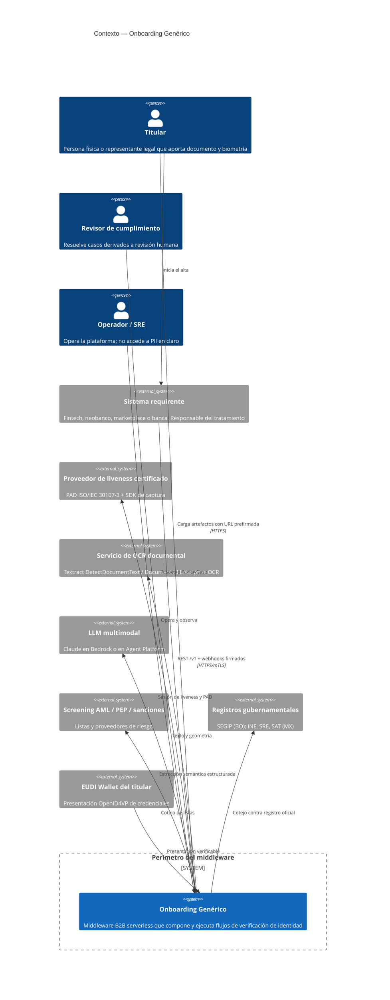
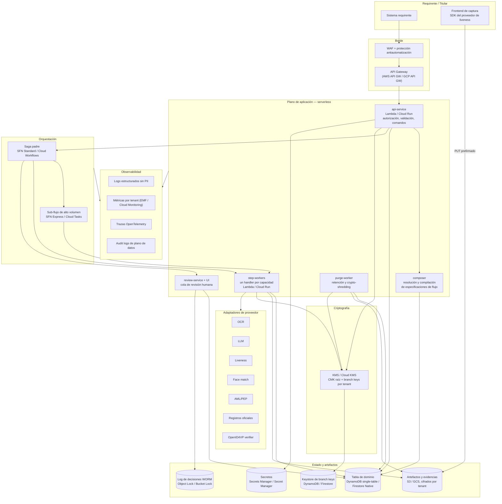
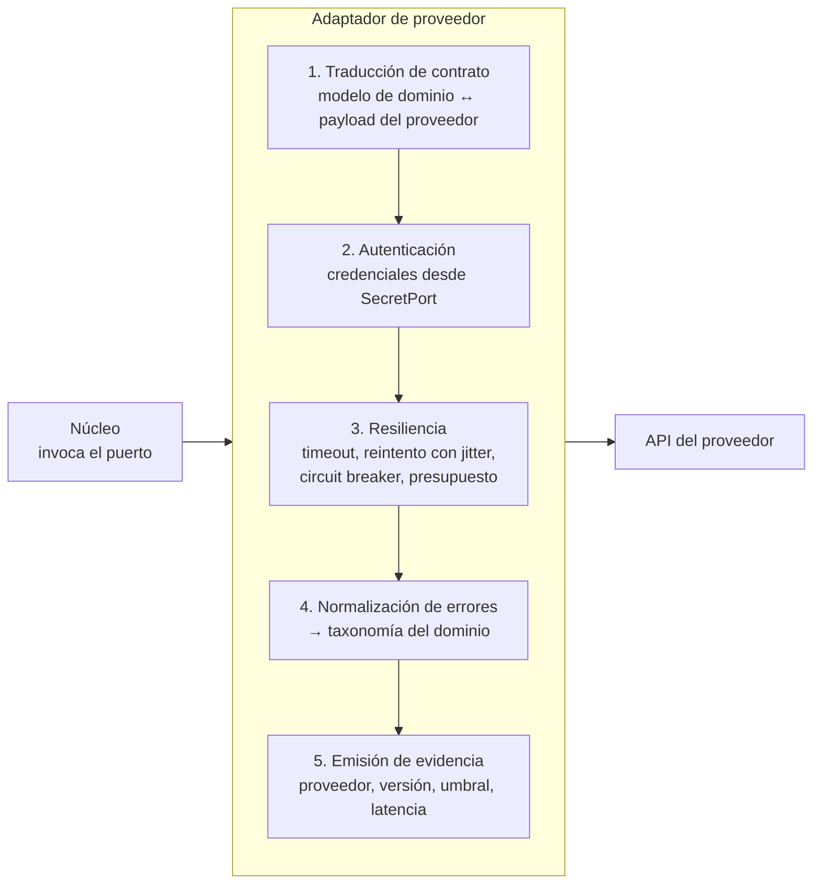
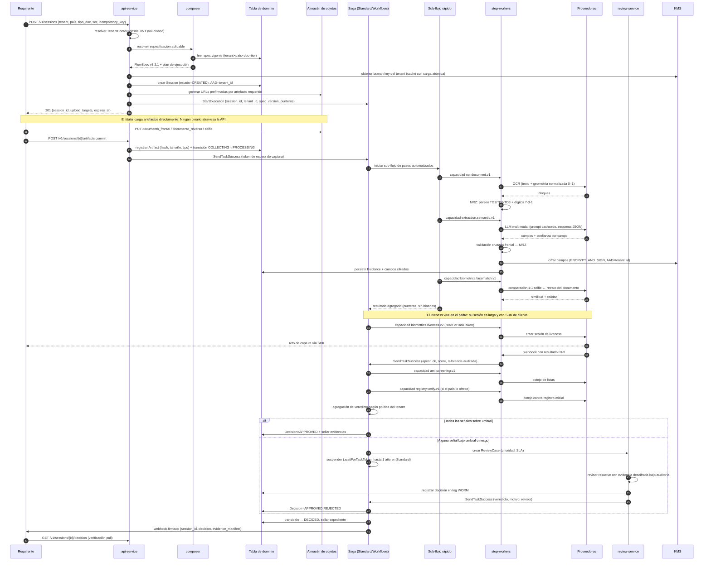
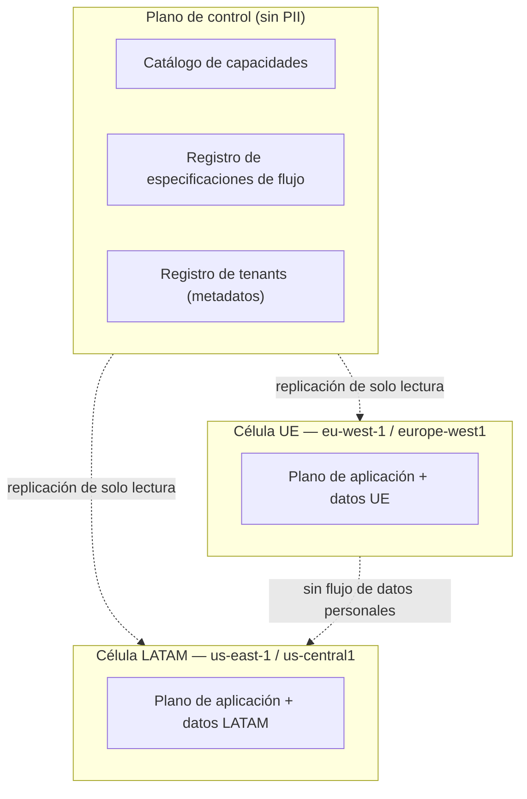

# 02 — Arquitectura

| Campo | Valor |
|---|---|
| **Estado** | Aprobado |
| **Versión** | 1.1.0 |
| **Última actualización** | 2026-08-21 |
| **Responsable** | Arquitectura de la plataforma |
| **Audiencia** | Arquitectura, ingeniería de plataforma, SRE |
| **Documentos relacionados** | [00 — Índice](00-indice.md) · [03 — Modelo de dominio](03-modelo-de-dominio.md) · [04 — Motor de composición](04-motor-de-composicion.md) · [07 — Orquestación](07-orquestacion.md) · [10 — Multinube](10-multicloud-aws-gcp.md) |

**Resumen ejecutivo.** El documento central del repositorio. Presenta los principios ordenados por prioridad, las tres vistas C4 —contexto, contenedores y componentes del núcleo—, la arquitectura hexagonal con su catálogo completo de puertos y los adaptadores AWS, GCP y locales de cada uno, el patrón de adaptador de proveedor con su taxonomía de errores normalizada, y el recorrido de extremo a extremo de una transacción de onboarding en un diagrama de secuencia. Si solo se lee un documento antes de tocar código, es este.

---

## 1. Principios arquitectónicos

Los principios están ordenados por prioridad. Cuando dos entran en conflicto, gana el de número menor.

| # | Principio | Consecuencia operativa | Verificable por |
|---|---|---|---|
| **P1** | **El aislamiento de tenant es una propiedad criptográfica, no una condición `WHERE`.** `tenant_id` es Associated Data del cifrado de sobre: un error de alcance produce un **fallo de descifrado**, no una fuga. | Todo dato de tenant se cifra con la clave de ese tenant y con `tenant_id` en el contexto de cifrado. | Pruebas de aislamiento negativas ([05](05-multitenancy-y-aislamiento.md) §8) |
| **P2** | **El núcleo no conoce la nube.** El dominio, los puertos, el compositor y la capa de aplicación no importan `boto3` ni `google.cloud`. | `mypy --strict` sobre `domain`, `ports`, `composer`, `application`, `crypto`; prueba de arquitectura que falla si un módulo del núcleo importa un SDK de nube. | Test de importaciones en CI |
| **P3** | **Ningún dato binario viaja por el estado del orquestador.** Solo punteros a almacenamiento de objetos con URL prefirmada. | Step Functions tiene 256 KiB por payload; Cloud Workflows **512 KB acumulados por ejecución**. El segundo límite es el que dicta el diseño. | Prueba de contrato del `SagaPort` |
| **P4** | **El puerto de repositorio expone operaciones de dominio, nunca primitivas de almacén.** Nada de `PK`, `SK`, `begins_with` ni `FilterExpression` en la firma. | Si el puerto se acopla a DynamoDB, el adaptador de Firestore es inviable — el modelo documental no ofrece consultas de rango sobre sort key. | Revisión de firmas + adaptador en memoria |
| **P5** | **La autorización vive en el núcleo, no en el gateway.** GCP API Gateway no admite autorizadores de código arbitrario. | El `AuthorizationPort` se implementa como middleware in-process. En AWS, el Lambda Authorizer es una optimización de caché, no la fuente de verdad. | Pruebas de autorización sin gateway |
| **P6** | **Diseñar contra el peor sustrato.** Cuando AWS y GCP divergen, la interfaz la dicta el sustrato más débil. | Si el `TenantIsolationPort` asume `dynamodb:LeadingKeys`, el adaptador GCP queda estructuralmente inseguro. | Revisión de ADR |
| **P7** | **Fail-closed en identidad.** Un token sin `tenant_id` resuelto no debe existir. | El *pre token generation trigger* falla cerrado; el middleware rechaza con `401` cualquier contexto sin tenant. | Prueba de token sin claim de tenant |
| **P8** | **Toda decisión es reconstruible.** Cada paso emite evidencia inmutable con proveedor, versión, umbral y resultado. | La evidencia es un objeto WORM; el log de auditoría es *append-only*. | Auditoría de reconstrucción de sesión |
| **P9** | **La política es dato versionado.** Flujos, umbrales y retención son especificaciones desplegables sin desplegar código. | Cambiar un umbral es un cambio de especificación con su propio ciclo de aprobación. | Despliegue de especificación sin CI de código |
| **P10** | **Idempotencia por defecto.** Todo paso invocable debe ser idempotente respecto de `(session_id, step_id, attempt_key)`. | Los Express Workflows tienen semántica **at-least-once**; Cloud Tasks y Pub/Sub también. La idempotencia no es opcional. | Prueba de reejecución de paso |

## 2. C4 nivel 1 — Contexto



**Lecturas del diagrama que conviene explicitar:**

- El titular **carga artefactos directamente** contra el almacenamiento de objetos con URL prefirmada. No atraviesan la API. Esto evita el techo de 32 MB del GCP API Gateway y el de 6 MB de payload síncrono de Lambda, y reduce la superficie de la API.
- El operador aparece en el diagrama porque su acceso es una **superficie de riesgo con controles propios** ([14 — Modelo de amenazas](14-modelo-de-amenazas.md) §4), no porque sea un usuario funcional.
- El wallet EUDI apunta **hacia** el middleware: en CU-03 el middleware es *Relying Party* y recibe la presentación.

## 3. C4 nivel 2 — Contenedores



### 3.1 Responsabilidad por contenedor

| Contenedor | Responsabilidad | Estado | Escalado |
|---|---|---|---|
| `api-service` | Terminación de la API v1, autorización, validación de comandos, emisión de URL prefirmadas, arranque de sesión. | Sin estado | Por petición |
| `composer` | Resolución de la especificación aplicable, validación de capacidades, compilación a ASL/YAML, publicación de versiones. | Sin estado; lee catálogo | Bajo volumen |
| `step-workers` | Un handler por capacidad. Traduce el contrato de la capacidad al adaptador del proveedor configurado para el tenant. | Sin estado | Por paso |
| `review-service` | Cola de revisión, asignación, SLA, UI, registro WORM de decisiones. | Con estado en la tabla | Por revisor |
| `purge-worker` | Ejecuta la política de retención, el bloqueo y el crypto-shredding con mutex distribuido. | Idempotente | Programado |
| Saga padre | Orquestación de fases con garantías fuertes y esperas largas. | Estado del orquestador | Por sesión |
| Sub-flujo rápido | Pasos automatizados de alto volumen, idempotentes, < 5 min. | Efímero | Por lote |

### 3.2 Por qué `step-workers` y no un monolito de pasos

Cada capacidad tiene un perfil de recursos distinto: la extracción con LLM es *I/O-bound* con latencia de segundos; el cotejo facial con ONNX es *CPU-bound* y quiere memoria alta; la validación MRZ es puro cómputo de microsegundos. Empaquetarlos juntos obliga a dimensionar por el peor caso y arrastra dependencias pesadas al arranque en frío de todos.

Consecuencia concreta en Lambda: la vCPU se asigna proporcionalmente a la memoria, en un rango de **128 MB a 10.240 MB** en incrementos de 1 MB. Un worker de cotejo facial se dimensiona por perfil de rendimiento medido; uno de validación MRZ vive con el mínimo. Nótese que **no existe ningún requisito de memoria ligado a AVX-512**: la documentación de Lambda cubre **AVX2** (vectores de 256 bits) y `arm64` usa NEON. Ver [20 — Fe de erratas](20-fe-de-erratas-del-spec-original.md) §4.

## 4. C4 nivel 3 — Componentes del núcleo

```mermaid
graph TB
    subgraph Núcleo["onboarding_generico — núcleo agnóstico de nube"]
        subgraph domain["domain/"]
            ENT["Entidades y objetos de valor<br/>Tenant, Session, Step, Artifact,<br/>Evidence, Decision, ReviewCase"]
            SM["SessionStateMachine<br/>transiciones válidas + invariantes"]
            POL["Políticas de dominio<br/>umbrales, agregación de veredicto,<br/>reglas de derivación"]
            EV["Eventos de dominio"]
        end

        subgraph composer["composer/"]
            REG["CapabilityRegistry"]
            RES["FlowResolver<br/>tenant × país × documento × tier"]
            VAL["SpecValidator<br/>esquema + capacidades + DAG acíclico"]
            CMP["SpecCompiler<br/>→ ASL | → Workflows YAML"]
            PLN["ExecutionPlanner<br/>fallback, reintentos, compensación"]
        end

        subgraph application["application/"]
            UC["Casos de uso<br/>StartSession, SubmitArtifact,<br/>AdvanceStep, ResolveReview,<br/>EmitDecision, PurgeSubject"]
            IDEM["IdempotencyGuard"]
            UOW["UnitOfWork"]
            AUTH["AuthorizationService<br/>ABAC sobre TenantContext"]
        end

        subgraph crypto["crypto/"]
            ENVC["EnvelopeCryptoService<br/>directivas por atributo"]
            KEYC["KeyMaterialCache<br/>carga atómica, TTL por tier"]
            BEA["DeterministicIndexService<br/>beacons / HMAC"]
        end

        subgraph ports["ports/"]
            P["Interfaces (Protocol)<br/>ver §6"]
        end
    end

    subgraph Adaptadores["adapters/ — dependen del núcleo, nunca al revés"]
        AAWS["aws/"]
        AGCP["gcp/"]
        AMEM["memory/ (pruebas y desarrollo local)"]
        APROV["providers/ (SaaS y OSS)"]
    end

    UC --> ENT
    UC --> SM
    UC --> POL
    UC --> IDEM
    UC --> UOW
    UC --> AUTH
    UC --> P
    RES --> REG
    VAL --> REG
    CMP --> PLN
    UC --> RES
    UC --> CMP
    UC --> ENVC
    ENVC --> KEYC
    ENVC --> BEA
    ENVC --> P
    AAWS -.implementa.-> P
    AGCP -.implementa.-> P
    AMEM -.implementa.-> P
    APROV -.implementa.-> P
```



**Regla de dependencia:** las flechas de implementación apuntan siempre hacia el núcleo. `domain/` no importa nada del proyecto salvo la biblioteca estándar; `ports/` importa solo `domain/`; `application/` y `composer/` importan `domain/` y `ports/`; los adaptadores importan `ports/` y `domain/`. Cualquier otra dirección es un fallo de arquitectura y la prueba de importaciones lo detecta.

## 5. Arquitectura hexagonal

### 5.1 Por qué hexagonal aquí y no en cualquier proyecto

La arquitectura hexagonal se justifica cuando hay **variabilidad real y prevista** en los bordes. En este producto hay tres ejes de variabilidad simultáneos:

1. **Por nube** — AWS de referencia, GCP alternativa.
2. **Por proveedor** — cada capacidad tiene entre uno y varios proveedores intercambiables, y el proveedor puede diferir **por tenant y por país**.
3. **Por jurisdicción** — un mismo puerto se invoca con umbrales y políticas distintas.

El tercer eje es el decisivo: sin puertos, la variabilidad jurisdiccional se implementa con condicionales dentro del código de integración, que es exactamente el estado del que el producto quiere sacar a sus clientes.

### 5.2 La dirección del diseño de puertos

> **Regla P6 aplicada:** cada puerto se diseña asumiendo el sustrato **más restrictivo** de los dos, y el sustrato más capaz añade refuerzo redundante.

Ejemplos donde esto cambia la firma:

| Puerto | Si lo dicta AWS | Si lo dicta GCP (correcto) |
|---|---|---|
| `SessionRepositoryPort` | `query(pk, sk_begins_with)` → el adaptador Firestore es inviable | `find_sessions(tenant, estado, ventana)` → ambos adaptadores viables |
| `TenantIsolationPort` | Casi vacío: `dynamodb:LeadingKeys` aplica la política | Contiene lógica real de *scoping*; AWS la refuerza con IAM |
| `SagaPort` | `wait_for_task_token(timeout=1 año)` | `suspend_until(correlation_id)` + reanudación por nueva ejecución si excede 12 h |
| `AuthorizationPort` | Delegado al Lambda Authorizer | Middleware in-process; el gateway solo valida firma del JWT |
| `LlmPort` | `cache_control` de Anthropic expuesto | `cachear_prefijo(contenido, ttl)`; cada adaptador traduce |

### 5.3 Catálogo de puertos

La columna **intención** dice qué problema del dominio resuelve el puerto; es lo que debe permanecer estable cuando cambia el proveedor o la nube. La columna **local** es el adaptador que se usa en el portátil y en las pruebas unitarias ([18 §1](18-desarrollo-local.md)): que exista y sea trivial es la prueba más barata de que el puerto no está acoplado a infraestructura. El riesgo de portaje de cada uno se cuantifica en [10 §3](10-multicloud-aws-gcp.md); aquí no se repite.

| Puerto | Intención | Operaciones (resumen) | Adaptador AWS | Adaptador GCP | Adaptador local |
|---|---|---|---|---|---|
| `SessionRepositoryPort` | Persistir y recuperar el agregado de sesión **por operaciones de dominio, nunca por claves físicas** | `save`, `load`, `find_by_tenant_and_state`, `append_step_result` | DynamoDB single-table | Firestore Native (ID compuesto `PK#SK`) | En memoria |
| `FlowSpecRepositoryPort` | Publicar y resolver la especificación vigente sin desplegar código | `publish_version`, `resolve`, `get_version`, `list_versions` | DynamoDB + S3 | Firestore + GCS | En memoria, cargando YAML del repositorio |
| `TenantRepositoryPort` | Conocer la configuración, las capacidades y la política del tenant | `get`, `list_capabilities`, `get_policy` | DynamoDB | Firestore | En memoria, sembrado desde `.env` |
| `EvidenceStorePort` | Sellar evidencia de forma inmutable y demostrable ante un auditor | `put_evidence`, `get_evidence`, `seal` | S3 + Object Lock | GCS + Bucket Lock | Directorio temporal de solo escritura |
| `ObjectStoragePort` | Mover binarios **fuera** del plano de control y del estado del orquestador | `presign_put`, `presign_get`, `head`, `delete`, `set_lifecycle` | S3 | GCS | Sistema de archivos temporal, con firma simulada servida por la propia API local |
| `SagaPort` | Ejecutar un proceso de larga duración con esperas humanas sin consumir cómputo | `start`, `signal`, `suspend_until`, `resume`, `cancel`, `status` | Step Functions Standard + Express | Cloud Workflows + Cloud Tasks + relanzamiento | Ejecutor secuencial en proceso, con reloj avanzable |
| `QueuePort` | Diferir trabajo y absorber picos | `enqueue`, `enqueue_delayed`, `dead_letter` | SQS | Cloud Tasks / Pub/Sub | Cola en memoria |
| `KeyManagementPort` | Disponer de material de clave **por tenant** con destrucción programable | `get_branch_key`, `rotate`, `schedule_destroy`, `destroy_status` | KMS + hierarchical keyring | Cloud KMS + Tink | Claves en memoria, con la misma semántica de estados |
| `EnvelopeCryptoPort` | Que un error de alcance produzca un **fallo de descifrado**, no una fuga | `encrypt_record`, `decrypt_record`, `sign_only` | AWS DB-ESDK | Tink `KmsEnvelopeAead` + firma propia | AEAD local con la misma AAD |
| `DeterministicIndexPort` | Buscar por igualdad sobre un campo cifrado | `index_value`, `query_by_index` | Beacons del DB-ESDK | HMAC determinista con clave por tenant | HMAC local |
| `SecretPort` | Obtener credenciales de proveedor sin que toquen el repositorio | `get`, `put`, `rotate_notify` | Secrets Manager | Secret Manager | Diccionario cargado de `.env` |
| `ConfigPort` | Leer configuración de alto volumen separada de los secretos | `get`, `watch` | Parameter Store | Variables de entorno + documento con caché | Diccionario |
| `AuthorizationPort` | Resolver el `TenantContext` y autorizar **en el núcleo**, no en el gateway | `resolve_tenant_context`, `authorize` | In-process (+ autorizador del gateway como caché) | In-process | In-process, con token de desarrollo |
| `DocumentOcrPort` | Obtener texto **con geometría normalizada** de cualquier proveedor | `extract_text_and_geometry` | Textract `DetectDocumentText` | Document AI Enterprise OCR | Respuesta grabada del conjunto dorado |
| `LlmPort` | Extraer estructura con esquema estricto, sin acoplarse a un proveedor de modelo | `complete_structured`, `cachear_prefijo` | Bedrock (Claude) | Agent Platform (Claude) | Respuesta grabada; modo determinista |
| `MrzPort` | Verificar la MRZ conforme a ICAO Doc 9303 sin depender de nadie | `parse`, `verify_check_digits` | Implementación propia | Idéntica | Idéntica: **el mismo código en las tres** |
| `FaceMatchPort` | Cotejar 1:1 con umbral explícito y puntuación auditable | `compare_1_1`, `quality_score` | Rekognition `CompareFaces` | Cloud Run + ONNX (embeddings) | Similitud simulada, configurable por caso de prueba |
| `LivenessPort` | Obtener una prueba de vida **certificada por un tercero** | `create_session`, `get_result` | Proveedor certificado (recomendado) | Mismo proveedor certificado | Simulado, con inyección del resultado deseado |
| `AmlScreeningPort` | Contrastar contra listas de sanciones, PEP y adversos | `screen_person`, `screen_entity` | Proveedor SaaS | Mismo proveedor | Listas simuladas |
| `GovernmentRegistryPort` | Cotejar contra la fuente autoritativa del país | `verify_identity_record` | Adaptador por país | Idéntico | Simulado por país |
| `WalletVerifierPort` | Verificar una presentación OpenID4VP como *Relying Party* | `request_presentation`, `verify_presentation` | OpenID4VP propio | Idéntico | Emisor y wallet simulados |
| `HumanReviewPort` | Encolar, asignar y resolver casos con trazabilidad regulatoria | `enqueue_case`, `assign`, `resolve`, `escalate` | Construcción propia | Construcción propia | En memoria, resoluble desde la CLI |
| `AuditLogPort` | Registrar hechos encadenados por hash, sin PII | `append`, `query_by_session` | DynamoDB + S3 WORM | Firestore + GCS WORM | En memoria, con verificación de cadena |
| `TelemetryPort` | Emitir métricas, trazas y logs **sin PII** | `emit_metric`, `span`, `log` | Métricas embebidas en log + OTel | Cloud Monitoring + OTel | Colector en memoria, inspeccionable en pruebas |
| `ClockPort` / `IdPort` | Hacer determinista lo que de otro modo no lo sería | `now`, `new_id` | Sistema | Sistema | Reloj avanzable e identificadores secuenciales |

> **Nota sobre `LivenessPort`.** Es el único puerto cuyo adaptador **no es solo servidor**: el proveedor aporta SDK de captura en el frontend. Cambiar de adaptador implica trabajo de aplicación móvil o web. Por eso [09](09-biometria-y-liveness.md) recomienda un proveedor certificado único en ambas nubes y elimina la asimetría de raíz, en lugar de gestionarla.

> **Nota sobre `FaceMatchPort` y `LivenessPort` separados.** Unirlos en un `BiometricsPort` arrastraría el problema de portabilidad del segundo al primero, que se porta sin fricción. La separación es deliberada.

## 6. Patrón adaptador de proveedor

Un adaptador de proveedor tiene cinco responsabilidades y ninguna más:



### 6.1 Taxonomía de errores normalizada

Todo adaptador traduce a esta taxonomía. El núcleo no ve códigos HTTP ni excepciones del SDK.

| Error de dominio | Semántica | ¿Reintentable? | ¿Activa fallback? |
|---|---|---|---|
| `ProviderUnavailable` | Fallo transitorio de infraestructura del proveedor | Sí, con *backoff* | Sí, tras agotar reintentos |
| `ProviderThrottled` | Límite de tasa alcanzado | Sí, con *backoff* respetando `Retry-After` | Sí |
| `InvalidInput` | El artefacto no cumple precondiciones (calidad, formato) | No | No — se pide recaptura al titular |
| `InconclusiveResult` | El proveedor respondió pero sin confianza suficiente | No | Sí, a proveedor alternativo o a revisión humana |
| `NegativeResult` | Resultado válido y negativo (no coincide, PAD falla) | No | No — es una señal del dominio |
| `CapabilityNotSupported` | El proveedor no cubre este país/documento | No | Sí, obligatorio |
| `ProviderContractViolation` | Respuesta que no valida contra el esquema esperado | No | Sí, con alerta de severidad alta |

`NegativeResult` frente a `InconclusiveResult` es la distinción más importante: la primera es información de negocio que alimenta el veredicto; la segunda es una carencia del pipeline que debe resolverse con fallback o con un humano. Confundirlas produce rechazos falsos.

### 6.2 Resiliencia por adaptador

Cada adaptador declara su presupuesto en la configuración del tenant, no en el código:

```yaml
providers:
  ocr.document.v1:
    primary: textract
    fallback: [document_ai]
    timeout_ms: 8000
    retries: {max: 2, base_ms: 200, jitter: full}
    circuit_breaker: {error_threshold: 0.5, window_s: 60, open_s: 30}
    budget: {max_calls_per_session: 4}
```

El presupuesto por sesión (`max_calls_per_session`) es un control de coste **y** de seguridad: acota el impacto de un bucle de reintentos sobre una llamada facturable.

## 7. Flujo transaccional de una sesión de onboarding

Secuencia completa del caso CU-01 con derivación condicional a revisión humana.



### 7.1 Puntos de control transaccional

| Punto | Garantía | Mecanismo |
|---|---|---|
| Creación de sesión | Exactly-once por `idempotency_key` | Escritura condicional (`attribute_not_exists`) con TTL de la clave |
| *Commit* de artefacto | Idempotente por hash de contenido | El mismo hash sobre el mismo `(session, slot)` es un no-op |
| Avance de paso | At-least-once tolerado | `IdempotencyGuard` sobre `(session_id, step_id, attempt_key)` |
| Llamada facturable a proveedor | A lo sumo N por sesión | Presupuesto por adaptador + `retry_enabled=false` para no idempotentes |
| Emisión de veredicto | Exactly-once | Transición de estado con *optimistic locking* sobre `version` |
| Webhook al requirente | At-least-once con firma y `event_id` | El requirente deduplica por `event_id`; se documenta en el contrato de API |

### 7.2 Compensación

La saga no puede deshacer una llamada a un proveedor externo ni un cotejo gubernamental. Lo que compensa son **efectos internos**: liberar reservas de cuota, marcar evidencias como descartadas, y notificar al requirente el abandono. Las acciones no compensables se identifican explícitamente en la especificación de flujo con `compensable: false`, y el planificador las coloca **lo más tarde posible** en el DAG, para maximizar la ventana en la que un fallo aún es reversible.

## 8. Decisiones de acoplamiento

| # | Decisión | Alternativa descartada | Razón |
|---|---|---|---|
| **A1** | Orquestación **híbrida**: padre Standard/Workflows para garantías y esperas largas; hijo Express/Tasks para pasos automatizados. | Express puro (más barato) | Express es **at-least-once** y no soporta `.waitForTaskToken`, `.sync`, Distributed Map ni Activities. El flujo necesita esperas largas y exactly-once sobre acciones no idempotentes. El ahorro medido del patrón anidado en el ejemplo de AWS es **~52 %** frente a Standard puro; el 98 % corresponde a Express puro, que aquí no es aplicable. |
| **A2** | La **especificación de flujo es dato**; se compila a ASL/YAML en el despliegue de la especificación. | DAG dinámico interpretado en runtime sobre la tabla | Se evaluó el motor de DAG dinámico sobre DynamoDB Streams. Se reserva para el **sub-grafo dinámico** dentro de una fase; el esqueleto sigue siendo compilado, para no reimplementar reintentos, timeouts y auditoría. |
| **A3** | **Repositorio con operaciones de dominio.** | Repositorio genérico tipo `query(spec)` | Un repositorio genérico filtra por PK/SK y se acopla a DynamoDB (P4). |
| **A4** | **Autorización en el núcleo.** | Autorizador en el gateway | GCP API Gateway no ejecuta código arbitrario por petición. Además, mover la autorización al núcleo la hace testeable sin infraestructura. |
| **A5** | **Un handler por capacidad**, no un despachador único. | Handler monolítico con `switch` | Perfiles de recursos y dependencias incompatibles; arranque en frío contaminado. |
| **A6** | **Cifrado de sobre por tenant con branch keys**, no CMK por tenant. | CMK por tenant | Coste lineal por existencia de clave (≈1 USD/mes por CMK más ≈1 USD/mes por rotación, según precios de blog de terceros a re-verificar) y presión sobre la cuota de `CreateGrant`, que es de **50 req/s**. Las branch keys dan aislamiento criptográfico sin ese coste. |
| **A7** | **Los grants de KMS se crean en el aprovisionamiento del tenant**, nunca en el camino de la petición. | Grant bajo demanda | `CreateGrant` está limitado a 50 req/s, cuota independiente de la de operaciones criptográficas. |
| **A8** | **`HumanReviewPort` construido a medida en ambas nubes.** | SageMaker A2I / Document AI HITL | A2I está **cerrado a nuevos clientes**; Document AI HITL se apagó el 16/01/2025; Vertex AI Data Labeling, el 03/10/2024. Construirlo elimina la asimetría entre nubes en vez de gestionarla. |
| **A9** | **`LivenessPort` con proveedor certificado en ambas nubes.** | Rekognition Face Liveness en AWS + modelo abierto en GCP | GCP no tiene equivalente gestionado; los modelos abiertos de antispoofing son débiles frente a inyección, *deepfakes* y máscaras 3D. Un proveedor único elimina la divergencia de frontend. |
| **A10** | **OTel como instrumentación única.** | SDK de X-Ray en AWS y Cloud Trace en GCP | OTel es el denominador común; evita dos instrumentaciones y dos modelos de traza. |
| **A11** | **Sin datos binarios en el estado del orquestador.** | Pasar respuestas OCR completas entre estados | Cloud Workflows acumula **512 KB por ejecución** (variables + argumentos + eventos). Es el límite más restrictivo del sistema y dicta el diseño en ambas nubes. |
| **A12** | **Python 3.14** con compatibilidad 3.11 en el código de núcleo. | Runtime políglota por componente | Un solo lenguaje en el núcleo mantiene el modelo de dominio único; los adaptadores pesados de visión pueden vivir en contenedor sin cambiar el núcleo. |

## 9. Vistas de despliegue

Las topologías concretas por nube están en [16 — Despliegue AWS](16-guia-de-despliegue-aws.md) y [17 — Despliegue GCP](17-guia-de-despliegue-gcp.md). El resumen arquitectónico:

- **Una célula por región y por dominio de residencia de datos.** Una célula es autónoma: tabla, buckets, claves, orquestador y workers propios. No hay tráfico de datos personales entre células.
- **El plano de control es global y no contiene PII**: catálogo de capacidades, registro de tenants (metadatos, no datos de titulares), y especificaciones de flujo.
- La regionalización resuelve simultáneamente el Capítulo V del GDPR (ningún país LATAM del alcance tiene decisión de adecuación), los *Transfer Impact Assessment*, y las expectativas de localización de los supervisores financieros latinoamericanos.



> El acceso remoto de soporte desde LATAM a datos alojados en la UE **es una transferencia internacional** aunque los datos no se muevan. Debe cubrirse en las Cláusulas Contractuales Tipo y controlarse técnicamente ([11](11-cumplimiento-normativo.md) §5).

---

## Referencias

- [`docs/referencias/aws-arquitecturas-de-referencia.md`](referencias/aws-arquitecturas-de-referencia.md) — Fichas 1 (multi-tenancy y ABAC), 3 (caching de data keys), 4 (DB-ESDK y beacons), 5 (Standard vs. Express y patrón anidado), 6 (motor de DAG dinámico); cuotas verificadas de Lambda, Step Functions y KMS.
- [`docs/referencias/gcp-paridad-de-servicios.md`](referencias/gcp-paridad-de-servicios.md) — capacidades 1–15, brechas 1–9 y recomendaciones de diseño hexagonal.
- [`docs/referencias/cumplimiento-normativo-y-estandares.md`](referencias/cumplimiento-normativo-y-estandares.md) — reparto responsable/encargado, transferencias internacionales, separación expediente KYC / biometría.
- [01 — Visión y alcance](01-vision-y-alcance.md) · [03 — Modelo de dominio](03-modelo-de-dominio.md) · [04 — Motor de composición](04-motor-de-composicion.md) · [05 — Multitenancy](05-multitenancy-y-aislamiento.md) · [06 — Criptografía](06-criptografia-y-gestion-de-claves.md) · [07 — Orquestación](07-orquestacion.md) · [10 — Multinube](10-multicloud-aws-gcp.md) · [14 — Modelo de amenazas](14-modelo-de-amenazas.md) · [20 — Fe de erratas](20-fe-de-erratas-del-spec-original.md)
