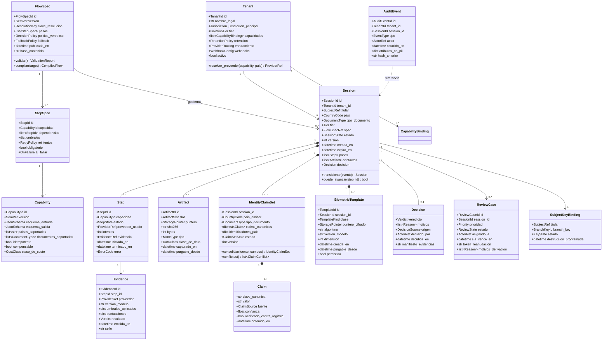
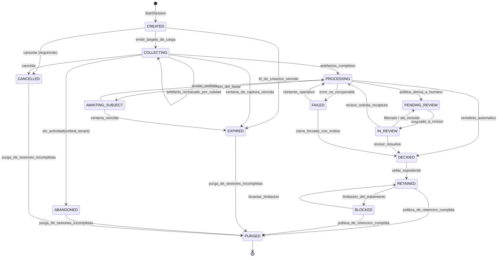
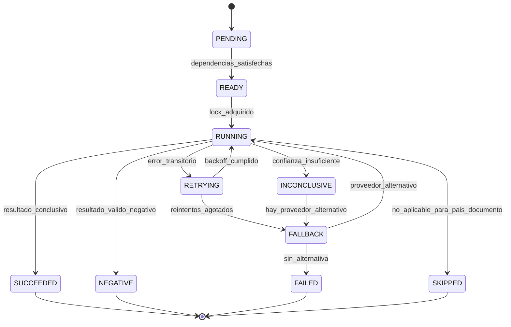

# 03 — Modelo de dominio

| Campo | Valor |
|---|---|
| **Estado** | Aprobado |
| **Versión** | 1.1.0 |
| **Última actualización** | 2026-08-21 |
| **Responsable** | Arquitectura de la plataforma |
| **Audiencia** | Arquitectura, desarrollo |
| **Documentos relacionados** | [00 — Índice](00-indice.md) · [02 — Arquitectura](02-arquitectura.md) · [04 — Motor de composición](04-motor-de-composicion.md) · [05 — Multitenancy](05-multitenancy-y-aislamiento.md) · [12 — Retención y borrado](12-retencion-y-borrado.md) |

**Resumen ejecutivo.** Define las entidades del dominio —`Tenant`, `FlowSpec`, `Session`, `Step`, `Artifact`, `Evidence`, `IdentityClaimSet`, `BiometricTemplate`, `Decision`, `AuditEvent`— con sus invariantes, el diagrama de clases y la máquina de estados de la sesión. Después baja al diseño físico: la tabla única de DynamoDB con sus patrones de acceso AP-01..AP-20, sus índices y sus directivas de cifrado, la resolución del conflicto entre beacons y `LeadingKeys`, y la traducción al modelo documental de Firestore. La regla que sostiene esa traducción es que **el puerto de repositorio expone operaciones de dominio y nunca `PK`/`SK`**.

---

## 1. Mapa de entidades

`Session` es la **raíz de agregación**. Todo lo que cambia dentro de una sesión cambia bajo su bloqueo optimista. `Tenant` y `FlowSpec` son entidades del plano de control con ciclo de vida propio. `AuditEvent` es un *append-only log* que no pertenece a ningún agregado.

| Entidad | Naturaleza | Ciclo de vida | Contiene PII |
|---|---|---|---|
| `Tenant` | Raíz de agregación (plano de control) | Larga, versionada | No (metadatos de negocio) |
| `Capability` | Entidad de catálogo | Global, versionada | No |
| `FlowSpec` | Raíz de agregación, inmutable por versión | Publicada, nunca modificada | No |
| `Session` | **Raíz de agregación transaccional** | Horas a días; luego expediente retenido | Sí, cifrado |
| `Step` | Entidad dentro de `Session` | Vive y muere con la sesión | Metadatos, no PII |
| `Artifact` | Entidad con puntero a objeto | Retención independiente por clase de dato | Sí (el objeto) |
| `IdentityClaimSet` | Objeto de valor dentro de `Session` | Se consolida durante la sesión; se retiene con el expediente | **Sí, cifrado.** Es el corazón del expediente |
| `BiometricTemplate` | Objeto de valor derivado, **efímero por defecto** | Existe mientras dura el cotejo; se purga tras la decisión salvo instrucción contraria del responsable | **Sí, categoría especial** |
| `Evidence` | **Objeto de valor inmutable** | Sellado; retención del expediente | Sí, cifrado y minimizado |
| `Decision` | Objeto de valor inmutable | Con el expediente | Parcial |
| `ReviewCase` | Raíz de agregación secundaria | Días | Referencias, no copias |
| `AuditEvent` | Registro *append-only* | Retención del expediente o superior | No debe contener PII en claro |
| `SubjectKeyBinding` | Vínculo titular ↔ clave de cifrado | Existe hasta el crypto-shredding | No |

## 2. Diagrama de clases



**`IdentityClaimSet` es el resultado del producto, no un detalle de la extracción.** Es el conjunto consolidado de afirmaciones de identidad en su forma canónica —`nombre_completo`, `fecha_nacimiento`, `numero_documento`, `sexo`, `nacionalidad`, más el mapa `identificadores_pais` con CURP, clave de elector, cédula o RUC según corresponda ([08 §4.7](08-ia-y-extraccion-semantica.md))—. Cada `Claim` conserva su **procedencia**: si vino de la MRZ, de la extracción semántica, del registro gubernamental o del propio requirente, con qué confianza y si fue verificado contra fuente autoritativa. Esa procedencia es lo que permite responder en una auditoría a "¿de dónde salió esta fecha de nacimiento?", y es también lo que hace posible la regla de precedencia MRZ > LLM sin perder el valor descartado.

**`BiometricTemplate` existe para poder no persistirlo.** Modelar el *template* como entidad de primer orden —con su algoritmo, su versión de modelo, su puntero cifrado y su `purgable_desde`— es lo que permite tratarlo distinto del resto del expediente: por defecto `persistida = false`, se destruye tras la decisión, y solo se conserva cuando el responsable lo instruye por escrito ([12 §2.1](12-retencion-y-borrado.md)). Un diseño que guarde el vector de características dentro de `Evidence` pierde esa capacidad, porque la evidencia es inmutable y retenible por obligación AML: acabaría reteniendo dato biométrico durante diez años sin base para hacerlo.

### 2.1 Invariantes de dominio

Se comprueban en el agregado, no en el adaptador de persistencia:

| # | Invariante | Consecuencia si se viola |
|---|---|---|
| I1 | Una `Session` pertenece a exactamente un `Tenant` y su `tenant_id` es inmutable. | Fuga entre tenants. Se refuerza criptográficamente con AAD. |
| I2 | Un `Step` no pasa a `RUNNING` si alguna dependencia no está en estado terminal exitoso. | Ejecución fuera de orden con datos incompletos. |
| I3 | Una `Evidence` es inmutable una vez emitida; corregir exige emitir otra que la supersede. | Pérdida de trazabilidad regulatoria. |
| I4 | Una `Session` en estado terminal no admite nuevos `Step` ni `Artifact`. | Manipulación de expediente cerrado. |
| I5 | Solo hay una `Decision` por sesión. Una segunda decisión exige una sesión de re-verificación. | Ambigüedad del veredicto. |
| I6 | El `sha256` de un `Artifact` debe coincidir con el objeto almacenado antes de que ningún paso lo consuma. | Sustitución de artefacto tras el *commit*. |
| I7 | `Artifact` de clase biométrica tiene `purgable_desde` obligatorio. | Retención indefinida de dato sensible. |
| I8 | `AuditEvent.hash_anterior` encadena con el evento previo de la misma sesión. | Manipulación del log sin detección. |
| I9 | Todo `Claim` tiene `fuente` declarada. Un claim sin procedencia no se consolida. | Expediente no defendible en auditoría: no se puede decir de dónde salió el dato. |
| I10 | Ante conflicto entre fuentes para el mismo campo canónico, prevalece la de mayor autoridad (registro gubernamental > MRZ > extracción semántica > declarado), y el conflicto se **registra**, no se descarta en silencio. | Se pierde la señal de fraude documental, que muchas veces *es* la discrepancia. |
| I11 | Un `BiometricTemplate` tiene `persistida = true` únicamente si existe instrucción documentada del responsable; en cualquier otro caso se destruye al emitir la `Decision`. | Retención de dato de categoría especial sin base jurídica. |
| I12 | Un `BiometricTemplate` nunca se copia fuera del alcance criptográfico del tenant ni se agrega a un índice compartido entre tenants. | Base biométrica compartida: prohibida en México y fuera del rol de encargado ([11 §3.2](11-cumplimiento-normativo.md)). |

## 3. Máquina de estados de la sesión



### 3.1 Notas sobre estados que suelen modelarse mal

| Estado | Por qué existe separado |
|---|---|
| `AWAITING_SUBJECT` vs. `COLLECTING` | `COLLECTING` es la captura inicial; `AWAITING_SUBJECT` es una petición **derivada del pipeline** (recaptura por calidad insuficiente, reto de liveness adicional). Métricas y SLA distintos: la fricción del segundo es la que mide el BPCER efectivo. |
| `PENDING_REVIEW` vs. `IN_REVIEW` | Sin la distinción no se puede medir tiempo de cola frente a tiempo de trabajo, ni detectar revisores que acaparan casos. |
| `DECIDED` vs. `RETAINED` | `DECIDED` cierra el proceso; `RETAINED` es la fase de custodia legal, con controles distintos: solo lectura, acceso auditado, y sin uso analítico. |
| `BLOCKED` | Corresponde a la limitación del tratamiento del art. 18 del GDPR y a la figura de bloqueo previa a la supresión. **No es un borrado**: los datos se conservan pero su tratamiento queda restringido a cumplir la obligación legal. Ver [12](12-retencion-y-borrado.md). |
| `PURGED` | Estado terminal con expediente eliminado o crypto-shredded. El registro de que la sesión existió y fue purgada **sobrevive** en el log de auditoría, sin PII. |

> **El reloj de retención no arranca en `DECIDED`.** Los plazos AML se computan desde la **finalización de la relación comercial**, y solo el requirente sabe cuándo ocurre. Por eso `RETAINED → PURGED` depende de un evento externo (`POST /v1/subjects/{ref}/relationship-ended`) más el plazo de la jurisdicción, no de la fecha de la sesión.

### 3.2 Estados del paso



`NEGATIVE` es un estado terminal **exitoso desde el punto de vista del pipeline**: el paso hizo su trabajo y la respuesta fue "no coincide". Modelarlo como `FAILED` provoca reintentos inútiles contra proveedores facturables y confunde las métricas de disponibilidad.

## 4. Modelo de datos: DynamoDB single-table

### 4.1 Decisiones estructurales

1. **PK con prefijo de tenant desde el día uno.** `dynamodb:LeadingKeys` **no es retrofit-able** sin migración de datos. Toda PK empieza por `TENANT#<tenant_id>`.
2. **Todo GSI lleva el tenant en su partition key.** `LeadingKeys` protege la PK de la tabla base y los LSI, pero **no los GSI**. Un GSI sin tenant en la PK queda fuera del perímetro IAM.
3. **PK/SK nunca contienen PII.** El DB-ESDK obliga a `SIGN_ONLY` en partition key y sort key, lo que significa que viajan en claro. Nunca `SK = DOC#<numero_documento>`.
4. **Los binarios viven en el almacén de objetos.** El límite de ítem es de **400 KB**; imágenes de documento, selfies y respuestas de proveedor lo exceden con holgura.

### 4.2 Tablas

El plano de datos son cuatro tablas, no una. La single-table cubre el **dominio de tenant**; lo que no lleva prefijo de tenant vive aparte, precisamente porque una política con `LeadingKeys` lo bloquearía por completo.

| Tabla | Claves | Propósito |
|---|---|---|
| `og-{env}-core` | `PK = TENANT#<tid>` · `SK` por tipo de ítem | Single-table del dominio, con sus GSI, TTL, stream y recuperación a un punto en el tiempo |
| `og-{env}-capability-registry` | `PK = CAPABILITY#<id>` · `SK = COUNTRY#…#DOCTYPE#…#V<n>` | Catálogo de plataforma: qué proveedor cubre qué paso, país y tipo de documento. **Sin prefijo de tenant, y por eso fuera de la política de `LeadingKeys`** |
| `og-{env}-locks` | `PK = LOCK#<tenant>#<recurso>` | Mutex distribuido con TTL y token de vallado ([12](12-retencion-y-borrado.md) §6.3) |
| `og-{env}-keystore` | `PK = branch-key-id` · `SK = version` | Branch keys del hierarchical keyring ([06](06-criptografia-y-gestion-de-claves.md) §2) |

Ítems de `og-{env}-core`:

| Ítem | PK | SK | Atributos relevantes | Notas |
|---|---|---|---|---|
| Tenant | `TENANT#<tid>` | `META` | `nombre_legal`, `jurisdiccion`, `tier`, `retencion`, `enrutamiento` | Plano de control |
| Vínculo de capacidad | `TENANT#<tid>` | `CAP#<capability_id>#<version>` | `proveedor_primario`, `fallback[]`, `presupuesto` | |
| Sesión | `TENANT#<tid>` | `SESSION#<session_id>` | `estado`, `version`, `pais`, `tipo_doc`, `tier`, `spec_ref`, `creada_en`, `expira_en`, `GSI1PK`, `GSI1SK`, `GSI2PK`, `GSI2SK` | Bloqueo optimista sobre `version` |
| Paso | `TENANT#<tid>` | `SESSION#<sid>#STEP#<step_id>` | `estado`, `capacidad`, `proveedor`, `intentos`, `lock_expires_at`, `evidence_ref` | |
| Artefacto | `TENANT#<tid>` | `SESSION#<sid>#ART#<slot>` | `puntero`, `sha256`, `bytes`, `clase_dato`, `purgable_desde` | |
| Conjunto de claims | `TENANT#<tid>` | `SESSION#<sid>#CLAIMS` | `claims_canonicos` (cifrado), `identificadores_pais` (cifrado), `procedencias`, `conflictos`, `version` | Un único ítem por sesión; los campos PII van agrupados en un solo blob cifrado ([06 §3.2](06-criptografia-y-gestion-de-claves.md)) |
| Template biométrico | `TENANT#<tid>` | `SESSION#<sid>#BIOTPL#<clase>` | `puntero_cifrado`, `algoritmo`, `version_modelo`, `persistida`, `purgable_desde` | **Solo existe si `persistida = true`.** El vector vive en el almacén de objetos, no en el ítem |
| Evidencia (índice) | `TENANT#<tid>` | `SESSION#<sid>#EVI#<evidence_id>` | `proveedor`, `version_modelo`, `umbrales`, `puntuaciones`, `sello`, `puntero_worm` | El detalle completo va al almacén WORM |
| Decisión | `TENANT#<tid>` | `SESSION#<sid>#DECISION` | `veredicto`, `motivos[]`, `origen`, `decidida_en` | Escritura condicional: una sola |
| Caso de revisión | `TENANT#<tid>` | `REVIEW#<review_id>` | `session_id`, `prioridad`, `estado`, `asignado_a`, `sla_vence_en`, `token`, `GSI1PK`, `GSI1SK` | Se proyecta a `GSI1` con `STATE#PENDING_REVIEW` |
| Evento de auditoría | `TENANT#<tid>` | `AUDIT#<session_id>#<ts>#<seq>` | `tipo`, `actor`, `atributos_no_pii`, `hash_anterior` | *Append-only*; sin `UpdateItem` en la política IAM |
| Clave de idempotencia | `TENANT#<tid>` | `IDEM#<scope>#<key>` | `resultado_ref`, `expires_at` | **El único uso legítimo del TTL**: los ítems de expediente nunca llevan `expires_at` |
| Vínculo de clave | `TENANT#<tid>` | `SUBJKEY#<subject_ref>` | `branch_key_id`, `estado`, `destruccion_programada` | |
| Especificación publicada | `SPEC#<tenant_o_GLOBAL>` | `FLOW#<clave_resolucion>#v<semver>` | `hash_contenido`, `puntero_asl`, `puntero_yaml`, `publicada_en`, `estado` | Plano de control, sin PII |

### 4.3 Índices secundarios

Los tres llevan el tenant en la partition key. Es la condición innegociable del punto 2 de §4.1.

| Índice | PK | SK | Proyección | Patrón que resuelve |
|---|---|---|---|---|
| `GSI1` — trabajo por estado | `GSI1PK = TENANT#<tid>#STATE#<estado>` | `GSI1SK = <prioridad_o_fecha>#<id>` | INCLUDE mínimo | Sesiones por estado (atascadas, purga de incompletas) **y** cola de revisión, que es el mismo patrón con otro valor de estado |
| `GSI2` — por referencia externa | `GSI2PK = TENANT#<tid>#EXTREF` | `GSI2SK = <external_ref>` | INCLUDE `estado`, `decision` | Consulta del requirente por su propio identificador |
| `GSI3-beacon` — índice determinista | `aws_dbe_b_TenantScopedIdentityCompound` | — | KEYS_ONLY | Búsqueda por campo cifrado (ver §4.5) |

Notas sobre esta forma concreta:

- **`GSI1` absorbe la cola de revisión.** Un caso pendiente de revisión es una sesión en estado `PENDING_REVIEW`; darle un índice propio duplicaría escrituras sin añadir capacidad de consulta. La clave de ordenación lleva la prioridad delante para que la asignación por prioridad y SLA sea una consulta de rango.
- **El índice de beacon es el único cuya partition key no tiene forma `TENANT#…` literal**, porque el nombre del atributo lo fija la biblioteca de cifrado. Sigue siendo tenant-scoped porque **el tenant es la primera parte del beacon compuesto** (§4.5). Es el punto de fricción del diseño y está tratado allí.
- Añadir un GSI nuevo exige verificar que su partition key empiece por `TENANT#`, o queda fuera del perímetro IAM.

### 4.4 Patrones de acceso

| # | Patrón de acceso | Operación | Índice |
|---|---|---|---|
| AP-01 | Cargar la configuración de un tenant | `GetItem(TENANT#t, META)` | Base |
| AP-02 | Resolver proveedor para una capacidad | `Query(TENANT#t, begins_with(SK,'CAP#'))` | Base |
| AP-03 | Cargar el agregado completo de una sesión | `Query(TENANT#t, begins_with(SK,'SESSION#s'))` | Base |
| AP-04 | Leer solo la cabecera de sesión | `GetItem(TENANT#t, SESSION#s)` | Base |
| AP-05 | Avanzar un paso con bloqueo optimista | `UpdateItem` con `ConditionExpression: version = :v` | Base |
| AP-06 | Registrar artefacto de forma idempotente | `PutItem` con `attribute_not_exists(SK) OR sha256 = :h` | Base |
| AP-07 | Emitir decisión una sola vez | `PutItem` con `attribute_not_exists(SK)` | Base |
| AP-08 | Añadir evento de auditoría | `PutItem` con `attribute_not_exists(SK)` | Base |
| AP-09 | Listar sesiones en un estado | `Query(GSI1, TENANT#t#STATE#PENDING_REVIEW)` | GSI1 |
| AP-10 | Buscar sesión por referencia del requirente | `Query(GSI2, TENANT#t#EXTREF, SK=external_ref)` | GSI2 |
| AP-11 | Tomar el siguiente caso de revisión | `Query(GSI1, TENANT#t#STATE#PENDING_REVIEW, límite 1, orden asc)` | GSI1 |
| AP-12 | Buscar por campo cifrado (p. ej. correo) | `Query(GSI3-beacon, aws_dbe_b_TenantScopedIdentityCompound = <beacon compuesto>)` | GSI3-beacon |
| AP-13 | Reservar clave de idempotencia | `PutItem` con `attribute_not_exists(SK)` + TTL | Base |
| AP-14 | Enumerar candidatos a purga | `Query(GSI1, TENANT#t#STATE#RETAINED)` filtrando `purgable_desde` | GSI1 |
| AP-15 | Resolver la especificación vigente | `Query(SPEC#t, begins_with(SK,'FLOW#<clave>#'), orden desc, límite 1)` | Base |
| AP-16 | Reconstruir la traza de auditoría de una sesión | `Query(TENANT#t, begins_with(SK,'AUDIT#s#'))` | Base |
| AP-17 | Consultar el catálogo de capacidades por país y documento | `Query(CAPABILITY#<id>, begins_with(SK,'COUNTRY#MX#DOCTYPE#…'))` | Tabla `capability-registry` |
| AP-18 | Adquirir el mutex de purga | `PutItem` condicional sobre `LOCK#<tenant>#<recurso>` | Tabla `locks` |
| AP-19 | Consolidar o leer el conjunto de claims de una sesión | `GetItem` / `UpdateItem` condicional sobre `SESSION#<sid>#CLAIMS` con `version` | Base |
| AP-20 | Localizar los templates biométricos persistidos de una sesión para purgarlos | `Query(TENANT#t, begins_with(SK,'SESSION#s#BIOTPL#'))` | Base |

> **Cómo se añade un patrón nuevo.** Un patrón de acceso que no esté en esta tabla no se implementa con una consulta improvisada: se añade aquí primero, se comprueba que su clave empieza por `TENANT#` (o que su índice cumple §4.1, punto 2) y se le da un identificador `AP-xx` estable. La tabla es el contrato entre el dominio y el esquema físico, y `Scan` **está denegado por política IAM** ([05 §4](05-multitenancy-y-aislamiento.md)): un patrón no previsto no degrada el rendimiento, sencillamente no se puede ejecutar.

### 4.5 El conflicto entre beacons y `LeadingKeys`, y su resolución

El AWS Database Encryption SDK materializa los beacons como atributos con prefijo `aws_dbe_b_` y los consulta a través de GSI creados sobre esos atributos, cuya partition key es **el beacon**. Eso colisiona frontalmente con la exigencia de que todo GSI tenga el tenant como PK.

**Resolución adoptada:** se define un **campo virtual** cuya primera parte es el `tenant_id`, de modo que el beacon compuesto conserve el alcance de tenant y el GSI siga siendo tenant-scoped. La consulta se construye entonces con un valor del tipo `T-<tenant>~E-<beacon_email>`.

Consecuencias que hay que aceptar de forma explícita:

- La **longitud de beacon se mide en bits y no puede cambiarse** tras escribir registros. Es una decisión irreversible del día cero. La fórmula de dimensionado es `colisiones = Población × 2^(−longitud)`, con rango recomendado `2 ≤ colisiones < √(Población)` y regla simple `b = log₂(p) − 1`. La población mínima requerida es de **16 valores únicos**.
- Copiar el `length(15)` de los ejemplos de la documentación es un valor de demostración, no una recomendación: con población de 100.000 el rango recomendado es de **8 a 15 bits**, y a 15 bits se obtienen ≈1,5 falsos positivos por valor.
- **Los beacons filtran la distribución de los datos.** Para campos de baja cardinalidad y alta sensibilidad (nacionalidad, condición de PEP, nivel de riesgo AML) el beacon revela más de lo aceptable. **No se indexan por beacon**; esas consultas se resuelven con agregados precalculados o filtrando en cliente tras una consulta acotada por tenant.
- Los beacons **solo se calculan para registros nuevos** y no se aplican retroactivamente. Todo campo que pueda necesitar búsqueda en el futuro necesita beacon desde el inicio.

Los detalles criptográficos y la alternativa en GCP están en [06 — Criptografía](06-criptografia-y-gestion-de-claves.md) §6.

### 4.6 Directivas de cifrado por atributo

| Atributo | Directiva | Motivo |
|---|---|---|
| `PK`, `SK` | `SIGN_ONLY` | Obligatorio: las claves no se pueden cifrar. Por eso no llevan PII. |
| `estado`, `version`, `creada_en`, `expira_en` | `SIGN_ONLY` | Necesarios para consultas y condiciones; no son PII. |
| `gsi1pk`…`gsi4sk` | `SIGN_ONLY` | Claves de índice. |
| `campos_documento` (nombre, número, fecha de nacimiento, domicilio) | `ENCRYPT_AND_SIGN` | PII agrupada en un único blob para minimizar operaciones criptográficas. |
| `claims_canonicos`, `identificadores_pais` | `ENCRYPT_AND_SIGN` | El `IdentityClaimSet` es el núcleo del expediente; se cifra como un solo blob. |
| `procedencias`, `conflictos` del claim set | `SIGN_ONLY` | Son metadatos de auditoría (qué fuente ganó, qué campos discreparon), no valores de identidad. Deben poder leerse sin descifrar. |
| `puntero_cifrado`, `algoritmo`, `version_modelo` del template biométrico | `SIGN_ONLY` | El vector está cifrado en el almacén de objetos; estos campos son metadatos íntegros pero no sensibles. |
| `puntuaciones_biometricas` | `ENCRYPT_AND_SIGN` | Derivado de dato de categoría especial. |
| `puntero`, `sha256` del artefacto | `SIGN_ONLY` | El objeto está cifrado en origen; el puntero no es PII pero debe ser íntegro. |
| `atributos_no_pii` de auditoría | `SIGN_ONLY` | Deben poder leerse sin descifrar para investigación operativa. |
| Contadores y métricas agregadas | `DO_NOTHING` | Sin valor ni riesgo. |

### 4.7 🔴 El puerto de repositorio no expone `PK` ni `SK`

Todo lo anterior —claves compuestas, `begins_with`, GSI, beacons— es **detalle del adaptador de DynamoDB y no puede filtrarse al núcleo**. La regla, sin excepciones:

| Prohibido en el puerto | Forma correcta |
|---|---|
| `query(pk, sk_begins_with)` | `find_sessions(tenant, estado, ventana)` |
| `get_item(pk, sk)` | `load_session(tenant, session_id)` |
| `update_item(..., condition_expression)` | `append_step_result(session, step_id, resultado, version_esperada)` |
| `query_index("GSI1", ...)` | `next_review_case(tenant, prioridad_minima)` |
| Devolver el ítem crudo con sus atributos `aws_dbe_*` | Devolver el agregado de dominio ya descifrado y validado |
| Exponer `last_evaluated_key` | Cursor opaco de dominio, que cada adaptador codifica a su manera |

Tres razones, en orden de importancia:

1. **El adaptador documental sería inviable.** Firestore no tiene clave compuesta ni `begins_with` sobre una sort key: lo emula con identificadores de documento compuestos y consultas de rango sobre `__name__` (§5.1). Si el puerto habla de `PK`/`SK`, la emulación deja de ser un detalle del adaptador y se convierte en una reescritura del núcleo.
2. **El aislamiento deja de ser verificable.** Con operaciones de dominio, el `tenant_id` entra una sola vez por el `TenantContext` y ninguna ruta puede olvidarlo. Con primitivas, cada llamada es una oportunidad de construir mal la clave, y la prueba de arquitectura ya no puede afirmar nada ([05 §6.3](05-multitenancy-y-aislamiento.md), C1).
3. **Las pruebas dejan de ser baratas.** El adaptador en memoria de [18 §1](18-desarrollo-local.md) implementa operaciones de dominio en pocas líneas; implementar la semántica de `ConditionExpression` sería reescribir una base de datos.

> **Cómo se detecta la violación.** La prueba de arquitectura falla si el paquete `domain` o `ports` importa el cliente de DynamoDB o de Firestore, y la revisión de código rechaza cualquier firma de puerto cuyo nombre de parámetro contenga `pk`, `sk`, `index` o `key_condition`. Es una regla mecánica precisamente para que no dependa del criterio de quien revisa.

## 5. Traducción al modelo documental de Firestore

### 5.1 Correspondencia

| Concepto DynamoDB | Firestore Native | Comentario |
|---|---|---|
| Tabla única | Colección plana `core` con **ID de documento compuesto** `TENANT#<tid>__SESSION#<sid>` | Es el mapeo más fiel: los IDs se ordenan lexicográficamente, así que las consultas de rango sobre `__name__` reproducen `begins_with` |
| `PK` + `SK` | Prefijo y sufijo del ID de documento | Se preserva el orden y el *scoping* por tenant |
| GSI | Índice compuesto (`google_firestore_index`) sobre campos replicados | Hay que **replicar explícitamente** `GSI1PK`/`GSI1SK` y equivalentes como campos del documento |
| LSI | No existe | Se cubre con índice compuesto |
| TTL por ítem | Política TTL sobre un campo `Timestamp` **por grupo de colecciones** | **Un solo campo TTL por grupo de colecciones**; máximo 1.000 configuraciones a nivel de campo |
| Streams | Eventarc (`google.cloud.firestore.document.v1.*`) | Sin orden garantizado y **sin replay** |
| Escritura condicional | Transacción con precondición sobre `version` | Transacción máxima **270 s** (60 s de inactividad) |
| Límite de ítem 400 KB | Documento **1 MiB** | Más generoso, pero cuidado con el límite de **40.000 entradas de índice por documento** |

### 5.2 Diferencias que cambian el diseño, no solo la sintaxis

| # | Diferencia | Impacto | Mitigación adoptada |
|---|---|---|---|
| D1 | **No existe aislamiento en el plano de datos.** IAM Conditions no expone atributos de clave de fila o documento; las Security Rules de Firestore *"son ignoradas por las bibliotecas de servidor"*, que se autentican con credenciales de aplicación por defecto. | Con la cuenta de servicio de Firestore, el código puede leer **todos** los tenants. La barrera es el código. | Repositorio único con alcance de tenant + cifrado con `tenant_id` como AAD + prueba de arquitectura + Data Access audit logs con alerta de desalineación. Ver [05](05-multitenancy-y-aislamiento.md) §5. |
| D2 | **El TTL no borra subcolecciones.** | Modelar `/tenants/{t}/sesiones/{s}/documentos/{d}` deja huérfanas las subcolecciones al expirar el caso. | Colección **plana** con ID compuesto. Sin subcolecciones bajo la sesión. |
| D3 | El borrado por TTL ocurre *"típicamente dentro de 24 h"* tras la expiración y **no es transaccional**; los documentos expirados siguen apareciendo en consultas hasta borrarse. En DynamoDB el borrado típico es en 48 h. | **Ninguno de los dos sirve como mecanismo de borrado garantizado** para cumplimiento. | La purga es un proceso explícito con mutex ([12](12-retencion-y-borrado.md) §6); el TTL solo se usa para artefactos efímeros y claves de idempotencia. |
| D4 | Eventarc **no garantiza orden** y **no permite replay**. | Una saga que dependa del orden de eventos por caso se rompe. | Número de secuencia monótono en el documento y consumidores idempotentes y reentrantes; reproceso por iteración de la colección, no del *stream*. |
| D5 | **Múltiples bases de datos por proyecto (100).** | Habilita **base de datos por tenant** para tenants grandes, algo que en DynamoDB solo se logra con tablas separadas. | Tier *silo* de aislamiento para tenants regulados o de alto valor. Tope de 100 por proyecto. |
| D6 | Firestore **no está cubierto por Cloud KMS Autokey**. | El aprovisionamiento automático de CMEK no aplica. | CMEK explícita donde exista y, sobre todo, cifrado a nivel de aplicación con Tink, que es lo que realmente protege. |
| D7 | Límite de **40.000 entradas de índice por documento**. | Un documento con mapas anidados grandes revienta ese límite antes que el de tamaño. | Desactivar la indexación de campos no consultados (`google_firestore_field` con `index_config` vacío). |
| D8 | No existe DB-ESDK: sin firma del registro completo, sin atributos firmados-no-cifrados, sin beacons. | Las directivas `SIGN_ONLY`/`ENCRYPT_AND_SIGN` hay que implementarlas. | Tink `KmsEnvelopeAead` + firma de registro propia + HMAC determinista con clave por tenant. Ver [06](06-criptografia-y-gestion-de-claves.md) §7. |

> **Cuándo Firestore no es la respuesta.** Si el patrón de acceso es agresivamente single-table, con consultas de rango densas sobre la sort key y proyecciones arbitrarias, el destino correcto en GCP es **Bigtable** (row keys ordenadas, prefijos, column families) o **Spanner** (única opción con change streams reales: orden garantizado y replay de hasta 7 días). El modelo de acceso de este producto (§4.4) cabe en Firestore porque las consultas de rango se limitan a prefijos de ID y las agregaciones son acotadas por tenant. Esa evaluación debe rehacerse si aparecen patrones analíticos.

### 5.3 Estructura de documento equivalente

```json
{
  "_id": "TENANT#acme__SESSION#01J9X8",
  "entity": "SESSION",
  "tenant_id": "acme",
  "session_id": "01J9X8",
  "estado": "PROCESSING",
  "version": 7,
  "pais": "MX",
  "tipo_documento": "INE_2019",
  "tier": "IAL2",
  "spec_ref": {"clave": "acme:MX:INE_2019:IAL2", "version": "3.2.1"},
  "creada_en": "2026-08-21T14:02:11Z",
  "expira_en": "2026-08-21T15:02:11Z",
  "GSI1PK": "TENANT#acme#STATE#PROCESSING",
  "GSI1SK": "2026-08-21T14:02:11Z#01J9X8",
  "seq": 7,
  "campos_documento_cifrados": "<base64 KmsEnvelopeAead, AAD=acme|01J9X8>",
  "ttl_efimero": null
}
```

Los pasos, artefactos y evidencias son documentos hermanos en la misma colección plana, con `_id` de la forma `TENANT#acme__SESSION#01J9X8#STEP#ocr`, lo que hace que una consulta de rango sobre `__name__` con prefijo `TENANT#acme__SESSION#01J9X8` devuelva el agregado completo — el equivalente exacto de AP-03.

## 6. Consideraciones de tamaño y crecimiento

| Elemento | Estimación por sesión | Comentario |
|---|---|---|
| Ítems en la tabla | 8–20 | Cabecera, 4–10 pasos, 2–4 artefactos, 4–8 evidencias, 1 decisión, N eventos de auditoría |
| Bytes en la tabla | 6–30 KB | Muy por debajo del límite de 400 KB por ítem y de 1 MiB por documento |
| Objetos en el almacén | 3–8 | Documento frontal, reverso, selfie, frames de liveness, evidencias completas |
| Bytes en el almacén | 2–20 MB | Dominado por imágenes y por frames de liveness |
| Eventos de historial del orquestador | 40–200 | Muy por debajo de los **25.000 eventos** por ejecución de Step Functions Standard, salvo bucles patológicos ([07](07-orquestacion.md) §6) |

El *overhead* del cifrado de sobre es de aproximadamente 100–200 bytes por campo cifrado (clave de datos cifrada, *nonce* y etiqueta de autenticación), lo que justifica la decisión de agrupar campos PII en un único blob en lugar de cifrarlos individualmente.

---

## Referencias

- [`docs/referencias/aws-arquitecturas-de-referencia.md`](referencias/aws-arquitecturas-de-referencia.md) — Ficha 1 (esquema `pk = TENANT#…`, `LeadingKeys` y su no aplicación a GSI), Ficha 4 (acciones `SIGN_ONLY`/`ENCRYPT_AND_SIGN`/`DO_NOTHING`, beacons, longitud en bits e irreversibilidad), Ficha 6 (bloqueo optimista, límite de 400 KB, *offload* a objetos).
- [`docs/referencias/gcp-paridad-de-servicios.md`](referencias/gcp-paridad-de-servicios.md) — capacidad 4 (Firestore, TTL, Eventarc, emulación de single-table), capacidad 7 (ausencia de aislamiento en el plano de datos), brecha 6.
- [`docs/referencias/cumplimiento-normativo-y-estandares.md`](referencias/cumplimiento-normativo-y-estandares.md) — separación entre expediente KYC y datos biométricos, bloqueo frente a borrado, cómputo del plazo desde el fin de la relación.
- [02 — Arquitectura](02-arquitectura.md) · [04 — Motor de composición](04-motor-de-composicion.md) · [05 — Multitenancy](05-multitenancy-y-aislamiento.md) · [06 — Criptografía](06-criptografia-y-gestion-de-claves.md) · [12 — Retención y borrado](12-retencion-y-borrado.md)
