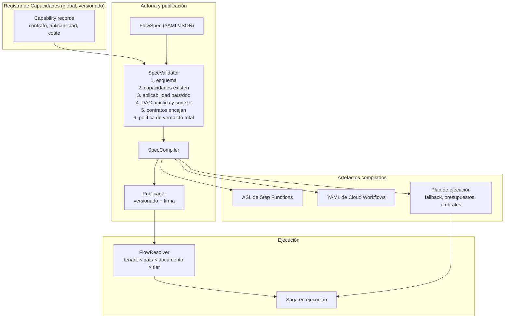
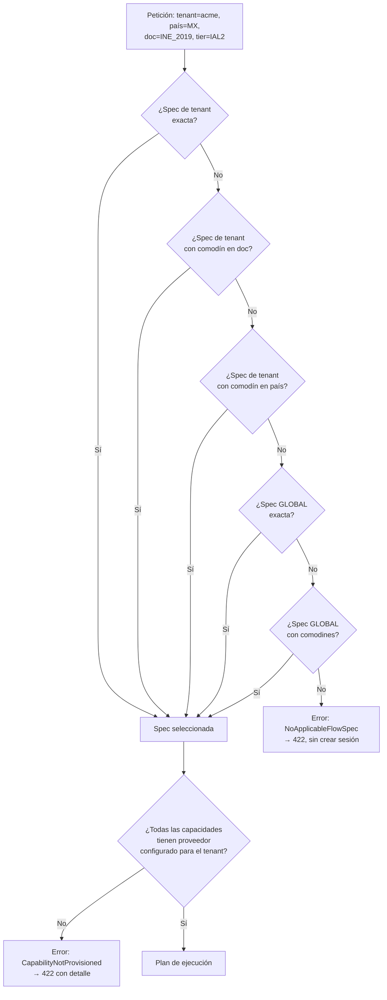
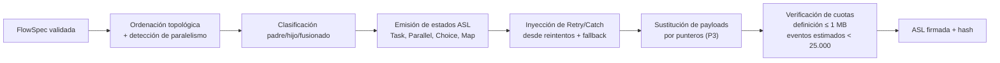
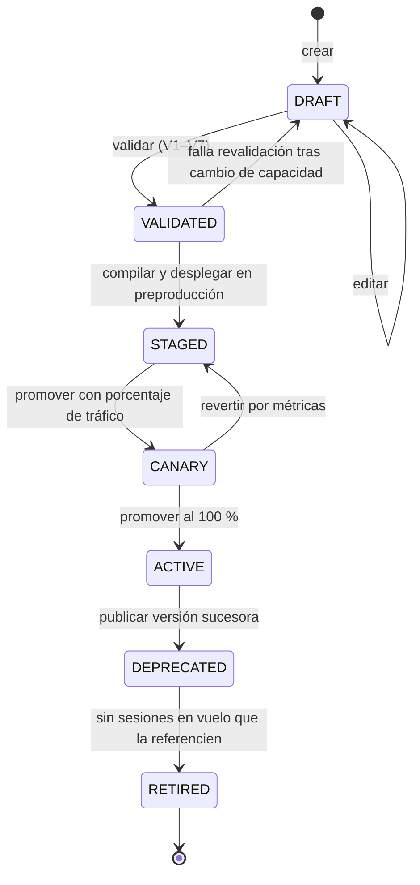
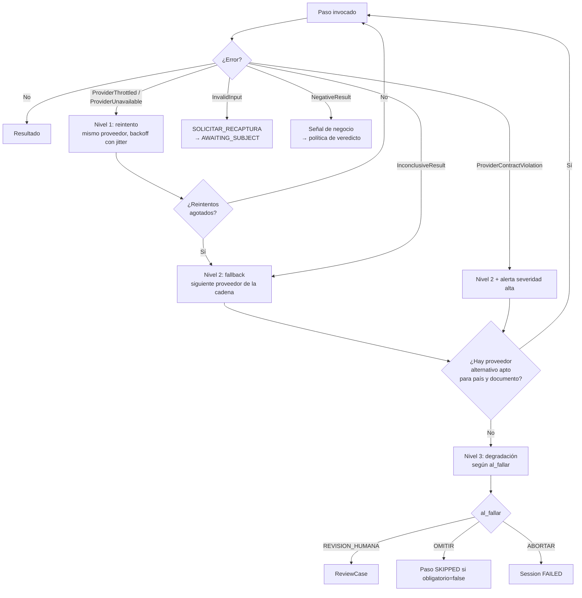

# 04 — Motor de composición

| Campo | Valor |
|---|---|
| **Estado** | Aprobado |
| **Versión** | 1.1.0 |
| **Última actualización** | 2026-08-21 |
| **Responsable** | Arquitectura de la plataforma |
| **Audiencia** | Arquitectura, desarrollo, producto |
| **Documentos relacionados** | [00 — Índice](00-indice.md) · [02 — Arquitectura](02-arquitectura.md) · [03 — Modelo de dominio](03-modelo-de-dominio.md) · [07 — Orquestación](07-orquestacion.md) |

**Resumen ejecutivo.** Describe el componente que da nombre al producto: el Registro de Capacidades con su estado de madurez por capacidad, el esquema de la especificación de flujo y un ejemplo completo y comentado para un flujo LATAM multipaís, y el ciclo del Composer —recuperación, resolución por especificidad, validación de capacidades y compilación—. Explica el versionado semántico de especificaciones y su congelación en la sesión, la resolución de `fallback_provider` en sus tres niveles, y cómo la misma especificación se compila a ASL de Step Functions y a YAML de Cloud Workflows.

---

## 1. El problema que resuelve

Un flujo de onboarding no es un proceso; es una **familia de procesos**. La misma entidad necesita:

- En México, para una cuenta Nivel 4: captura de INE anverso y reverso, verificación de elementos de seguridad, cotejo contra la autoridad emisora, prueba de vida certificada capaz de detectar *deepfakes*, máscaras, fotos estáticas y **ataques de inyección**, y contraste biométrico contra registros de INE, SRE o SAT.
- En Paraguay, para el régimen simplificado del art. 26 de la Res. SEPRELAD 70/2019: nombres, documento, nacionalidad, domicilio y ocupación, con formulario de identificación y documentación de respaldo. Sin exigencia normativa de biometría.
- En Bolivia: consulta al SEGIP, con la particularidad de que **el veredicto debe emitirlo la entidad**, no el middleware (art. 32(II) del Instructivo UIF).
- En la UE, a partir del 6 de diciembre de 2027: aceptación de la presentación de credencial EUDI, que **no incluye captura biométrica ni MRZ**.

Codificar esa familia con condicionales produce un artefacto imposible de auditar: nadie puede responder "¿qué pasos exactos se ejecutaron para el titular X el día D, con qué umbrales?" leyendo código con seis meses de parches.

El motor de composición convierte esa familia en **datos versionados, validables y auditables**.

## 2. Arquitectura del motor



Punto clave: **la compilación ocurre en el momento de publicar la especificación**, no en cada sesión. En tiempo de ejecución solo hay una resolución (una lectura indexada) y el arranque de un orquestador ya desplegado.

## 3. Registro de Capacidades

Una **capacidad** es la unidad atómica de composición. Declara *qué* hace, no *quién* lo hace.

### 3.1 Estructura del registro

```yaml
capability: ocr.document.v1
version: 1.4.0
titulo: "Extracción de texto y geometría de documento de identidad"
descripcion: >
  OCR genérico que devuelve bloques de texto con cajas delimitadoras
  normalizadas al rango 0–1. No interpreta campos: eso es extraction.semantic.v1.

contrato:
  entrada:
    type: object
    required: [artifact_ref, pagina]
    properties:
      artifact_ref: {type: string, pattern: "^(s3|gs)://"}
      pagina: {type: string, enum: [FRONT, BACK, PAGE_1]}
      hints: {type: object}
  salida:
    type: object
    required: [bloques, idioma_detectado]
    properties:
      bloques:
        type: array
        items:
          type: object
          required: [texto, bbox, confianza]
          properties:
            texto: {type: string}
            bbox: {type: array, items: {type: number, minimum: 0, maximum: 1}}
            confianza: {type: number, minimum: 0, maximum: 1}
      idioma_detectado: {type: string}

aplicabilidad:
  paises: ["*"]
  documentos: ["*"]

semantica:
  idempotente: true
  compensable: true
  clase_de_coste: BAJO
  latencia_p95_ms: 2500
  produce_evidencia: true
  clase_de_dato: DOCUMENTO

proveedores:
  - id: textract
    nubes: [aws]
    notas: "DetectDocumentText. AnalyzeID NO se usa: cubre esencialmente EE. UU."
  - id: document_ai_ocr
    nubes: [gcp]
    notas: >
      Enterprise Document OCR, +200 idiomas. Online máx. 15 páginas,
      batch 500. Regionalizado (us/eu/asia): fijar región para residencia UE.
  - id: mock
    nubes: [local]
```

### 3.2 Catálogo inicial

El **estado** de cada capacidad es información de plataforma, no de marketing: el validador rechaza una especificación que referencie una capacidad `planificada`, y admite con advertencia una `en construcción` solo en entornos distintos de producción. La columna se mantiene sincronizada con las fases de [19 — Roadmap](19-roadmap.md) §2, y su valor a **2026-08-21** es el siguiente.

| Capacidad | Qué hace | Estado | Fase | Idempotente | Coste | Nota crítica |
|---|---|---|---|---|---|---|
| `capture.quality.v1` | Evalúa calidad de imagen antes de gastar en pasos caros | ✅ **Disponible** | F0 | Sí | Nulo | Ejecutar siempre primero: evita llamadas facturables sobre basura |
| `mrz.parse.v1` | Parseo TD1/TD2/TD3 y dígitos de control 7-3-1 | ✅ **Disponible** | F0 | Sí | Nulo | Implementación propia; sin dependencia de nube ni de proveedor |
| `validation.crossfield.v1` | Coherencia frontal ↔ MRZ ↔ campos extraídos | ✅ **Disponible** | F0 | Sí | Nulo | En proceso; su coste es despreciable |
| `decision.aggregate.v1` | Agregación de señales según política del tenant | ✅ **Disponible** | F0 | Sí | Nulo | La política es dato del tenant, no código |
| `notify.webhook.v1` | Notificación firmada al requirente | ✅ **Disponible** | F0 | Sí (con `event_id`) | Nulo | Semántica *at-least-once* declarada en el contrato |
| `ocr.document.v1` | Texto + geometría normalizada | 🚧 **En construcción** | F1 | Sí | Bajo | `AnalyzeID` y los procesadores de identidad de Document AI **cubren esencialmente EE. UU.** y no sirven para LATAM |
| `extraction.semantic.v1` | Campos estructurados desde OCR + imagen con LLM multimodal | 🚧 **En construcción** | F1 | Sí | Medio | El patrón portable para documentos no estadounidenses. Bloqueado por el conjunto dorado por país |
| `biometrics.facematch.v1` | Cotejo 1:1 selfie ↔ retrato del documento | 🚧 **En construcción** | F1 | Sí | Medio | Umbrales conformes a SP 800-63A-4; pendiente de calibración por población |
| `biometrics.liveness.v2` | Sesión de prueba de vida con PAD | 🚧 **En construcción** | F1 | **No** (crea sesión externa) | Alto | Incluye SDK de cliente; `compensable: false`. **Bloqueada por la selección de proveedor certificado** ([09 §7](09-biometria-y-liveness.md)) |
| `aml.screening.v1` | Listas de sanciones, PEP y adversos | 🚧 **En construcción** | F1 | Sí | Medio | Pendiente de contrato con proveedor de listas |
| `review.human.v1` | Derivación a revisión humana | 🚧 **En construcción** | F1 | **No** | Alto | Espera larga; solo en el orquestador padre. Construcción propia en ambas nubes |
| `registry.verify.v1` (MX) | Cotejo contra registro gubernamental mexicano | 🚧 **En construcción** | F1 | **No** (llamada facturable y auditada) | Alto | Adaptador por país: INE/SRE/SAT |
| `document.tamper.v1` | Señales de manipulación del documento | 📋 **Planificada** | F2 | Sí | Medio | Atención a la licencia de los **pesos** del modelo ([15 §5](15-catalogo-de-proveedores-y-licencias.md)) |
| `registry.verify.v1` (BO, PY) | Cotejo contra registro gubernamental boliviano y paraguayo | 📋 **Planificada** | F3 | **No** | Alto | SEGIP en Bolivia |
| `wallet.presentation.v1` | Verificación OpenID4VP de credencial EUDI | 📋 **Planificada** | F4 | Sí | Bajo | Flujo alternativo completo, no paso adicional. Fecha dura: 6 de diciembre de 2027 |
| `kyb.entity.verify.v1` | Verificación de persona jurídica y registro mercantil | 📋 **Planificada** | F5 | Sí | Alto | CU-04 |
| `kyb.ubo.resolve.v1` | Resolución de beneficiarios finales | 📋 **Planificada** | F5 | Sí | Alto | Umbral de participación >10 % en Paraguay |

| Estado | Significado operativo | Qué hace el validador |
|---|---|---|
| ✅ **Disponible** | Implementada, con adaptador productivo y suite de contrato en verde | Admite la referencia sin restricción |
| 🚧 **En construcción** | Puerto definido y adaptador en curso o pendiente de proveedor | Admite con advertencia fuera de producción; **rechaza** en `prd` |
| 📋 **Planificada** | Solo existe el contrato en el catálogo | **Rechaza** la publicación en cualquier entorno |

### 3.3 Compatibilidad de versiones

El registro sigue versionado semántico con reglas estrictas:

| Cambio | Incremento | Efecto sobre especificaciones publicadas |
|---|---|---|
| Añadir campo opcional a la salida | MINOR | Ninguno; las specs siguen válidas |
| Añadir campo opcional a la entrada | MINOR | Ninguno |
| Añadir país o documento a `aplicabilidad` | MINOR | Ninguno |
| Endurecer una restricción de entrada | **MAJOR** | Revalidación obligatoria de todas las specs que la usan |
| Eliminar o renombrar campo de salida | **MAJOR** | Idem |
| Cambiar `idempotente: true → false` | **MAJOR** | Idem; afecta al plan de reintentos |

Una especificación referencia la capacidad con rango (`ocr.document.v1: "^1.4"`), y el validador resuelve la versión concreta en la publicación. **La resolución queda congelada en el artefacto compilado**: una sesión ejecutada con la spec v3.2.1 usa exactamente las versiones de capacidad que estaban vigentes al publicarla, aunque después salgan otras. Esto es requisito de trazabilidad, no una preferencia.

## 4. Especificación de flujo

### 4.1 Esquema

```yaml
apiVersion: og.flow/v1
kind: FlowSpec
metadata:
  name: "acme-mx-ine-ial2"
  tenant: "acme"            # o GLOBAL para una plantilla base
  version: "3.2.1"          # semver; inmutable una vez publicada
  descripcion: "Onboarding MX, INE 2019, nivel IAL2"

resolucion:                  # clave de resolución compuesta
  pais: ["MX"]
  documento: ["INE_2019", "INE_2021"]
  tier: ["IAL2"]
  prioridad: 100             # desempate entre specs solapadas

artefactos_requeridos:
  - slot: DOC_FRONT
    tipos: ["image/jpeg", "image/png"]
    max_bytes: 12000000
    clase_de_dato: DOCUMENTO
  - slot: DOC_BACK
    tipos: ["image/jpeg", "image/png"]
    max_bytes: 12000000
    clase_de_dato: DOCUMENTO
  - slot: SELFIE
    tipos: ["image/jpeg"]
    max_bytes: 8000000
    clase_de_dato: BIOMETRICO
    purga_por_defecto: TRAS_DECISION

pasos:
  - id: calidad_frontal
    capacidad: "capture.quality.v1@^1.0"
    entrada: {artifact_ref: "${artefactos.DOC_FRONT.puntero}", pagina: FRONT}
    umbrales: {nitidez_min: 0.55, glare_max: 0.30, resolucion_min_px: 1000}
    al_fallar: SOLICITAR_RECAPTURA

  - id: ocr_frontal
    capacidad: "ocr.document.v1@^1.4"
    dependencias: [calidad_frontal]
    entrada: {artifact_ref: "${artefactos.DOC_FRONT.puntero}", pagina: FRONT}
    reintentos: {max: 2, base_ms: 200, jitter: full}

  - id: ocr_reverso
    capacidad: "ocr.document.v1@^1.4"
    dependencias: [calidad_frontal]
    entrada: {artifact_ref: "${artefactos.DOC_BACK.puntero}", pagina: BACK}

  - id: mrz
    capacidad: "mrz.parse.v1@^1.2"
    dependencias: [ocr_reverso]
    entrada: {bloques: "${pasos.ocr_reverso.salida.bloques}", formato_esperado: TD1}
    obligatorio: false          # no todos los INE presentan MRZ legible

  - id: extraccion
    capacidad: "extraction.semantic.v1@^2.1"
    dependencias: [ocr_frontal, ocr_reverso]
    entrada:
      plantilla: "MX/INE_2019"
      bloques_frontal: "${pasos.ocr_frontal.salida.bloques}"
      bloques_reverso: "${pasos.ocr_reverso.salida.bloques}"
      imagenes: ["${artefactos.DOC_FRONT.puntero}", "${artefactos.DOC_BACK.puntero}"]
    umbrales: {confianza_min_por_campo: 0.85, confianza_min_global: 0.90}
    al_fallar: REVISION_HUMANA

  - id: coherencia
    capacidad: "validation.crossfield.v1@^1.1"
    dependencias: [extraccion, mrz]
    entrada:
      campos: "${pasos.extraccion.salida.campos}"
      mrz: "${pasos.mrz.salida}"
    umbrales: {discrepancias_max: 0}

  - id: liveness
    capacidad: "biometrics.liveness.v2@^2.0"
    dependencias: [calidad_frontal]
    entrada: {subject_ref: "${sesion.titular}"}
    umbrales: {score_min: 0.90, requiere_deteccion_inyeccion: true}
    espera: LARGA
    compensable: false
    reintentos: {max: 1}

  - id: facematch
    capacidad: "biometrics.facematch.v1@^1.3"
    dependencias: [liveness, extraccion]
    entrada:
      referencia: "${pasos.liveness.salida.imagen_auditada}"
      candidato: "${pasos.extraccion.salida.retrato_documento}"
    umbrales:
      fmr_objetivo: 0.0001        # SP 800-63A-4: FMR ≤ 1:10.000
      fnmr_objetivo: 0.01         # SP 800-63A-4: FNMR ≤ 1:100
      similitud_min: 0.82         # calibrado por población; ver doc 09
      banda_gris: [0.74, 0.82]    # → revisión humana

  - id: registro_oficial
    capacidad: "registry.verify.v1@^1.0"
    dependencias: [extraccion]
    entrada: {pais: MX, campos: "${pasos.extraccion.salida.campos}"}
    compensable: false
    presupuesto: {max_llamadas_por_sesion: 1}

  - id: aml
    capacidad: "aml.screening.v1@^1.2"
    dependencias: [extraccion]
    entrada: {campos: "${pasos.extraccion.salida.campos}"}

politica_veredicto:
  reglas:
    - si: "pasos.coherencia.discrepancias > 0"
      entonces: REVISION_HUMANA
      motivo: DOC_INCOHERENTE
    - si: "pasos.liveness.score < umbral OR pasos.liveness.inyeccion_detectada"
      entonces: RECHAZAR
      motivo: PAD_FALLIDO
    - si: "pasos.facematch.similitud en banda_gris"
      entonces: REVISION_HUMANA
      motivo: BIOMETRIA_DUDOSA
    - si: "pasos.facematch.similitud < banda_gris.min"
      entonces: RECHAZAR
      motivo: NO_COINCIDE
    - si: "pasos.aml.coincidencias_fuertes > 0"
      entonces: REVISION_HUMANA
      motivo: ALERTA_AML
    - si: "pasos.registro_oficial.resultado != COINCIDE"
      entonces: REVISION_HUMANA
      motivo: REGISTRO_NO_COINCIDE
  por_defecto: APROBAR
  emisor_del_veredicto: MIDDLEWARE   # ver §4.3

fallback:
  ocr.document.v1: {cadena: [textract, document_ai_ocr], activar_en: [ProviderUnavailable, ProviderThrottled, InconclusiveResult]}
  extraction.semantic.v1: {cadena: [claude_primario, claude_secundario], activar_en: [ProviderUnavailable, ProviderContractViolation]}
  biometrics.liveness.v2: {cadena: [proveedor_certificado], activar_en: []}   # sin fallback: no se degrada el PAD

retencion:
  hereda_de: "tenant"        # el responsable fija la política; ver doc 12
```

### 4.2 Semántica de referencias

Las expresiones `${...}` se resuelven **en la compilación** cuando son estructurales (qué paso depende de qué), y **en la ejecución** cuando son de datos. El compilador rechaza referencias a pasos no declarados o a slots de artefacto inexistentes, lo que convierte una clase entera de errores de runtime en errores de publicación.

Restricción operativa: en el destino de Cloud Workflows, **la longitud de expresión está limitada a 400 caracteres**, lo que obliga a partir lógica en pasos `assign`. El compilador lo hace automáticamente y emite advertencia si una expresión de la especificación no puede partirse.

### 4.3 `emisor_del_veredicto`

Campo de tres valores con consecuencias legales directas:

| Valor | Semántica | Cuándo usarlo |
|---|---|---|
| `MIDDLEWARE` | El middleware emite `APPROVED`/`REJECTED` según la política. | Jurisdicciones sin restricción sobre delegación, con el requirente asumiendo la política por escrito. |
| `SEÑALES_SOLAMENTE` | El middleware emite únicamente señales y evidencias; no hay campo `veredicto`. | **Obligatorio en Bolivia.** El art. 32(II) del Instructivo UIF establece que *"El Sujeto Obligado no podrá delegar a terceros la ejecución de las medidas de Debida Diligencia del cliente"*. |
| `REQUIRENTE_CONFIRMA` | El middleware propone veredicto y el requirente lo confirma por API antes de sellar. | Punto intermedio: mantiene el paso de decisión bajo control de la entidad y conserva la trazabilidad. |

El validador **rechaza** una especificación con `emisor_del_veredicto: MIDDLEWARE` cuando `resolucion.pais` incluye `BO`. Es una regla de cumplimiento codificada en el motor, no una nota en un manual.

## 5. Resolución

### 5.1 Clave de resolución

`(tenant_id, país, tipo_documento, tier)` → especificación vigente.



### 5.2 Reglas de precedencia

1. **Especificidad antes que prioridad.** Una spec con `pais: [MX]` gana sobre una con `pais: ["*"]`, independientemente del campo `prioridad`.
2. **Tenant antes que global.** Siempre.
3. **`prioridad` desempata** solo entre specs con idéntico nivel de especificidad. Dos specs empatadas en especificidad y prioridad son un **error de publicación**, no una ambigüedad resuelta al azar: el validador lo detecta al publicar la segunda.
4. **No hay herencia parcial ni composición de specs.** Una spec se aplica completa. La herencia de fragmentos genera especificaciones efectivas que nadie puede leer, y eso destruye la auditabilidad, que es el propósito del mecanismo.

### 5.3 Congelación en la sesión

Al crear la sesión se persiste `spec_ref = {clave, version, hash_contenido}`. Una republicación posterior **no afecta a sesiones en vuelo**. Esto es indispensable: una sesión que empieza bajo la spec v3.2.1 y termina bajo la v3.3.0 no es auditable.

## 6. Validación

El validador ejecuta siete comprobaciones en orden. Un fallo detiene la publicación.

| # | Comprobación | Ejemplo de fallo detectado |
|---|---|---|
| V1 | Esquema estructural de la especificación | Campo `umbrales` con tipo incorrecto |
| V2 | Todas las capacidades referenciadas existen y el rango de versión resuelve | `extraction.semantic.v1@^3.0` cuando la última es 2.1.0 |
| V3 | **Aplicabilidad**: cada capacidad soporta los países y documentos de `resolucion` | Usar un procesador de identidad limitado a EE. UU. en una spec con `pais: [MX]` |
| V4 | El grafo de dependencias es **acíclico**, conexo, y todo paso es alcanzable | `a → b → c → a`; o un paso huérfano que nunca se ejecuta |
| V5 | **Encaje de contratos**: la salida referenciada existe en el esquema de salida de la capacidad origen y su tipo es compatible con la entrada del destino | `${pasos.mrz.salida.bloques}` cuando `mrz.parse.v1` no devuelve `bloques` |
| V6 | La **política de veredicto es total**: existe una regla o un `por_defecto` para toda combinación de resultados posible | Ninguna rama cubre `facematch = INCONCLUSIVE` sin banda gris definida |
| V7 | **Reglas de cumplimiento**: `emisor_del_veredicto` compatible con las jurisdicciones; los pasos `compensable: false` no preceden a pasos que puedan fallar y forzar abandono | `MIDDLEWARE` con `pais: [BO]`; llamada facturable a registro oficial antes del liveness |

V7 merece énfasis: colocar un paso no compensable temprano en el DAG significa gastar dinero y consumir cuota antes de saber si la sesión va a completarse. El planificador lo señala como advertencia si el paso podría moverse más tarde sin romper dependencias.

### 6.1 Validación de capacidades frente a la configuración del tenant

Una spec puede ser estructuralmente válida y no ejecutable para un tenant concreto, si ese tenant no tiene proveedor configurado para alguna capacidad. Esa comprobación es de **resolución**, no de publicación, y devuelve `CapabilityNotProvisioned` con el detalle exacto de qué falta. Se ejecuta también en un modo `dry-run` (`POST /v1/flows:validate`) para que el aprovisionamiento de un tenant nuevo pueda verificarse sin crear sesiones.

## 7. Compilación

### 7.1 Estrategia de reparto entre padre e hijo

El compilador clasifica cada paso y lo asigna a un nivel de orquestación:

| Condición del paso | Destino | Razón |
|---|---|---|
| `espera: LARGA` o `compensable: false` o requiere `waitForTaskToken` | **Padre** (Standard / Cloud Workflows) | Necesita exactly-once y esperas largas; Express no soporta `.waitForTaskToken`, `.sync`, Distributed Map ni Activities |
| Automatizado, idempotente, duración < 5 min | **Hijo rápido** (Express / Cloud Tasks) | Coste por duración en vez de por transición |
| Puramente computacional y de microsegundos (validación MRZ, coherencia) | **Fusionado** en el paso vecino | Cada transición del padre cuesta; colapsar estados triviales reduce la factura linealmente |

El ahorro del patrón anidado es **específico de cada flujo** y debe calcularse con el número real de transiciones y la duración media. Los datos de referencia disponibles, sobre un flujo de ejemplo ejecutado 1.000 veces: Standard puro con 17 transiciones = 0,42 USD; Express puro con duración media de 11.300 ms = 0,01 USD (**98 %** de reducción); anidado con padre de 8 transiciones = 0,20 USD (**~52 %**). Arrancar un workflow anidado **no tiene coste adicional**. Ver [20 — Fe de erratas](20-fe-de-erratas-del-spec-original.md) §2 sobre la cifra de 72,5 % que aparecía en el spec original y que no está respaldada.

### 7.2 Compilación a ASL



Puntos que el compilador garantiza por construcción:

- **Ningún estado transporta binarios**: todos los pasos reciben y devuelven punteros. El payload de entrada/salida está limitado a **256 KiB** en ambos tipos de workflow.
- **El tamaño de la definición de la máquina de estados no supera 1 MB**, que es una cuota **dura**. Si una spec compila por encima, el compilador la parte en un padre y varios hijos anidados y lo reporta.
- **Estimación de eventos de historial**: el límite de Standard es de **25.000 eventos por ejecución**. El compilador calcula la cota superior con los reintentos máximos declarados y advierte si supera el 60 % del límite, sugiriendo el patrón de arrancar ejecuciones nuevas.

### 7.3 Compilación a YAML de Cloud Workflows

La traducción **no es mecánica**. Cloud Workflows usa YAML/CEL, no ASL, y carece de las funciones intrínsecas de ASL y del catálogo de integraciones optimizadas de SDK. Todo se resuelve con `http.post` o conectores.

Restricciones que el compilador debe respetar y verificar:

| Límite de Cloud Workflows | Valor | Cómo lo gestiona el compilador |
|---|---|---|
| **Datos acumulados por ejecución** | **512 KB** (variables + argumentos + eventos) | Es el límite dominante. Solo punteros; además libera variables con `assign` a `null` tras su último uso |
| Respuesta HTTP | 2 MB | Los workers devuelven referencias, nunca documentos completos |
| Longitud de string | 256 KB | |
| Pasos por ejecución | 100.000 | Holgado |
| **Ramas por paso `parallel`** | **10** | Si el DAG tiene más de 10 ramas concurrentes, el compilador las agrupa en olas sucesivas |
| Anidamiento paralelo | 2 niveles | Limita la profundidad de fan-out |
| Iteraciones concurrentes | 20 antes de encolar | |
| Profundidad de call stack | 20 | |
| Tamaño del código fuente | 128 KB | Umbral de partición del workflow |
| Longitud de expresión | 400 caracteres | Partición automática en pasos `assign` |
| Retención de ejecuciones | 90 días | Paridad con el historial de Standard |

Además, el compilador emite el patrón alternativo de espera larga: cuando un paso declara `espera: LARGA`, en el destino GCP no genera un `await_callback` sin más, porque el **timeout por defecto es de 43.200 s (12 h)** y hay **un solo slot por endpoint** (un segundo callback recibe HTTP 429), sin heartbeat. Genera el patrón de **persistir estado, terminar la ejecución y relanzar una nueva con `executions.run`** cuando llegue la decisión. Ver [07 — Orquestación](07-orquestacion.md) §8.

<!-- PENDIENTE DE VERIFICAR: si el parámetro `timeout` de `events.await_callback` admite valores documentados por encima de 43.200 s. La referencia de paridad GCP lo señala como no verificado. Si admitiera valores mayores, el patrón de relanzamiento seguiría siendo preferible por el límite de un solo slot. -->

### 7.4 Plan de ejecución

Artefacto independiente del orquestador, consumido por los `step-workers`:

```json
{
  "spec_ref": {"clave": "acme:MX:INE_2019:IAL2", "version": "3.2.1"},
  "hash_contenido": "sha256:9f2c…",
  "pasos": {
    "extraccion": {
      "capacidad": "extraction.semantic.v1",
      "version_resuelta": "2.1.3",
      "proveedores": ["claude_primario", "claude_secundario"],
      "umbrales": {"confianza_min_por_campo": 0.85, "confianza_min_global": 0.90},
      "reintentos": {"max": 2, "base_ms": 200, "jitter": "full"},
      "presupuesto": {"max_llamadas_por_sesion": 3},
      "al_fallar": "REVISION_HUMANA"
    }
  },
  "politica_veredicto": { "…": "…" },
  "emisor_del_veredicto": "MIDDLEWARE"
}
```

Separar el plan del orquestador permite cambiar umbrales de un paso sin recompilar la topología, siempre que la estructura del DAG no cambie. Es la diferencia entre un cambio de **parámetro** (rápido, con validación ligera) y un cambio de **flujo** (recompilación completa).

## 8. Versionado y despliegue sin desplegar código

### 8.1 Ciclo de vida de una especificación



Una especificación en `RETIRED` **no se elimina**: se conserva mientras exista algún expediente que la referencie, porque es parte de la evidencia de qué proceso se aplicó a ese titular.

### 8.2 Despliegue canario

El campo `resolucion.prioridad` permite el reparto: se publica la v3.3.0 con una condición de canario evaluada en la resolución (`hash(session_id) % 100 < N`). Las métricas que gobiernan la promoción o la reversión:

| Métrica | Umbral de reversión |
|---|---|
| Tasa de derivación a revisión humana | > 1,5× la línea base de la versión anterior |
| Tasa de `InconclusiveResult` por paso | > 2× la línea base |
| Latencia p95 de la sesión | > 1,3× la línea base |
| Tasa de rechazo | Desviación > 20 % en cualquier dirección |
| Coste por sesión | > 1,4× la línea base |

Una desviación de la tasa de rechazo **en cualquier dirección** es sospechosa: una caída brusca puede indicar que un paso está devolviendo éxito por defecto tras un cambio de contrato del proveedor.

### 8.3 Qué sí exige desplegar código

Ser honestos sobre los límites del mecanismo:

| Cambio | ¿Sin desplegar código? |
|---|---|
| Cambiar un umbral | ✅ Sí (plan de ejecución) |
| Reordenar pasos, añadir un paso existente | ✅ Sí (recompilación de spec) |
| Cambiar de proveedor entre los ya integrados | ✅ Sí (configuración de tenant) |
| Añadir un país usando capacidades existentes | ✅ Sí (spec nueva + plantilla de extracción) |
| Añadir un documento nuevo con OCR + LLM | ✅ Sí, si la plantilla de extracción es dato |
| **Integrar un proveedor nuevo** | ❌ No — requiere adaptador |
| **Definir una capacidad nueva** | ❌ No — requiere contrato y worker |
| **Cambiar la máquina de estados de la sesión** | ❌ No — es dominio |

## 9. Fallback y reintentos

### 9.1 Los tres niveles, y por qué son distintos



- **Nivel 1 (reintento)** solo aplica a errores transitorios. Reintentar un `InvalidInput` es gastar dinero para obtener el mismo error.
- **Nivel 2 (fallback)** exige verificar la aplicabilidad del proveedor alternativo: un proveedor de OCR que no cubre el país no es un fallback válido, es un fallo distinto.
- **Nivel 3 (degradación)** es una decisión de política del tenant, no del motor.

### 9.2 Reglas duras

| Regla | Motivo |
|---|---|
| Un paso con `compensable: false` tiene `reintentos.max ≤ 1` por defecto y **nunca** fallback automático a otro proveedor facturable sin presupuesto explícito. | Evita duplicar llamadas facturables y consultas auditadas a registros oficiales. |
| `biometrics.liveness.v2` **no tiene cadena de fallback**. | Degradar el PAD a un proveedor menos capaz es peor que fallar: produce una evidencia de cumplimiento falsa. |
| El presupuesto por sesión se comprueba **antes** de invocar, no después. | Es un control de coste y de abuso. |
| El *jitter* es completo (`full`), no fijo. | Sin jitter, N entornos de ejecución que fallan a la vez reintentan a la vez. |
| Todo reintento comparte la misma `attempt_key` de idempotencia. | Un reintento sobre un paso que sí se ejecutó no debe duplicar el efecto. |

### 9.3 Circuito abierto y presupuesto de error

El disyuntor es **por (proveedor, capacidad, región)**, no global: un proveedor puede estar degradado en una región y sano en otra. Cuando se abre, el motor conmuta al fallback y emite un evento de alta severidad. Un disyuntor abierto en un paso sin fallback pausa la admisión de nuevas sesiones que lo requieran, con un `503` explícito y `Retry-After`, en lugar de acumular sesiones en `PROCESSING` que van a expirar.

## 10. Ejemplo completo: flujo LATAM multipaís

Especificación global que cubre tres países con un solo documento de política, apoyándose en la aplicabilidad de capacidades y en pasos condicionales.

```yaml
apiVersion: og.flow/v1
kind: FlowSpec
metadata:
  name: "global-latam-base"
  tenant: GLOBAL
  version: "1.0.0"
  descripcion: >
    Plantilla base LATAM. Cubre MX, PY y BO con un núcleo común de
    captura, extracción y biometría, más pasos condicionales por país.
    Los tenants la especializan sobrescribiendo umbrales y proveedores.

resolucion:
  pais: ["MX", "PY", "BO"]
  documento: ["*"]
  tier: ["IAL2"]
  prioridad: 10

artefactos_requeridos:
  - {slot: DOC_FRONT, tipos: ["image/jpeg","image/png"], max_bytes: 12000000, clase_de_dato: DOCUMENTO}
  - {slot: DOC_BACK,  tipos: ["image/jpeg","image/png"], max_bytes: 12000000, clase_de_dato: DOCUMENTO, requerido_si: "sesion.tipo_documento != 'PASAPORTE'"}
  - {slot: SELFIE,    tipos: ["image/jpeg"], max_bytes: 8000000, clase_de_dato: BIOMETRICO, purga_por_defecto: TRAS_DECISION}

pasos:
  # --- Fase 1: calidad (barata, primero, evita gasto inútil) ---
  - id: calidad
    capacidad: "capture.quality.v1@^1.0"
    entrada: {artifact_refs: ["${artefactos.DOC_FRONT.puntero}", "${artefactos.SELFIE.puntero}"]}
    umbrales: {nitidez_min: 0.55, glare_max: 0.30, resolucion_min_px: 1000, rostro_detectado: true}
    al_fallar: SOLICITAR_RECAPTURA

  # --- Fase 2: lectura documental (paralela) ---
  - id: ocr_frontal
    capacidad: "ocr.document.v1@^1.4"
    dependencias: [calidad]
    entrada: {artifact_ref: "${artefactos.DOC_FRONT.puntero}", pagina: FRONT}
    reintentos: {max: 2, base_ms: 200, jitter: full}

  - id: ocr_reverso
    capacidad: "ocr.document.v1@^1.4"
    dependencias: [calidad]
    condicion: "artefactos.DOC_BACK != null"
    entrada: {artifact_ref: "${artefactos.DOC_BACK.puntero}", pagina: BACK}

  - id: mrz
    capacidad: "mrz.parse.v1@^1.2"
    dependencias: [ocr_frontal, ocr_reverso]
    obligatorio: false
    entrada:
      bloques: "${pasos.ocr_reverso.salida.bloques ?? pasos.ocr_frontal.salida.bloques}"
      formato_esperado: "${sesion.tipo_documento == 'PASAPORTE' ? 'TD3' : 'TD1'}"

  - id: extraccion
    capacidad: "extraction.semantic.v1@^2.1"
    dependencias: [ocr_frontal, ocr_reverso]
    entrada:
      plantilla: "${sesion.pais}/${sesion.tipo_documento}"
      bloques_frontal: "${pasos.ocr_frontal.salida.bloques}"
      bloques_reverso: "${pasos.ocr_reverso.salida.bloques}"
      imagenes: ["${artefactos.DOC_FRONT.puntero}", "${artefactos.DOC_BACK.puntero}"]
    umbrales: {confianza_min_por_campo: 0.85, confianza_min_global: 0.90}
    reintentos: {max: 1}
    al_fallar: REVISION_HUMANA

  - id: coherencia
    capacidad: "validation.crossfield.v1@^1.1"
    dependencias: [extraccion, mrz]
    entrada: {campos: "${pasos.extraccion.salida.campos}", mrz: "${pasos.mrz.salida}"}
    umbrales: {discrepancias_max: 0}

  - id: manipulacion
    capacidad: "document.tamper.v1@^1.0"
    dependencias: [calidad]
    entrada: {artifact_ref: "${artefactos.DOC_FRONT.puntero}"}
    umbrales: {score_sospecha_max: 0.35}

  # --- Fase 3: biometría ---
  - id: liveness
    capacidad: "biometrics.liveness.v2@^2.0"
    dependencias: [calidad]
    espera: LARGA
    compensable: false
    reintentos: {max: 1}
    entrada: {subject_ref: "${sesion.titular}", modo: PASIVO_CON_RETO_SI_DUDA}
    umbrales:
      score_min: 0.90
      requiere_deteccion_inyeccion: true      # exigido por CNBV en MX; se aplica en los tres países
      iapar_objetivo: 0.07                    # SP 800-63A-4

  - id: facematch
    capacidad: "biometrics.facematch.v1@^1.3"
    dependencias: [liveness, extraccion]
    entrada:
      referencia: "${pasos.liveness.salida.imagen_auditada}"
      candidato: "${pasos.extraccion.salida.retrato_documento}"
    umbrales:
      fmr_objetivo: 0.0001
      fnmr_objetivo: 0.01
      similitud_min: 0.82
      banda_gris: [0.74, 0.82]

  # --- Fase 4: fuentes externas, condicionadas por país ---
  - id: registro_mx
    capacidad: "registry.verify.v1@^1.0"
    condicion: "sesion.pais == 'MX'"
    dependencias: [extraccion, facematch]
    compensable: false
    presupuesto: {max_llamadas_por_sesion: 1}
    entrada: {pais: MX, fuentes: [INE, SRE, SAT], campos: "${pasos.extraccion.salida.campos}"}

  - id: registro_bo
    capacidad: "registry.verify.v1@^1.0"
    condicion: "sesion.pais == 'BO'"
    dependencias: [extraccion]
    compensable: false
    presupuesto: {max_llamadas_por_sesion: 1}
    entrada: {pais: BO, fuentes: [SEGIP], campos: "${pasos.extraccion.salida.campos}"}

  - id: aml
    capacidad: "aml.screening.v1@^1.2"
    dependencias: [extraccion]
    entrada:
      campos: "${pasos.extraccion.salida.campos}"
      regimen: "${sesion.pais == 'PY' && sesion.tier == 'SIMPLIFICADO' ? 'BASICO' : 'AMPLIADO'}"

politica_veredicto:
  reglas:
    - {si: "pasos.manipulacion.score_sospecha > umbral", entonces: REVISION_HUMANA, motivo: DOC_MANIPULADO}
    - {si: "pasos.coherencia.discrepancias > 0",         entonces: REVISION_HUMANA, motivo: DOC_INCOHERENTE}
    - {si: "pasos.liveness.inyeccion_detectada",         entonces: RECHAZAR,        motivo: ATAQUE_INYECCION}
    - {si: "pasos.liveness.score < umbral",              entonces: RECHAZAR,        motivo: PAD_FALLIDO}
    - {si: "pasos.facematch.similitud en banda_gris",    entonces: REVISION_HUMANA, motivo: BIOMETRIA_DUDOSA}
    - {si: "pasos.facematch.similitud < banda_gris.min", entonces: RECHAZAR,        motivo: NO_COINCIDE}
    - {si: "pasos.aml.coincidencias_fuertes > 0",        entonces: REVISION_HUMANA, motivo: ALERTA_AML}
    - {si: "pasos.registro_mx.resultado == NO_COINCIDE", entonces: REVISION_HUMANA, motivo: REGISTRO_NO_COINCIDE}
    - {si: "pasos.registro_bo.resultado == NO_COINCIDE", entonces: REVISION_HUMANA, motivo: REGISTRO_NO_COINCIDE}
  por_defecto: APROBAR
  emisor_del_veredicto:
    MX: MIDDLEWARE
    PY: MIDDLEWARE
    BO: SEÑALES_SOLAMENTE      # art. 32(II) Instructivo UIF: la DDC no se delega

fallback:
  ocr.document.v1: {cadena: [primario, secundario], activar_en: [ProviderUnavailable, ProviderThrottled, InconclusiveResult]}
  extraction.semantic.v1: {cadena: [primario, secundario], activar_en: [ProviderUnavailable, ProviderContractViolation]}
  aml.screening.v1: {cadena: [primario], activar_en: [ProviderUnavailable]}
  biometrics.liveness.v2: {cadena: [], activar_en: []}

retencion:
  hereda_de: tenant
  clases:
    DOCUMENTO: EXPEDIENTE_KYC          # 5–10 años según jurisdicción, desde fin de relación
    BIOMETRICO: MINIMIZAR              # purga tras la decisión salvo instrucción del responsable
    EVIDENCIA: EXPEDIENTE_KYC
```

### 10.1 Lectura del ejemplo

- **La calidad va primero y es barata.** Rechazar por calidad antes del OCR y del LLM evita la mayor parte del gasto de una sesión abortada.
- **El OCR de anverso y reverso es paralelo**, pero el fan-out total se mantiene por debajo de 10 ramas concurrentes para caber en el límite de `parallel` de Cloud Workflows sin agrupar en olas.
- **Los pasos no compensables están tarde.** `registro_mx` depende de `facematch`: no se gasta una consulta auditada al registro oficial si la biometría ya falló.
- **`emisor_del_veredicto` es un mapa por país.** Un solo documento de política cubre la restricción boliviana sin duplicar la especificación.
- **El liveness no degrada.** Cadena de fallback vacía, deliberadamente.
- **La detección de inyección se exige en los tres países**, aunque solo la CNBV la imponga expresamente. Un estándar técnico único para todas las jurisdicciones es más barato que diferenciarlo, y el techo lo marca el regulador más exigente.

---

## Referencias

- [`docs/referencias/aws-arquitecturas-de-referencia.md`](referencias/aws-arquitecturas-de-referencia.md) — Ficha 5 (Standard vs. Express, patrón anidado y sus cifras reales), Ficha 6 (motor de DAG dinámico, dependencias y bloqueo optimista), cuotas de Step Functions (25.000 eventos, 256 KiB, definición de 1 MB).
- [`docs/referencias/gcp-paridad-de-servicios.md`](referencias/gcp-paridad-de-servicios.md) — capacidad 2 (límites de Cloud Workflows: 512 KB acumulados, 10 ramas paralelas, 400 caracteres de expresión, callbacks de 12 h con un solo slot), capacidad 8 (cobertura geográfica de los procesadores de identidad).
- [`docs/referencias/cumplimiento-normativo-y-estandares.md`](referencias/cumplimiento-normativo-y-estandares.md) — art. 32(II) del Instructivo UIF de Bolivia, requisitos de la CNBV mexicana, regímenes de DDC de la Res. SEPRELAD 70/2019, umbrales de NIST SP 800-63A-4.
- [02 — Arquitectura](02-arquitectura.md) · [03 — Modelo de dominio](03-modelo-de-dominio.md) · [07 — Orquestación](07-orquestacion.md) · [08 — IA y extracción semántica](08-ia-y-extraccion-semantica.md) · [11 — Cumplimiento normativo](11-cumplimiento-normativo.md) · [20 — Fe de erratas](20-fe-de-erratas-del-spec-original.md)
