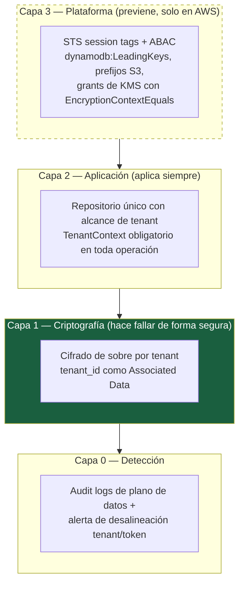
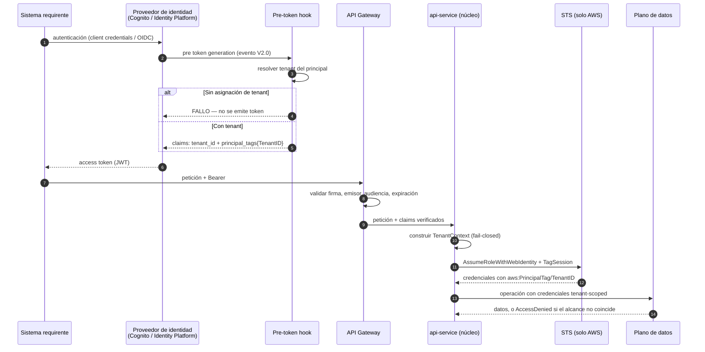

# 05 — Multitenancy y aislamiento

| Campo | Valor |
|---|---|
| **Estado** | Aprobado |
| **Versión** | 1.1.0 |
| **Última actualización** | 2026-08-21 |
| **Responsable** | Seguridad de la plataforma |
| **Audiencia** | Arquitectura, seguridad, SRE |
| **Documentos relacionados** | [00 — Índice](00-indice.md) · [02 — Arquitectura](02-arquitectura.md) · [03 — Modelo de dominio](03-modelo-de-dominio.md) · [06 — Criptografía](06-criptografia-y-gestion-de-claves.md) · [14 — Modelo de amenazas](14-modelo-de-amenazas.md) |

**Resumen ejecutivo.** El aislamiento de este producto descansa en tres capas independientes: aplicación, criptografía y plataforma. El documento transcribe la cadena completa de AWS —Cognito, *pre-token-generation* V2, `AssumeRoleWithWebIdentity` con `sts:TagSession`, `aws:PrincipalTag/TenantID` y `dynamodb:LeadingKeys`, con el `Deny` explícito de `Scan`— y las políticas que la implementan. Después expone sin adornos la **brecha de GCP**, que no tiene equivalente en el plano de datos, y la estrategia de compensación en capas con su tabla de controles por nivel de garantía. La conclusión invierte la dirección del diseño: el puerto se escribe asumiendo GCP.

---

## 1. Tesis del documento

El aislamiento multi-tenant de este producto descansa en **tres capas independientes**, y ninguna de las tres es suficiente por sí sola:



La capa 3 está **con trazo discontinuo** porque **no existe en GCP**. La capa 1 es la que se subraya porque es la única que convierte un error de programación en un **fallo de descifrado** en lugar de una fuga de datos, y funciona idéntica en ambas nubes. Esa es la propiedad que hace portable el multi-tenancy de este producto.

## 2. Modelos de aislamiento por recurso

El aislamiento es una decisión **por recurso**, no por aplicación. Los tres modelos canónicos:

| Modelo | Definición | Aislamiento | Coste operativo | Eficiencia |
|---|---|---|---|---|
| **Silo** | Cada tenant obtiene recursos dedicados (tabla, base de datos, cuenta o proyecto). Frontera física. | Máximo, demostrable ante auditoría | Alto | Baja |
| **Pool** | Los tenants comparten recursos; el aislamiento se aplica lógicamente a nivel de fila o de ítem. | Depende de que los controles sean correctos | Bajo | Máxima |
| **Bridge** | Mezcla: algunos recursos en silo, otros en pool. Habilita estrategias por tier. | Ajustable | Medio | Alta |

### 2.1 Asignación adoptada

**Modelo Bridge**, con la siguiente matriz por recurso:

| Recurso | Tier `STANDARD` | Tier `REGULADO` | Tier `DEDICADO` | Justificación |
|---|---|---|---|---|
| Tabla de dominio | Pool (`og-{env}-core`) | Pool con branch key dedicada | **Silo**: tabla propia (AWS) / base de datos Firestore propia (GCP) | Firestore admite hasta **100 bases de datos por proyecto**; es el tope duro del tier `DEDICADO` en GCP |
| Artefactos y evidencias | Pool con prefijo `${TenantID}/` | Pool con prefijo + CMK propia | **Silo**: bucket propio | El *scoping* por prefijo cubre bien la mayoría de casos |
| Material criptográfico | **Branch key por tenant** en keystore compartida | Branch key por tenant + CMK raíz por jurisdicción | **CMK propia** del tenant | Ver §2.2 |
| Orquestador | Pool (máquina de estados compartida por spec) | Pool | Silo por spec | Las ejecuciones ya están aisladas entre sí |
| Cómputo (workers) | Pool | Pool con concurrencia reservada | Silo: funciones o servicios propios | Evita el vecino ruidoso en tiers altos |
| Cola de revisión | Pool con partición lógica | Pool | Silo | La UI filtra por `TenantContext` |
| Log de auditoría WORM | Pool con prefijo | Silo (bucket con retención bloqueada propia) | Silo | Un auditor de un tenant no debe recibir un objeto que contenga eventos de otros |
| Métricas y logs | Pool con dimensión `TenantId` | Pool | Pool | La dimensión es suficiente; el silo aquí solo añade coste |

### 2.2 Por qué branch keys y no una CMK por tenant

Una CMK gestionada por cliente tiene un coste de existencia (del orden de 1 USD/mes según precios de blog de terceros, más un incremento similar por rotación) que escala linealmente con el número de tenants: mil tenants suponen aproximadamente 2.000 USD/mes **solo por la existencia de las claves**, antes de cualquier operación criptográfica.

Más importante que el coste: el aislamiento por CMK exige un **grant por tenant** con `EncryptionContextEquals={tenant=<tenantId>}`, y `CreateGrant` está limitado a **50 req/s** (cuota independiente de la cuota compartida de operaciones criptográficas). Crear grants en el camino de la petición topa con ese límite a ~50 altas de tenant por segundo. **Los grants se crean en el flujo de aprovisionamiento del tenant, nunca en el flujo de request.**

Las **branch keys** —claves de envoltura intermedias entre la CMK de KMS y las claves de datos, persistidas en una tabla de keystore— dan aislamiento criptográfico por tenant sin ese coste ni esa presión de cuota, y son además la primitiva que exige el DB-ESDK. Una sola decisión cubre las dos necesidades. Detalle en [06 — Criptografía](06-criptografia-y-gestion-de-claves.md) §3.

Reservamos la CMK dedicada para el tier `DEDICADO`, donde el cliente exige poder **revocar el acceso del operador** modificando la política de la clave sin tocar los datos, o poder alojarla en un HSM externo.

## 3. Cadena de identidad de tenant



### 3.1 El hook falla cerrado

Requisito duro: **si un principal no tiene tenant asignado, no se emite token**. No se emite un token sin `tenant_id` que luego el middleware rechace: no se emite en absoluto. La diferencia importa porque un token válido sin tenant, en manos de un componente que olvide comprobarlo, es una credencial de acceso universal.

Fragmento del hook (evento V2.0 de Cognito):

```python
def handler(event, context):
    principal = event["userName"]
    tenant_id = resolve_tenant(principal)          # consulta al registro de tenants
    if not tenant_id:
        raise TenantNotAssignedError(principal)     # falla cerrado: sin token

    event["response"]["claimsAndScopeOverrideDetails"] = {
        "idTokenGeneration": {
            "claimsToAddOrOverride": {
                "https://aws.amazon.com/tags": {
                    "principal_tags": {"TenantID": [tenant_id]}
                }
            }
        },
        "accessTokenGeneration": {
            "claimsToAddOrOverride": {"tenant_id": tenant_id}
        }
    }
    return event
```

### 3.2 Trust policy del rol tenant-scoped

La *trust policy* debe permitir **explícitamente ambas** acciones: `sts:AssumeRoleWithWebIdentity` y `sts:TagSession`. Omitir la segunda produce un fallo poco intuitivo: el rol se asume, pero sin *session tags*, y entonces `${aws:PrincipalTag/TenantID}` se resuelve a vacío y todas las políticas ABAC deniegan.

```json
{
  "Version": "2012-10-17",
  "Statement": [
    {
      "Sid": "TenantFederation",
      "Effect": "Allow",
      "Principal": {
        "Federated": "arn:aws:iam::111122223333:oidc-provider/cognito-idp.us-east-1.amazonaws.com/us-east-1_EXAMPLE"
      },
      "Action": ["sts:AssumeRoleWithWebIdentity", "sts:TagSession"],
      "Condition": {
        "StringEquals": {
          "cognito-idp.us-east-1.amazonaws.com/us-east-1_EXAMPLE:aud": "EXAMPLECLIENTID"
        }
      }
    }
  ]
}
```

### 3.3 Presupuesto de session tags

| Límite | Valor |
|---|---|
| Máximo de session tags por operación de STS | **50** |
| Longitud máxima de clave de tag | **128 caracteres** |
| Longitud máxima de valor de tag | **256 caracteres** |

Cincuenta es holgado, pero se agota antes de lo que parece si se usa como bolsa de contexto general. El conjunto adoptado es **mínimo y estable**: `TenantID`, `Tier`, `Jurisdiction`, `Role`. Cualquier otro atributo de autorización vive en el `TenantContext` del núcleo, no en los tags — porque los tags son un contrato con IAM y cambiarlos exige tocar políticas.

### 3.4 `TenantContext` en el núcleo

```python
@dataclass(frozen=True)
class TenantContext:
    tenant_id: TenantId
    tier: IsolationTier
    jurisdiction: Jurisdiction
    scopes: frozenset[str]
    actor: ActorRef
    token_id: str          # jti, para correlación de auditoría
```

Es inmutable, se construye una sola vez por petición y **se pasa explícitamente** a cada caso de uso. No es una variable de contexto implícita ni un *thread local*: en un modelo con concurrencia por instancia (Cloud Run admite hasta 1.000 peticiones concurrentes por instancia), el estado implícito por hilo es una fuente de fugas entre tenants difícil de detectar en pruebas.

## 4. Política ABAC completa, comentada

Política de permisos del rol tenant-scoped en AWS. Cada sentencia con su razón.

```json
{
  "Version": "2012-10-17",
  "Statement": [
    {
      "Sid": "TenantScopedItemAccess",
      "Effect": "Allow",
      "Action": [
        "dynamodb:GetItem", "dynamodb:BatchGetItem", "dynamodb:Query",
        "dynamodb:PutItem", "dynamodb:UpdateItem", "dynamodb:DeleteItem"
      ],
      "Resource": "arn:aws:dynamodb:us-east-1:111122223333:table/og-prd-core",
      "Condition": {
        "ForAllValues:StringEquals": {
          "dynamodb:LeadingKeys": ["TENANT#${aws:PrincipalTag/TenantID}"]
        }
      }
    },
```

> **Comentario 1.** La clave de condición `dynamodb:LeadingKeys` es **plural incluso para acciones de ítem único**, y **debe usarse con el modificador de conjunto `ForAllValues:`**. Escribirla sin el modificador es el error más frecuente y produce una política que parece correcta y no restringe lo que se cree. El valor lleva el prefijo `TENANT#` porque así se construyen las partition keys ([03](03-modelo-de-dominio.md) §4.2); si la PK fuera el `tenant_id` desnudo, `TENANT#acme` y `TENANT#acme-corp` podrían solaparse en comparaciones de prefijo mal escritas.

```json
    {
      "Sid": "TenantScopedIndexAccess",
      "Effect": "Allow",
      "Action": ["dynamodb:Query"],
      "Resource": [
        "arn:aws:dynamodb:us-east-1:111122223333:table/og-prd-core/index/GSI1",
        "arn:aws:dynamodb:us-east-1:111122223333:table/og-prd-core/index/GSI2",
        "arn:aws:dynamodb:us-east-1:111122223333:table/og-prd-core/index/GSI3",
        "arn:aws:dynamodb:us-east-1:111122223333:table/og-prd-core/index/GSI4"
      ],
      "Condition": {
        "ForAllValues:StringLike": {
          "dynamodb:LeadingKeys": ["TENANT#${aws:PrincipalTag/TenantID}#*"]
        }
      }
    },
```

> **Comentario 2 — el punto más delicado de toda la política.** `LeadingKeys` restringe la partition key **de la tabla base**. Un **LSI comparte esa PK y queda protegido automáticamente**; un **GSI no**. Por eso los cuatro GSI de este diseño llevan el `tenant_id` como primer componente de su propia partition key (`TENANT#<tid>#STATE#…`, `TENANT#<tid>#IDX#…`), y esta sentencia lo exige con `StringLike`. Un GSI cuya PK no empiece por el tenant queda **fuera del perímetro IAM** y hay que excluirlo explícitamente de la política — lo que en la práctica significa que no puede existir en este diseño.

```json
    {
      "Sid": "DenyAuditMutation",
      "Effect": "Deny",
      "Action": ["dynamodb:UpdateItem", "dynamodb:DeleteItem"],
      "Resource": "arn:aws:dynamodb:us-east-1:111122223333:table/og-prd-core",
      "Condition": {
        "ForAllValues:StringLike": {
          "dynamodb:LeadingKeys": ["TENANT#${aws:PrincipalTag/TenantID}"]
        },
        "StringLike": {"dynamodb:Attributes": ["AUDIT#*"]}
      }
    },
```

> **Comentario 3.** El log de auditoría es *append-only*. El `Deny` explícito sobre modificación y borrado del rango `AUDIT#` prevalece sobre cualquier `Allow`. La inmutabilidad real la aporta el almacén WORM; esta sentencia evita la manipulación accidental por la ruta principal. <!-- PENDIENTE DE VERIFICAR: la aplicabilidad exacta de `dynamodb:Attributes` sobre patrones de sort key en esta forma; la referencia AWS documenta `LeadingKeys` pero no esta combinación concreta. Validar contra el simulador de políticas de IAM antes de desplegar. -->

```json
    {
      "Sid": "TenantObjectAccess",
      "Effect": "Allow",
      "Action": ["s3:GetObject", "s3:PutObject", "s3:DeleteObject"],
      "Resource": "arn:aws:s3:::og-prd-artifacts/${aws:PrincipalTag/TenantID}/*"
    },
    {
      "Sid": "TenantScopedList",
      "Effect": "Allow",
      "Action": "s3:ListBucket",
      "Resource": "arn:aws:s3:::og-prd-artifacts",
      "Condition": {
        "StringLike": {"s3:prefix": ["${aws:PrincipalTag/TenantID}/*"]}
      }
    },
```

> **Comentario 4.** `s3:ListBucket` es una acción **sobre el bucket**, no sobre el objeto, y por eso necesita sentencia separada con condición sobre `s3:prefix`. Sin ella, un tenant puede **enumerar** las claves de todos los demás aunque no pueda leerlas — y los nombres de objeto filtran volumen, tasa de actividad y, si el esquema de nombres es descuidado, identificadores de titular.

```json
    {
      "Sid": "TenantKmsUsage",
      "Effect": "Allow",
      "Action": ["kms:Encrypt", "kms:Decrypt", "kms:GenerateDataKey"],
      "Resource": "arn:aws:kms:us-east-1:111122223333:key/<cmk-raiz-jurisdiccion>",
      "Condition": {
        "StringEquals": {
          "kms:EncryptionContext:tenant": "${aws:PrincipalTag/TenantID}",
          "kms:EncryptionContext:purpose": "ekyc-record"
        }
      }
    },
    {
      "Sid": "BranchKeyRead",
      "Effect": "Allow",
      "Action": ["dynamodb:GetItem", "dynamodb:Query"],
      "Resource": "arn:aws:dynamodb:us-east-1:111122223333:table/og-prd-keystore",
      "Condition": {
        "ForAllValues:StringEquals": {
          "dynamodb:LeadingKeys": ["${aws:PrincipalTag/TenantID}"]
        }
      }
    },
```

> **Comentario 5.** El contexto de cifrado del grant y de la política **debe coincidir exactamente** con el que se usa al cifrar. Una discrepancia produce `AccessDeniedException` **en el descifrado**, no en el cifrado: el dato se escribe correctamente y solo falla al leerlo, potencialmente semanas después. Es un fallo difícil de detectar en pruebas y por eso la suite de contrato incluye un caso explícito de *round-trip* con contexto desalineado ([§8](#8-pruebas-de-aislamiento-automatizadas)).

```json
    {
      "Sid": "DenyOutsideJurisdiction",
      "Effect": "Deny",
      "Action": "*",
      "Resource": "*",
      "Condition": {
        "StringNotEquals": {
          "aws:RequestedRegion": ["${aws:PrincipalTag/Jurisdiction}"]
        }
      }
    },
    {
      "Sid": "DenyInsecureTransport",
      "Effect": "Deny",
      "Action": "*",
      "Resource": "*",
      "Condition": {"Bool": {"aws:SecureTransport": "false"}}
    }
  ]
}
```

> **Comentario 6.** El `Deny` por región convierte la residencia de datos en un control técnico, no en una convención de despliegue. Un tenant con `Jurisdiction=eu-west-1` no puede operar contra recursos de otra región ni por error de configuración ni por un adaptador mal parametrizado. <!-- PENDIENTE DE VERIFICAR: `aws:RequestedRegion` no aplica a acciones globales (IAM, STS global, algunas de S3); la sentencia debe complementarse con una lista de acciones exentas para no bloquear operaciones legítimas. Validar con el simulador de políticas. -->

### 4.1 Grant de KMS por tenant (tier `DEDICADO`)

```bash
aws kms create-grant \
  --key-id arn:aws:kms:us-east-1:111122223333:key/<cmk-del-tenant> \
  --grantee-principal arn:aws:iam::111122223333:role/og-prd-tenant-data-access \
  --operations Encrypt Decrypt GenerateDataKey \
  --constraints EncryptionContextEquals={tenant=<tenantId>,purpose=ekyc-record}
```

Se ejecuta **en el aprovisionamiento del tenant**, por la cuota de 50 req/s de `CreateGrant`.

## 5. Por qué el filtro `WHERE tenant_id` en la aplicación es insuficiente

Este apartado existe porque la objeción es frecuente y la respuesta es contraintuitiva: el filtro en la aplicación no es *débil*, es **de una categoría distinta de control**.

### 5.1 Los cinco modos de fallo que el filtro no cubre

| # | Modo de fallo | Ejemplo concreto | ¿Lo detiene el filtro? | ¿Lo detiene IAM? | ¿Lo detiene la criptografía? |
|---|---|---|---|---|---|
| F1 | **Ruta olvidada** | Un endpoint nuevo, un script de operación, un job de migración o un exportador de métricas que consulta directamente sin pasar por el repositorio. | ❌ | ✅ | ✅ |
| F2 | **Confusión de contexto** | En un modelo con alta concurrencia por instancia, un `TenantContext` guardado en estado implícito se filtra entre peticiones. | ❌ (el filtro se aplica con el tenant equivocado) | ✅ | ✅ |
| F3 | **Inyección en el predicado** | Un parámetro no saneado que altera el filtro, o un `FilterExpression` construido por concatenación. | ❌ | ✅ | ✅ |
| F4 | **Sobrelectura antes del filtro** | En DynamoDB, `FilterExpression` se aplica **después** de leer: la operación consume capacidad de otros tenants y el dato ya salió del almacén, aunque no se devuelva. | ❌ | ✅ | ✅ (el dato sale cifrado) |
| F5 | **Credencial comprometida** | Un atacante con la credencial de cómputo ejecuta consultas arbitrarias sin pasar por el código. | ❌ | ✅ | ✅ |

### 5.2 La asimetría de la evidencia

Un filtro en la aplicación es una afirmación sobre **todo el código presente y futuro**: "ninguna ruta de acceso omite el filtro". Esa afirmación no es verificable de forma estable — cada *pull request* puede invalidarla.

Una política IAM es una afirmación sobre la **credencial**: "esta credencial no puede leer fuera de su prefijo, ejecute el código que ejecute". Es verificable por inspección y no cambia cuando cambia el código.

El cifrado con `tenant_id` como AAD es una afirmación sobre el **dato**: "este texto cifrado no se puede descifrar con la clave de otro tenant". Es verificable matemáticamente y no depende ni del código ni de la credencial.

### 5.3 Lo que sí aporta el filtro

No se elimina: es la **capa 2** del modelo. Aporta corrección funcional (que las consultas devuelvan lo correcto), eficiencia (que no se lean datos que se van a descartar) y una superficie de pruebas rápida. Simplemente no es una **frontera de seguridad**.

## 6. La brecha de GCP

### 6.1 El hecho, sin adornos

**GCP no tiene equivalente a `dynamodb:LeadingKeys`. En ninguna forma.**

No es una carencia de madurez ni algo que se resuelva con una configuración poco conocida. La documentación de IAM Conditions enumera exhaustivamente los atributos disponibles y **ninguno permite condicionar sobre el prefijo de una clave de fila o el identificador de un documento**:

| Categoría | Atributos disponibles |
|---|---|
| Recurso | `resource.type`, `resource.name`, `resource.service`, `resource.matchTag()` |
| Petición | `request.time`, `request.auth.access_levels` (solo IAP), `request.host` / `request.path` (solo IAP), `destination.ip` / `destination.port` (solo IAP TCP), `api.getAttribute()` |
| Principal | `principal.type`, `principal.subject` |

Además, solo algunos tipos de recurso aceptan condiciones en los *bindings* de rol, y **Firestore no expone condiciones a nivel de documento en IAM**.

Y el complemento del problema, que suele proponerse como solución y no lo es: **las Security Rules de Firestore no protegen a un backend**. La documentación es explícita: *"The server client libraries bypass all Firestore Security Rules and instead authenticate through Google Application Default Credentials."* Las Security Rules protegen SDK de cliente móvil y web. Un middleware server-side las ignora por completo.

**Consecuencia operativa:** en GCP, si el proceso tiene la cuenta de servicio de Firestore, puede leer todos los tenants. La barrera es el código. Y la brecha es **silenciosa**: el sistema funciona perfectamente, simplemente no está aislado en el plano de datos.

### 6.2 Lo que GCP sí ofrece, y qué cubre cada cosa

| Mecanismo | Qué consigue | Qué NO consigue |
|---|---|---|
| **IAM Conditions** con `resource.name.startsWith(...)` | Funciona bien para **Cloud Storage** (prefijos de objeto) y **Secret Manager** | ❌ No aplica a filas o documentos de Firestore, Bigtable ni Spanner |
| **Workload Identity Federation con *attribute conditions*** | Mapea claims del token externo a `google.subject` y hasta **50 atributos personalizados** (`attribute.tenant`), y concede roles a `principalSet://…/attribute.tenant/{VALOR}`. Es el análogo más cercano a las *session tags*. | Gobierna a qué **recursos** de GCP puede acceder la identidad, **no a qué filas dentro de una base de datos** |
| **Cuenta de servicio por tenant + base de datos Firestore por tenant** | Aislamiento real en el plano de datos vía IAM sobre el recurso `database` | Tope de **100 bases de datos por proyecto**; no escala a miles de tenants |
| **Proyecto por tenant** | Aislamiento máximo: IAM, cuotas, facturación, VPC-SC y *audit logs* separados | Sobrecarga operativa alta; exige una fábrica de proyectos y Terraform generado |
| **VPC Service Controls** | Perímetro que impide exfiltración de datos desde servicios gestionados hacia fuera. **No tiene equivalente en AWS.** | Granularidad de **proyecto**, no de fila |
| **Firestore Security Rules** | Útil solo si algún cliente accede directamente a Firestore | ❌ Irrelevante para el middleware |

### 6.3 Controles compensatorios adoptados

Ordenados por lo que realmente aportan:

**C1 — Repositorio único con alcance de tenant (obligatorio).**
Toda consulta pasa por un `TenantScopedRepository` que inyecta el `tenant_id` en el prefijo del identificador de documento antes de tocar el adaptador. **Ningún otro código puede construir una referencia a Firestore.** Se refuerza con una prueba de arquitectura que falla si el cliente de Firestore se importa fuera del módulo del adaptador. Es un control de la capa 2 y hereda todas sus limitaciones (§5.1), pero es la vía de acceso normal.

**C2 — Cifrado de sobre por tenant con `tenant_id` como Associated Data (obligatorio, y el que de verdad cambia el resultado).**
Un error de alcance devuelve un texto cifrado que **no se puede descifrar** con la clave del tenant equivocado. Convierte una fuga de datos en un error de descifrado, que además es alertable. En GCP se implementa con Tink `KmsEnvelopeAead` y AAD `tenant_id|record_id`. Ver [06](06-criptografia-y-gestion-de-claves.md) §7.

**C3 — Base de datos o proyecto dedicado para tenants de alto valor.**
Con WIF `attribute.tenant` y VPC Service Controls. Es el único control que reproduce la propiedad de la capa 3, y solo escala hasta 100 tenants por proyecto (base de datos) o hasta donde llegue la fábrica de proyectos.

**C4 — Data Access audit logs habilitados sobre Firestore, GCS y KMS, con alerta de desalineación.**
Los **Data Access logs están deshabilitados por defecto** (excepto BigQuery). Si no se habilitan explícitamente, no hay traza de quién leyó datos de qué tenant: un fallo de cumplimiento silencioso. Se habilitan en el Terraform base con `google_project_iam_audit_config`, y se define una alerta sobre accesos cuyo `tenant_id` en la ruta del documento no coincide con el del token. **Es detección, no prevención** — hay que decirlo así.

**C5 — VPC Service Controls como perímetro.**
Contiene Firestore, GCS, Cloud KMS y Document AI, de modo que una credencial robada no pueda exfiltrar datos fuera del perímetro. Compensa parcialmente la brecha a nivel de proyecto.

### 6.4 Cómo esto cambia el diseño de los puertos

> **Invierte la dirección del diseño.** Si el `TenantIsolationPort` se escribe asumiendo que la plataforma aplica la política (modelo AWS), el adaptador GCP queda **estructuralmente inseguro**. Se diseña asumiendo el modelo GCP —aplicación explícita en un único repositorio con alcance de tenant— y se deja que el adaptador AWS añada `LeadingKeys` como refuerzo **redundante**.

Esto tiene una consecuencia contraintuitiva y positiva: el adaptador AWS acaba con dos capas de aplicación (código + IAM) donde el de GCP tiene una, pero **ambos comparten la misma capa criptográfica**, que es la que da la garantía transversal.

### 6.5 Declaración honesta al cliente

En un despliegue GCP, la respuesta correcta a "¿está mi tenant aislado del de otro cliente?" es:

> *"El aislamiento se aplica en tres niveles: la aplicación garantiza el alcance por construcción y está verificado con pruebas automatizadas de arquitectura y de acceso negativo; la criptografía garantiza que un texto cifrado de otro tenant es indescifrable con su clave, incluso si un error de aplicación lo devolviera; y la auditoría detecta cualquier acceso desalineado. Lo que GCP **no** ofrece, y AWS sí, es una barrera en el plano de datos aplicada por el proveedor de nube que rechace la consulta antes de ejecutarla. Para tenants que requieren esa propiedad, ofrecemos base de datos o proyecto dedicado."*

Esa es la formulación que se sostiene en una auditoría. La formulación que no se sostiene es "está aislado igual que en AWS".

## 7. Vecino ruidoso y limitación por tenant

### 7.1 Vectores de contención

| Recurso compartido | Cómo se manifiesta | Control |
|---|---|---|
| Partición caliente de la tabla | Un tenant con volumen desproporcionado satura una partición | Sufijo de dispersión en la PK de los ítems de alta frecuencia; capacidad *on-demand*; alarma sobre `ThrottledRequests` por dimensión de tenant |
| Concurrencia de cómputo | Un tenant agota la concurrencia de la región | AWS: concurrencia reservada por función crítica. Límite por defecto **1.000 ejecuciones concurrentes por región** con *burst* de **1.000 entornos cada 10 segundos por función**. GCP: `max_instance_count` por servicio |
| Cuota de KMS | Operaciones criptográficas compartidas por cuenta y región | La cuota compartida es de **100.000 req/s** en us-east-1, us-west-2 y eu-west-1; **20.000** en us-east-2, ap-southeast-1/2, ap-northeast-1, eu-central-1 y eu-west-2; **10.000** en el resto. Sin caché y con una llamada por operación, ese es el techo de todo el sistema **compartido con cualquier otra cosa en la cuenta**. La caché de material criptográfico no es una optimización: es un requisito de viabilidad |
| Cuota de proveedor externo | Un tenant consume la cuota contratada con un proveedor SaaS | Cuota por tenant en el adaptador, con cola y rechazo explícito antes de llamar |
| Ejecuciones del orquestador | Ejecuciones abiertas por cuenta y región | Standard: **1.000.000** ejecuciones abiertas (cuota flexible). Cloud Workflows: **10.000 ejecuciones concurrentes** por región y proyecto |
| Cola de revisión humana | Un tenant satura a los revisores compartidos | Cuotas por tenant en la asignación y colas separadas por tier |

### 7.2 Limitación por tenant

Tres niveles, aplicados en orden:

1. **Borde** — plan de uso del gateway por clave de API del tenant. Absorbe el abuso grosero antes de consumir cómputo.
2. **Aplicación** — cubeta de tokens por `(tenant_id, operación)` con el estado en la tabla, comprobada en el caso de uso. Es la que respeta la semántica de negocio (una sesión no es lo mismo que una consulta de estado).
3. **Recurso** — concurrencia reservada, cuotas por proveedor y presupuesto por sesión declarado en el plan de ejecución ([04](04-motor-de-composicion.md) §9).

Cuando se limita, la respuesta es `429` con `Retry-After` y una cabecera `X-RateLimit-Scope` que indica qué nivel disparó, para que el cliente pueda distinguir un límite propio de una degradación global.

### 7.3 Medición por tenant

La medición se emite con métricas embebidas en el log, **sin llamadas API síncronas**, añadiendo la dimensión `TenantId`:

```python
print(json.dumps({
    "_aws": {
        "CloudWatchMetrics": [{
            "Namespace": "OnboardingGenerico/Uso",
            "Dimensions": [["TenantId", "Capability"], ["TenantId"]],
            "Metrics": [
                {"Name": "SesionesIniciadas", "Unit": "Count"},
                {"Name": "LlamadasProveedor", "Unit": "Count"},
                {"Name": "OperacionesKms", "Unit": "Count"}
            ]
        }]
    },
    "TenantId": tenant_id,
    "Capability": capability_id,
    "SesionesIniciadas": 1,
    "LlamadasProveedor": llamadas,
    "OperacionesKms": ops_kms
}))
```

Emitir métricas de forma síncrona por tenant desde el camino de la petición añade latencia y consume cuota de API; embebidas en el log, no.

> **Regla transversal:** *tenancy* observable en **todos** los logs, métricas y trazas. Un log sin `tenant_id` es un log que no sirve para investigar un incidente de aislamiento. Ver [13 — Observabilidad](13-observabilidad-y-sre.md).

## 8. Pruebas de aislamiento automatizadas

> *"Una frontera que no has intentado romper es una frontera de la que no sabes si funciona."*

Estas pruebas son **bloqueantes en CI** y se ejecutan además contra el entorno desplegado en cada promoción.

### 8.1 Suite de aislamiento

| # | Prueba | Qué verifica | Resultado esperado | Nubes |
|---|---|---|---|---|
| **A-01** | Consulta con PK de otro tenant usando credenciales tenant-scoped | Perímetro IAM del plano de datos | `AccessDeniedException` | AWS |
| **A-02** | Igual contra cada uno de los cuatro GSI | Que ningún GSI escape del perímetro | `AccessDeniedException` en los cuatro | AWS |
| **A-03** | `s3:ListBucket` con prefijo de otro tenant | Enumeración de claves ajenas | `AccessDenied` | AWS |
| **A-04** | `GetObject` sobre objeto de otro tenant | Lectura de artefacto ajeno | `AccessDenied` | AWS |
| **A-05** | `Decrypt` con contexto de cifrado del tenant equivocado | Que el AAD ata el texto cifrado al tenant | `AccessDeniedException` / fallo de descifrado | Ambas |
| **A-06** | Descifrar un blob del tenant A con la branch key de B | Aislamiento criptográfico efectivo | Excepción de autenticación (etiqueta inválida) | Ambas |
| **A-07** | Invocar cada caso de uso con `TenantContext` que no corresponde al `session_id` | Comprobación de propiedad en el dominio | `SessionNotFound` (no `Forbidden`, para no filtrar existencia) | Ambas |
| **A-08** | Petición sin claim `tenant_id` | Fail-closed | `401`, sin creación de recursos | Ambas |
| **A-09** | Token válido de otro emisor o audiencia | Validación de emisor | `401` | Ambas |
| **A-10** | Asunción de rol sin `sts:TagSession` en la trust policy | Que la ausencia de tags no degrada a permisivo | Todas las operaciones denegadas | AWS |
| **A-11** | Prueba de arquitectura: importación del SDK de almacén fuera del adaptador | Que no hay rutas alternativas de acceso | Fallo de compilación de la prueba | Ambas |
| **A-12** | Prueba de arquitectura: caso de uso sin parámetro `TenantContext` | Que todo caso de uso está en el perímetro | Fallo | Ambas |
| **A-13** | Ejecución concurrente de 200 peticiones de 20 tenants distintos, verificando que ninguna respuesta contiene datos de otro | Confusión de contexto bajo concurrencia (F2) | Cero cruces | Ambas |
| **A-14** | Operación contra una región distinta de la jurisdicción del tenant | Residencia de datos como control técnico | Denegado | AWS (Deny por región); GCP con VPC-SC |
| **A-15** | Consulta al índice determinista con el beacon de otro tenant | Que el índice está particionado por tenant | Sin resultados y sin error informativo | Ambas |
| **A-16** | Purga del tenant A y verificación de que los datos de B siguen descifrables | Que el crypto-shredding está acotado | B intacto | Ambas |
| **A-17** | Fuzzing del `tenant_id` en todos los parámetros de entrada | Inyección en el predicado (F3) | Sin acceso cruzado; entradas rechazadas por validación | Ambas |
| **A-18** | Revisión de que ningún log, métrica o traza emitida contiene PII o el `tenant_id` de otro | Fuga por telemetría | Cero coincidencias del detector de PII | Ambas |

### 8.2 Prueba negativa de referencia

```python
def test_cross_tenant_query_is_denied(entorno):
    """A-01: credenciales de 'acme' no pueden leer ítems de 'globex'."""
    creds = entorno.tenant_scoped_credentials("acme")
    ddb = entorno.dynamodb_client(creds)

    with pytest.raises(ClientError) as exc:
        ddb.query(
            TableName=entorno.tabla_core,
            KeyConditionExpression="pk = :pk",
            ExpressionAttributeValues={":pk": {"S": "TENANT#globex"}},
        )
    assert exc.value.response["Error"]["Code"] == "AccessDeniedException"


def test_cross_tenant_decrypt_fails_cryptographically(entorno):
    """A-06: el AAD ata el texto cifrado a su tenant, con IAM o sin él."""
    blob = entorno.cifrar_registro(tenant="acme", datos={"nombre": "prueba"})

    with pytest.raises(CryptographicError):
        entorno.descifrar_registro(tenant="globex", blob=blob)
```

A-06 es la prueba más valiosa del conjunto porque **no depende de IAM**: pasa idéntica en AWS, en GCP y contra los adaptadores en memoria. Es la verificación directa de la capa 1.

### 8.3 Verificación continua

- La suite se ejecuta en cada *pull request* contra adaptadores en memoria y contra emuladores, y en cada promoción contra la infraestructura real de preproducción.
- Una alarma vigila que las pruebas A-01 a A-05 y A-14 se hayan ejecutado con éxito en las últimas 24 horas en producción con un tenant sintético. Una política IAM puede quedar mal aplicada por un cambio de Terraform, y una prueba que solo corre en CI no lo detecta.
- El detector de PII de A-18 se ejecuta también de forma continua sobre una muestra de logs de producción ([13](13-observabilidad-y-sre.md) §2).

## 9. Cuadro de controles por nivel de garantía

Esta es la tabla que se lleva a una auditoría, y la que hay que leer antes de responder a un cliente que pregunta "¿cómo me garantizan el aislamiento?". El **nivel de garantía** dice quién impone el control y, por tanto, qué hace falta para eludirlo:

| Nivel | Quién lo impone | Qué hace falta para eludirlo | Efecto de un fallo de programación |
|---|---|---|---|
| **Plataforma** | El proveedor de nube, en el plano de datos, antes de ejecutar la operación | Comprometer credenciales o alterar la política IAM | La operación se **rechaza**: el error nunca llega a los datos |
| **Criptográfico** | La matemática, mediante la clave y el contexto de cifrado | Obtener la clave del tenant víctima | El texto cifrado se devuelve pero es **indescifrable**: hay error, no fuga |
| **Aplicación** | El código del núcleo | Un error de programación en la ruta correspondiente | **Fuga silenciosa**, salvo que otro nivel lo detenga |
| **Detección** | La telemetría, *a posteriori* | Que la señal no se emita o nadie la mire | No previene nada; acorta la ventana de exposición |

| # | Control | Nivel | AWS | GCP | Prueba que lo verifica |
|---|---|---|---|---|---|
| **CI-01** | Prefijo de tenant en toda clave de partición | Aplicación + Plataforma | ✅ Aplicado por `dynamodb:LeadingKeys` | ⚠️ Solo aplicación: el prefijo existe, nadie lo impone | A-01, A-02 |
| **CI-02** | `Deny` explícito de operaciones de barrido | Plataforma | ✅ `Deny` de `Scan` en la política del rol | ❌ Sin equivalente: la consulta sin filtro es legítima para IAM | A-01, en su variante de barrido |
| **CI-03** | Etiqueta de sesión con el `tenant_id` en la identidad asumida | Plataforma | ✅ `sts:TagSession` + `aws:PrincipalTag/TenantID` | ⚠️ Parcial: WIF con `attribute.tenant` gobierna **recursos**, no filas | A-10 |
| **CI-04** | Prefijo de tenant en el almacén de objetos | Plataforma | ✅ Condición sobre el prefijo de clave | ✅ IAM Conditions con `resource.name.startsWith` | A-03, A-04 |
| **CI-05** | Cifrado de sobre con `tenant_id` como Associated Data | **Criptográfico** | ✅ DB-ESDK con contexto de cifrado | ✅ Tink con AAD equivalente | **A-06**, A-05 |
| **CI-06** | Clave por tenant con destrucción programable | **Criptográfico** | ✅ *Branch key* por tenant sobre CMK | ✅ CryptoKey por tenant | A-16 |
| **CI-07** | Restricción del uso de la clave al contexto del tenant | **Criptográfico** + Plataforma | ✅ *Grant* de KMS con `EncryptionContextEquals` | ⚠️ Sin condición equivalente sobre el contexto; se compensa con clave por tenant | A-05 |
| **CI-08** | Repositorio único con alcance de tenant | Aplicación | ✅ | ✅ **Es el control primario en GCP** | A-07, A-11 |
| **CI-09** | `TenantContext` obligatorio en toda operación del núcleo | Aplicación | ✅ | ✅ | A-12 |
| **CI-10** | `tenant_id` nunca aceptado del cuerpo de la petición | Aplicación | ✅ | ✅ | A-08, A-17 |
| **CI-11** | Índices secundarios con el tenant en su clave de partición | Aplicación + Plataforma | ✅ Requisito duro; sin él, el índice queda fuera del perímetro IAM | ⚠️ Solo aplicación | A-02, A-15 |
| **CI-12** | Recurso dedicado para tenants de alto valor | Plataforma | ✅ Tabla, bucket y CMK propios | ✅ Base de datos o proyecto propio (tope de 100 por proyecto) | Revisión de configuración |
| **CI-13** | Perímetro contra exfiltración | Plataforma | ❌ Sin equivalente | ✅ **VPC Service Controls: ventaja de GCP** | Revisión de configuración |
| **CI-14** | Auditoría del plano de datos con alerta de desalineación | Detección | ✅ Eventos de datos activados explícitamente | ✅ Data Access logs, **deshabilitados por defecto** | Verificación continua (§8.3) |
| **CI-15** | Alarma sobre fallos de descifrado por contexto | Detección | ✅ | ✅ | RB-04 en [13 §5.2](13-observabilidad-y-sre.md) |
| **CI-16** | Ausencia de PII en telemetría | Aplicación + Detección | ✅ | ✅ | A-18 |

**Cómo se lee.** En AWS, el aislamiento cuenta con controles de los tres niveles y el criptográfico es redundante. En GCP, **los niveles de plataforma desaparecen para el plano de datos** (CI-01, CI-02, CI-03 y CI-11 degradan a aplicación) y CI-05 pasa de red de seguridad a **control principal**. De ahí la conclusión de §6.4: el puerto se diseña asumiendo el modelo GCP. Y de ahí también que A-06 sea la prueba más valiosa del conjunto: verifica CI-05, el único control que no cambia de nivel entre nubes.

---

## Referencias

- [`docs/referencias/aws-arquitecturas-de-referencia.md`](referencias/aws-arquitecturas-de-referencia.md) — Ficha 1 (modelos silo/pool/bridge, pre-token hook con fallo cerrado, trust policy con `sts:TagSession`, `dynamodb:LeadingKeys` con `ForAllValues:`, GSI fuera del perímetro, prefijos de S3, grants de KMS con `EncryptionContextEquals`, métricas embebidas, límites de session tags); cuotas de KMS (operaciones compartidas por región, `CreateGrant` a 50 req/s) y de Lambda (concurrencia y *burst*).
- [`docs/referencias/gcp-paridad-de-servicios.md`](referencias/gcp-paridad-de-servicios.md) — capacidad 7 y brecha 2 (ausencia de `LeadingKeys`, atributos de IAM Conditions, Security Rules ignoradas por bibliotecas de servidor, WIF con `attribute.tenant`, tope de 100 bases de datos, VPC Service Controls), capacidad 12 (Data Access logs deshabilitados por defecto).
- [`docs/referencias/cumplimiento-normativo-y-estandares.md`](referencias/cumplimiento-normativo-y-estandares.md) — art. 25 del GDPR (aislamiento estricto entre responsables), art. 28 (encargado), transferencias internacionales y residencia.
- [02 — Arquitectura](02-arquitectura.md) · [03 — Modelo de dominio](03-modelo-de-dominio.md) · [06 — Criptografía](06-criptografia-y-gestion-de-claves.md) · [10 — Multinube](10-multicloud-aws-gcp.md) · [13 — Observabilidad](13-observabilidad-y-sre.md) · [14 — Modelo de amenazas](14-modelo-de-amenazas.md)
