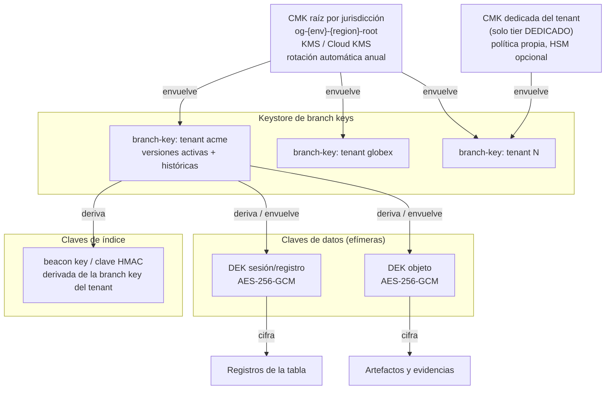
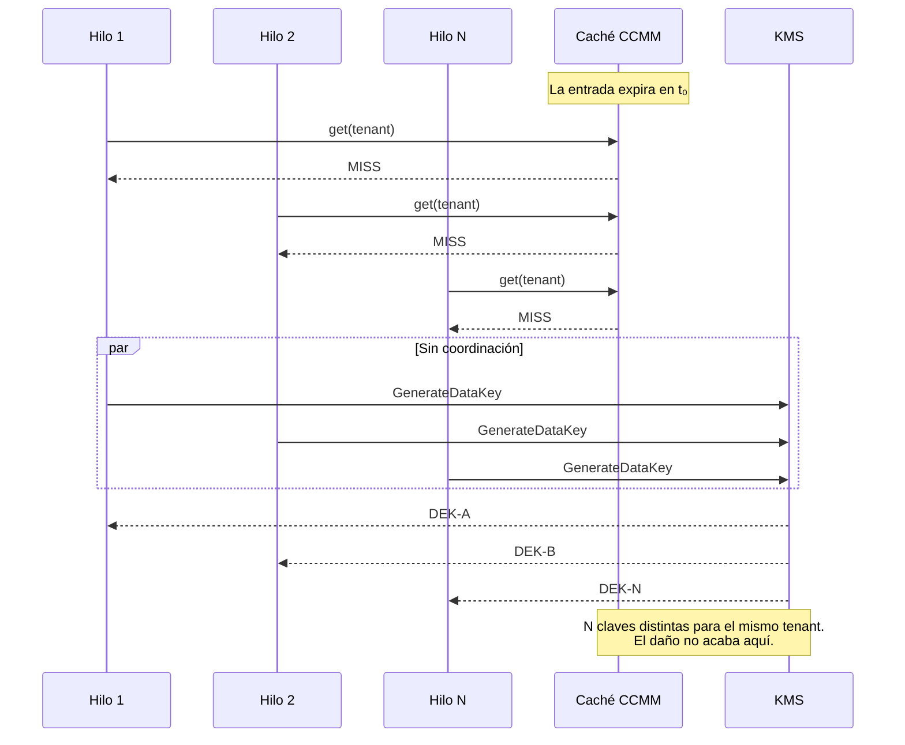
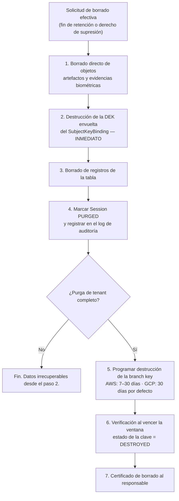

# 06 — Criptografía y gestión de claves

| Campo | Valor |
|---|---|
| **Estado** | Aprobado |
| **Versión** | 1.1.0 |
| **Última actualización** | 2026-08-21 |
| **Responsable** | Seguridad de la plataforma |
| **Audiencia** | Arquitectura, seguridad, desarrollo |
| **Documentos relacionados** | [00 — Índice](00-indice.md) · [03 — Modelo de dominio](03-modelo-de-dominio.md) · [05 — Multitenancy](05-multitenancy-y-aislamiento.md) · [12 — Retención y borrado](12-retencion-y-borrado.md) · [14 — Modelo de amenazas](14-modelo-de-amenazas.md) |

**Resumen ejecutivo.** Cubre el cifrado de sobre por tenant con `tenant_id` como Associated Data, la tabla de directivas por atributo (`SIGN_ONLY` / `ENCRYPT_AND_SIGN` / `DO_NOTHING`), y el uso del AWS Database Encryption SDK con **hierarchical keyring** —explicando por qué el `CachingCryptoMaterialsManager` es la causa del problema de estampida de caché y no su solución—. Trata los beacons de búsqueda con la advertencia de que su longitud es irreversible y su conflicto con `LeadingKeys`, el crypto-shredding con sus plazos reales en ambos KMS, y la ausencia de DB-ESDK en GCP con la estrategia equivalente basada en Tink.

---

## 1. Objetivos criptográficos

| # | Objetivo | Cómo se logra | Verificación |
|---|---|---|---|
| O1 | Un texto cifrado de un tenant **no puede descifrarse** con material de otro | Cifrado de sobre con clave por tenant y `tenant_id` en el Associated Data | Prueba A-06 ([05](05-multitenancy-y-aislamiento.md) §8) |
| O2 | El operador de la plataforma no puede leer datos de un tenant del tier `DEDICADO` sin dejar traza y sin autorización de la clave | CMK del tenant con política propia; toda operación registrada | Revisión de CloudTrail / Cloud Audit Logs |
| O3 | Un registro alterado en el almacén se detecta | Firma del registro completo (DB-ESDK) o firma de aplicación (GCP) | Prueba de detección de manipulación |
| O4 | El borrado de datos de un titular es efectivo dentro de un plazo comprometible | Crypto-shredding con plazos reales y documentados (§8) | Auditoría de purga |
| O5 | El coste y la latencia del cifrado no hacen inviable el sistema | Caché de material criptográfico con carga atómica (§4) | Prueba de carga y métrica de llamadas a KMS por operación |
| O6 | Se puede buscar por campos cifrados sin descifrar toda la tabla | Índice determinista con las limitaciones declaradas (§6, §7) | Prueba de consulta indexada |

O1 es el objetivo dominante: es el que hace portable el multi-tenancy a GCP, donde no hay barrera de plano de datos.

## 2. Jerarquía de claves



| Nivel | Qué es | Dónde vive | Rotación |
|---|---|---|---|
| **CMK raíz** | Clave simétrica del KMS, una por jurisdicción y entorno | AWS KMS / Cloud KMS | Automática (365 días en AWS; `rotation_period` configurable en GCP) |
| **Branch key** | Clave de envoltura intermedia por tenant | Tabla de keystore dedicada (`og-{env}-keystore`), cifrada por la CMK raíz | Programada; las versiones antiguas se retienen para descifrar histórico |
| **DEK** | Clave de datos AES-256-GCM, por registro o por objeto | Nunca persistida en claro; viaja cifrada junto al dato | Por operación |
| **Clave de índice** | Clave HMAC para beacons o índices deterministas | Derivada de la branch key | Con la branch key (con las salvedades de §6.4) |
| **CMK dedicada** | Solo tier `DEDICADO` | KMS del tenant, política separada | Según acuerdo con el cliente |

### 2.1 Por qué la jerarquía tiene tres niveles y no dos

Con dos niveles (CMK → DEK) cada operación exige una llamada a KMS, o bien se cachea la DEK y se pierde el aislamiento por tenant si la caché no está particionada correctamente.

Con branch keys:

- El aislamiento por tenant está en la **branch key**, que es persistente y compartida entre entornos de ejecución. La caché puede ser agresiva sin comprometer el aislamiento, porque **la clave de caché incluye el discriminador de tenant**.
- El coste de KMS baja de una llamada por operación a una llamada por refresco de branch key.
- La destrucción de la branch key de un tenant es el mecanismo de crypto-shredding, sin tocar la CMK raíz que comparten los demás.

## 3. Cifrado de sobre por tenant

### 3.1 Contexto de cifrado (AAD)

El contexto de cifrado es el eje del modelo. **No es un campo opcional de metadatos: es lo que ata criptográficamente el texto cifrado a su tenant y a su propósito.**

```python
def contexto_cifrado(ctx: TenantContext, record_id: str, proposito: str) -> dict[str, str]:
    return {
        "tenant": ctx.tenant_id,        # obligatorio — objetivo O1
        "purpose": proposito,           # "ekyc-record" | "ekyc-artifact" | "ekyc-evidence"
        "record": record_id,            # ata el blob a su registro concreto
        "service": "onboarding-generico",
        "jurisdiction": ctx.jurisdiction,
    }
```

Propiedades que se obtienen:

1. **Aislamiento entre tenants.** Un blob cifrado con `tenant=acme` no se descifra con `tenant=globex`, aunque el atacante tenga ambas claves: el AAD forma parte de la autenticación de AES-GCM y una discrepancia produce fallo de etiqueta.
2. **Antimovimiento.** El campo `record` impide reubicar un blob cifrado de un registro a otro dentro del mismo tenant.
3. **Aplicación por IAM.** El grant de KMS con `EncryptionContextEquals={tenant=…}` y las condiciones `kms:EncryptionContext:tenant` de la política ABAC ([05](05-multitenancy-y-aislamiento.md) §4) se apoyan en el mismo contexto.
4. **Trazabilidad.** El contexto aparece en los eventos de CloudTrail y de Cloud Audit Logs, lo que da trazabilidad **por propósito**, no solo por clave.

> **Trampa operativa.** El contexto debe coincidir **exactamente** entre cifrado y descifrado. Una discrepancia produce `AccessDeniedException` **en el descifrado**, no un error de cifrado. El dato se escribe bien y solo falla al leerlo, potencialmente semanas después. Por eso el contexto se construye en **una sola función** del núcleo, y la suite de contrato incluye un caso de *round-trip* con contexto desalineado.

### 3.2 Agrupación de campos

Cifrar campo a campo multiplica las operaciones criptográficas. La estrategia adoptada es **agrupar los campos PII de un registro en un único blob**:

```python
campos_documento = {
    "nombre_completo": "...",
    "numero_documento": "...",
    "fecha_nacimiento": "...",
    "nacionalidad": "...",
    "domicilio": "...",
}
blob = envelope.encrypt(
    json.dumps(campos_documento).encode(),
    aad=contexto_cifrado(ctx, session_id, "ekyc-record"),
)
```

Reduce las operaciones criptográficas de N a 1 por registro. El coste es que **cualquier lectura de un campo exige descifrar todos** — aceptable aquí, porque los patrones de acceso ([03](03-modelo-de-dominio.md) §4.4) leen el registro completo, y porque el descifrado parcial no aportaría minimización real: quien puede leer un campo del documento puede leer los demás.

El *overhead* del sobre es de aproximadamente **100–200 bytes por campo cifrado** (DEK cifrada, *nonce* y etiqueta de autenticación). Agrupar lo amortiza.

### 3.3 Cifrado de artefactos

Los objetos binarios (imágenes de documento, selfies, frames de liveness) se cifran del lado del cliente antes de subirlos, o bien con cifrado del servicio usando la clave del tenant, según el tier:

| Tier | Mecanismo | Nota |
|---|---|---|
| `STANDARD` | Cifrado del servicio con la CMK raíz de la jurisdicción + contexto de cifrado con `tenant` | El proveedor de nube gestiona la operación; el contexto mantiene O1 |
| `REGULADO` | Cifrado del lado del cliente con la branch key del tenant | El objeto es opaco para el servicio de almacenamiento |
| `DEDICADO` | Cifrado del lado del cliente con la CMK dedicada | El cliente puede revocar el acceso modificando la política de su clave |

La URL prefirmada de subida se emite con las cabeceras de cifrado ya fijadas, de modo que un objeto no puede subirse sin cifrar aunque el cliente lo intente.

## 4. Directivas por atributo

En AWS, el DB-ESDK permite configurar la acción criptográfica por atributo. Las tres acciones y su semántica:

| Acción | Qué hace | Uso en este diseño |
|---|---|---|
| `ENCRYPT_AND_SIGN` | Cifra el atributo y lo firma con una clave de cifrado única | Todo lo que sea PII o derivado de dato de categoría especial |
| `SIGN_ONLY` | Añade firma digital para verificar autenticidad, sin cifrar | **Obligatorio en partition key y sort key** (no se pueden cifrar); además, todo atributo necesario para consultas o condiciones |
| `DO_NOTHING` | Ni cifrado ni autenticación | Contadores y métricas agregadas sin valor ni riesgo |

### 4.1 Tabla de directivas del middleware

| Atributo | Directiva | Justificación |
|---|---|---|
| `pk`, `sk` | `SIGN_ONLY` | Restricción del SDK. **Consecuencia:** viajan en claro, por eso nunca contienen PII. Nunca `sk = DOC#<numero_documento>` |
| `gsi1pk` … `gsi4sk` | `SIGN_ONLY` | Claves de índice; deben ser legibles por el motor de consultas |
| `estado`, `version`, `seq` | `SIGN_ONLY` | Usados en `ConditionExpression` y en el bloqueo optimista |
| `creada_en`, `expira_en`, `purgable_desde` | `SIGN_ONLY` | Usados por TTL, ciclos de vida y consultas de purga |
| `tenant_id`, `jurisdiction` | `SIGN_ONLY` | Necesarios para enrutamiento y verificación del contexto |
| `campos_documento` (blob agrupado) | `ENCRYPT_AND_SIGN` | PII del documento |
| `datos_titular_normalizados` | `ENCRYPT_AND_SIGN` | Nombre, fecha de nacimiento, domicilio normalizados |
| `puntuaciones_biometricas` | `ENCRYPT_AND_SIGN` | Derivado de dato de categoría especial (art. 9 del GDPR) |
| `respuesta_proveedor_resumida` | `ENCRYPT_AND_SIGN` | Puede contener fragmentos de PII |
| `sha256` del artefacto | `SIGN_ONLY` | No es PII, pero su integridad es crítica (invariante I6) |
| `puntero` al objeto | `SIGN_ONLY` | Ruta opaca; su integridad importa |
| `capacidad`, `proveedor_usado`, `version_modelo` | `SIGN_ONLY` | Evidencia consultable sin descifrar, necesaria para investigación operativa |
| `umbrales_aplicados` | `SIGN_ONLY` | Parte de la evidencia; no es PII y debe ser auditable directamente |
| `motivos` de la decisión | `SIGN_ONLY` | Códigos enumerados, sin PII |
| `atributos_no_pii` de auditoría | `SIGN_ONLY` | Deben leerse sin descifrar para investigación de incidentes |
| `hash_anterior` de auditoría | `SIGN_ONLY` | Encadenamiento verificable |
| `intentos`, `latencia_ms`, contadores | `DO_NOTHING` | Sin valor ni riesgo |
| `aws_dbe_b_*` (beacons) | Gestionado por el SDK | Ver §6 |

### 4.2 La regla que gobierna la tabla

> Un atributo es `SIGN_ONLY` si y solo si **(a)** el motor de almacenamiento necesita leerlo (clave, condición, índice, TTL) **o (b)** un investigador necesita leerlo sin descifrar, **y** además **(c)** no es PII ni permite inferirla.

El punto (c) es el que hay que defender activamente. `version_modelo` cumple (b) y (c). `nacionalidad` cumpliría (b) —sería útil para investigar— pero **no cumple (c)**, así que va cifrada aunque eso complique algunas consultas operativas.

## 5. El problema del *cache stampede*

### 5.1 Qué es realmente y quién lo causa

Este apartado corrige un error extendido. El `CachingCryptoMaterialsManager` (CCMM) del AWS Encryption SDK **es la causa del problema**, no la solución.

El fallo documentado: en entornos multihilo, cuando una entrada de caché de clave de datos expira, **no hay coordinación entre hilos**. Cada hilo llama de forma independiente a `GenerateDataKey` contra KMS. En lugar de que un hilo genere la clave mientras los demás esperan, **N hilos crean N claves de datos distintas**.



**El daño no se limita al pico de llamadas.** Las claves de datos cifradas (EDK) excedentes generadas durante el cifrado **degradan el ratio de aciertos de la caché del lado del descifrado**, provocando llamadas KMS redundantes adicionales de forma sostenida. En el caso de estudio documentado (NICE Actimize), esto produjo un **ratio del 30 % de claves de datos únicas por registro** en las tablas —casi uno de cada tres registros cifrado con una clave distinta— y **millones de llamadas API duplicadas por hora**.

### 5.2 Las dos soluciones correctas

**Opción A — Hierarchical keyring (recomendación de AWS, y la adoptada aquí).**

Introduce **branch keys almacenadas en una tabla** como claves de envoltura intermedias entre la CMK de KMS y las claves de datos. Su caché está diseñada para entornos multihilo: un único hilo refresca la entrada mientras los demás siguen usando la entrada aún válida, mediante una **ventana de notificación de pre-expiración de 10 segundos**. Es además la misma primitiva que exige el DB-ESDK, de modo que una sola decisión cubre el problema de escala y el requisito de búsqueda sobre campos cifrados.

**Opción B — Caché con carga atómica.**

Un decorador sobre el cliente de KMS con dos cachés de carga (una para `GenerateDataKey`, otra para `Decrypt`), con `refreshAfterWrite` (TTL de 1 hora por defecto en la implementación de referencia). La propiedad clave es la **carga atómica**: exactamente un hilo ejecuta la función de carga (la llamada real a KMS) mientras todos los demás hilos concurrentes bloquean y esperan ese único resultado. Es precisamente lo que el CCMM no garantiza. `refreshAfterWrite` frente a `expireAfterWrite` sirve además contenido ligeramente rancio durante el refresco, evitando el pico de latencia.

El caso NICE Actimize reporta una **reducción del 77 % del coste de KMS** con este enfoque. Esa cifra es real, pero **no se logró con el CCMM**: se logró sustituyendo su comportamiento. Ver [20 — Fe de erratas](20-fe-de-erratas-del-spec-original.md) §3.

> **Regla del proyecto:** no se usa `CachingCryptoMaterialsManager` en funciones con concurrencia alta ni en contenedores multihilo. La ruta por defecto es el **hierarchical keyring**; donde no sea aplicable (adaptadores propios, GCP), se implementa caché con **carga atómica explícita**.

### 5.3 El matiz del modelo serverless

El cálculo cambia según el modelo de ejecución, y conviene no aplicar mecánicamente la conclusión del caso multihilo:

| Modelo | Forma del stampede | Mitigación efectiva |
|---|---|---|
| **Lambda** (una petición por entorno de ejecución) | El stampede intraproceso es menos agudo, pero se sustituye por un **stampede entre entornos**: N entornos fríos = N llamadas a `GenerateDataKey`. El *burst* de concurrencia es de **1.000 entornos cada 10 segundos por función**, así que el pico puede ser considerable | El hierarchical keyring lo mitiga porque **la branch key es compartida y persistente**, no efímera por entorno: los N entornos leen la misma branch key de la tabla, no generan N claves nuevas |
| **Cloud Run** (hasta 1.000 peticiones concurrentes por instancia) | Stampede intraproceso clásico, en su forma más aguda | Caché en proceso con **carga atómica** obligatoria; sin ella, la latencia de la llamada a KMS por operación hace inviable el sistema |
| **Contenedor de larga vida** | Idéntico al anterior | Idéntico |

En GCP la caché **no es opcional**: existe un problema de rendimiento conocido y documentado del Envelope AEAD de Tink sobre Cloud KMS, precisamente por la latencia de la llamada a KMS por operación.

### 5.4 Caché: parámetros y trade-off de seguridad

El caching implica mantener **claves de datos en claro en memoria** durante el TTL. Es un control de seguridad ajustable, no un parámetro de rendimiento:

| Tier de sensibilidad | TTL de material criptográfico | Justificación |
|---|---|---|
| `DEDICADO` (datos biométricos activos) | **60 s** | Ventana mínima de exposición ante volcado de memoria |
| `REGULADO` | **300 s** | Equilibrio |
| `STANDARD` | **900 s** | Volumen alto, sensibilidad estándar |

El TTL de 1 hora de la implementación de referencia externa es **demasiado largo para eKYC**. La ventana de exposición ante un volcado de memoria se documenta explícitamente en el modelo de amenazas ([14](14-modelo-de-amenazas.md)).

### 5.5 Instrumentación obligatoria

| Métrica | Definición | Alarma |
|---|---|---|
| `crypto.unique_data_keys_ratio` | Claves de datos únicas / registros escritos, por tenant | > 0,05 (el caso patológico documentado alcanzó **0,30**) |
| `crypto.kms_calls_per_operation` | Llamadas a KMS / operaciones de dominio | > 0,2 sostenido |
| `crypto.cache_hit_ratio` | Aciertos de caché de material | < 0,90 |
| `crypto.cache_load_contention` | Hilos bloqueados esperando una carga | Percentil 99 creciente |
| `crypto.decrypt_failures_by_context` | Fallos de descifrado agrupados por contexto | **Cualquiera > 0 es incidente de seguridad** (posible error de alcance de tenant) |

La última es doblemente valiosa: mide la salud criptográfica **y** es el detector de errores de alcance de tenant, porque un bug de aislamiento se manifiesta como fallo de descifrado (§1, O1).

## 6. Beacons de búsqueda del DB-ESDK

### 6.1 Qué son

Índices **HMAC truncados** que permiten consultas de igualdad sobre atributos cifrados sin descifrarlos. Se materializan como atributos con prefijo `aws_dbe_b_` y se consultan mediante índices secundarios sobre esos atributos.

Dos tipos:

| Tipo | Operaciones | Construcción |
|---|---|---|
| **Standard beacon** | Igualdad y desigualdad sobre un campo fuente. Admite **campos virtuales**: campos sintéticos formados concatenando varios campos fuente | `StandardBeacon(name, length)` |
| **Compound beacon** | `begins with`, `contains`, `between` sobre combinaciones de campos cifrados y firmados | Lista de partes con **prefijos únicos por campo** y un **carácter separador único**; la consulta se hace con un valor tipo `"C-4567~E-082026"` |

### 6.2 La advertencia que hay que subrayar

> **La longitud del beacon se mide en BITS, no en caracteres. Y no puede cambiarse después de escribir registros con ese beacon.**

Ambas mitades de la frase son críticas y ambas se malinterpretan con frecuencia:

- Los ejemplos de la documentación usan `length(15)`, que **son 15 bits**, no 15 caracteres. Un desarrollador que lea "15" pensando en caracteres dimensionará el beacon con un orden de magnitud de error.
- El dimensionado es una **decisión irreversible del día cero**. Además, los beacons **solo se calculan para registros nuevos** y no se aplican retroactivamente, por lo que configurarlos sobre una tabla existente no funciona: hay que reescribir los registros.

### 6.3 Dimensionado

| Parámetro | Valor |
|---|---|
| Fórmula de colisiones | `colisiones = Población × 2^(−longitud)` |
| Rango recomendado | `2 ≤ colisiones < √(Población)` |
| Fórmula simple para datos uniformes | `b = log₂(p) − 1` |
| Población mínima requerida | **16 valores únicos** |

Ejemplo con población de 100.000 valores únicos: rango recomendado **8–15 bits**; a 15 bits ≈ **1,5 falsos positivos por valor** y 66 % de probabilidad de mismo valor; a 14 bits ≈ **6,1 falsos positivos** y 33 %; a 8 bits ≈ **316 falsos positivos**, que es el máximo recomendado.

Dimensionado adoptado en este producto, por campo y por población estimada **dentro de un tenant** (la población relevante es la del tenant, no la global, porque el beacon lleva el tenant en el campo virtual):

| Campo | Población estimada por tenant grande | Longitud | Colisiones esperadas |
|---|---|---|---|
| `correo_normalizado` | 10⁶ | **19 bits** | ≈ 1,9 |
| `numero_documento_normalizado` | 10⁶ | **19 bits** | ≈ 1,9 |
| `telefono_normalizado` | 10⁵ | **16 bits** | ≈ 1,5 |
| `referencia_externa` | 10⁶ | **19 bits** | ≈ 1,9 |
| `nacionalidad` | ~200 | **no se indexa** | Ver §6.5 |
| `condicion_pep` | 2 | **no se indexa** | Ver §6.5 |
| `nivel_riesgo_aml` | 4 | **no se indexa** | Ver §6.5 |

> Copiar el `length(15)` de los ejemplos de la documentación de forma uniforme, como hace el material introductorio, es un valor de demostración. En este diseño se calcula por campo, y la decisión queda registrada en un ADR porque no se puede revisar después.

### 6.4 El conflicto con el aislamiento de tenant, y su resolución

Los índices de beacon tienen **el beacon** como partition key. El requisito de aislamiento exige que todo índice secundario tenga el `tenant_id` como primer componente de su partition key ([05](05-multitenancy-y-aislamiento.md) §4, comentario 2). Es el conflicto de diseño de mayor riesgo del producto y hay que cerrarlo **antes de escribir el primer registro**.

**Resolución adoptada:** se define un **campo virtual** cuya primera parte es el `tenant_id` y se construye un **compound beacon** con prefijos únicos:

```java
// Campo virtual: tenant + campo fuente
VirtualField tenantEmail = VirtualField.builder()
    .name("TenantEmail")
    .parts(List.of(
        VirtualPart.builder().loc("tenant_id").build(),
        VirtualPart.builder().loc("correo_normalizado").build()))
    .build();

StandardBeacon tenantEmailBeacon = StandardBeacon.builder()
    .name("TenantEmail").length(19).build();   // 19 BITS, decisión irreversible
```

Consecuencias que se aceptan explícitamente:

1. El índice de beacon queda tenant-scoped y **dentro del perímetro IAM**.
2. La población efectiva del beacon es la del tenant, lo que **mejora** el dimensionado: un beacon global sobre todos los tenants tendría población mayor y necesitaría más bits, filtrando más.
3. No se puede consultar por correo **entre** tenants. Es exactamente lo que se quiere.

### 6.5 Fuga de distribución: qué no se indexa

Un beacon más largo reduce colisiones y mejora el rendimiento de la consulta, pero **filtra más información sobre la distribución de los datos**. Es un trade-off declarado por el propio SDK.

Para campos de **baja cardinalidad y alta sensibilidad**, el beacon revela más de lo aceptable: con cuatro valores posibles de `nivel_riesgo_aml`, un beacon permite a quien observe la tabla —sin descifrar nada— contar cuántos registros hay de cada nivel y, correlacionando con las claves visibles, inferir el riesgo asignado a un caso concreto.

**Decisión:** no se indexan por beacon `nacionalidad`, `condicion_pep`, `nivel_riesgo_aml` ni ningún campo con menos de 10³ valores distintos esperados. Esas consultas se resuelven con:

- **Agregados precalculados** por tenant, actualizados de forma transaccional, para conteos y cuadros de mando.
- **Filtrado en cliente** tras una consulta acotada por tenant y por ventana temporal, cuando se necesita el detalle.

### 6.6 Lo que no cubren los beacons

- No hay búsqueda por prefijo sobre un campo cifrado individual sin compound beacon.
- No hay comparaciones de orden (`>`, `<`) sobre valores cifrados.
- No hay búsqueda de texto libre.
- Cualquier campo que **pueda** necesitar búsqueda en el futuro debe tener beacon **desde el inicio**, aunque no se use, porque no se aplican retroactivamente. Esto obliga a un ejercicio de previsión incómodo pero necesario en la fase de diseño.

## 7. Ausencia de DB-ESDK en GCP y la alternativa

### 7.1 El hecho

**Google Cloud no publica nada equivalente al AWS Database Encryption SDK.** El DB-ESDK aporta tres cosas que hay que reconstruir:

| Capacidad del DB-ESDK | ¿Existe en GCP? | Alternativa |
|---|---|---|
| Cifrado de sobre a nivel de campo con AAD | ✅ Sí, con **Tink `KmsEnvelopeAead`** | Directo |
| **Firma criptográfica del registro completo** | ❌ No | Firma de aplicación (§7.3) |
| **Atributos firmados pero no cifrados** (para poder indexarlos) | ❌ No | Se derivan de la firma de aplicación |
| **Searchable encryption beacons** | ❌ No | HMAC determinista con clave por tenant (§7.4) |
| Caché de material criptográfico integrada | ❌ No | Implementación propia con carga atómica (§5.2, opción B) |

### 7.2 Cifrado de sobre con Tink

```python
from tink import aead
from tink.integration import gcpkms

def construir_aead(tenant_id: str, kek_uri: str) -> aead.Aead:
    """Envelope AEAD: DEK local + KEK en Cloud KMS. Cacheado por tenant."""
    kms_client = gcpkms.GcpKmsClient(kek_uri, credentials_path=None)
    remote_aead = kms_client.get_aead(kek_uri)
    return aead.KmsEnvelopeAead(
        aead.aead_key_templates.AES256_GCM, remote_aead
    )

def cifrar_registro(a: aead.Aead, datos: bytes, ctx: TenantContext, record_id: str) -> bytes:
    aad = f"{ctx.tenant_id}|{record_id}|ekyc-record".encode()
    return a.encrypt(datos, aad)
```

`KmsEnvelopeAead` genera una DEK, la cifra con la KEK de Cloud KMS y devuelve `[DEK cifrada || texto cifrado]`. Es el análogo directo del cifrado de sobre de AWS. El `associated_data` cumple exactamente el papel del contexto de cifrado.

**La caché no es opcional.** Tink no trae caché de material criptográfico; el objeto `Aead` derivado se cachea por tenant en memoria del proceso, con TTL, límite de mensajes y de bytes, y **carga atómica**. Sin ella, la latencia de la llamada a Cloud KMS por operación hace inviable el sistema.

> **Advertencia de plataforma:** Tink existe en Java, Go, Python, C++ y Objective-C. **La versión JavaScript/TypeScript fue descontinuada.** Para este producto es irrelevante porque el núcleo es Python 3.12, pero es un bloqueante real para cualquier componente auxiliar en Node.js, que necesitaría un *sidecar* en Go o Java, o implementar el sobre directamente contra la API de Cloud KMS.

### 7.3 Firma de registro en el adaptador GCP

Sin la firma de registro del DB-ESDK, un atacante con escritura en Firestore podría alterar atributos `SIGN_ONLY` (estado, umbrales aplicados, versión de modelo) sin que nada lo detecte. Se reconstruye con un MAC sobre la representación canónica del registro:

```python
def firmar_registro(doc: dict, mac_key: bytes) -> str:
    """MAC sobre la serialización canónica de los atributos firmables."""
    firmables = {k: v for k, v in sorted(doc.items())
                 if k in ATRIBUTOS_FIRMABLES}
    canonico = json.dumps(firmables, separators=(",", ":"), sort_keys=True,
                          ensure_ascii=False).encode()
    return hmac.new(mac_key, canonico, hashlib.sha256).hexdigest()
```

Requisitos que hay que respetar y que el DB-ESDK resolvía por diseño:

- La **serialización debe ser canónica y estable**: orden de claves determinista, sin espacios, con codificación fija. Un cambio en la serialización invalida todas las firmas históricas.
- El conjunto `ATRIBUTOS_FIRMABLES` debe estar **versionado** en el propio documento (`sig_version`), para poder evolucionarlo sin invalidar el histórico.
- La clave MAC se **deriva de la branch key del tenant**, no es la misma que la de cifrado (separación de propósitos criptográficos).
- La verificación se ejecuta **en cada lectura**, no como un job periódico. Un fallo de verificación es un incidente de seguridad, no una advertencia.

### 7.4 Índice determinista en GCP

Reimplementación funcional de los beacons, asumiendo explícitamente el análisis de fuga de frecuencia:

```python
def indice_determinista(valor: str, campo: str, tenant_id: str,
                        idx_key: bytes, bits: int) -> str:
    """HMAC truncado a `bits`, con el tenant en el material de entrada."""
    normalizado = normalizar(valor, campo)          # minúsculas, sin acentos, trim
    material = f"{tenant_id}|{campo}|{normalizado}".encode()
    digest = hmac.new(idx_key, material, hashlib.sha256).digest()
    entero = int.from_bytes(digest, "big") >> (256 - bits)
    return f"{entero:0{(bits + 3) // 4}x}"
```

Diferencias frente a los beacons de AWS que hay que asumir:

| Aspecto | Beacons del DB-ESDK | HMAC propio en GCP |
|---|---|---|
| Dimensionado | Documentado, con fórmula oficial | **Se aplica la misma fórmula**, pero el análisis de fuga es responsabilidad propia |
| Inmutabilidad | Impuesta por el SDK | **No impuesta.** Hay que imponerla por proceso: la longitud entra en un ADR y la verifica una prueba |
| Consultas compuestas | Compound beacons con prefijos y separador | Construcción manual del valor compuesto |
| Rotación de la clave de índice | Gestionada con la branch key | **Rotar la clave de índice invalida el índice.** Rotarla exige reindexar todos los registros; se documenta como operación planificada, no automática |
| Normalización | Configurable | Debe ser idéntica en escritura y en consulta, y **versionada** |

> **La rotación de la clave de índice es el punto más delicado.** A diferencia de la clave de cifrado, cuya rotación es transparente porque cada registro lleva su DEK cifrada, la clave de índice determinista es **compartida por todo el índice**. Se mantiene fija por tenant y se rota solo mediante un procedimiento de reindexación completa con doble escritura, documentado como runbook ([13](13-observabilidad-y-sre.md) §5).

## 8. Crypto-shredding y sus plazos reales

### 8.1 El mecanismo

Borrar criptográficamente un titular consiste en destruir el material que cifra sus datos, de modo que los textos cifrados residuales sean irrecuperables. Es la única forma práctica de "borrar" datos de copias de seguridad, réplicas y almacenes de solo-anexado.

Granularidad adoptada:

| Alcance del borrado | Qué se destruye | Efecto |
|---|---|---|
| **Titular** | La DEK del titular, envuelta por la branch key del tenant y almacenada en el vínculo `SubjectKeyBinding` | Los registros y artefactos de ese titular quedan irrecuperables; el resto del tenant intacto |
| **Tenant** | Todas las versiones de la branch key del tenant | Todo el tenant queda irrecuperable |
| **Jurisdicción** | La CMK raíz de la jurisdicción | Recurso de último extremo; requiere doble autorización |

La granularidad por titular exige una **DEK por titular** (no por registro), envuelta por la branch key del tenant. Es la razón por la que el `SubjectKeyBinding` existe como entidad de dominio ([03](03-modelo-de-dominio.md) §1).

### 8.2 Los plazos reales, que no son inmediatos

Este es el punto donde muchos compromisos contractuales se rompen: **ninguna de las dos nubes permite destruir material de clave de forma inmediata.**

| Nube | Mecanismo | Ventana de espera | Reversible durante la ventana |
|---|---|---|---|
| **AWS KMS** | `ScheduleKeyDeletion` | **7 a 30 días**, con **mínimo de 7 días** | Sí (`CancelKeyDeletion`) |
| **Cloud KMS** | Programación de destrucción de versión de clave | **30 días por defecto**, configurable con `destroy_scheduled_duration`; la organización puede forzar un mínimo con `constraints/cloudkms.minimumDestroyScheduledDuration` | Sí (restauración de la versión) |

Cita de la documentación de Cloud KMS: *"Cloud KMS doesn't let you destroy key versions immediately. Instead, you schedule a key version for destruction. The key version remains in the scheduled for destruction state for a configurable time."*

<!-- PENDIENTE DE VERIFICAR: el valor mínimo configurable de `destroy_scheduled_duration` en Cloud KMS. Se cita habitualmente 24 h, pero la documentación oficial de destrucción y restauración no lo indica. Verificar antes de comprometer cualquier SLA de borrado. -->

**Consecuencias contractuales directas:**

1. Un compromiso de "borrado en 24 horas" **es incumplible con destrucción de clave** en AWS (mínimo 7 días) y probablemente también en GCP con la configuración por defecto (30 días).
2. La política de privacidad debe prometer un plazo `X ≥ ventana_de_destrucción + margen operativo`. El plazo comprometido por este producto es de **35 días naturales** desde la solicitud efectiva, lo que acomoda los 30 días de la configuración por defecto de GCP con margen.
3. Para plazos más cortos, el mecanismo **no es la destrucción de clave del KMS** sino la destrucción de la DEK envuelta —que está bajo control de la aplicación y puede borrarse de la tabla de inmediato— combinada con el borrado directo de los objetos. La destrucción de la branch key queda como garantía de segundo nivel. Con este esquema, el borrado efectivo es **inmediato para el almacén primario** y de hasta 35 días para las trazas residuales.



### 8.3 Lo que el crypto-shredding no resuelve

- **Copias de seguridad del propio KMS.** El proveedor de nube conserva el material según sus propias políticas internas. El compromiso contractual con el cliente se limita a lo que el proveedor documenta.
- **Datos exportados a terceros.** Si un subencargado recibió datos, su borrado se rige por su propio DPA. Por eso el registro de subencargados y sus SLA de borrado forman parte del paquete contractual ([11](11-cumplimiento-normativo.md) §4).
- **Derivados no cifrados.** Métricas agregadas, contadores y logs operativos. Por eso ningún log contiene PII ([13](13-observabilidad-y-sre.md) §2): un log con PII es un dato que el crypto-shredding no alcanza.
- **El índice determinista.** El HMAC de un valor sigue en el índice tras destruir la clave de cifrado. No revela el valor (es un HMAC truncado con clave), pero conviene borrar las entradas de índice del titular en el paso 3.

## 9. Rotación de claves

| Nivel | Frecuencia | Mecanismo | Impacto en datos existentes |
|---|---|---|---|
| **CMK raíz** | Anual, automática | `enable_key_rotation` en AWS (**cada 365 días**); `rotation_period` en Cloud KMS | Ninguno: el material antiguo se retiene para descifrar el histórico. Los cifrados nuevos usan la versión nueva |
| **Branch key** | Trimestral, o bajo demanda | Nueva versión en la keystore; las versiones antiguas se conservan | Ninguno: cada registro referencia la versión con la que se cifró |
| **DEK** | Por operación | Generada en cada cifrado | No aplica |
| **Clave de índice determinista** | **No se rota automáticamente** | Reindexación completa con doble escritura | **Invalida el índice.** Ver §7.4 |
| **Clave de firma de registro (GCP)** | Con la branch key | `sig_version` en el documento permite verificar con la clave correcta | Ninguno si `sig_version` está presente |
| **Credenciales de proveedores externos** | Según el proveedor; 90 días por defecto | Ver §10 | Ninguno |

Notas de coste y operación:

- En AWS, la rotación automática de una CMK tiene un coste adicional del orden de 1 USD/mes por clave según precios de blog de terceros —despreciable con una CMK por jurisdicción, significativo con una CMK por tenant. Es un argumento cuantitativo más a favor de las branch keys ([05](05-multitenancy-y-aislamiento.md) §2.2).
- **Reversión:** ninguna rotación es reversible en el sentido de "volver a cifrar con la clave anterior". La reversión de un despliegue que introduzca una rotación consiste en dejar de usar la versión nueva, no en deshacerla.

## 10. Gestión de secretos

### 10.1 Separación de configuración y secretos

| Tipo | AWS | GCP | Motivo de la separación |
|---|---|---|---|
| **Secretos** (credenciales de proveedores, claves de firma de webhooks, claves de API) | Secrets Manager | Secret Manager | Rotación, auditoría de acceso, coste por acceso |
| **Configuración** (URLs, umbrales por defecto, banderas) | Parameter Store (tier estándar) | Variables de entorno inyectadas por Terraform, o documento de configuración con caché en proceso | **GCP no tiene equivalente a Parameter Store**; todo va a Secret Manager y todo se cobra |

La separación es obligatoria por una razón dura: el límite de **600 lecturas por minuto a nivel de proyecto** de Secret Manager lo hace inadecuado como almacén de configuración de alto volumen. Usar Secret Manager para configuración es un cuello de botella que aparece en producción, no en pruebas.

Por eso el núcleo tiene **dos puertos distintos**: `SecretPort` y `ConfigPort`.

### 10.2 Límites relevantes

| Límite | AWS Secrets Manager | GCP Secret Manager |
|---|---|---|
| Tamaño por secreto/versión | 65.536 bytes | **64 KiB** |
| Rotación gestionada | Sí, con función de rotación provista para bases de datos gestionadas | **No.** Solo **notificaciones de rotación** vía Pub/Sub; el rotador lo escribe uno mismo |
| Secretos regionales | Por región | Sí (`google_secret_manager_regional_secret`) además de globales con réplica automática — útil para residencia de datos en la UE |
| Cuota de acceso | Por región | `AccessSecretVersion`: 90.000/min por proyecto; lecturas y escrituras: **600/min por proyecto** |

### 10.3 Reglas de uso

1. **Ningún secreto en el repositorio.** El archivo `.env.example` contiene valores ficticios y comentados.
2. **Versión fija en producción.** Referenciar `latest` provoca cambios no auditados en el comportamiento del sistema cuando alguien publica una versión nueva. Se fija la versión y se promueve por despliegue.
3. **Los secretos se leen en el arranque y se cachean** con TTL corto, no en cada petición: el límite de lecturas por minuto de GCP lo exige.
4. **Cada proveedor externo tiene su propio secreto**, no un secreto compartido. Rotar la credencial de un proveedor no debe obligar a reiniciar todo.
5. **Rotación cada 90 días** por defecto, con doble credencial activa durante la ventana de transición para evitar cortes.
6. **El acceso a secretos se audita.** Un acceso a la credencial de un proveedor desde un componente que no debería usarla es una señal de compromiso.
7. **Las claves de firma de webhooks se rotan con solapamiento**: el requirente acepta ambas firmas durante la ventana, publicada con antelación en el contrato de API.

---

## Referencias

- [`docs/referencias/aws-arquitecturas-de-referencia.md`](referencias/aws-arquitecturas-de-referencia.md) — Ficha 2 (cifrado de campos con contexto de cifrado, agrupación de campos, coste y latencia de KMS, rotación anual), Ficha 3 (**el CCMM como causa del cache stampede**, hierarchical keyring con ventana de pre-expiración de 10 s, caché con carga atómica, 77 % de reducción atribuida correctamente, ratio de 30 % de claves únicas, cuotas de KMS y de `CreateGrant`), Ficha 4 (acciones por atributo, standard y compound beacons, campos virtuales, keystore, hierarchical keyring, longitud de beacon **en bits** e inmutable, fórmulas de dimensionado, fuga de distribución).
- [`docs/referencias/gcp-paridad-de-servicios.md`](referencias/gcp-paridad-de-servicios.md) — capacidad 6 y brecha 4 (ausencia de DB-ESDK, Tink `KmsEnvelopeAead` y AAD, ausencia de caché en Tink y su problema de rendimiento conocido, Tink sin versión JS/TS, crypto-shredding en Cloud KMS con 30 días por defecto y mínimo no verificado, Autokey sin soporte de Firestore), capacidad 13 (Secret Manager: 64 KiB, 600 lecturas/min, ausencia de Parameter Store y de rotación gestionada).
- [`docs/referencias/cumplimiento-normativo-y-estandares.md`](referencias/cumplimiento-normativo-y-estandares.md) — art. 32 del GDPR, separación entre expediente KYC y datos biométricos, bloqueo frente a borrado.
- [03 — Modelo de dominio](03-modelo-de-dominio.md) · [05 — Multitenancy](05-multitenancy-y-aislamiento.md) · [12 — Retención y borrado](12-retencion-y-borrado.md) · [13 — Observabilidad](13-observabilidad-y-sre.md) · [14 — Modelo de amenazas](14-modelo-de-amenazas.md) · [20 — Fe de erratas](20-fe-de-erratas-del-spec-original.md)
