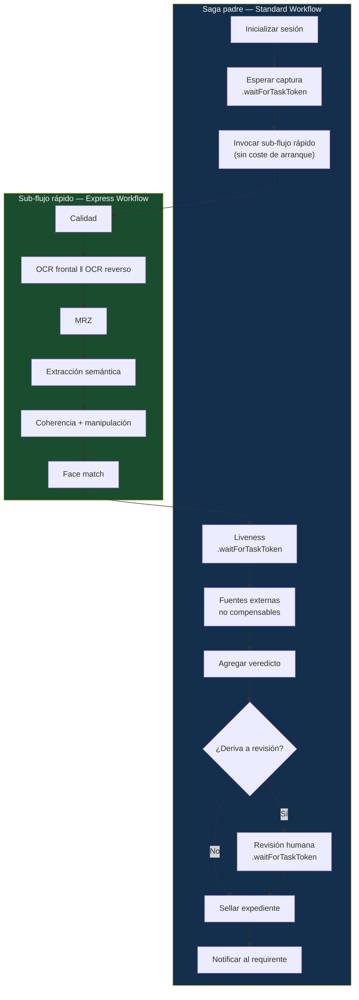
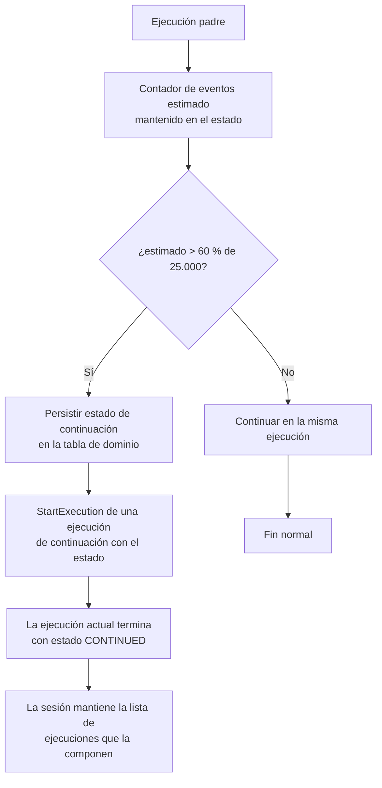
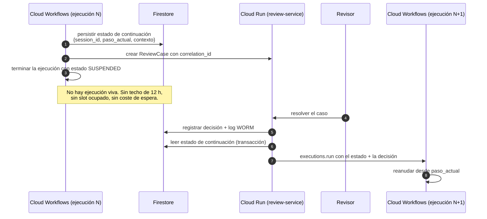

# 07 — Orquestación

| Campo | Valor |
|---|---|
| **Estado** | Aprobado |
| **Versión** | 1.1.0 |
| **Última actualización** | 2026-08-21 |
| **Responsable** | Arquitectura de la plataforma |
| **Audiencia** | Arquitectura, desarrollo, SRE |
| **Documentos relacionados** | [00 — Índice](00-indice.md) · [02 — Arquitectura](02-arquitectura.md) · [04 — Motor de composición](04-motor-de-composicion.md) · [10 — Multinube](10-multicloud-aws-gcp.md) |

**Resumen ejecutivo.** Un onboarding combina un sub-flujo automatizado de segundos con esperas humanas de días, y por eso la orquestación es híbrida: un flujo padre Standard de larga duración con sub-flujos Express para el tramo rápido. El documento recoge las cuotas reales verificadas de Step Functions —incluido el límite de **25 000 eventos de historial** que el spec original omitía—, el patrón `.waitForTaskToken`, la regla de que ningún binario viaja por el estado, y el cálculo de coste hecho con la fórmula correcta de transiciones y duración. Cierra con el mapeo a Cloud Workflows y el patrón obligatorio para esperas superiores a 12 horas.

---

## 1. El problema de orquestación

Un flujo de onboarding combina dos regímenes temporales incompatibles en un solo proceso:

- **Pasos automatizados de segundos**: calidad de imagen, OCR, extracción semántica, cotejo facial, *screening*. Alto volumen, idempotentes, latencia crítica.
- **Esperas de horas o días**: la sesión de liveness que el titular abandona y retoma, la revisión humana que cruza un fin de semana, la respuesta asíncrona de un registro gubernamental.

Optimizar para uno degrada el otro. Un orquestador barato y rápido no sostiene esperas largas ni garantías de exactly-once; uno con garantías fuertes cobra por transición y hace caro cada paso trivial.

**La respuesta es híbrida**, y su forma concreta difiere entre nubes de manera que no se puede abstraer sin perder propiedades. Este documento describe ambas implementaciones y el contrato común del `SagaPort`.

## 2. Comparativa Standard vs. Express

Cuotas oficiales verificadas. Cuando un blog y la documentación oficial discrepan, prevalece la documentación oficial.

| Cuota | Standard | Express |
|---|---|---|
| **Duración máxima de ejecución** | **1 año** | **5 minutos** |
| Retención de historial | **90 días** tras el cierre (reducible a 30 por solicitud de soporte) | Ilimitado dentro de la ventana de 5 min; **requiere CloudWatch Logs** para inspección |
| **Tamaño máximo de historial** | **25.000 eventos** por ejecución | Sin límite |
| Payload de entrada/salida | **256 KiB** (UTF-8) | **256 KiB** (UTF-8) |
| Tamaño de definición de la máquina de estados | **1 MB** (cuota **dura**) | **1 MB** (cuota dura) |
| Ejecuciones abiertas | **1.000.000** por cuenta y región (cuota flexible) | No sujeto a este límite |
| Tasa de transición de estado | Sujeta a cuotas de *throttling* | **Sin límite**; hasta **100.000 transiciones/s** |
| Base de facturación | Nº de transiciones de estado | Nº de ejecuciones + duración + memoria |
| **Semántica de ejecución** | **Exactly-once** | Asíncrono: **at-least-once** · Síncrono: **at-most-once** |
| Integraciones de servicio | Todas | Todas **excepto** `.sync` (job-run) y `.waitForTaskToken` (callback) |
| Distributed Map | Soportado | **No soportado** |
| Activities | Soportado | **No soportado** |

> El blog de AWS afirma que Standard tiene *"no limit"* de duración. Es impreciso: la cuota oficial es de **1 año**. Ver [20 — Fe de erratas](20-fe-de-erratas-del-spec-original.md) §5.

### 2.1 Precios y el cálculo de ahorro real

| Concepto | Valor |
|---|---|
| Standard — precio por transición | **0,025 USD / 1.000 transiciones** (0,000025 USD cada una) |
| Express — precio por *request* | **0,000001 USD** |
| Express — facturación por duración | Redondeo a **100 ms**, bloques de **64 MB**, cobro por GB-hora |
| Coste de arrancar un workflow anidado | **0 USD adicional** |
| Espera de aprobación humana con `.waitForTaskToken` | Hasta **1 año**, tiempo de espera **no facturable** (solo se paga la transición) |

**La fórmula, que es lo que hay que usar; el porcentaje de ahorro es siempre un resultado, nunca un dato de entrada:**

```
coste_standard(N) = T_std × N × 0,000025

coste_express(N)  = N × [ 0,000001 + ceil(d_ms / 100) × p_100ms ]
                    donde  d_ms   = duración media de la ejecución, en ms
                           p_100ms= precio del bloque de 100 ms para el
                                    escalón de memoria usado (bloques de 64 MB,
                                    tarifado por GB-hora)

coste_anidado(N)  = T_padre × N × 0,000025 + coste_express(N)
                    (arrancar el workflow hijo no añade coste de transición)

ahorro %          = 1 − coste_anidado(N) / coste_standard(N)
```

En el ejemplo publicado por AWS, `p_100ms = 0,0000001042 USD` para el escalón de memoria empleado. <!-- PENDIENTE DE VERIFICAR: el precio por GB-hora del tier Express y su desglose por escalón de memoria no se tomaron de la página de precios oficial, sino del ejemplo del artículo de referencia; verifíquelo para la región de despliegue antes de usar el resultado en un presupuesto. -->

Las dos variables que gobiernan el resultado son **T** (transiciones) y **d** (duración). Por eso no existe un porcentaje de ahorro característico del patrón: existe el de *este* flujo, con *estas* transiciones y *esta* duración. Reducir `T_padre` es la palanca dominante, porque el término Standard escala con transiciones mientras el término Express escala con tiempo de cómputo real.

Ejemplo de referencia sobre un flujo ejecutado 1.000 veces:

| Escenario | Cálculo | Coste | Ahorro vs. Standard puro |
|---|---|---|---|
| Standard puro, 17 transiciones | `17 × 1.000 × 0,000025` | **0,42 USD** | — |
| Express puro, duración media 11.300 ms | `(0,000001 + 0,0000117746) × 1.000` | **0,01 USD** | **98 %** |
| **Anidado**: padre Standard de 8 transiciones + hijo Express | `8 × 1.000 × 0,000025 + 0,0002` | **0,20 USD** | **~52 %** |

> **El ahorro depende por completo del flujo concreto** — de su número de transiciones y de su duración media. El propio ejemplo lo demuestra: cae del 98 % al 52 % solo por conservar 8 transiciones Standard en el padre. La cifra de **72,5 %** que aparecía en el spec original **no está respaldada por ninguna fuente** y no debe usarse. Ver [20](20-fe-de-erratas-del-spec-original.md) §2. El compilador calcula el coste esperado por flujo con las transiciones reales ([04](04-motor-de-composicion.md) §7.1).

### 2.2 Por qué no Express puro

Express puro es 98 % más barato en el ejemplo, y aun así es la opción incorrecta aquí:

1. **Express es at-least-once.** Toda tarea invocada desde un Express puede ejecutarse más de una vez. Aceptable para OCR; inaceptable para una llamada facturable a un registro gubernamental sin idempotencia adicional.
2. **Express no soporta `.waitForTaskToken`.** El liveness y la revisión humana necesitan callback.
3. **Express dura 5 minutos.** Una sesión de onboarding real dura desde minutos hasta días.
4. **Express no soporta Distributed Map ni Activities.**
5. **Express no tiene retención de historial propia.** Para trazabilidad KYC/AML esto es material: el historial de los hijos Express **solo existe en CloudWatch Logs**, con su propia política de retención y su propio coste.

## 3. Arquitectura híbrida adoptada



### 3.1 Criterio de asignación

| Va al **padre** (Standard) | Va al **hijo** (Express) |
|---|---|
| Requiere `.waitForTaskToken` o `.sync` | Automatizado y sin callback |
| Duración potencial > 5 min | Duración < 5 min con margen |
| No idempotente (`compensable: false`) | Idempotente por diseño |
| Necesita exactly-once | Tolera at-least-once con guarda de idempotencia |
| Ramificación de negocio que debe quedar en el historial auditable | Ramificación técnica |

### 3.2 Optimización de transiciones en el padre

Cada estado del padre cuesta. Bajar de 17 a 8 transiciones fue la mitad del ahorro en el ejemplo de referencia. Reglas del compilador:

- Colapsar cadenas de `Pass` y `Choice` triviales.
- Mover la lógica de ramificación técnica al hijo Express, donde las transiciones no se facturan por unidad.
- Fusionar validaciones de microsegundos (MRZ, coherencia) en el paso vecino en vez de darles estado propio.
- No usar `Wait` para *polling*: usar callback.

## 4. `.waitForTaskToken`

### 4.1 Mecánica

```mermaid
sequenceDiagram
    autonumber
    participant SFN as Step Functions (padre)
    participant W as step-worker
    participant DB as Tabla de dominio
    participant P as Proveedor externo
    participant CB as Endpoint de callback

    SFN->>W: Task con .waitForTaskToken<br/>{session_id, step_id, taskToken}
    W->>DB: persistir taskToken cifrado<br/>+ correlación (session, step, provider_ref)
    W->>P: crear operación asíncrona (sesión de liveness, caso de revisión)
    P-->>W: provider_ref
    W-->>SFN: (el worker retorna; la ejecución sigue suspendida)
    Note over SFN: Suspendida. No se facturan transiciones<br/>durante la espera. Hasta 1 año.

    P->>CB: webhook con resultado {provider_ref, payload, firma}
    CB->>CB: verificar firma y frescura (antirreplay)
    CB->>DB: resolver taskToken por provider_ref
    alt Token ya consumido
        CB-->>P: 200 OK (idempotente, sin efecto)
    else Token vivo
        CB->>SFN: SendTaskSuccess(taskToken, resultado)
        CB->>DB: marcar token consumido
    end
```

### 4.2 Reglas de uso

| Regla | Motivo |
|---|---|
| El `taskToken` se persiste **cifrado** con la clave del tenant | Es una credencial: quien lo posee puede reanudar la ejecución con el resultado que quiera |
| La correlación es por `provider_ref`, no por el token | El proveedor no debe conocer el token de Step Functions |
| El endpoint de callback es **idempotente**: un token ya consumido devuelve 200 sin efecto | Los proveedores reintentan webhooks |
| Se verifica **firma y frescura** del webhook | Prevención de *replay* ([14](14-modelo-de-amenazas.md)) |
| Todo Task con token declara `TimeoutSeconds` explícito | Sin timeout, una ejecución puede quedar suspendida hasta la duración máxima de un año |
| Se usa `HeartbeatSeconds` en tareas con progreso observable | Detecta al proveedor colgado antes del timeout total |
| El fallo se envía con `SendTaskFailure`, no con un `SendTaskSuccess` que contenga un error | Mantiene limpia la semántica de la máquina de estados y el historial |

Timeouts adoptados:

| Paso | `TimeoutSeconds` | `HeartbeatSeconds` |
|---|---|---|
| Espera de captura de artefactos | 3.600 (1 h) | — |
| Sesión de liveness | 1.800 (30 min) | 300 |
| Revisión humana estándar | 172.800 (48 h) | — |
| Revisión humana escalada a cumplimiento | 604.800 (7 días) | — |
| Respuesta asíncrona de registro gubernamental | 900 (15 min) | 120 |

## 5. Integración directa API Gateway → Step Functions

Para el arranque de sesión hay dos rutas posibles: pasar por una función de cómputo, o integrar el gateway directamente con `StartExecution` mediante una plantilla de transformación.

### 5.1 Cuándo usar cada una

| Ruta | Latencia | Validación | Cuándo |
|---|---|---|---|
| Gateway → Lambda → StartExecution | +arranque en frío | Completa: autorización, resolución de spec, emisión de URLs prefirmadas, escritura de la sesión | **Ruta por defecto** para `POST /v1/sessions` |
| Gateway → StartExecution (integración directa) | Mínima | Solo esquema y transformación | Reanudaciones y señales simples de alto volumen, donde el trabajo ya está hecho |

La ruta directa **no se usa para crear sesiones**, porque crear una sesión requiere resolver la especificación, verificar el aprovisionamiento de capacidades, crear el vínculo de clave del titular y emitir URLs prefirmadas. Nada de eso cabe en una plantilla de transformación, y forzarlo produce un sistema donde la lógica crítica vive en un lenguaje de plantillas sin pruebas.

### 5.2 Plantilla de transformación para la ruta directa

```velocity
## Integración directa: POST /v1/sessions/{sessionId}/signals -> states:StartExecution
#set($ctx = $context.authorizer)
{
  "stateMachineArn": "arn:aws:states:$context.region:$context.accountId:stateMachine:og-$stageVariables.env-signal",
  "name": "$input.path('$.signal_id')",
  "input": "$util.escapeJavaScript($input.json('$')).replaceAll("\\'","'")"
}
```

Puntos que suelen fallar en esta integración:

1. **El campo `input` es una cadena JSON escapada**, no un objeto. Olvidar `$util.escapeJavaScript` produce ejecuciones que fallan al arrancar con un mensaje poco informativo.
2. **El `name` debe ser determinista** para obtener idempotencia: reusar el mismo nombre de ejecución devuelve `ExecutionAlreadyExists`, que se traduce a `200` en la respuesta. Es la forma más barata de idempotencia disponible.
3. **El `tenant_id` se toma del contexto del autorizador**, nunca del cuerpo de la petición. Un `tenant_id` en el cuerpo es un vector de escalada trivial.
4. **La plantilla no valida el negocio.** Solo el gateway valida el esquema; la máquina de estados debe rechazar entradas inconsistentes en su primer estado, porque llegan menos filtradas que por la ruta con cómputo.

> **En GCP no existe esta integración.** Cloud Workflows se arranca con `executions.run` desde el servicio de Cloud Run. Es una diferencia de implementación sin impacto arquitectónico, porque la ruta por defecto ya pasa por cómputo.

## 6. Idempotencia y semántica de entrega

### 6.1 Matriz de garantías

| Componente | Semántica nativa | Garantía efectiva tras las guardas |
|---|---|---|
| Standard Workflow | Exactly-once | Exactly-once |
| Express Workflow (asíncrono) | **At-least-once** | Exactly-once por efecto, vía `IdempotencyGuard` |
| Express Workflow (síncrono) | **At-most-once** | Requiere reintento del llamante |
| SQS estándar | At-least-once | Exactly-once por efecto |
| Cloud Tasks | At-least-once | Exactly-once por efecto |
| Pub/Sub | At-least-once (con modo exactly-once disponible) | Exactly-once por efecto |
| Webhook de proveedor | At-least-once | Idempotente por `provider_ref` |
| Webhook al requirente | At-least-once | El requirente deduplica por `event_id` (contrato de API) |

### 6.2 El `IdempotencyGuard`

```python
def ejecutar_paso(ctx: TenantContext, session_id: str, step_id: str,
                  attempt_key: str, fn: Callable[[], StepResult]) -> StepResult:
    """Exactly-once por efecto sobre un sustrato at-least-once."""
    idem_sk = f"IDEM#STEP#{session_id}#{step_id}#{attempt_key}"

    reserva = repo.reservar_idempotencia(ctx, idem_sk, ttl_horas=48)
    if reserva.ya_completada:
        return reserva.resultado          # el efecto ya ocurrió: se devuelve el mismo resultado
    if reserva.en_curso:
        raise PasoEnCurso(step_id)        # otro ejecutor lo tiene; que reintente el orquestador

    resultado = fn()
    repo.completar_idempotencia(ctx, idem_sk, resultado)
    return resultado
```

Reglas:

| Regla | Motivo |
|---|---|
| `attempt_key` es estable dentro de una cadena de reintentos y **cambia** cuando el orquestador decide un intento nuevo deliberado | Un reintento por *timeout* del orquestador no debe reejecutar un efecto ya producido; una recaptura sí es un intento nuevo |
| El TTL de la reserva (48 h) es **mayor** que el timeout máximo del paso | Si expira antes, se pierde la protección justo cuando hace falta |
| Los pasos con `compensable: false` reservan **antes** de llamar al proveedor y confirman después | Ante duda, se prefiere no ejecutar a ejecutar dos veces una llamada facturable |
| La reserva usa escritura condicional (`attribute_not_exists`) | Es el único mecanismo atómico disponible en ambos almacenes |

### 6.3 Bloqueo optimista y el problema del *lock* huérfano

Los ítems con estado llevan `version` y se actualizan con condición sobre esa versión: si dos ejecutores intentan actualizar el mismo paso simultáneamente, **solo uno tiene éxito**; el otro debe reintentar con la versión actualizada. Complementariamente, un indicador `locked` protege contra la ejecución concurrente.

**El fallo que el patrón publicado no aborda:** si un ejecutor muere después de poner `locked=YES` y antes de completar, la tarea queda bloqueada indefinidamente.

Mitigación adoptada:

- `lock_expires_at` con marca temporal absoluta, no un simple indicador booleano.
- Un *reaper* programado libera los bloqueos vencidos y emite un evento de auditoría.
- Un heartbeat extiende `lock_expires_at` en pasos largos.
- La expiración de un bloqueo con un paso en `RUNNING` es una **métrica alertable**: indica ejecutores que mueren, no solo un caso raro.

## 7. El límite de 25.000 eventos de historial

### 7.1 Por qué importa

Standard Workflows tiene un límite de **25.000 eventos de historial por ejecución**. Es una cuota real que el spec original omitía y que se alcanza de tres formas en un flujo de eKYC:

1. **Reintentos multiplicados.** Cada intento genera varios eventos (`TaskScheduled`, `TaskStarted`, `TaskFailed`, `TaskRetry`...). Con 10 pasos, 3 reintentos y fallbacks, la cuenta crece rápido.
2. **Bucles sobre documentos.** Un KYB con 15 beneficiarios finales, cada uno con su subflujo de verificación.
3. **Sesiones de larga vida con re-verificación**, si se modelan como una única ejecución.

Alcanzar el límite **aborta la ejecución**. Para una sesión en revisión humana con días de trabajo invertido, es una pérdida inaceptable.

### 7.2 Patrón adoptado



Detalles que hacen funcionar el patrón:

- **La sesión, no la ejecución, es la unidad de negocio.** Una `Session` referencia una lista `execution_refs`. La reconstrucción de la traza concatena los historiales.
- **El compilador estima la cota superior** de eventos con los reintentos máximos declarados y advierte al publicar si supera el 60 % del límite ([04](04-motor-de-composicion.md) §7.2).
- **Los bucles sobre N elementos van a subejecuciones**, una por elemento o por lote, no al historial del padre.
- La continuación es **transparente para el requirente**: el `session_id` no cambia.

### 7.3 Retención de historial y trazabilidad regulatoria

| Fuente | Retención nativa | Suficiente para KYC/AML |
|---|---|---|
| Historial de Standard | **90 días** tras el cierre (reducible a 30) | ❌ No |
| Historial de Express | Solo en CloudWatch Logs | ❌ No por sí solo |
| Ejecuciones de Cloud Workflows | **90 días** | ❌ No |

Los plazos de conservación KYC/AML son de **5 a 10 años** según la jurisdicción ([12](12-retencion-y-borrado.md) §3). Noventa días es insuficiente por un factor de veinte.

**Por eso la trazabilidad regulatoria no descansa en el historial del orquestador**, sino en el log de auditoría propio y en las evidencias selladas en almacenamiento WORM, que sí tienen la retención adecuada. El historial del orquestador es una herramienta de **depuración operativa**, no el expediente. Adicionalmente, se exporta el historial de las ejecuciones cerradas a almacenamiento de largo plazo antes de que expire, como material de apoyo.

## 8. Mapeo a Cloud Workflows

### 8.1 Equivalencias y ausencias

| Aspecto | Step Functions | Cloud Workflows |
|---|---|---|
| Duración máxima | 1 año (Standard) | **1 año** — paridad |
| Lenguaje | ASL (JSON) | **YAML/CEL** — no es una traducción mecánica |
| Tier de baja latencia | Express | **No existe.** Se cubre con Cloud Tasks, Pub/Sub y Eventarc |
| Callback | `.waitForTaskToken`, hasta 1 año, tokens ilimitados, heartbeat | `events.create_callback_endpoint` + `await_callback`: **12 h por defecto, 1 slot, sin heartbeat** |
| Fan-out masivo | Distributed Map (hasta 10.000 ejecuciones hijas) | **No existe.** Se usan Cloud Run jobs con `task_count` hasta 10.000 |
| Funciones intrínsecas e integraciones de SDK | Amplio catálogo (`arn:aws:states:::aws-sdk:*`) | **No existen.** Todo con `http.post` o conectores |
| Retención de ejecuciones | 90 días | 90 días — paridad |

### 8.2 Límites de Cloud Workflows y su impacto

| Límite | Valor | Impacto |
|---|---|---|
| **Datos acumulados por ejecución** | **512 KB** (variables + argumentos + eventos) | 🔴 **El límite dominante del sistema.** No es por payload como en Step Functions (256 KiB): es **acumulado**. Impone la regla de solo punteros, y además liberar variables tras su último uso |
| Respuesta HTTP | 2 MB | Los workers devuelven referencias, no documentos |
| Longitud de string | 256 KB | |
| Pasos por ejecución | 100.000 | Holgado |
| **Ramas por paso `parallel`** | **10** | Frente a la concurrencia mucho mayor de un Map de Step Functions. Fan-out en olas |
| Anidamiento paralelo | 2 niveles | |
| Iteraciones concurrentes | 20 antes de encolar | |
| Profundidad de call stack | 20 | |
| Ejecuciones concurrentes | 10.000 por región y proyecto | |
| Tamaño del código fuente | 128 KB | Umbral de partición del workflow |
| Longitud de expresión | 400 caracteres | Fuerza a partir lógica en pasos `assign` |
| Cuota de callbacks | **1.500 peticiones de callback/min por ubicación** | |

### 8.3 El patrón alternativo para esperas largas

Los callbacks de Cloud Workflows tienen tres limitaciones que los hacen inadecuados para revisión humana:

```yaml
- create_callback:
    call: events.create_callback_endpoint
    args:
      http_callback_method: "POST"
    result: callback_details
- await_response:
    call: events.await_callback
    args:
      callback: ${callback_details}
      timeout: 43200          # 12 h por defecto
    result: callback_request
```

1. **Timeout por defecto de 43.200 s (12 h).** Una revisión que cruce un fin de semana o escale a cumplimiento no cabe.
2. **Un solo slot pendiente por endpoint.** Un segundo callback recibe **HTTP 429**.
3. **Sin heartbeat.** No hay forma de detectar que el trabajo externo sigue vivo.

<!-- PENDIENTE DE VERIFICAR: si el parámetro `timeout` de `events.await_callback` admite valores documentados por encima de 43.200 s. La investigación de paridad GCP no encontró un techo documentado. Aunque los admitiera, el límite de un solo slot y la ausencia de heartbeat mantienen la decisión. -->

**Patrón adoptado en GCP: persistir, terminar y relanzar.**



Propiedades del patrón:

| Propiedad | Comentario |
|---|---|
| **Sin techo temporal** | La espera puede durar lo que haga falta |
| **Sin límite de concurrencia de callbacks** | No se consume el slot único ni la cuota de 1.500/min |
| **Idempotente** | La lectura del estado de continuación y el arranque de la ejecución siguiente ocurren en transacción con marca de consumo; una segunda resolución no arranca una segunda ejecución |
| **Trazable** | La sesión mantiene `execution_refs` con todas las ejecuciones, igual que en el patrón de continuación por historial de AWS (§7.2) |
| **Menos elegante** | Se acepta. La alternativa es un techo de 12 h que rompe el caso de uso |

Beneficio colateral: **el mismo patrón resuelve el límite de 25.000 eventos en AWS**, así que la lógica de continuación es compartida por ambos adaptadores. La divergencia se reduce a *cuándo* se dispara: en AWS por presión de historial, en GCP siempre que hay espera larga.

### 8.4 Sustitución del tier Express

| Necesidad | Sustituto en GCP | Límites relevantes |
|---|---|---|
| Pasos automatizados encadenados de baja latencia | Llamadas secuenciales desde el mismo servicio de Cloud Run, orquestadas en proceso | Sin coste de transición; se pierde la observabilidad de estados |
| Trabajo asíncrono con reintentos | **Cloud Tasks** | Tarea de **1 MiB**; despacho de **500 tareas/s por cola**; programación hasta **30 días** en el futuro; retención **31 días**; deduplicación hasta 24 h; 1.000 colas por región; **deadline HTTP de 10 min por defecto, 30 min máximo** |
| Fan-out por eventos | **Pub/Sub** | Mensaje hasta **10 MB**; retención de suscripción de 7 días por defecto hasta 31 días; *exactly-once delivery* y claves de ordenación (1 MBps por clave); 10.000 suscripciones por topic |
| Enrutamiento declarativo desde Firestore o GCS | **Eventarc** | Sin garantía de orden; sin replay |
| Fan-out masivo | **Cloud Run jobs** con `task_count` hasta 10.000 | Los jobs de más de 1 hora pueden sufrir cortes de conexión en mantenimiento: diseñar con reintentos idempotentes |

Decisión adoptada: el sub-flujo rápido en GCP se implementa como **orquestación en proceso dentro de un servicio de Cloud Run**, con Cloud Tasks para los pasos que requieren reintento con *backoff* prolongado. Se pierde la visibilidad de estado por paso que da Express, y se compensa con trazas de OpenTelemetry con un *span* por paso ([13](13-observabilidad-y-sre.md) §3).

## 9. Contrato del `SagaPort`

La interfaz que ambas implementaciones satisfacen:

```python
class SagaPort(Protocol):
    def start(self, ctx: TenantContext, session_id: str,
              plan: ExecutionPlan, entrada: dict) -> ExecutionRef: ...

    def signal(self, ctx: TenantContext, correlation_id: str,
               resultado: dict) -> None:
        """Reanuda una espera. Idempotente: una segunda señal no tiene efecto."""

    def suspend_until(self, ctx: TenantContext, session_id: str,
                      correlation_id: str, estado: dict,
                      timeout_s: int | None) -> None:
        """Suspende. El adaptador decide entre callback y persistir-terminar-relanzar."""

    def cancel(self, ctx: TenantContext, session_id: str, motivo: str) -> None: ...

    def status(self, ctx: TenantContext, session_id: str) -> SagaStatus: ...
```

Decisiones de diseño de la interfaz:

- **No expone `taskToken`.** Es un detalle de AWS. El núcleo trabaja con `correlation_id`, que el adaptador traduce.
- **`suspend_until` no promete un mecanismo**, solo la propiedad: la ejecución se reanuda al señalar. El adaptador de AWS usa `.waitForTaskToken`; el de GCP, persistir-terminar-relanzar. Ninguno de los dos filtra al núcleo.
- **`timeout_s` es opcional y puede ser `None`** (sin techo). El adaptador de AWS lo traduce a `TimeoutSeconds`; el de GCP no necesita traducirlo porque el patrón no tiene techo. Si un adaptador no puede honrar un timeout solicitado, **falla en la publicación de la especificación**, no en tiempo de ejecución.
- **`signal` es idempotente por contrato**, no por implementación. Ambos adaptadores lo garantizan y la suite de contrato lo verifica.

## 10. Fallos de orquestación y su tratamiento

| Fallo | Detección | Tratamiento |
|---|---|---|
| Ejecución abortada por límite de historial | Estado `ExecutionAborted` con causa de historial | El patrón de continuación debería haberlo evitado; se investiga por qué la estimación falló |
| *Token* de espera consumido dos veces | Segunda llamada devuelve error de token no encontrado | Se responde 200 al proveedor (idempotencia) y se registra |
| *Token* perdido (worker murió antes de persistirlo) | Timeout del Task | El paso pasa a `RETRYING`; se recrea la operación externa con nueva `attempt_key` |
| Proveedor que nunca envía el webhook | Timeout del Task o del heartbeat | Fallback o derivación a revisión humana según `al_fallar` |
| Ejecución huérfana (sesión purgada, ejecución viva) | Auditoría de reconciliación diaria | Cancelación de la ejecución |
| Bloqueo huérfano | `lock_expires_at` vencido con paso en `RUNNING` | *Reaper*; métrica alertable (§6.3) |
| *Throttling* de transiciones | Métrica de `ThrottledEvents` | *Backoff* del arranque de sesiones nuevas; alarma |
| Definición que supera 1 MB al compilar | Fallo en la publicación de la especificación | El compilador la parte en padre e hijos |

---

## Referencias

- [`docs/referencias/aws-arquitecturas-de-referencia.md`](referencias/aws-arquitecturas-de-referencia.md) — Ficha 5 (Standard vs. Express, precios, patrón anidado, ausencia de coste de arranque anidado, `.WaitForTaskToken` de hasta 1 año no facturable, restricciones de Express); Ficha 6 (bloqueo optimista, indicador `locked` y su fallo huérfano, *offload* a objetos, `retry_enabled` para operaciones no idempotentes); tabla de cuotas oficiales de Step Functions (1 año, 90 días, **25.000 eventos**, 256 KiB, definición de 1 MB, semántica exactly-once / at-least-once / at-most-once, integraciones no soportadas por Express) y el patrón oficial de arrancar ejecuciones nuevas para evitar la cuota de historial.
- [`docs/referencias/gcp-paridad-de-servicios.md`](referencias/gcp-paridad-de-servicios.md) — capacidad 2 y brecha 7 (duración de 1 año, callbacks con 12 h por defecto, un slot y HTTP 429, sin heartbeat, cuota de 1.500 callbacks/min, límites de 512 KB acumulados, 10 ramas paralelas, 400 caracteres de expresión, 128 KB de código, ausencia de tier Express y de Distributed Map, sustitutos Cloud Tasks / Pub/Sub / Eventarc con sus límites).
- [02 — Arquitectura](02-arquitectura.md) · [04 — Motor de composición](04-motor-de-composicion.md) · [10 — Multinube](10-multicloud-aws-gcp.md) · [12 — Retención y borrado](12-retencion-y-borrado.md) · [13 — Observabilidad](13-observabilidad-y-sre.md) · [20 — Fe de erratas](20-fe-de-erratas-del-spec-original.md)
