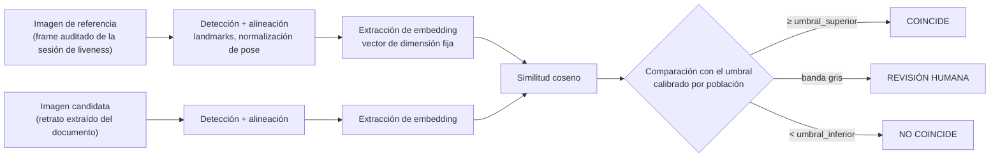
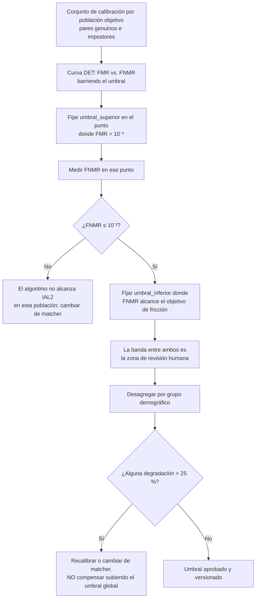
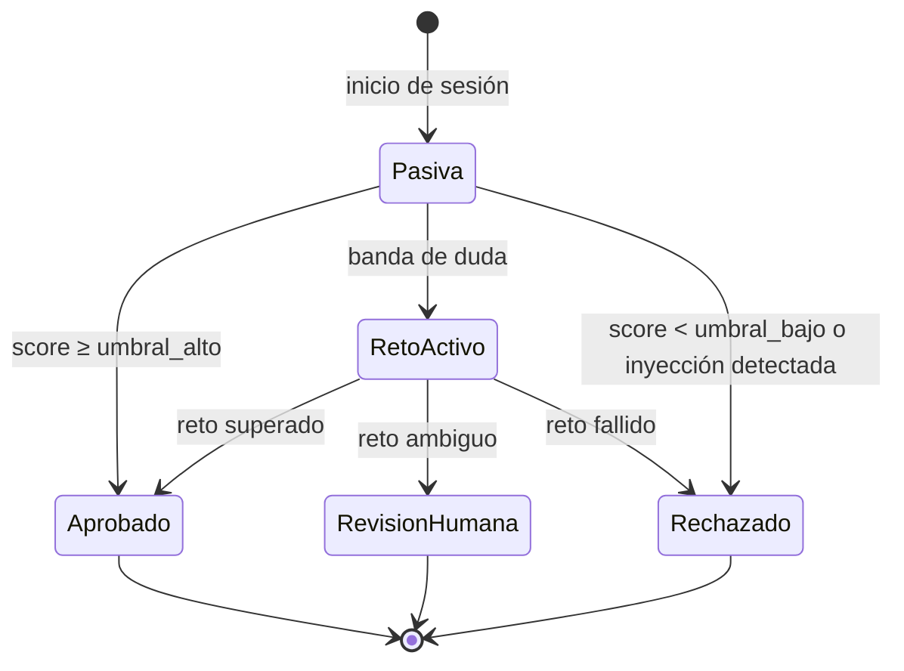
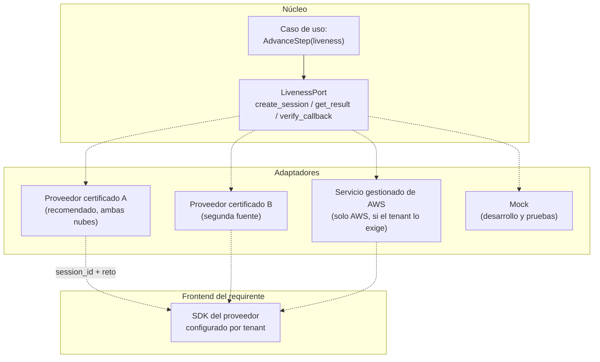

# 09 — Biometría y liveness

| Campo | Valor |
|---|---|
| **Estado** | Aprobado |
| **Versión** | 1.1.0 |
| **Última actualización** | 2026-08-21 |
| **Responsable** | Seguridad de la plataforma |
| **Audiencia** | Arquitectura, seguridad, cumplimiento, producto |
| **Documentos relacionados** | [00 — Índice](00-indice.md) · [08 — IA y extracción semántica](08-ia-y-extraccion-semantica.md) · [11 — Cumplimiento normativo](11-cumplimiento-normativo.md) · [14 — Modelo de amenazas](14-modelo-de-amenazas.md) · [15 — Catálogo de proveedores y licencias](15-catalogo-de-proveedores-y-licencias.md) |

**Resumen ejecutivo.** Separa deliberadamente dos puertos con portabilidad distinta: el cotejo facial 1:1, que se porta sin fricción, y la detección de vida, que no. Explica la diferencia entre FMR/FNMR y el umbral de similitud, la calidad de imagen conforme a ISO/IEC 19794-5 y su sucesor 39794-5, y el PAD conforme a ISO/IEC 30107-3 con APCER y BPCER reportadas por separado y los matices reales de la certificación de laboratorio. Trata los ataques de inyección como categoría distinta que la certificación PAD no cubre, y concluye recomendando un proveedor certificado único para ambas nubes y **desaconsejando expresamente** construir liveness propio con modelos abiertos de 2020.

---

## 1. Dos puertos, no uno

El producto separa deliberadamente:

```
FaceMatchPort   → AWS: Rekognition CompareFaces
                → GCP: Cloud Run + modelo ONNX de embeddings        [portable]

LivenessPort    → AWS: proveedor certificado (o Rekognition Face Liveness)
                → GCP: proveedor certificado                         [NO portable si se construye]
```

**Por qué separarlos.** `FaceMatchPort` se porta sin fricción: es un problema resuelto de embeddings y similitud coseno. `LivenessPort` no: GCP no tiene equivalente gestionado y el liveness incluye un SDK de cliente, de modo que cambiar de adaptador implica **cambiar el frontend**, no solo el backend. Unirlos en un `BiometricsPort` arrastraría el segundo problema al primero.

**Por qué esto es el eje del documento.** La detección de vida es la brecha más grave de todo el portaje y, simultáneamente, el componente con más exigencia regulatoria. La recomendación de §7 se deriva de ambas cosas.

## 2. Cotejo facial 1:1

### 2.1 Mecánica



Puntos que determinan la calidad del resultado y que suelen descuidarse:

| Etapa | Riesgo si se hace mal |
|---|---|
| **Detección y alineación** | Un rostro mal alineado degrada el embedding más que la calidad de la imagen. La normalización de pose es obligatoria |
| **Extracción del retrato del documento** | El retrato impreso está degradado por el proceso de impresión, la laminación y el holograma. Es la imagen de peor calidad del par y determina el techo del rendimiento |
| **Elección de la imagen de referencia** | Debe ser el **frame auditado que devuelve el proveedor de liveness**, no una selfie arbitraria: solo así la cadena de evidencia liga "persona viva" con "persona que coincide con el documento" |
| **Comparación** | La similitud coseno sobre embeddings no calibrados no es una probabilidad. El umbral se calibra empíricamente |

### 2.2 Umbrales normativos

La referencia **citable en contrato** es NIST SP 800-63A-4, no un informe de evaluación de algoritmos. Sus umbrales para IAL2 con verificación remota desatendida:

| Requisito | Umbral | Carácter |
|---|---|---|
| Verificación **1:1** — FMR (tasa de falsa coincidencia) | **≤ 1:10.000** (1×10⁻⁴) o mejor | Obligatorio |
| Verificación **1:1** — FNMR (tasa de falsa no coincidencia) | **≤ 1:100** (1 %) o mejor | Obligatorio |
| Identificación **1:N** — tasa de falso positivo | **≤ 1:1.000** o mejor | Obligatorio |
| Identificación **1:N** — revisión manual | **Obligatoria antes de denegar** el enrolamiento | Obligatorio |
| **Paridad demográfica** | El rendimiento en cualquier grupo demográfico **no puede ser más de un 25 % peor** que el de la población general | Obligatorio |
| **PAD** en recolección biométrica remota | **IAPAR < 0,07** conforme a **ISO/IEC 30107-3:2023** | Obligatorio |

> **Arquitectura correcta de la evidencia:** *el contrato B2B fija el umbral de SP 800-63A-4; el informe de evaluación independiente del proveedor de matcher demuestra que su algoritmo alcanza ese punto de operación.* El programa de evaluación de NIST (hoy denominado FRTE, antes FRVT) es la **evidencia**, no la norma que exige los umbrales.

Contexto del programa de evaluación: la pista 1:1 evalúa exactitud, velocidad, consumo de almacenamiento y memoria, y resiliencia; usa FMR de **10⁻⁶** como umbral principal de ranking en el conjunto de control fronterizo, **3×10⁻⁴** para el análisis de FMR demográfico, **10⁻⁵** para FNMR demográfico y **10⁻⁴** para comparación de gemelos. Hay un informe publicado el **8 de mayo de 2026** con estadísticas de participación actualizadas al **31 de julio de 2026**.

<!-- PENDIENTE DE VERIFICAR: los valores concretos de FNMR de los algoritmos líderes por conjunto de datos. La investigación de referencia no pudo extraerlos y advierte explícitamente contra inventarlos. Consultar el PDF del informe FRTE 1:1 más reciente antes de seleccionar proveedor de matcher. -->

### 2.3 Calibración por población

Un umbral de similitud es un número sin significado hasta que se calibra contra una población concreta. Un umbral que produce FMR de 10⁻⁴ sobre una población europea puede producir un FMR distinto sobre una población latinoamericana, y esa diferencia es exactamente lo que la exigencia de paridad demográfica pretende acotar.

**Procedimiento adoptado:**



Reglas:

| Regla | Motivo |
|---|---|
| La calibración es **por población y por par de fuentes de imagen** (selfie ↔ retrato de documento no es lo mismo que selfie ↔ selfie) | El retrato impreso degradado cambia la distribución de similitudes |
| El conjunto de calibración **no incluye datos de producción de clientes** sin instrucción documentada | Art. 28 del GDPR: reutilizar datos de un responsable para calibrar es tratamiento sin instrucción |
| Los umbrales se versionan y se registran **en cada evidencia** | Requisito de trazabilidad: reconstruir por qué se aprobó una sesión exige saber qué umbral se aplicó |
| Recalibración obligatoria ante cambio de versión del matcher | Un cambio de modelo cambia la distribución de similitudes |
| La degradación demográfica **no se compensa subiendo el umbral global** | Subir el umbral degrada a todos para ocultar el problema de un grupo |

### 2.4 Adaptador GCP

Sin servicio gestionado, el adaptador es un contenedor propio: modelo ONNX de embeddings sobre Cloud Run, con GPU L4 si el volumen lo justifica (decenas de milisegundos por inferencia, arranque en frío de aproximadamente 5 segundos con los controladores preinstalados). Es un problema resuelto y el riesgo técnico es medio-bajo.

Consideraciones de despliegue específicas de Cloud Run:

- **El modelo se hornea en la imagen**, no se descarga de almacenamiento de objetos en el arranque. Cloud Run no documenta límite de tamaño de imagen, lo que es una ventaja real frente a los 10 GB de una imagen de Lambda.
- **`min_instances ≥ 1`** y arranque acelerado de CPU, para evitar el arranque en frío en la ruta síncrona.
- **Concurrencia de 1 a 4 por instancia** para inferencia pesada. Cloud Run admite hasta 1.000 peticiones concurrentes por instancia, pero un motor de inferencia con concurrencia alta necesita sesiones seguras para hilos y control de hilos intra-operación, o satura la CPU.
- **El sistema de archivos escribible es tmpfs y consume memoria.** Un adaptador portado desde Lambda que use `/tmp` asumiendo disco reduce la memoria disponible para el modelo. Alternativas: montaje de volumen de almacenamiento de objetos o sistema de archivos en red.
- **Relación CPU↔memoria obligatoria:** 8 vCPU requiere de 4 a 32 GiB. No existe la asignación proporcional automática de Lambda.

> ⚠️ **Advertencia sobre licencias de pesos de modelo.** Varios conjuntos de pesos de modelos de reconocimiento facial ampliamente usados arrastran **restricciones de uso no comercial independientes de la licencia del código**. La licencia del repositorio no es la licencia de los pesos. Ver [15 — Catálogo de proveedores y licencias](15-catalogo-de-proveedores-y-licencias.md) §5 antes de incorporar cualquier modelo.

## 3. Detección de vida: pasiva y activa

| Dimensión | Pasiva | Activa |
|---|---|---|
| Acción del usuario | Ninguna | Reto: girar la cabeza, seguir una secuencia, parpadear |
| Fricción | Baja | Media-alta |
| Tasa de abandono | Menor | Mayor |
| Evidencia de reto-respuesta | No | **Sí** — dificulta el *replay* de material pregrabado |
| Resistencia a inyección | Similar: **ninguna de las dos la resuelve** por sí sola | Similar |
| Accesibilidad | Mejor (no exige capacidad motriz) | Peor: un reto de giro de cabeza excluye a personas con movilidad reducida |
| Coste computacional | Menor | Mayor (secuencia de frames) |

**Estrategia adoptada: pasiva por defecto, con escalada a reto ante duda.**



Ventajas: minimiza la fricción en el caso mayoritario, y reserva el coste y la molestia del reto para los casos que lo justifican. Requisito: **ofrecer siempre una alternativa accesible** al reto activo, tanto por accesibilidad como porque la ausencia de alternativa debilita el argumento de que el consentimiento es libre bajo el art. 9.2(a) del GDPR.

## 4. PAD conforme a ISO/IEC 30107-3

### 4.1 Métricas normativas

| Métrica | Definición | Estatus |
|---|---|---|
| **APCER** — *Attack Presentation Classification Error Rate* | Proporción de presentaciones de ataque, **por especie de PAI**, clasificadas incorrectamente como legítimas. Mide **seguridad**. Se reporta por especie y **el resultado global es el peor caso** entre especies | Normativa en las ediciones de 2017 y 2023 |
| **BPCER** — *Bona Fide Presentation Classification Error Rate* | Proporción de presentaciones legítimas clasificadas incorrectamente como ataque. Mide **usabilidad y fricción** | Normativa en ambas ediciones |
| **IAPAR** — *Impostor Attack Presentation Accept Rate* (antes IAPMR) | Probabilidad de que un ataque contra el **sistema biométrico completo** (PAD + matcher) sea aceptado. Es la métrica extremo a extremo, no de subsistema | Normativa |
| **RIAPAR** — *Relative IAPAR* | Combina seguridad y conveniencia (IAPAR + FRR) para evitar que un proveedor optimice una métrica a costa de la otra. **Introducida como métrica obligatoria en la edición de 2023** | Obligatoria desde :2023 |

### 4.2 ACER no es normativa

> **ACER** = (APCER + BPCER) / 2 tiene uso extendido en literatura académica y en material comercial de proveedores, pero **no es la métrica normativa de reporte de ISO/IEC 30107-3**. La norma exige reportar APCER y BPCER **por separado** —y RIAPAR desde 2023— precisamente porque promediarlas **oculta el peor caso de ataque**.

Un proveedor con APCER del 10 % en máscaras de resina y BPCER del 0 % presenta un ACER del 5 %, que suena excelente y describe un sistema penetrable una de cada diez veces con un artefacto concreto.

**Regla del proyecto:** no se acepta un ACER como evidencia de conformidad con ISO/IEC 30107-3. La ficha de evaluación de un proveedor debe contener APCER **por especie de PAI** y BPCER.

<!-- PENDIENTE DE VERIFICAR: si ACER fue formalmente eliminado del texto de la edición de 2023. La investigación de referencia documenta que no es la métrica normativa de reporte, pero no pudo confirmar su eliminación formal. -->

### 4.3 Niveles del laboratorio de certificación, y qué NO acreditan

El laboratorio de referencia de facto está acreditado para pruebas de conformidad con ISO/IEC 30107-3. Sus "niveles" **no son niveles de la norma ISO**: son un protocolo comercial que define el presupuesto y la sofisticación de los artefactos de ataque.

| Parámetro | **Nivel 1** | **Nivel 2** |
|---|---|---|
| Tiempo por sujeto y especie | 8 horas | 2–4 días |
| Pericia del atacante | *"None"* — sujeto cooperativo, equipo doméstico u ofimático | *"Moderate"* — personal con al menos una prueba PAD previa en la modalidad |
| **Coste máximo del artefacto** | **30 USD** | **300 USD** |
| Artefactos típicos | Foto impresa, foto en pantalla, vídeo de reproducción, máscara de papel | Impresión 3D, máscara de resina, máscara de látex |
| Especies de PAI | **6** | **6** |
| Presentaciones (protocolo solo-liveness) | ~**150 ataques** alternados con **50 presentaciones genuinas** | Protocolo análogo, mayor duración |
| **Criterio de aprobación — tasa de penetración** | **0 %** permitido | **1 %** permitido |
| **Criterio de aprobación — BPCER/FNMR** | ≤ **15 %** | ≤ **15 %** |

Lo que estas certificaciones **no acreditan**:

| No acredita | Explicación |
|---|---|
| **Baja fricción** | El BPCER admitido es del **15 %**. Un producto comercial de onboarding financiero necesita típicamente BPCER de 2–5 %. Presentar "Nivel 2" como sinónimo de baja fricción es incorrecto: ese ajuste **no lo impone la certificación**, es decisión de diseño |
| **Resistencia a ataques de inyección** | Están **fuera del alcance de ISO/IEC 30107-3**, que cubre ataques de *presentación* |
| **Resistencia a artefactos de coste alto** | Nivel 2 topa en **300 USD** de coste de artefacto. Un atacante motivado puede gastar más |
| **Rendimiento sobre la población objetivo** | Las pruebas se hacen con un panel de sujetos del laboratorio, no con la demografía del cliente |
| **Estabilidad en el tiempo** | Es una foto de un momento. Un cambio de versión del proveedor no está cubierto por la certificación anterior |

**Uso correcto:** la certificación es el **aseguramiento independiente** que exige el GAFI en su Guía de Identidad Digital — el elemento que convierte una afirmación comercial en evidencia regulatoria. Es necesaria y no suficiente.

### 4.4 Exigencias por regulador

| Regulador / marco | Exigencia |
|---|---|
| **NIST SP 800-63A-4** | PAD obligatorio en recolección biométrica remota, con **IAPAR < 0,07** conforme a **ISO/IEC 30107-3:2023** |
| **CNBV (México)** | Prueba de vida "certificada" y mecanismos capaces de detectar *deepfakes*, máscaras, fotos estáticas y **ataques de inyección**. El régimen no presencial exige además conservar el registro del proceso *"íntegra y sin ediciones"* |
| **eIDAS 2.0 / EUDI** | Sin umbral numérico único; se remite a los actos de ejecución y a los esquemas de certificación |
| **ASFI (Bolivia) / BCP-SEPRELAD (Paraguay)** | **No se localizó ninguna exigencia de umbral PAD ni referencia a ISO 30107-3** |

> ⚠️ **Asimetría a subrayar:** la exigencia mexicana de detectar **ataques de inyección** va **más allá del alcance de ISO/IEC 30107-3**. Una certificación de Nivel 1 o 2 **no acredita por sí sola** el cumplimiento de ese requisito. El proveedor debe demostrar controles adicionales específicos.

## 5. Ataques de inyección

### 5.1 Por qué son una categoría distinta

Un ataque de presentación introduce un artefacto **delante de la cámara**. Un ataque de inyección introduce medios sintéticos **directamente en el pipeline**, sin pasar por ninguna cámara física: cámara virtual, *hooking* del stream, emulador, o petición HTTP fabricada contra la API.

30107-3 no los cubre porque no son presentaciones. Existe trabajo en la parte 4 de la norma y en esquemas específicos, pero <!-- PENDIENTE DE VERIFICAR: el estado normativo de ISO/IEC 30107-4 y de los esquemas de certificación de detección de inyección. La investigación de referencia no lo verificó. -->

### 5.2 Taxonomía y controles

| Vector | Descripción | Control |
|---|---|---|
| **Cámara virtual** | Software que presenta un vídeo como si fuera una cámara del sistema | Detección de dispositivos de captura virtuales; atestación de la aplicación |
| **Hooking del stream** | Interceptación de la captura en el dispositivo | Atestación de integridad de la aplicación y del dispositivo; detección de *root*/*jailbreak* |
| **Emulador** | La aplicación corre en un entorno emulado | Detección de emulador; atestación de hardware |
| **Petición fabricada** | Se llama directamente a la API con material preparado, sin usar el SDK | **Cifrado y firma del canal de captura**; sesión de liveness ligada criptográficamente al reto emitido por el servidor |
| **Deepfake en tiempo real** | Sustitución facial aplicada sobre una cámara real | Análisis de artefactos de generación; señales de coherencia temporal; reto activo con propiedades difíciles de sintetizar en tiempo real |
| **Replay** | Reenvío de una sesión de liveness válida capturada anteriormente | Reto único por sesión, con caducidad corta; *nonce* del servidor; verificación de frescura y de uso único |

### 5.3 Requisitos arquitectónicos derivados

1. **La sesión de liveness la crea el servidor**, con un *nonce* y una caducidad corta. El cliente no puede iniciar una sesión con parámetros propios.
2. **El resultado llega por webhook firmado desde el proveedor**, no desde el cliente. El cliente nunca reporta su propio resultado de liveness.
3. **La imagen de referencia auditada la aporta el proveedor**, ligada a la sesión. El cotejo facial usa esa imagen, no una que suba el cliente.
4. **Verificación de uso único** del `provider_ref` en el callback ([07](07-orquestacion.md) §4).
5. **Atestación de aplicación y dispositivo** como señal de riesgo que alimenta la política de veredicto, no como bloqueo duro: una atestación fallida puede deberse a un dispositivo legítimo poco común.
6. **El registro de la sesión se conserva íntegro y sin ediciones** cuando la jurisdicción lo exige, como en el régimen no presencial mexicano — y esa retención se rige por la política del responsable ([12](12-retencion-y-borrado.md)).

## 6. Calidad de imagen

### 6.1 Normas aplicables

| Norma | Objeto | Estado |
|---|---|---|
| **ISO/IEC 19794-5:2011** | Formato de intercambio de imagen facial (estructura fija) | Vigente, **en transición de salida** |
| **ISO/IEC 39794-5:2019** | Formato **extensible** de intercambio de imagen facial; sucesor para documentos de viaje electrónicos | Vigente, adopción en curso |
| **ISO/IEC 29794-5:2025** | **Calidad de muestra facial** (distinto de formato). Define componentes de calidad y puntuación unificada; base de una herramienta abierta de evaluación de calidad | Publicada en 2025 |

Perfil de aplicación de ICAO para 39794-5 en documentos de viaje electrónicos: captura y codificación conforme al Anexo D.1; valores de género limitados a `Other`/`Male`/`Female`; formatos de imagen permitidos **JPEG, JPEG2000 con pérdida y JPEG2000 sin pérdida** únicamente; solo bloque de **representación 2D**, con la representación **3D prohibida**; y `Face image kind = MRTD`.

<!-- PENDIENTE DE VERIFICAR: las fechas exactas de transición de 19794-5 a 39794-5. El informe técnico de perfil de aplicación de ICAO consultado no contiene calendario y remite a la edición vigente de Doc 9303 Parte 10. Las fechas citadas en la industria (emisión opcional desde ~2025, obligatoria hacia ~2030) no están confirmadas en fuente ICAO. -->

> **Implicación de diseño:** el lector de chip debe **soportar ambos formatos de DG2 en paralelo** durante toda la ventana de transición. Asumir solo 19794-5 falla con pasaportes de emisión reciente; asumir solo 39794-5 rompe con el parque circulante, que tiene validez de hasta 10 años.

### 6.2 Comprobaciones de calidad en `capture.quality.v1`

| Comprobación | Umbral por defecto | Motivo |
|---|---|---|
| Resolución de la región facial | ≥ 1.000 px en el lado mayor del documento; ≥ 200 px entre ojos en la selfie | Por debajo, el embedding se degrada rápidamente |
| Nitidez (varianza del laplaciano normalizada) | ≥ 0,55 | El desenfoque es la causa más frecuente de fallo de cotejo |
| Reflejo especular | ≤ 0,30 de área afectada | El reflejo sobre la laminación del documento borra el retrato |
| Iluminación uniforme | Rango dinámico dentro de banda | La iluminación lateral fuerte introduce sesgo por tono de piel |
| Pose (guiñada, cabeceo, alabeo) | ≤ 15° en cada eje | Fuera de rango, la alineación no compensa |
| Oclusión | Sin oclusión de ojos, nariz o boca | |
| Rostro único detectado | Exactamente 1 | Varios rostros en la escena es una señal de riesgo |
| Recorte del documento completo | Las cuatro esquinas visibles | Un documento recortado puede ocultar alteraciones |
| Compresión | Sin artefactos de recompresión múltiple | Señal de manipulación |

**El paso de calidad se ejecuta primero y es barato.** Rechazar por calidad antes del OCR, del LLM y del cotejo es la palanca de coste más grande del sistema, y además mejora la experiencia: es preferible pedir una recaptura en 2 segundos que rechazar tras 40 segundos de proceso.

## 7. Recomendación explícita sobre liveness

### 7.1 La situación

**GCP no tiene equivalente gestionado.** El servicio de visión de Google detecta rostros (caja delimitadora, puntos de referencia, probabilidades de emoción, presencia de sombrero), pero la documentación es explícita: *"Specific individual Facial Recognition is not supported."* No hay comparación 1:1, no hay verificación de identidad, no hay detección de vivacidad, no hay antispoofing, no hay detección de ataques de presentación.

Es **la brecha más grave de todo el portaje**, y no solo por la ausencia de una API. El servicio equivalente de AWS es un flujo completo cliente-servidor: incluye SDK de cliente con el reto visual, protección contra *replay*, un score de confianza y **una imagen de referencia auditada** encadenable al cotejo facial. Es un servicio auditado, lo que importa para el cumplimiento en varias jurisdicciones.

### 7.2 Evaluación de alternativas

| Opción | Viabilidad | Riesgo |
|---|---|---|
| **A. Contenedor propio con modelo de embeddings ONNX en Cloud Run** | ✅ Resuelve **el cotejo facial** muy bien: embeddings y similitud coseno, decenas de milisegundos con GPU L4 y arranque en frío de ~5 s | 🟡 Medio. Problema resuelto y bien documentado |
| **B. Liveness propio (pasivo o activo con reto)** | ⚠️ Resuelve el liveness **mal**. Los modelos abiertos de antispoofing son notoriamente débiles frente a ataques de inyección, *deepfakes* y máscaras 3D | 🔴 **Alto. No hacerlo para producción regulada** |
| **C. Proveedor SaaS de terceros** | ✅ Es **la recomendación real**. Muchos ofrecen certificación de conformidad con ISO/IEC 30107-3 y disponibilidad multinube | 🟢 Bajo, pero añade un tercero al perímetro de datos |
| **D. Mantener el servicio de AWS como servicio cruzado desde GCP** | Técnicamente posible | 🟡 Contradice el objetivo del portaje: egreso, latencia y dos cuentas de nube |

### 7.3 La recomendación

> **Se usa un proveedor de liveness certificado en ambas nubes. No se construye detección de vida con modelos abiertos para producción regulada.**

Las cuatro razones, en orden de peso:

1. **Regulatoria.** La CNBV exige prueba de vida *certificada* y detección de ataques de inyección. Un modelo abierto no aporta certificación, y la carga de demostrar equivalencia ante el supervisor recae sobre la entidad cliente, no sobre el middleware. Además, el GAFI enfatiza que el nivel de confianza debe estar **certificado o auditado por un tercero independiente**, no autodeclarado.
2. **Técnica.** Los modelos abiertos de antispoofing disponibles son débiles frente a los vectores que importan hoy. El más citado es de **2020**: en un dominio donde la generación sintética avanzó de forma radical desde entonces, un modelo de esa antigüedad no es una defensa creíble.
3. **De alcance.** El liveness serio **no es un modelo, es un sistema**: SDK de captura con integridad, canal cifrado con atestación, reto ligado al servidor, análisis en servidor, detección de cámara virtual y de emulador, e imagen de referencia auditada. Construir el modelo resuelve la parte pequeña del problema.
4. **De asimetría.** Si se usa el servicio gestionado de AWS en AWS y un proveedor SaaS en GCP, el `LivenessPort` acaba con **tres** adaptadores y, sobre todo, con **dos frontends distintos**. Usar el mismo proveedor SaaS en ambas nubes elimina la asimetría de raíz.

### 7.4 Arquitectura del `LivenessPort` que permite esta decisión



Interfaz del puerto:

```python
class LivenessPort(Protocol):
    def create_session(self, ctx: TenantContext, subject_ref: str,
                       modo: LivenessMode, nonce: str) -> LivenessSession:
        """Crea la sesión en el proveedor. Devuelve el material que el
        frontend necesita para iniciar la captura, y un provider_ref opaco."""

    def verify_callback(self, ctx: TenantContext, cuerpo: bytes,
                        cabeceras: Mapping[str, str]) -> LivenessResult:
        """Verifica firma y frescura del webhook y normaliza el resultado.
        Devuelve NUNCA un objeto sin `imagen_referencia_auditada`."""

    def get_result(self, ctx: TenantContext, provider_ref: str) -> LivenessResult:
        """Consulta por si el webhook se perdió. Idempotente."""
```

Decisiones que hacen viable el cambio de proveedor:

| Decisión | Efecto |
|---|---|
| El resultado normalizado incluye **APCER/BPCER declarados del proveedor, versión de modelo y modo**, no solo un score | La evidencia es comparable entre proveedores y auditable |
| `imagen_referencia_auditada` es **obligatoria** en el resultado | Garantiza la cadena "persona viva → misma persona que el documento" con cualquier proveedor |
| El puerto **no expone el reto** ni su formato | El reto es del proveedor; exponerlo acoplaría el núcleo a su protocolo |
| La configuración del SDK de frontend se sirve **por tenant** desde la API | Cambiar de proveedor para un tenant no exige desplegar frontend, solo cambiar configuración, siempre que el frontend incorpore ambos SDK |
| `LivenessMode` es un enumerado del dominio (`PASIVO`, `ACTIVO`, `PASIVO_CON_RETO_SI_DUDA`), no el nombre del modo del proveedor | Traducción en el adaptador |

> **La honestidad del diseño:** el `LivenessPort` hace **intercambiable el backend**, pero no elimina el trabajo de frontend. Cambiar de proveedor de liveness sigue exigiendo integrar su SDK en la aplicación del requirente. El puerto reduce el coste de ese cambio; no lo anula. Cualquier análisis de portabilidad que solo mire infraestructura pasa por alto este coste.

## 8. Ficha de evaluación de un proveedor de liveness

Lo que se exige antes de incorporar un proveedor al catálogo:

| # | Requisito | Evidencia aceptable |
|---|---|---|
| 1 | Conformidad con ISO/IEC 30107-3 | Carta de confirmación del laboratorio con **APCER por especie de PAI** y **BPCER**. No se acepta ACER |
| 2 | IAPAR extremo a extremo | Medición conforme a la edición de 2023, con **IAPAR < 0,07** |
| 3 | RIAPAR | Reportado, conforme a la edición de 2023 |
| 4 | Detección de ataques de inyección | Descripción técnica de los controles y evidencia de prueba independiente si existe |
| 5 | Rendimiento sobre población objetivo | BPCER medido sobre demografía latinoamericana y europea, desagregado |
| 6 | Paridad demográfica | Degradación ≤ 25 % en cualquier grupo, conforme a SP 800-63A-4 |
| 7 | Disponibilidad multinube | Endpoints en las regiones de despliegue, o al menos independencia de nube |
| 8 | Residencia de datos | Procesamiento en la UE para titulares de la UE |
| 9 | Condición de subencargado | DPA firmable, registro en la lista pública de subencargados, SLA de borrado |
| 10 | Retención | Política de retención de material biométrico compatible con [12](12-retencion-y-borrado.md) |
| 11 | SLA técnico | Disponibilidad, latencia p95, y modelo de webhooks con reintentos y firma |
| 12 | Estabilidad de versiones | Compromiso de notificación previa ante cambios de modelo, con ventana de revalidación |

El requisito 12 se olvida con frecuencia y es el que más incidentes causa: un cambio silencioso de versión del modelo del proveedor desplaza la distribución de scores y descalibra los umbrales del tenant de un día para otro.

---

## Referencias

- [`docs/referencias/cumplimiento-normativo-y-estandares.md`](referencias/cumplimiento-normativo-y-estandares.md) — ISO/IEC 30107-3 (APCER, BPCER, IAPAR, RIAPAR obligatoria desde 2023, **ACER no normativa**), niveles del laboratorio de certificación y sus criterios (coste de artefacto, BPCER ≤ 15 %, tasas de penetración), exigencias de reguladores, ataques de inyección fuera del alcance de la norma, NIST SP 800-63A-4 (FMR ≤ 10⁻⁴, FNMR ≤ 10⁻², 1:N ≤ 10⁻³ con revisión manual obligatoria antes de denegar, paridad demográfica ≤ 25 %, IAPAR < 0,07, prohibición de KBA), programa FRTE y sus umbrales de reporte, ISO/IEC 19794-5 / 39794-5 / 29794-5 y el perfil de aplicación de ICAO, requisitos de la CNBV y GAFI sobre aseguramiento independiente.
- [`docs/referencias/gcp-paridad-de-servicios.md`](referencias/gcp-paridad-de-servicios.md) — capacidad 10 y brecha 1 (ausencia total de equivalente gestionado, evaluación de las cuatro alternativas, recomendación de separar `FaceMatchPort` de `LivenessPort`, advertencia de que el liveness incluye SDK de cliente y su portaje implica trabajo de frontend), capacidad 3 (Cloud Run con GPU L4, arranque en frío, relación CPU↔memoria, tmpfs, concurrencia para inferencia).
- [08 — IA y extracción semántica](08-ia-y-extraccion-semantica.md) · [11 — Cumplimiento normativo](11-cumplimiento-normativo.md) · [12 — Retención y borrado](12-retencion-y-borrado.md) · [14 — Modelo de amenazas](14-modelo-de-amenazas.md) · [15 — Catálogo de proveedores y licencias](15-catalogo-de-proveedores-y-licencias.md)
