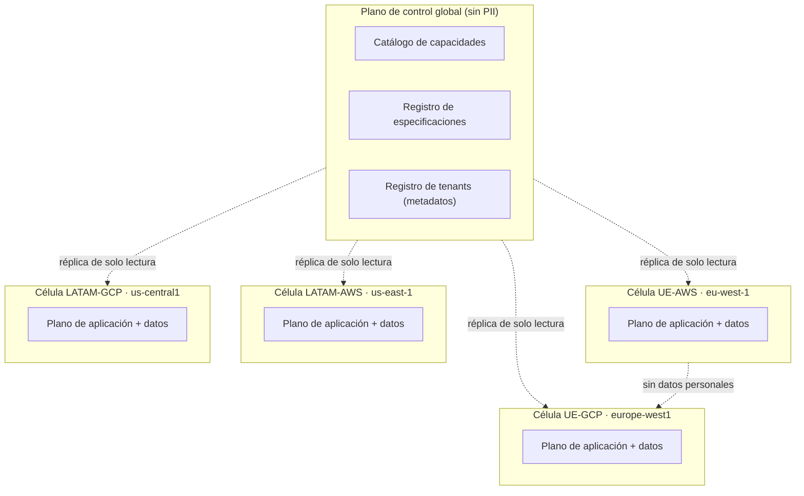
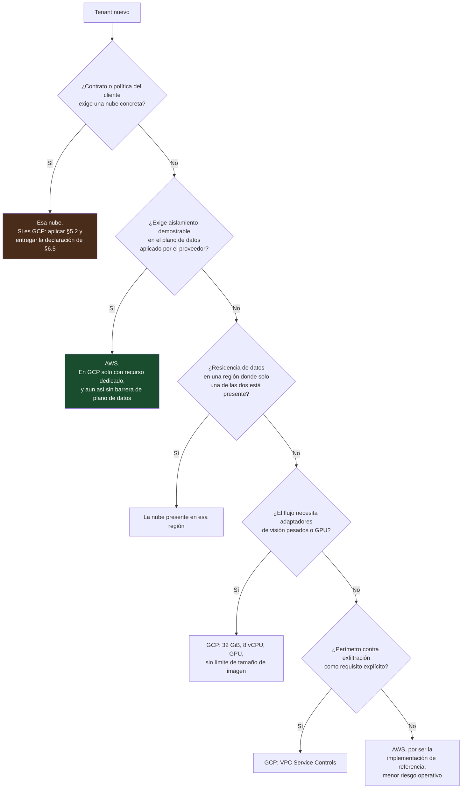
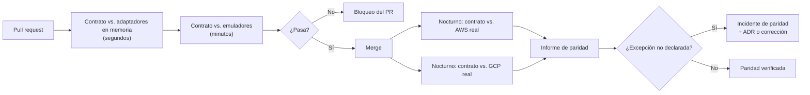

# 10 — Multinube: AWS y GCP

| Campo | Valor |
|---|---|
| **Estado** | Aprobado |
| **Versión** | 1.1.0 |
| **Última actualización** | 2026-08-21 |
| **Responsable** | Arquitectura de la plataforma |
| **Audiencia** | Arquitectura, SRE, comercial |
| **Documentos relacionados** | [00 — Índice](00-indice.md) · [02 — Arquitectura](02-arquitectura.md) · [05 — Multitenancy](05-multitenancy-y-aislamiento.md) · [07 — Orquestación](07-orquestacion.md) · [16 — Despliegue AWS](16-guia-de-despliegue-aws.md) · [17 — Despliegue GCP](17-guia-de-despliegue-gcp.md) |

**Resumen ejecutivo.** AWS es la implementación de referencia y GCP una alternativa completa por adaptadores. El documento contiene la matriz maestra de equivalencias, las **nueve brechas de paridad ordenadas por impacto** con su mitigación, y la regla de diseño que gobierna todo el hexágono: cuando GCP es más restrictivo, GCP dicta la forma del puerto. Incluye la clasificación de cada puerto según se porte sin fricción, lo dicte GCP o haya que construirlo a medida en ambas nubes, la estrategia de despliegue por células con sus RPO y RTO, y la guía de elección de nube por tenant.

---

## 1. Postura del proyecto

**AWS es la implementación de referencia. GCP es una alternativa completa por adaptadores.**

Esto significa cosas concretas:

| Afirmación | Significado operativo |
|---|---|
| AWS es la referencia | Toda capacidad nueva se implementa primero en AWS. La suite de contrato se define contra el comportamiento esperado, no contra el comportamiento de AWS |
| GCP es alternativa completa | Un tenant puede desplegarse íntegramente en GCP y obtener la misma funcionalidad, **con las excepciones declaradas en §5** |
| No es multinube activo-activo | Un tenant vive en una nube. No hay tráfico de datos entre nubes ni conmutación automática |
| No es *cloud agnostic* por defecto | El núcleo es agnóstico; los adaptadores explotan las capacidades específicas de cada nube. No se usa el mínimo común denominador |

**Lo que no se promete:** que el coste, la latencia y el perfil operativo sean idénticos. Son distintos, y las diferencias están documentadas.

## 2. Matriz de paridad

Síntesis derivada de la investigación de referencia. El detalle completo, con límites verificados y recursos de Terraform, está en [`docs/referencias/gcp-paridad-de-servicios.md`](referencias/gcp-paridad-de-servicios.md).

| # | Capacidad | AWS | GCP | Paridad | Impacto en el diseño |
|---|---|---|---|---|---|
| 1 | Puerta de API + autorización | API Gateway + Lambda Authorizer + Cognito | API Gateway / Apigee / Cloud Run + Identity Platform | ⚠️ Parcial — **sin autorizador de código arbitrario** | La autorización vive en el núcleo (P5) |
| 2 | Orquestación de larga duración | Step Functions Standard (1 año) | Cloud Workflows (1 año) | ✅ Buena | — |
| 2b | Orquestación de baja latencia | Step Functions Express (5 min) | Cloud Tasks / Pub/Sub / Eventarc | ⚠️ Modelo distinto: **no hay tier Express** | Sub-flujo en proceso ([07](07-orquestacion.md) §8.4) |
| 2c | Callback de espera larga | `.waitForTaskToken`, hasta 1 año, tokens ilimitados, heartbeat | `await_callback`: **12 h por defecto, 1 slot, sin heartbeat** | ⚠️ Parcial | Patrón persistir-terminar-relanzar |
| 3 | Cómputo en contenedor | Lambda: 10 GB de imagen, 10.240 MB, 15 min | Cloud Run: **32 GiB, 8 vCPU, 60 min**, jobs hasta 168 h, GPU | ✅ **GCP superior** | Adaptadores de visión más cómodos en GCP |
| 4 | NoSQL con streams y TTL | DynamoDB + Streams + TTL | Firestore + Eventarc + TTL | ⚠️ Parcial — streams con semántica distinta | Consumidores idempotentes y reentrantes |
| 5 | Objetos con ciclo de vida | S3 + Lifecycle + Glacier | Cloud Storage + OLM + Coldline/Archive | ✅ Buena (**Archive mejor**: recuperación en ms) | Cuidado con soft-delete (§5.6) |
| 6 | Gestión de claves y cifrado de campo | KMS + **DB-ESDK** | Cloud KMS + **Tink** | ⚠️ Parcial — **no existe DB-ESDK** | Firma y beacons a mano ([06](06-criptografia-y-gestion-de-claves.md) §7) |
| 7 | Aislamiento multi-tenant en plano de datos | Session tags + `dynamodb:LeadingKeys` | — | ❌ **Sin equivalente directo** | **Brecha crítica** ([05](05-multitenancy-y-aislamiento.md) §6) |
| 8 | OCR de documentos de identidad | Textract `DetectDocumentText` / `AnalyzeID` | Document AI (OCR + procesadores de identidad) | ⚠️ OCR sí; **cobertura de países mucho menor en ambos** | Patrón OCR + LLM ([08](08-ia-y-extraccion-semantica.md)) |
| 9 | LLM multimodal con caché | Bedrock + Claude + prompt caching | Agent Platform + **Claude** + caché | ✅ **Buena** — la que mejor se porta | `LlmPort` casi idéntico |
| 10 | Biometría facial y liveness | Rekognition `CompareFaces` + Face Liveness | **Nada gestionado** | ❌ **Sin equivalente** | **Brecha crítica** ([09](09-biometria-y-liveness.md) §7) |
| 11 | Revisión humana gestionada | SageMaker A2I (**cerrado a nuevos clientes**) | **Nada gestionado** (HITL y etiquetado apagados) | ❌ **Ambas nubes lo abandonaron** | Construcción propia en ambas |
| 12 | Observabilidad y auditoría | CloudWatch, X-Ray, CloudTrail | Cloud Logging, Cloud Trace, Cloud Audit Logs | ✅ Buena | OTel como denominador común |
| 13 | Secretos y configuración | Secrets Manager + Parameter Store | Secret Manager | ⚠️ **No hay equivalente a Parameter Store** | `ConfigPort` separado de `SecretPort` |
| 14 | Registro de contenedores | ECR | Artifact Registry | ✅ Buena (**mejor**: multiformato) | Parametrizar la URI de imagen |
| 15 | Red privada y egreso | VPC + PrivateLink + endpoints | VPC + Private Service Connect + Direct VPC egress | ✅ Buena, con **VPC-SC como ventaja de GCP** | Ver §5.7 |

## 3. Mapa de puertos → adaptadores

| Puerto | Adaptador AWS | Adaptador GCP | Adaptador de pruebas | Riesgo del portaje |
|---|---|---|---|---|
| `SessionRepositoryPort` | DynamoDB single-table | Firestore Native, colección plana con ID compuesto | En memoria | 🟡 Medio |
| `FlowSpecRepositoryPort` | DynamoDB + S3 | Firestore + GCS | En memoria | 🟢 Bajo |
| `TenantRepositoryPort` | DynamoDB | Firestore | En memoria | 🟢 Bajo |
| `EvidenceStorePort` | S3 + Object Lock | GCS + Bucket Lock | Sistema de archivos temporal | 🟢 Bajo |
| `ObjectStoragePort` | S3 | GCS | Sistema de archivos temporal | 🟢 Bajo |
| `SagaPort` | Step Functions Standard + Express | Cloud Workflows + Cloud Tasks + patrón de relanzamiento | Ejecutor secuencial | 🔴 **Alto** |
| `QueuePort` | SQS | Cloud Tasks | Cola en memoria | 🟢 Bajo |
| `KeyManagementPort` | KMS + hierarchical keyring | Cloud KMS + Tink | Claves en memoria | 🟡 Medio |
| `EnvelopeCryptoPort` | AWS DB-ESDK | Tink `KmsEnvelopeAead` + firma propia | AEAD local | 🔴 **Alto** |
| `DeterministicIndexPort` | Beacons del DB-ESDK | HMAC determinista propio | HMAC local | 🔴 **Alto** |
| `SecretPort` | Secrets Manager | Secret Manager | Diccionario | 🟢 Bajo |
| `ConfigPort` | Parameter Store | Variables de entorno + documento con caché | Diccionario | 🟡 Medio |
| `AuthorizationPort` | In-process (+ Lambda Authorizer como caché) | In-process | In-process | 🟢 Bajo por diseño |
| `DocumentOcrPort` | Textract `DetectDocumentText` | Document AI Enterprise OCR | Respuesta grabada | 🟢 Bajo tras normalizar |
| `LlmPort` | Bedrock (Claude) | Agent Platform (Claude) | Respuesta grabada | 🟢 **Muy bajo** |
| `MrzPort` | Propio | Propio (idéntico) | Propio | 🟢 Nulo |
| `FaceMatchPort` | Rekognition `CompareFaces` | Cloud Run + ONNX | Similitud simulada | 🟡 Medio (calibración) |
| `LivenessPort` | Proveedor certificado | **Mismo** proveedor certificado | Simulado | 🟢 Bajo con proveedor único; 🔴 alto si se divergiera |
| `AmlScreeningPort` | Proveedor SaaS | Mismo proveedor | Listas simuladas | 🟢 Bajo |
| `GovernmentRegistryPort` | Adaptador por país | Idéntico | Simulado | 🟢 Bajo |
| `WalletVerifierPort` | OpenID4VP propio | Idéntico | Simulado | 🟢 Bajo |
| `HumanReviewPort` | Propio (DynamoDB + Lambda + UI + WORM) | Propio (Firestore + Cloud Run + UI + WORM) | En memoria | 🟢 Bajo por decisión |
| `AuditLogPort` | DynamoDB + S3 WORM | Firestore + GCS WORM | En memoria | 🟢 Bajo |
| `TelemetryPort` | EMF + OTel | Cloud Monitoring + OTel | Colector en memoria | 🟢 Bajo |

Los cuatro puertos de riesgo alto (`SagaPort`, `EnvelopeCryptoPort`, `DeterministicIndexPort`, y `LivenessPort` si se divergiera) concentran el esfuerzo del portaje. Los demás son mecánicos.

### 3.1 Clasificación por tipo de esfuerzo

La tabla anterior mide **riesgo**; esta mide **naturaleza del trabajo**, que es lo que se planifica. Un puerto de la categoría A se estima en días; uno de la B exige rediseñar la interfaz antes de escribir el segundo adaptador; uno de la C es un proyecto propio que no se ahorra eligiendo nube.

| Categoría | Qué significa | Puertos |
|---|---|---|
| **A — Se portan sin fricción** | Ambas nubes ofrecen el servicio con semántica equivalente. El adaptador es una traducción de SDK | `FlowSpecRepositoryPort`, `TenantRepositoryPort`, `EvidenceStorePort`, `ObjectStoragePort`, `QueuePort`, `SecretPort`, `DocumentOcrPort`, `LlmPort`, `AmlScreeningPort`, `AuditLogPort`, `TelemetryPort` |
| **A′ — Sin dependencia de nube** | No hay nada que portar: el mismo código corre en las tres implementaciones | `MrzPort`, `ClockPort`, `IdPort`, `GovernmentRegistryPort` (depende del país, no de la nube), `WalletVerifierPort` |
| **B — La forma la dicta GCP** | AWS ofrece una primitiva más potente que, adoptada como interfaz, haría inviable o inseguro el adaptador de GCP. La interfaz se escribe contra el sustrato restrictivo y AWS refuerza (§4) | `TenantIsolationPort`, `SessionRepositoryPort`, `AuthorizationPort`, `SagaPort`, `ConfigPort`, `LlmPort` en su parte de caché |
| **C — Se construyen a medida en ambas nubes** | Ninguna de las dos ofrece el servicio, o el que ofrece no sirve para uso regulado. La ventaja: **no hay asimetría que gestionar** | `HumanReviewPort` (ambas nubes lo abandonaron), `EnvelopeCryptoPort` y `DeterministicIndexPort` en GCP, `FaceMatchPort` en GCP, `LivenessPort` (proveedor externo en ambas) |

> **La lectura estratégica.** Las categorías A y A′ cubren la mayor parte del catálogo y no consumen presupuesto de arquitectura. El diseño se juega en **B**, donde una interfaz mal elegida se paga en el segundo adaptador, y en **C**, donde la respuesta correcta es no usar el servicio gestionado de ninguna de las dos nubes. La categoría C, contra la intuición, es la que **elimina** riesgo de portabilidad: lo que se construye una vez, corre igual en ambas.

## 4. Los puertos que GCP dicta

Aplicación del principio P6 ([02](02-arquitectura.md) §1): cuando las nubes divergen, la interfaz la fija el sustrato más restrictivo.

| Puerto | Qué habría pasado si lo dictara AWS | Forma adoptada |
|---|---|---|
| `TenantIsolationPort` | Casi vacío: la plataforma aplica la política. El adaptador GCP quedaría **estructuralmente inseguro** | Contiene lógica real de alcance; AWS añade `LeadingKeys` como refuerzo redundante |
| `SessionRepositoryPort` | `query(pk, sk begins_with)` → el adaptador de Firestore es inviable | Operaciones de dominio: `find_sessions(tenant, estado, ventana)` |
| `AuthorizationPort` | Delegado al autorizador del gateway → sin equivalente en GCP | Middleware in-process; el gateway solo valida la firma del JWT |
| `SagaPort` | `wait_for_task_token(timeout=1 año)` → imposible en GCP | `suspend_until(correlation_id, timeout opcional)`; el adaptador elige el mecanismo |
| `LlmPort` | `cache_control` de Anthropic expuesto → impide un adaptador de Gemini | `cachear_prefijo(contenido, ttl)` |
| `ConfigPort` | Fusionado con `SecretPort`, porque en AWS ambos tienen backend gestionado | Separado, porque GCP no tiene Parameter Store y el límite de lecturas de Secret Manager es un cuello real |

## 5. Las nueve brechas de paridad

Ordenadas por impacto sobre el producto, no por severidad técnica abstracta. El **impacto** combina tres cosas: si la brecha bloquea una capacidad regulatoriamente exigida, cuánto trabajo adicional impone, y si su fallo es **silencioso** (el sistema funciona, pero no cumple una propiedad que se creía garantizada).

| # | Brecha | Severidad | Impacto | Trabajo adicional en GCP | ¿Fallo silencioso? | Detalle |
|---|---|---|---|---|---|---|
| **1** | Liveness facial gestionado | 🔴 | Bloquea una capacidad **exigida por el regulador mexicano**; además arrastra trabajo de frontend | Contratar proveedor certificado e integrar su SDK | No | §5.1 |
| **2** | Aislamiento multi-tenant en el plano de datos | 🔴 | Elimina un nivel de garantía completo; cambia lo que se puede afirmar ante una auditoría | Cuatro controles compensatorios y sus pruebas | **Sí** ⚠️ | §5.2 |
| **3** | Revisión humana gestionada | 🔴 | Ninguna de las dos nubes lo ofrece ya: **la brecha es simétrica** y se convierte en decisión de construir | Construcción propia (también en AWS) | No | §5.3 |
| **4** | Biblioteca de cifrado a nivel de atributo | 🟡 | Obliga a reimplementar firma de registro y atributos firmados-no-cifrados | Sobre con Tink, firma propia, índice determinista propio | No | §5.4 |
| **5** | Autorizador de código arbitrario en el gateway | 🟡 | Fuerza la autorización al núcleo — que resulta ser **la decisión correcta** | Middleware in-process | No | §5.5 |
| **6** | Semántica de *streams* y patrón de tabla única | 🟡 | Sin orden garantizado ni *replay*; el diseño de claves cambia de forma | Identificadores compuestos, índices explícitos, consumidores idempotentes | Parcial | §5.6 |
| **7** | Espera larga con horizonte superior a 12 horas | 🟡 | Afecta a todo flujo con revisión humana, que es el caso normal, no el excepcional | Patrón persistir-terminar-relanzar | No | §5.7 |
| **8** | Almacén de configuración separado de los secretos | ⚪ | Coste y cuota, no funcionalidad | `ConfigPort` con variables de entorno o documento cacheado | No | §5.8 |
| **9** | Comportamiento de red y arranque en frío | ⚪ | Puede invalidar un SLA de latencia comprometido antes de medirlo | Medir antes de comprometer; instancias mínimas > 0; sobredimensionar subredes | **Sí** ⚠️ | §5.9 |

> **Las dos que hay que vigilar son la 2 y la 9, y por la misma razón:** fallan en silencio. El código funciona, las pruebas pasan, y la propiedad que se creía tener —aislamiento en el plano de datos, latencia dentro del presupuesto— simplemente no está. Las otras siete se manifiestan como un error o como una tarea de ingeniería visible.

### 5.1 🔴 Brecha 1 — Liveness facial gestionado

**Hecho:** GCP no tiene equivalente. El servicio de visión declara explícitamente que no soporta reconocimiento facial individual. No hay antispoofing, ni reto de vivacidad, ni SDK de cliente.

**Agravante:** el servicio de AWS no es solo una API: incluye SDK de cliente con reto visual y protección contra *replay*, devuelve un score y **una imagen de referencia auditada**, y es un servicio auditado, lo que importa para el cumplimiento.

**Mitigación adoptada:** **proveedor certificado en ambas nubes**. Elimina la asimetría de raíz en lugar de gestionarla. Ver [09](09-biometria-y-liveness.md) §7.

**Coste que hay que presupuestar:** el `LivenessPort` no es un puerto puramente de backend. Cambiar de proveedor implica trabajo de aplicación móvil o web. Un análisis de portabilidad que solo mire infraestructura pasa esto por alto.

**Riesgo residual:** dependencia de un tercero en el perímetro de datos. Se mitiga con segunda fuente cualificada en el catálogo y con la ficha de evaluación de [09](09-biometria-y-liveness.md) §8.

### 5.2 🔴 Brecha 2 — Aislamiento multi-tenant en el plano de datos

**Hecho:** no existe equivalente a `dynamodb:LeadingKeys` en ninguna forma. IAM Conditions no expone atributos de clave de fila o documento, y las Security Rules de Firestore son irrelevantes para un backend porque las bibliotecas de servidor las eluden.

**Por qué es la más peligrosa:** es **silenciosa**. El código funciona; simplemente no está aislado.

**Mitigación adoptada:** las cuatro capas de [05](05-multitenancy-y-aislamiento.md) §6.3, con el cifrado de sobre con `tenant_id` como AAD como control determinante — es lo que convierte un error de alcance en un fallo de descifrado.

**Riesgo residual, declarado:** en GCP no existe prevención en el plano de datos aplicada por el proveedor de nube. Hay aplicación en la capa de aplicación, garantía criptográfica y detección por auditoría. Para tenants que exijan la propiedad de prevención, la respuesta es base de datos o proyecto dedicado.

### 5.3 🔴 Brecha 3 — Revisión humana gestionada

**Hecho:** **ambas nubes lo abandonaron.** El servicio de AWS está *"no longer open to new customers"*; el equivalente de Document AI se apagó el **16 de enero de 2025**; el servicio de etiquetado, el **3 de octubre de 2024**. La recomendación oficial de Google es contratar un partner.

**Efecto paradójico:** esto **simplifica** el diseño. El `HumanReviewPort` se construye a medida en ambas nubes y la asimetría desaparece.

**Ventaja adicional:** el servicio gestionado de AWS nunca dio bien la trazabilidad regulatoria — su modelo de plantillas de tarea está pensado para etiquetado de aprendizaje automático, no para decisiones de cumplimiento. Un servicio propio con log de decisiones en almacenamiento WORM cumple mejor.

**Nota:** si un despliegue AWS existente usara ese servicio, **ya sería deuda técnica con independencia del portaje**.

### 5.4 🟡 Brecha 4 — AWS Database Encryption SDK

**Hecho:** no existe equivalente. Tink cubre el cifrado de sobre y el AAD, pero **no** la firma del registro completo, ni los atributos firmados-pero-no-cifrados, ni los beacons de búsqueda.

**Mitigación:** ver [06](06-criptografia-y-gestion-de-claves.md) §7 — Tink `KmsEnvelopeAead`, firma de registro propia con MAC sobre serialización canónica versionada, e índice determinista con HMAC truncado.

**Riesgos residuales:**

| Riesgo | Comentario |
|---|---|
| El análisis de fuga de frecuencia del índice pasa a ser responsabilidad propia | Se aplican las mismas fórmulas de dimensionado y las mismas exclusiones de campos de baja cardinalidad |
| La inmutabilidad de la longitud del índice **no está impuesta por ninguna biblioteca** | Se impone por proceso: ADR más prueba que verifica la longitud configurada |
| La caché de material criptográfico hay que implementarla | Con carga atómica; existe un problema de rendimiento conocido del Envelope AEAD de Tink sobre Cloud KMS por la latencia por operación |
| Tink no tiene versión JavaScript/TypeScript mantenida | Irrelevante aquí (Python 3.14), pero bloqueante para componentes auxiliares en Node.js |
| La ventana de destrucción de clave difiere | AWS: 7–30 días, mínimo 7. GCP: 30 días por defecto, configurable. El SLA de borrado se fija por el mayor |

### 5.5 🟡 Brecha 5 — Autorizador de código arbitrario

**Hecho:** GCP API Gateway solo admite autenticación declarativa: claves de API, cuentas de servicio con JWT firmado, y validación de JWT contra emisores configurados. No hay ejecución de código arbitrario por petición.

**Mitigación:** la autorización se mueve al middleware in-process. **Es más portable, no menos**: saca la autorización del adaptador de infraestructura y la lleva al núcleo, donde es testeable sin desplegar nada.

**Coste:** se pierde la caché de autorizador del gateway (hasta 3.600 s). Se implementa caché en proceso con TTL.

**Nota de límites:** el gateway de GCP tiene un límite de request y response de **32 MB**, cabeceras de 60 KB, 50 APIs por proyecto, 100 configuraciones por API y 50 gateways por región, y **no soporta streaming**. Irrelevante en este diseño porque los artefactos se cargan con URL prefirmada y nunca atraviesan el gateway.

<!-- PENDIENTE DE VERIFICAR: el timeout de petición de GCP API Gateway y sus regiones soportadas no están documentados en la página de cuotas, según la investigación de referencia. -->

### 5.6 🟡 Brecha 6 — Semántica de streams y patrón single-table

**Hecho:**

| Aspecto | DynamoDB Streams | Firestore + Eventarc |
|---|---|---|
| Orden | Garantizado **por clave de partición** dentro de un shard | ❌ **Sin garantía de orden estricto** |
| Entrega | At-least-once, iterador de 24 h | At-least-once vía Pub/Sub |
| Reproceso histórico | Sí, 24 h de retención de shard | ❌ **No hay replay del stream** |
| Batching | Lotes de hasta 10.000 registros | Un evento por invocación |
| Imagen previa y posterior | Configurable | `oldValue` y `value` en el payload |
| Tamaño de evento | 400 KB (tamaño de ítem) | 512 KB (límite de evento) |

**Mitigación:** número de secuencia monótono en el documento con reordenación en el consumidor, o Pub/Sub con claves de ordenación; consumidores **idempotentes y reentrantes** desde el principio; reproceso por iteración de la colección, no del stream.

**Decisión de almacén:** Firestore es adecuado para los patrones de acceso de este producto porque las consultas de rango se limitan a prefijos de ID y las agregaciones están acotadas por tenant. Si aparecieran patrones agresivamente single-table o analíticos, el destino correcto sería **Bigtable** (row keys ordenadas, prefijos) o **Spanner** (única opción con change streams reales: orden garantizado y replay de hasta 7 días). Elegir Firestore por reflejo "NoSQL → NoSQL" y descubrir después que no hay consultas de rango sobre sort key es un fallo caro.

**Además — dos comportamientos por defecto que sorprenden:**

- **El TTL de Firestore no borra subcolecciones.** Por eso el modelo es una colección plana ([03](03-modelo-de-dominio.md) §5.2).
- **El soft-delete de GCS está activo por defecto y retiene los objetos borrados 7 días.** Para el derecho de supresión esto significa que un borrado **no es un borrado**. Se desactiva la política explícitamente o se documenta la ventana. S3 no tiene este comportamiento por defecto.

### 5.7 🟡 Brecha 7 — Espera larga con horizonte superior a 12 horas

Tratada en detalle en [07](07-orquestacion.md) §8.3. Resumen: callbacks con 12 h por defecto, **un solo slot por endpoint** (HTTP 429 al segundo), sin heartbeat, cuota de 1.500 callbacks por minuto y ubicación. Mitigación: persistir estado, terminar la ejecución y relanzar. El mismo patrón resuelve el límite de 25.000 eventos de historial en AWS, así que la lógica es compartida.

### 5.8 ⚪ Brecha 8 — Parameter Store

GCP no separa configuración de secretos. Todo va a Secret Manager, todo se cobra, y el límite de **600 lecturas por minuto a nivel de proyecto** lo hace inadecuado como almacén de configuración de alto volumen. Además, la rotación automática de credenciales no es gestionada: solo hay notificaciones vía Pub/Sub y el rotador se escribe a mano.

**Mitigación:** `ConfigPort` separado, implementado en GCP con variables de entorno inyectadas por Terraform o un documento de configuración con caché en proceso.

### 5.9 ⚪ Brecha 9 — Comportamiento de red y arranque en frío

Es la brecha que no aparece en ninguna matriz de servicios, porque no falta ningún servicio: lo que difiere es **cómo se comporta el mismo servicio bajo carga y al arrancar**. Se descubre en la primera prueba de carga, o peor, en producción.

| Diferencia | Impacto | Mitigación |
|---|---|---|
| **Direct VPC egress limita a 100–200 instancias según región** | Si se necesita alta escala **y** red privada a la vez, es un techo real | Revisar la cuota temprano; usar conectores (coste fijo) o repartir en varios servicios |
| **Retrasos de establecimiento de conexión de un minuto o más en el arranque de instancia**, y arranques en frío de 30 s o más con NAT | Materialmente peor que el equivalente de AWS tras sus mejoras. Para APIs síncronas con SLA de latencia, es determinante | **Medirlo antes de comprometer SLA**; instancias mínimas > 0 en las rutas síncronas |
| **Dimensionado de subred**: en estado estable los servicios consumen el doble de IP que instancias en ejecución; los jobs, una IP por tarea más 7 minutos de retención | Un `/26` soporta ~30 instancias | Sobredimensionar la subred desde el inicio |
| **Los jobs de más de 1 hora pueden sufrir cortes de conexión** en eventos de mantenimiento | Los jobs largos de purga o reindexación se interrumpen | Diseñarlos con reintentos idempotentes y reanudables |
| **VPC Service Controls no tiene equivalente en AWS** | Es una **ventaja** de GCP: perímetro que impide exfiltración desde servicios gestionados | Adoptarlo; compensa parcialmente la brecha de aislamiento a nivel de proyecto |

## 6. Estrategia de despliegue

### 6.1 Célula como unidad de despliegue



Una célula es autónoma: tabla, buckets, claves, orquestador, workers y cola de revisión propios. **No hay flujo de datos personales entre células.**

### 6.2 Por residencia de datos

Es el criterio dominante, por encima de cualquier consideración técnica:

| Titular | Célula | Motivo |
|---|---|---|
| UE | UE (AWS o GCP) | Ningún país LATAM del alcance tiene decisión de adecuación de la Comisión Europea. Regionalizar elimina la mayor parte del problema del Capítulo V, simplifica el análisis de impacto de transferencias y resuelve las expectativas de localización de los supervisores financieros latinoamericanos |
| México | LATAM | Expectativa del supervisor y coherencia con el cotejo contra registros nacionales |
| Bolivia, Paraguay | LATAM | Ídem |

> **El acceso remoto de soporte desde LATAM a datos alojados en la UE es una transferencia internacional**, aunque los datos no se muevan. Debe cubrirse en las Cláusulas Contractuales Tipo y controlarse técnicamente. La sentencia `DenyOutsideJurisdiction` de la política ABAC ([05](05-multitenancy-y-aislamiento.md) §4) es el control técnico correspondiente.

### 6.3 Activo/pasivo, no activo/activo

**Dentro de una nube y una región**, la disponibilidad se apoya en los servicios gestionados multi-zona.

**Entre regiones de la misma nube y dominio de residencia**, se opera activo/pasivo:

| Componente | Estrategia | RPO | RTO |
|---|---|---|---|
| Tabla de dominio | Réplica global o exportación programada según tier | Segundos (réplica) / 1 h (exportación) | Minutos / horas |
| Objetos | Replicación entre regiones del mismo dominio de residencia | Minutos | Minutos |
| Claves | CMK multi-región o CMK espejo con re-envoltura de branch keys | 0 | Minutos |
| Especificaciones compiladas | Redesplegables desde el plano de control | 0 | Minutos |
| Ejecuciones del orquestador en vuelo | **No se replican** | — | Las sesiones en vuelo se pierden y deben reiniciarse |

La última fila es la limitación honesta: **una conmutación entre regiones pierde las sesiones en vuelo**. Se mitiga con el patrón de continuación ([07](07-orquestacion.md) §7.2), que persiste el estado de continuación en la tabla: una sesión suspendida esperando revisión humana sobrevive; una sesión a mitad del sub-flujo automatizado, no. Como el sub-flujo dura segundos, el impacto se acota a las sesiones activas en ese instante.

**Entre nubes no hay conmutación.** Un tenant desplegado en GCP no conmuta a AWS. Los datos están cifrados con claves de esa nube y la migración es un proyecto, no una operación.

### 6.4 Guía de decisión: qué nube para qué tenant

El orden de las preguntas importa: las tres primeras son **restricciones**, y una restricción no se negocia contra una preferencia técnica. Solo si ninguna aplica se decide por afinidad técnica.



**Sobre recuperación ante desastre.** La elección de nube **no** se decide por DR, porque la postura es la misma en ambas: activo/pasivo entre regiones del mismo dominio de residencia, sin conmutación entre nubes (§6.3). Lo que sí cambia por nube es el detalle operativo —replicación de tabla, semántica de claves multi-región, recuperación desde clase de archivo— y eso se documenta en las guías de despliegue, no condiciona la elección. **Un tenant que exija conmutación entre nubes está pidiendo algo que este producto no ofrece**, y la respuesta correcta es decirlo en la conversación comercial, no descubrirlo en el simulacro.

| Factor | Favorece AWS | Favorece GCP |
|---|---|---|
| Exigencia de aislamiento demostrable en el plano de datos | ✅ **Determinante** | |
| Búsqueda sobre campos cifrados con biblioteca soportada | ✅ | |
| Esperas largas con callbacks nativos | ✅ | |
| Adaptadores de visión pesados (GPU, imágenes grandes) | | ✅ **32 GiB, 8 vCPU, GPU, sin límite de tamaño de imagen** |
| Perímetro contra exfiltración | | ✅ VPC Service Controls |
| Retención de logs de auditoría por defecto | | ✅ 400 días en el bucket requerido, frente a 90 días de historial de eventos |
| Recuperación desde archivo frío | | ✅ Archive con recuperación en milisegundos |
| Preferencia o acuerdo comercial del cliente | Según el caso | Según el caso |

## 7. Qué NO se porta

Lista explícita, para que nadie descubra estas cosas a mitad de un proyecto:

| Elemento | Motivo | Alternativa |
|---|---|---|
| **La suite de políticas ABAC de plano de datos** | No hay equivalente en GCP | Capas de aplicación, criptografía y auditoría |
| **Los beacons del DB-ESDK tal cual** | No existe la biblioteca | HMAC determinista propio, con la inmutabilidad impuesta por proceso |
| **La firma de registro del DB-ESDK** | No existe | MAC sobre serialización canónica versionada |
| **`.waitForTaskToken` con horizonte de un año en una sola espera** | Callbacks de 12 h con un solo slot | Persistir-terminar-relanzar |
| **Distributed Map** | No existe | Cloud Run jobs con `task_count` hasta 10.000 |
| **Funciones intrínsecas de ASL e integraciones optimizadas de SDK** | No existen | `http.post` y conectores |
| **La integración directa gateway → orquestador con plantilla de transformación** | No existe | Arranque desde Cloud Run |
| **El SDK de cliente de liveness gestionado** | GCP no tiene el servicio | Proveedor certificado único en ambas nubes |
| **Parameter Store** | No existe | `ConfigPort` con variables de entorno o documento cacheado |
| **La rotación gestionada de credenciales de Secrets Manager** | Secret Manager solo notifica | Rotador propio |
| **El *service map* y las perspectivas de X-Ray** | Cloud Trace no tiene equivalente exacto | Trazas OTel con vistas propias |
| **Optimización de costes basada en transiciones de Express** | No hay tier Express | Orquestación en proceso; el modelo de coste es distinto, no equivalente |

Y a la inversa, lo que **no se porta de GCP a AWS**:

| Elemento | Motivo |
|---|---|
| **VPC Service Controls** | No hay equivalente en AWS |
| **Caché implícita de contexto** activada por defecto | En AWS el caché es siempre explícito |
| **Recuperación en milisegundos desde la clase de archivo** | El equivalente de AWS tiene latencia de horas |
| **Repositorios remotos y virtuales multiformato** del registro de artefactos | ECR es solo OCI, con caché de paso más limitada |
| **Retención de 400 días del bucket de logs requerido** | El historial de eventos de AWS es de 90 días; más requiere un rastro a objetos |

## 8. Procedimiento de validación de paridad

### 8.1 Suite de pruebas de contrato

Una única suite parametrizada se ejecuta contra los tres conjuntos de adaptadores: en memoria, AWS y GCP. **El mismo test, el mismo aserto, tres backends.**

```python
@pytest.mark.parametrize("backend", ["memory", "aws", "gcp"])
class TestSessionRepositoryContract:

    def test_save_and_load_roundtrip(self, repo, ctx):
        sesion = nueva_sesion(ctx, pais="MX", tipo_doc="INE_2019")
        repo.save(ctx, sesion)
        recuperada = repo.load(ctx, sesion.id)
        assert recuperada == sesion

    def test_optimistic_lock_rejects_stale_write(self, repo, ctx):
        sesion = nueva_sesion(ctx)
        repo.save(ctx, sesion)
        a = repo.load(ctx, sesion.id)
        b = repo.load(ctx, sesion.id)
        repo.save(ctx, a.transicionar(Evento.COLLECTING))
        with pytest.raises(ConflictoDeVersion):
            repo.save(ctx, b.transicionar(Evento.CANCELLED))

    def test_cross_tenant_load_returns_not_found(self, repo, ctx, otro_ctx):
        sesion = nueva_sesion(ctx)
        repo.save(ctx, sesion)
        with pytest.raises(SessionNotFound):
            repo.load(otro_ctx, sesion.id)
```

### 8.2 Contratos por puerto

| Puerto | Propiedades que la suite verifica |
|---|---|
| `SessionRepositoryPort` | Ida y vuelta; bloqueo optimista; aislamiento entre tenants; consulta por estado con paginación estable; escritura condicional idempotente |
| `ObjectStoragePort` | URL prefirmada con caducidad; rechazo tras caducar; integridad del hash; borrado efectivo (**y verificación del comportamiento de soft-delete**) |
| `SagaPort` | Arranque; suspensión y reanudación; **idempotencia de `signal`**; cancelación; estado consistente tras la reanudación; supervivencia a la continuación |
| `EnvelopeCryptoPort` | Ida y vuelta; **fallo con AAD de otro tenant**; fallo con AAD alterado; detección de manipulación del registro; rendimiento con caché |
| `DeterministicIndexPort` | Determinismo; **misma longitud en ambos backends**; aislamiento del índice entre tenants; tasa de colisión dentro de lo esperado |
| `KeyManagementPort` | Obtención de branch key; rotación sin invalidar el histórico; programación de destrucción; **estado tras la ventana** |
| `LlmPort` | Salida conforme al esquema; comportamiento ante caché activada y desactivada; normalización de errores; **rechazo de inyección** |
| `DocumentOcrPort` | Normalización a geometría 0–1; comportamiento asíncrono; taxonomía de errores |
| `LivenessPort` | Creación de sesión; verificación de firma del callback; **rechazo de callback repetido**; presencia obligatoria de imagen de referencia auditada |
| `AuditLogPort` | Solo anexado; encadenamiento de hash; consulta por sesión; **rechazo de modificación** |
| `QueuePort` | Entrega; reintento; cola de mensajes fallidos; entrega diferida |
| `SecretPort` / `ConfigPort` | Lectura de versión fija; comportamiento de caché; rechazo de secreto inexistente |

### 8.3 Excepciones declaradas

Algunos contratos **no pueden** pasar idénticos. Se declaran explícitamente con marcadores, y la lista de excepciones es en sí misma un entregable revisable:

| Excepción | Puerto | Nube | Comportamiento divergente |
|---|---|---|---|
| `xfail(gcp)` | `TenantIsolationPort` | GCP | La consulta con tenant ajeno usando credenciales de plataforma **no es denegada por la plataforma**. La prueba equivalente verifica que **el repositorio** la rechaza y que el descifrado falla |
| `xfail(gcp)` | `SagaPort` | GCP | Espera única superior a 12 h con callback nativo. La prueba equivalente verifica el patrón de relanzamiento |
| `skip(aws)` | `ObjectStoragePort` | AWS | La prueba de soft-delete por defecto no aplica: S3 no lo tiene |
| `xfail(gcp)` | `EnvelopeCryptoPort` | GCP | La firma la aporta la aplicación, no la biblioteca. La prueba verifica la propiedad, no el mecanismo |
| Tolerancia distinta | `FaceMatchPort` | Ambas | Los umbrales de similitud son distintos por matcher. La prueba verifica FMR/FNMR sobre el conjunto de calibración, no un valor de similitud concreto |

**Regla:** una excepción nueva requiere un ADR. La lista de excepciones no crece por conveniencia; crece por decisión documentada.

### 8.4 Ejecución y puertas de calidad



| Puerta | Frecuencia | Bloquea |
|---|---|---|
| Contrato contra adaptadores en memoria | Cada commit | El PR |
| Contrato contra emuladores | Cada PR | El PR |
| Contrato contra infraestructura real de ambas nubes | Nocturno y en cada promoción | La promoción |
| Suite de aislamiento ([05](05-multitenancy-y-aislamiento.md) §8) | Cada PR y diariamente en producción con tenant sintético | La promoción, y genera incidente en producción |
| Informe de paridad | Semanal | — (informativo; una excepción no declarada es incidente) |

### 8.5 El informe de paridad

Artefacto publicado semanalmente que responde tres preguntas:

1. **¿Qué contratos pasan en ambas nubes?** Porcentaje y tendencia.
2. **¿Qué excepciones están declaradas y cuál es su ADR?**
3. **¿Ha aparecido alguna divergencia nueva?** Un contrato que pasaba y dejó de pasar en una nube es un incidente, porque suele indicar un cambio de comportamiento del proveedor.

La tercera pregunta es la que justifica el informe. Los proveedores de nube cambian comportamientos sin previo aviso, y sin una verificación continua la paridad se degrada de forma invisible hasta que un cliente la descubre en producción.

---

## Referencias

- [`docs/referencias/gcp-paridad-de-servicios.md`](referencias/gcp-paridad-de-servicios.md) — tabla maestra de equivalencias, notas detalladas por capacidad 1–15, brechas críticas 1–9, recomendaciones de diseño hexagonal, y el inventario de puntos no verificados.
- [`docs/referencias/aws-arquitecturas-de-referencia.md`](referencias/aws-arquitecturas-de-referencia.md) — patrones de referencia de AWS y cuotas verificadas de Step Functions, Lambda, KMS y DB-ESDK.
- [`docs/referencias/cumplimiento-normativo-y-estandares.md`](referencias/cumplimiento-normativo-y-estandares.md) — transferencias internacionales y recomendación de regionalización del procesamiento.
- [02 — Arquitectura](02-arquitectura.md) · [05 — Multitenancy](05-multitenancy-y-aislamiento.md) · [06 — Criptografía](06-criptografia-y-gestion-de-claves.md) · [07 — Orquestación](07-orquestacion.md) · [09 — Biometría y liveness](09-biometria-y-liveness.md) · [16 — Despliegue AWS](16-guia-de-despliegue-aws.md) · [17 — Despliegue GCP](17-guia-de-despliegue-gcp.md)
