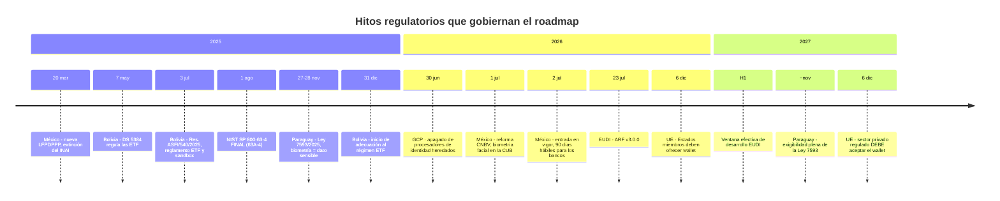

# 11 — Cumplimiento normativo

| Campo | Valor |
|---|---|
| **Estado** | Aprobado |
| **Versión** | 1.1.0 |
| **Última actualización** | 2026-08-21 |
| **Responsable** | Cumplimiento y legal |
| **Audiencia** | Cumplimiento, legal, arquitectura, comercial |
| **Documentos relacionados** | [00 — Índice](00-indice.md) · [01 — Visión y alcance](01-vision-y-alcance.md) · [09 — Biometría y liveness](09-biometria-y-liveness.md) · [12 — Retención y borrado](12-retencion-y-borrado.md) · [19 — Roadmap](19-roadmap.md) |

**Resumen ejecutivo.** Traduce a decisiones de arquitectura el marco normativo de las cuatro jurisdicciones del alcance: Bolivia, Paraguay, México y la Unión Europea. Fija el posicionamiento del middleware como **encargado del tratamiento** del art. 28 del GDPR y sus consecuencias contractuales, adopta NIST SP 800-63-4 IAL2 como estándar técnico único, y aterriza GAFI R.10, el art. 32(II) del Instructivo UIF de Bolivia —que condiciona la viabilidad del modelo de negocio—, la reforma de la CNBV publicada en julio de 2026 y el calendario de hitos 2026–2027. Incluye el mapeo de controles técnicos a requisitos y el inventario de puntos que exigen verificación en fuente primaria.

> ⚠️ **Este documento no es asesoramiento jurídico.** Es una traducción de requisitos normativos a decisiones de arquitectura, elaborada sobre la investigación de agosto de 2026 recogida en [`docs/referencias/cumplimiento-normativo-y-estandares.md`](referencias/cumplimiento-normativo-y-estandares.md). Los puntos marcados como no verificados deben contrastarse en fuente primaria antes de asumir compromiso contractual alguno.

---

## 1. Conclusión primero

Cinco afirmaciones que gobiernan el diseño:

1. **Un único estándar técnico para las cuatro jurisdicciones es la estrategia correcta.** El techo lo marcan GDPR + NIST SP 800-63A-4 IAL2 + CNBV. Bolivia y Paraguay quedan cubiertos por defecto, y Paraguay lo exigirá formalmente desde ~noviembre de 2027. Diferenciar por país multiplica el coste sin reducir riesgo.
2. **La regionalización del procesamiento (UE / LATAM) resuelve simultáneamente** el Capítulo V del GDPR, los análisis de impacto de transferencias, y las expectativas de localización de los supervisores financieros latinoamericanos.
3. **El posicionamiento contractual en Bolivia es una cuestión de viabilidad, no de redacción.** El producto debe ser herramienta, con la decisión de onboarding retenida por la entidad.
4. **La separación entre expediente KYC (retenible) y datos biométricos (minimizables)** es lo que hace compatibles la retención AML y el derecho de supresión. Es una decisión de arquitectura, no de política legal.
5. **Dos fechas estructuran el roadmap: ~noviembre de 2027** (exigibilidad de la ley paraguaya) y **6 de diciembre de 2027** (EUDI obligatorio para el sector privado regulado en la UE). Coinciden en ventana: es un único ciclo de trabajo 2026–2027.

### 1.1 Lo que este documento NO es

Conviene decirlo antes de la primera tabla, porque el resto se lee distinto según se entienda esto:

| No es | Es | Consecuencia práctica |
|---|---|---|
| **Asesoramiento jurídico** | Una traducción de requisitos normativos a decisiones de arquitectura, hecha por ingenieros | Ninguna afirmación de este documento sustituye el criterio del asesor legal del responsable del tratamiento ni el de la propia entidad obligada |
| **Un dictamen sobre el cumplimiento del cliente** | Una descripción de qué controles técnicos ofrece el middleware y a qué requisito responden | Que el producto implemente un control no acredita que el requirente cumpla: el cumplimiento es de la entidad obligada, y depende de sus procedimientos, su gobierno y su supervisor |
| **Una certificación** | Una base para preparar una auditoría o una DPIA | Las certificaciones se obtienen de laboratorios y auditores acreditados; el calendario para conseguirlas está en [19 §2](19-roadmap.md), fase F6 |
| **Una lectura autoritativa del texto normativo** | Una lectura de trabajo, con fuentes citadas y con sus lagunas marcadas | Los 15 puntos de §8 **no están verificados en fuente primaria**. Comprometer un contrato sobre cualquiera de ellos sin verificarlo es asumir un riesgo evitable |
| **Un documento estable** | Una foto de agosto de 2026, en un periodo de cambio regulatorio intenso | Cuatro de las normas citadas tienen hitos entre 2026 y 2027. Toda cifra debe reverificarse en cada revisión del documento |

Y una advertencia sobre el uso comercial de este material: **de aquí no salen afirmaciones para una propuesta**. Las cinco frases que no deben decirse, y su formulación correcta, están en [00 §2.5](00-indice.md).

## 2. Matriz consolidada por jurisdicción

| Eje | Bolivia | Paraguay | México | UE |
|---|---|---|---|---|
| **Ley de datos personales** | ❌ **No existe** (solo anteproyectos) | ✅ **Ley 7593/2025** — *vacatio* hasta ~nov 2027 | ✅ **LFPDPPP** (DOF 20/03/2025, vigente 21/03/2025) | ✅ GDPR 2016/679 |
| **Biometría = dato sensible** | s/d (el anteproyecto sí lo prevé) | ✅ **Sí, expreso** | ⚠️ **No expreso** — vía interpretación | ✅ Sí, si identifica unívocamente (art. 9) |
| **Autoridad de control** | ❌ No existe | 🆕 ANDP (bajo el MITIC) | 🔄 Secretaría Anticorrupción y Buen Gobierno (sustituye al INAI) | APD nacionales + EDPB |
| **Régimen del encargado** | ❌ No regulado | ✅ Sí (contrato, seguridad, auditorías) | ✅ Sí | ✅ Art. 28 (el más detallado) |
| **DPIA/EIPD obligatoria** | ❌ | ✅ Alto riesgo, decisiones automatizadas o monitoreo sistemático | ❌ No verificado | ✅ Art. 35 |
| **Onboarding remoto regulado** | ❌ **Vacío** (vía: sandbox de ASFI) | ❌ **Vacío** | ✅ **Sí** — arts. 51 Bis 6–9 + Anexo 71 | Vía eIDAS / EUDI |
| **Biometría exigida por el regulador financiero** | ❌ No | ❌ No | ✅ **Sí** (reforma del 01/07/2026) | Sectorial |
| **Prohibición de delegar la DDC** | ⚠️ **Sí — art. 32(II) del Instructivo UIF** | No localizada | No localizada | No |
| **Retención KYC** | 10 años (contable) ⚠️ | **5 años** ✅ | 10 años ❌ no verificado | 5–10 años |
| **Decisión de adecuación GDPR** | No | No | No | — |
| **Hito de calendario** | Sandbox: adecuación desde 31/12/2025 | **Exigibilidad ~nov 2027** | **90 días hábiles** desde 02/07/2026 | **EUDI obligatorio sector privado: 06/12/2027** |

## 3. Marco por jurisdicción

### 3.1 Unión Europea

#### GDPR — Reglamento (UE) 2016/679

**Art. 9 — Biometría como categoría especial.** Prohíbe el tratamiento de *"datos biométricos dirigidos a identificar de manera unívoca a una persona física"*.

Matiz técnico que se aplica con frecuencia de forma incorrecta: el art. 9 **no cubre todo dato biométrico**, sino el tratado *con la finalidad de identificar unívocamente*.

| Operación del middleware | ¿Art. 9? |
|---|---|
| Comparación facial **1:1** selfie ↔ retrato del documento | **Sí** — finalidad de identificación unívoca |
| Búsqueda **1:N** contra base de enrolados (antifraude, duplicados) | **Sí**, con carga de justificación mayor |
| Detección de vida (**PAD**) que solo decide "vivo / no vivo" sin extraer plantilla identificativa | Discutible; defendible como **fuera** del art. 9 si no genera plantilla ni permite identificación, pero **las autoridades de control tienden a una interpretación amplia** |

**Bases de licitud manejables** en onboarding financiero europeo:

- **Art. 9.2(a)** — consentimiento **explícito**. Es la vía habitual, pero frágil: si el titular no puede acceder al servicio sin dar biometría, el consentimiento puede considerarse **no libre**, especialmente si no se ofrece una alternativa no biométrica. Consecuencia de diseño: **la especificación de flujo debe admitir una rama alternativa no biométrica** cuando el tenant opere bajo esta base.
- **Art. 9.2(g)** — interés público esencial con base en Derecho de la Unión o nacional. Es la vía más sólida cuando existe una norma AML/KYC que **exige** la verificación, pero requiere que esa norma exista y sea suficientemente específica.

> La práctica sancionadora reciente apunta a que **la finalidad antifraude, por sí sola, no legitima automáticamente el tratamiento biométrico** bajo el art. 9. El análisis se hace por jurisdicción y por caso de uso.

**Art. 25 — Privacidad desde el diseño y por defecto.** Traducción concreta:

| Exigencia | Implementación |
|---|---|
| Minimización | No persistir el vídeo completo de la sesión si basta un frame y el resultado; no almacenar la plantilla biométrica si el caso de uso es una verificación puntual 1:1 |
| **Efímero por defecto** | El modo por defecto es *procesar, devolver veredicto, destruir*. **La retención es una opción que activa el responsable, no el comportamiento por defecto** |
| Seudonimización | Separación lógica de la plantilla biométrica respecto de los identificadores |
| Aislamiento estricto entre responsables | Ver [05](05-multitenancy-y-aislamiento.md) |

**Art. 35 — DPIA obligatoria.** Concurren simultáneamente varios criterios de alto riesgo: datos de categoría especial, tratamiento a gran escala, tecnología innovadora, evaluación y *scoring*, y tratamiento sistemático en 1:N.

> **Reparto de responsabilidades:** la DPIA es obligación **del responsable** (el requirente), no del encargado. Pero el art. 28 obliga al encargado a **asistirle**. En la práctica comercial, entregar un **paquete de DPIA** es requisito de facto para vender a entidades europeas — y diferenciador comercial además de obligación legal. Contenido del paquete en §4.3.

**Capítulo V — Transferencias internacionales.** Ninguno de los tres países LATAM del alcance tiene decisión de adecuación:

| País | Decisión de adecuación |
|---|---|
| México | **No** |
| Bolivia | **No** |
| Paraguay | **No** |

Consecuencias operativas:

1. Toda transferencia UE → BO/PY/MX requiere **garantías adecuadas**: en la práctica, **Cláusulas Contractuales Tipo** (Decisión de Ejecución (UE) 2021/914), módulo Encargado→Subencargado o Responsable→Encargado según el caso.
2. **Análisis de impacto de la transferencia (TIA) obligatorio por cada destino**, evaluando el marco de acceso gubernamental a los datos.
3. **Recomendación arquitectónica fuerte: regionalizar el procesamiento.** El coste de un despliegue multirregión es sensiblemente menor que el de sostener SCC más TIA para datos biométricos de categoría especial.
4. **El acceso remoto de soporte desde LATAM a datos alojados en la UE es una transferencia internacional**, aunque los datos no se muevan.

#### eIDAS 2.0 y EUDI Wallet

**Reglamento (UE) 2024/1183**, que modifica el Reglamento eIDAS 910/2014. Entrada en vigor: **20 de mayo de 2024**. Los actos de ejecución técnicos se publicaron el **4 de diciembre de 2024** — esa fecha es el reloj maestro del que cuelgan todos los plazos.

| Hito | Fecha | Sujeto |
|---|---|---|
| Entrada en vigor del Reglamento | 20 may 2024 | — |
| Publicación de actos de ejecución técnicos | 4 dic 2024 | — |
| Estados miembros deben ofrecer al menos un wallet | **6 dic 2026** | Estados miembros |
| Organismos del sector público deben aceptarlo | **6 dic 2026** | Sector público |
| Plataformas muy grandes deben aceptarlo | Al ofrecerse el primer wallet → dic 2026 / inicios 2027 | VLOP |
| **⭐ Partes privadas reguladas (banca, servicios financieros) deben aceptarlo** | **6 dic 2027** | Sector privado regulado |

> Estas fechas provienen de análisis de bufete, no del texto de EUR-Lex. El propio análisis señala riesgo de deslizamiento entre la fecha legal y la operativa. <!-- PENDIENTE DE VERIFICAR: las fechas EUDI en fuente oficial (EUR-Lex, Reglamento (UE) 2024/1183, art. 5a). -->

**⭐ La fecha que importa para este producto es el 6 de diciembre de 2027.** Es el momento en que los clientes B2B europeos pasan de "pueden" a "deben" aceptar el EUDI Wallet. El horizonte de desarrollo efectivo es 2026 – primer semestre de 2027.

**Marco de arquitectura de referencia (ARF): versión 3.0.0, publicada el 23 de julio de 2026.** Introduce el marco de evaluación de conformidad funcional, soporte tanto de listas de confianza como de **listas de entidades de confianza**, interacciones entre wallets, y servicios de parte que confía. El ARF es un documento de trabajo *"with no legal value"*: lo vinculante son el Reglamento y sus actos de ejecución.

**Pila técnica exigida:**

| Capa | Estándar | Rol |
|---|---|---|
| Formato de credencial (ISO) | **ISO/IEC 18013-5:2021** — mDoc / mDL | Formato CBOR; base del PID en modo mDoc |
| Formato de credencial (IETF) | **SD-JWT VC** | Formato JSON con divulgación selectiva |
| Modelo de datos W3C | Verifiable Credentials Data Model 1.1 | Admitido |
| **Presentación remota** | **OpenID4VP** | **Es la interfaz que el middleware debe implementar como Relying Party** |
| Emisión | OpenID4VCI | Fuera del alcance del producto |
| Codificación PID | **CBOR y JSON** ambos requeridos | — |
| Confianza | Listas de confianza + **listas de entidades de confianza** + PKI | Verificación del estatus de los participantes |

> **Consecuencia arquitectónica.** El EUDI Wallet **no es "otro método de KYC"** que se suma a la lista: es un modelo distinto. En el flujo actual el middleware **captura y procesa**; en el flujo EUDI **solicita y verifica una presentación criptográfica**: no hay biometría que capturar ni MRZ que leer, porque la verificación de identidad ya la hizo el emisor del PID y viaja firmada. Por eso CU-03 es un flujo alternativo completo, no un paso adicional ([01](01-vision-y-alcance.md) §4).

Requiere: rol de *Relying Party* registrado con certificado de acceso, implementación de OpenID4VP como verificador, parsers **duales** (mDoc/CBOR y SD-JWT VC), validación contra listas de confianza, y soporte de divulgación selectiva con respeto del principio de minimización — que es **obligación reforzada del Reglamento**, no buena práctica.

### 3.2 México

#### LFPDPPP — doble cambio en 2025 y 2026

| Dato | Valor |
|---|---|
| Publicación en el DOF | **20 de marzo de 2025** |
| Entrada en vigor | **21 de marzo de 2025** |
| Naturaleza | **Ley nueva que abroga la de 2010** — no es una reforma |
| Autoridad | 🔄 **Secretaría Anticorrupción y Buen Gobierno**, en sustitución del INAI (extinguido) |
| Reglamento | <!-- PENDIENTE DE VERIFICAR: no se confirmó la publicación del reglamento de la nueva ley; fuentes secundarias de 2026 lo describen como pendiente. --> |

**⚠️ Hallazgo contraintuitivo: la nueva ley NO incorporó expresamente los datos biométricos al catálogo de datos sensibles.** La definición se mantiene como aquellos *"que afectan la esfera más íntima del titular"*, con la enumeración clásica (origen racial o étnico, salud, información genética, creencias, afiliación sindical, opiniones políticas, preferencia sexual). Análisis independientes señalan que la ley *"no reconoce la protección especial de los datos biométricos, genéticos y de geolocalización"*.

> **Cómo se trata en este producto.** Que la ley no los liste **no significa que no sean sensibles**: la vía es la interpretación finalista, y la autoridad anterior sostuvo que los biométricos pueden ser sensibles según contexto y finalidad. **Decisión de diseño: tratar los datos biométricos como sensibles en México por defecto.** El coste de sobrecumplir es marginal; el riesgo de la interpretación contraria por una autoridad con criterios aún no consolidados es alto. Además, el estándar sensible ya es exigible por GDPR y por Paraguay: un diseño único es más simple que uno diferenciado.

<!-- PENDIENTE DE VERIFICAR: que la LFPDPPP de 2025 mantenga el estándar de consentimiento expreso y por escrito para datos sensibles que fijaba el art. 9 de la ley de 2010. No se pudo descargar el texto oficial. Verificar antes de diseñar el flujo de consentimiento. -->

#### CNBV — reforma biométrica del 1 de julio de 2026

| Dato | Valor |
|---|---|
| Publicación en el DOF | **1 de julio de 2026** |
| Entrada en vigor | **2 de julio de 2026** |
| Norma modificada | Disposiciones de carácter general aplicables a las instituciones de crédito (**CUB**), en materia de identificación de usuarios y operaciones presenciales; **sustituye el Anexo 71** |
| **Plazo de implementación** | **90 días hábiles** máximo para los bancos |

Contenido sustantivo:

- Se **incorpora expresamente la biometría facial** como método de verificación, adicional a la huella dactilar.
- La información biométrica *"deberá utilizarse exclusivamente para fines de autenticación de identidad"*.
- **Contraste obligatorio** contra registros de **INE, SRE, SAT** u otras autoridades competentes con servicios de verificación biométrica.
- Los bancos **pueden** construir bases biométricas propias, **pero solo tras validar** contra registros oficiales.
- **Prohibición expresa** de comercializar, enajenar o transferir bases de datos biométricas entre instituciones de crédito o a terceros.
- **Controles exigidos:** infraestructura dedicada, cifrado, control de accesos, **bitácoras de auditoría**, pruebas de vulnerabilidad, mecanismos de prevención de fraude de identidad.
- Ámbito: operaciones **presenciales** de cuentas Nivel 4 y operaciones activas, servicios y medios de pago de Niveles 3–4.

<!-- PENDIENTE DE VERIFICAR — ALTA PRIORIDAD: el umbral de coincidencia biométrica. Las fuentes están en conflicto: una indica coincidencia mínima del 90 % en verificación en línea; otra, 98 %. Es un parámetro de configuración directo del producto y no debe asumirse. Verificar en el texto del DOF del 01/07/2026, Anexo 71. -->

**Régimen no presencial preexistente:** base normativa en los **artículos 51 Bis 6 a 51 Bis 9** de las Disposiciones más el **Anexo 71**. Exige captura de identificación oficial por anverso y reverso, verificación de elementos de seguridad y **cotejo contra la autoridad emisora**; **prueba de vida certificada** con capacidad de detectar *deepfakes*, máscaras, fotos estáticas y **ataques de inyección**; y conservación del registro del proceso *"íntegra y sin ediciones"*. Aplica a cuentas Nivel 4, créditos al consumo y comerciales. Su antecedente es la resolución del **15 de agosto de 2024**, que introdujo la disposición 4ª Ter.

> ⚠️ **Dos consecuencias arquitectónicas directas.**
>
> **(1)** La prohibición de transferir bases biométricas a terceros implica que **el proveedor no puede constituirse en depositario de las plantillas biométricas del banco ni operarlas como base compartida entre clientes**. El modelo viable es procesamiento por cuenta del banco, con la base residiendo bajo control del banco o, como mínimo, lógicamente segregada y jurídicamente atribuida a él. Un diseño de "base antifraude multicliente" es difícilmente compatible.
>
> **(2)** La exigencia de detección de **ataques de inyección** va **más allá del alcance de ISO/IEC 30107-3**. Una certificación de nivel 1 o 2 **no acredita por sí sola** el cumplimiento de este requisito mexicano ([09](09-biometria-y-liveness.md) §4.3).

### 3.3 Bolivia

#### Protección de datos: no existe ley integral vigente

A agosto de 2026, **Bolivia no cuenta con una ley general de protección de datos personales en vigor**. Existe un anteproyecto impulsado por la agencia de gobierno electrónico, más un anteproyecto alternativo de la sociedad civil. Ninguno ha sido sancionado.

Marco fragmentario aplicable:

| Instrumento | Contenido |
|---|---|
| Constitución, arts. 21.2 y 130 | Derecho a la privacidad e intimidad; acción de protección de privacidad |
| Ley 164 (Telecomunicaciones y TIC) y su reglamento | Disposiciones dispersas sobre datos y documento digital |
| **Ley 393 de Servicios Financieros, art. 74.I.f** | Derecho del consumidor financiero *"A la confidencialidad, con las excepciones establecidas por Ley"* |
| **Ley 393, art. 29.II** | *"La información que sea requerida por medios electrónicos, con respaldo de firmas electrónicas, tendrá plena validez y fuerza probatoria para todos los efectos"* — habilitación general de la contratación digital |
| **Ley 393, art. 34.III** | Conservación de libros y documentos *"por un período no menor a diez (10) años, desde la fecha del último asiento contable"* |

> ⚠️ **Riesgo estratégico, no oportunidad.** La ausencia de ley no es menos carga regulatoria: es **incertidumbre**. Cuando la ley se apruebe —el anteproyecto sigue el modelo GDPR— lo hará probablemente con un período de adecuación corto y con la biometría clasificada como dato sensible. **Recomendación: aplicar en Bolivia el mismo estándar técnico que en la UE.** Coste marginal cero si el producto es único, y elimina el riesgo de rehacer.

#### Normativa financiera: ASFI y UIF

Dos reguladores concurren: **ASFI** (emite la Recopilación de Normas para Servicios Financieros) y la **UIF** (emite los Instructivos Específicos en materia LGI/FT-DP para entidades de intermediación financiera).

Instructivo UIF vigente (Instructivo EIF, R.A. N° 16, marzo de 2026):

| Artículo | Contenido |
|---|---|
| Art. 33(a) | *"procedimientos de identificación al inicio y durante la relación comercial"* |
| Art. 33(b) | *"procedimientos de verificación al inicio y durante la relación comercial"* |
| Art. 33(c) | *"actividades permanentes de monitoreo y evaluación de las transacciones"* |
| **⚠️ Art. 32(II)** | ***"El Sujeto Obligado no podrá delegar a terceros la ejecución de las medidas de Debida Diligencia del cliente"*** |
| Art. 34.IV (instructivo previo) | Obligación de *"consultar con el Servicio General de Identificación Personal (SEGIP) a través del sistema establecido"* |

> ⚠️⚠️ **El art. 32(II) es el hallazgo de mayor impacto comercial para Bolivia.** Exige un posicionamiento contractual preciso: el middleware es **herramienta tecnológica que la entidad utiliza para ejecutar por sí misma su DDC**, nunca un servicio al que la entidad *externaliza* la debida diligencia. Consecuencias concretas:
>
> - El **veredicto de aceptación o rechazo lo toma la entidad**, no el middleware. El producto entrega **señales y evidencias**, no una decisión vinculante. Implementación: `emisor_del_veredicto: SEÑALES_SOLAMENTE`, con el validador de especificaciones **rechazando** cualquier spec con `MIDDLEWARE` cuando el país incluya `BO` ([04](04-motor-de-composicion.md) §4.3).
> - Debe existir un **paso de decisión bajo control de la entidad**, aunque esté automatizado por reglas que ella configura.
> - El lenguaje contractual y de marketing debe evitar expresiones como "realizamos su KYC" en el mercado boliviano.
>
> <!-- PENDIENTE DE VERIFICAR — PRIORIDAD MÁXIMA PARA ENTRAR EN BOLIVIA: si ASFI o UIF han emitido criterio interpretativo que module el art. 32(II) respecto de proveedores tecnológicos. Consulta regulatoria formal antes de operar. -->

**Onboarding digital no presencial: vacío normativo.** No se localizó ningún reglamento que autorice, regule o establezca requisitos para la identificación no presencial, la verificación biométrica remota o la prueba de vida. El Instructivo UIF **no menciona explícitamente** procedimientos de onboarding digital ni verificación biométrica, y enfatiza la identificación presencial mediante documento físico consultado al SEGIP.

Vía de entrada disponible: el **Reglamento para Empresas de Tecnología Financiera**, aprobado por **Resolución ASFI/540/2025 del 3 de julio de 2025**, crea un régimen de constitución y funcionamiento de ETF y un **Entorno Controlado de Pruebas** —un sandbox que permite probar servicios *"en condiciones reales, limitadas y controladas"* con flexibilidad regulatoria—. Impone obligaciones de protección de datos, ciberseguridad, tratamiento de información y gestión de riesgos, **pero no detalla requisitos de onboarding digital ni biometría**. Plazo de inicio de adecuación: **31 de diciembre de 2025**. Norma habilitante superior: **Decreto Supremo N° 5384, de 7 de mayo de 2025**.

> **Lectura estratégica.** Bolivia combina ausencia de ley de datos, ausencia de marco de onboarding remoto, prohibición de delegar la DDC, y un sandbox recién creado. El camino de entrada más razonable es **vía el Entorno Controlado de Pruebas de ASFI**, que es precisamente el mecanismo diseñado para operar sin marco específico. Entrar por la vía ordinaria sin cobertura normativa expresa deja a la entidad cliente expuesta.

### 3.4 Paraguay

#### Ley N° 7593/2025 — primera ley integral, en *vacatio legis*

| Dato | Valor |
|---|---|
| Norma | **Ley N° 7593/2025, "De Protección de Datos Personales en la República del Paraguay"** |
| Promulgación | **27–28 de noviembre de 2025** |
| *Vacatio legis* | **24 meses** — exigibilidad general en torno a **noviembre de 2027** |
| Reglamentación | El Ejecutivo dispone de 24 meses |
| Autoridad | 🆕 **Agencia Nacional de Protección de Datos Personales (ANDP)**, unidad descentralizada bajo el MITIC con independencia funcional |

> **Precisión frecuente en documentación comercial:** la **Ley 6534/2020** es de **protección de datos personales crediticios** —régimen sectorial de burós de crédito—, **no una ley general**. No cubría biometría ni tratamiento general. Confundirlas es un error común.

Contenido relevante:

| Materia | Disposición |
|---|---|
| **Datos sensibles** | Incluyen expresamente **datos biométricos y genéticos** ⭐ |
| **Ámbito extraterritorial** | Aplica a establecidos en Paraguay **y** a quienes dirijan servicios a residentes paraguayos o **monitoreen su comportamiento** — modelo GDPR |
| Menores | Protección especial para menores de 16 años, con consentimiento parental |
| Bases de licitud | Consentimiento; obligación legal; función pública; ejecución contractual; procedimientos judiciales o administrativos; **interés legítimo** cuando no prevalezcan los derechos del titular |
| **Encargado del tratamiento** ⭐ | Debe incluir **cláusulas de seguridad y notificación de incidentes** en el contrato y **facilitar auditorías del responsable** |
| Transferencias internacionales | Nivel adecuado según la ANDP, o garantías apropiadas: cláusulas contractuales tipo o normas corporativas vinculantes |
| **Derecho de supresión** | Plazo de respuesta: **30 días hábiles**; excepciones por obligación legal o interés legítimo ⭐ |
| EIPD | Obligatoria en alto riesgo con **decisiones automatizadas** o **monitoreo sistemático** |
| Brechas | Notificación en **72 horas** |
| Sanciones | De **20 a 2.500 jornales mínimos** (datos generales); hasta **5.000** (sensibles); hasta **10.000** (sensibles de menores) |

> ⭐ **Implicación de producto:** Paraguay pasa de ser la jurisdicción más laxa a tener un régimen funcionalmente equivalente al GDPR. **El diseño GDPR-compliant sirve para Paraguay casi sin adaptación.** La ventana de adecuación coincide con la del EUDI Wallet: es el mismo ciclo de trabajo.

#### Normativa AML: SEPRELAD y BCP

**Resolución SEPRELAD N° 70/2019** (modificada por la Res. 254/2020 en sus arts. 26, 27 y 28):

| Artículo | Contenido |
|---|---|
| **Art. 25** — DDC general | Nombres completos, documento, nacionalidad, domicilio, teléfono o correo, ocupación, **declaración jurada del origen de fondos** y documentación de ingresos. Personas jurídicas: razón social, RUC, escritura de constitución, nómina de socios con participación **>10 %**, y datos de representantes |
| **Art. 26** — Régimen simplificado | Para riesgo bajo: nombres, documento, nacionalidad, domicilio y ocupación |
| **Art. 28** — Régimen ampliado | Obligatorio para personas jurídicas no domiciliadas, fideicomisos, organizaciones sin fines de lucro, **PEP**, transferencias a países no cooperantes y demás alto riesgo |
| Art. 24(b) | Permite iniciar la relación antes de completar la verificación, con plazos |
| Arts. 40 y 59 | Exigen *"sistemas de información"* y *"medios tecnológicos"* **genéricos** — sin mencionar biometría |
| **Art. 42** | Conservación: **cinco años** desde la finalización de la relación comercial o la operación ocasional |
| **Art. 43** | Información del sistema de prevención: **cinco años** |

**Ley N° 1015/1997, art. 18:** *"Los sujetos obligados deberán conservar durante un período de cinco años los registros de las operaciones y las medidas de debida diligencia que implementen"*.

**Onboarding no presencial: vacío normativo, igual que en Bolivia.** La Res. 70/2019 no regula expresamente las relaciones no presenciales ni menciona biometría. Existe un Reglamento de Cuentas Básicas de Ahorro (Resolución BCP N° 5, Acta 13, del 4 de abril de 2024) como instrumento más próximo a un régimen de apertura simplificada. <!-- PENDIENTE DE VERIFICAR: su contenido en materia de identificación remota, y si SEPRELAD o el BCP emitieron resoluciones posteriores a 2020 sobre identificación no presencial. -->

> ⚠️ **Riesgo específico de Paraguay:** ausencia de habilitación expresa para la identificación remota **con** ley de datos plenamente aplicable desde ~nov-2027. Es la peor combinación si no se gestiona: obligaciones de protección de datos completas sin cobertura normativa sectorial que justifique el tratamiento. Refuerza la necesidad de apoyar la licitud en el consentimiento explícito y en el enfoque basado en riesgo del GAFI, y de consultar a SEPRELAD y al BCP.

## 4. El middleware como encargado del tratamiento

### 4.1 La posición y sus consecuencias

**El requirente es responsable. El operador del middleware es encargado. Los proveedores de capacidad son subencargados.** Este reparto es el artículo estructural del producto.

| Requisito del art. 28 del GDPR | Traducción a producto |
|---|---|
| **Contrato vinculante (DPA) por escrito** con cada cliente | Plantilla de DPA estándar, no opcional. Fija objeto, duración, naturaleza, finalidad, tipo de datos y categorías de interesados |
| Tratar los datos **únicamente siguiendo instrucciones documentadas** | **Prohibición de reutilizar datos biométricos de un cliente** para entrenar modelos, hacer *benchmarking* o construir bases antifraude compartidas, salvo instrucción o acuerdo expreso. Es el punto de fricción más común en eKYC |
| **Confidencialidad** del personal autorizado | Compromisos documentados |
| **Art. 32** — medidas de seguridad | Cifrado en tránsito y reposo, control de acceso, registro de auditoría, pruebas de vulnerabilidad |
| **Subencargados** — autorización previa | Registro público de subencargados. Un proveedor de cotejo facial o de OCR **es subencargado** y debe declararse |
| **Asistir al responsable** en derechos de los interesados y en brechas | API de acceso, rectificación y supresión; SLA de notificación de brecha compatible con las 72 h del responsable (en la práctica ≤ 24 h) |
| **Suprimir o devolver** los datos al final del servicio | Procedimiento de terminación con **certificado de borrado**, incluidas copias de seguridad |
| Demostrar cumplimiento y **permitir auditorías** | Derecho de auditoría, o informes de tercero (SOC 2 / ISO 27001) como sustitutivo pactado |

> ⚠️ **La línea roja.** Un encargado que determina por su cuenta finalidades o medios esenciales **deja de ser encargado y pasa a ser corresponsable (art. 26)**, asumiendo responsabilidad directa. **Entrenar modelos con datos de clientes sin instrucción es la vía más rápida a esa reclasificación.** Por eso [01](01-vision-y-alcance.md) §5.2 excluye explícitamente esa práctica del alcance del producto.

### 4.2 Consecuencias de diseño derivadas de ser encargado

| Consecuencia | Implementación |
|---|---|
| **La política de retención la fija el responsable** | `retencion.hereda_de: tenant`; el middleware la implementa, no la elige ([12](12-retencion-y-borrado.md) §7) |
| **Los umbrales de decisión los fija el responsable** | La especificación de flujo es del tenant; los valores por defecto son plantilla, no imposición |
| **El registro de subencargados es público y versionado** | Cambiar de proveedor de OCR para un tenant es un cambio de subencargado y activa el derecho de objeción |
| **La instrucción es trazable** | Cada cambio de configuración de tenant queda en el log de auditoría con el actor que lo instruyó |
| **No hay uso secundario de datos** | Métricas agregadas sin PII; el conjunto dorado de evaluación no contiene datos de producción de clientes ([08](08-ia-y-extraccion-semantica.md) §7.1) |
| **La asistencia es una funcionalidad, no un servicio manual** | Endpoints de acceso, supresión y portabilidad; exportación del expediente en formato legible |

### 4.3 Paquete de asistencia para la DPIA

Contenido del paquete que se entrega a cada responsable:

| Sección | Contenido |
|---|---|
| Descripción del tratamiento | Finalidades, categorías de datos, categorías de interesados, plazos |
| Diagramas de flujo de datos | Por flujo contratado, con las fronteras de responsabilidad marcadas |
| Medidas técnicas | Cifrado, aislamiento, control de acceso, auditoría, retención — resumen ejecutivo con enlaces a [05](05-multitenancy-y-aislamiento.md), [06](06-criptografia-y-gestion-de-claves.md) y [12](12-retencion-y-borrado.md) |
| **Métricas de rendimiento biométrico** | APCER por especie de PAI, BPCER, IAPAR, FMR, FNMR del matcher, con su fuente |
| **Análisis de sesgo demográfico** | Desagregación por grupo, con la exigencia de degradación ≤ 25 % de SP 800-63A-4 |
| Registro de subencargados | Identidad, función, ubicación de procesamiento, garantías de transferencia |
| Ubicaciones de procesamiento | Por célula y por dominio de residencia |
| Análisis de riesgos y medidas mitigadoras | Derivado del modelo de amenazas ([14](14-modelo-de-amenazas.md)) |
| Procedimientos de derechos e incidentes | SLA y canal |

Este paquete es **requisito de facto para vender a entidades europeas** y diferenciador comercial.

## 5. GAFI y la cadena argumental

### 5.1 Recomendación 10 — Debida diligencia

Momentos en que se activa: *"(i) establecen relaciones comerciales; (ii) realizan transacciones ocasionales por encima de USD/EUR 15.000; (iii) existe sospecha de lavado de activos o financiamiento del terrorismo; o (iv) hay dudas sobre la veracidad de datos previos."*

Medidas exigidas: *"Identificar al cliente y verificar la identidad utilizando documentos confiables"* e *"Identificar al beneficiario final y tomar medidas razonables para verificar su identidad."*

### 5.2 Recomendación 1 — Enfoque basado en riesgo

*"aplicar un enfoque basado en riesgo (EBR) a fin de asegurar que las medidas para prevenir o mitigar el lavado de activos correspondan con los riesgos identificados."*

Es la **piedra angular** del onboarding remoto: el GAFI no prescribe tecnologías, sino que la intensidad de la verificación sea proporcional al riesgo. Habilita niveles de cuenta escalonados y justifica que la verificación biométrica se exija en niveles altos y no en los básicos. En el producto, esto es exactamente el eje `tier` de la clave de resolución de flujos.

### 5.3 Guía de Identidad Digital (marzo de 2020)

Cuatro aportaciones que sostienen el caso del producto:

1. **La identidad digital no es intrínsecamente de mayor riesgo.** ⭐ Revierte la presunción de que lo no presencial es automáticamente alto riesgo: los sistemas de identidad digital fiables e **independientemente asegurados** pueden ser iguales o más fiables que la verificación presencial con documentos físicos. Es la base argumental más importante ante un regulador o un oficial de cumplimiento conservador.
2. **Marco de evaluación en dos dimensiones**, alineado explícitamente con NIST SP 800-63: aseguramiento de la prueba de identidad (**IAL**) y aseguramiento de la autenticación (**AAL**).
3. **Aseguramiento independiente.** El nivel de confianza debe estar **certificado o auditado por un tercero independiente**, no autodeclarado. ⭐ Esto es lo que convierte las certificaciones de conformidad con ISO/IEC 30107-3 y los informes de evaluación de matchers de argumento comercial en **evidencia regulatoria**.
4. **Aplicación proporcional.** Niveles de aseguramiento bajos para relaciones de menor riesgo; niveles altos reservados a mayor riesgo.

### 5.4 La cadena argumental defendible

> **R.1 (enfoque basado en riesgo)** → **Guía de Identidad Digital del GAFI** (lo remoto puede ser tan o más fiable) → **NIST SP 800-63A-4 IAL2** (especificación técnica del nivel de aseguramiento: FMR ≤ 10⁻⁴, FNMR ≤ 10⁻², IAPAR < 0,07, paridad demográfica ≤ 25 %) → **ISO/IEC 30107-3 + certificación de laboratorio + informe de evaluación independiente del matcher** (aseguramiento independiente del cumplimiento de esos umbrales) → **R.10 satisfecha**.

Esta cadena es especialmente valiosa en **Bolivia y Paraguay**, donde no hay norma sectorial de onboarding remoto y el GAFI es el único referente disponible. Ambos son miembros de GAFILAT, por lo que los estándares del GAFI les son aplicables vía evaluación mutua.

### 5.5 NIST SP 800-63-4 como especificación citable

**SP 800-63-4 está publicada como versión final, no es borrador.** SP 800-63A-4 (*Identity Proofing and Enrollment*) se publicó el **1 de agosto de 2025** y supersede a SP 800-63A. La revisión 4 introduce requisitos cuantitativos que la revisión 3 no tenía, lo que la hace **citable como especificación técnica en un contrato B2B**.

Cambios de mayor impacto operativo:

- 🚫 **KBA prohibida:** *"Knowledge-based verification (KBV) or knowledge-based authentication SHALL NOT be used for identity verification."*
- Umbrales biométricos obligatorios (tabla en [09](09-biometria-y-liveness.md) §2.2).
- **Protección antiautomatización obligatoria:** detección y mitigación de bots, analítica de comportamiento, configuración de WAF, y análisis de tráfico de red.
- Obligación de documentar políticas de *"retention, protection, and deletion of all personal, sensitive, and biometric data"* en el *practice statement*.

<!-- PENDIENTE DE VERIFICAR: las combinaciones de evidencia para IAL2 en la revisión 4 (no en la 3). La revisión 4 reorganiza el modelo introduciendo atributos núcleo, códigos de confirmación y códigos de continuación, y es probable que las combinaciones difieran de la revisión 3. No transcribir las de la revisión 3 como si fueran de la 4. -->

<!-- PENDIENTE DE VERIFICAR: el período mínimo concreto de retención de registros de enrolamiento en la revisión 4 y el detalle normativo de los audit logs. -->

## 6. Calendario 2026–2027

| Fecha | Hito | Impacto en el producto |
|---|---|---|
| **02/07/2026 + 90 días hábiles** | Plazo de implementación de la reforma CNBV para los bancos mexicanos | **Ventana comercial inmediata**: los clientes mexicanos necesitan la capacidad ya |
| **06/12/2026** | Estados miembros deben ofrecer wallet | Inicio del ecosistema; momento para las primeras pruebas de integración OpenID4VP |
| **~nov/2027** | Exigibilidad plena de la Ley 7593 paraguaya | Los tenants paraguayos deben estar sobre el estándar GDPR |
| **06/12/2027** | Sector privado regulado de la UE debe aceptar el wallet | **Fecha límite dura** del roadmap europeo |

Detalle de fases en [19 — Roadmap](19-roadmap.md).

## 7. Controles técnicos trazables a requisitos normativos

Cada control tiene un origen normativo, una implementación concreta y una forma de verificarse. Es la tabla que se entrega a un auditor.

| ID | Control técnico | Requisito normativo de origen | Dónde se implementa | Verificación |
|---|---|---|---|---|
| **CT-01** | Cifrado de sobre por tenant con `tenant_id` como AAD | GDPR art. 32; art. 25 (aislamiento entre responsables); CNBV (cifrado) | [06](06-criptografia-y-gestion-de-claves.md) §3 | Prueba A-06 |
| **CT-02** | Aislamiento multinivel de tenant | GDPR arts. 25 y 28; CNBV (prohibición de bases compartidas) | [05](05-multitenancy-y-aislamiento.md) | Suite A-01…A-18 |
| **CT-03** | Log de auditoría inmutable en almacenamiento WORM | GDPR art. 5.2 (responsabilidad proactiva); CNBV (bitácoras de auditoría); GAFI R.11 | [03](03-modelo-de-dominio.md) §4.2; [13](13-observabilidad-y-sre.md) §2 | Prueba de rechazo de modificación |
| **CT-04** | Evidencia por paso con proveedor, versión, umbral y resultado | GAFI (aseguramiento independiente); CNBV (registro íntegro y sin ediciones) | [03](03-modelo-de-dominio.md) §2 | Reconstrucción de sesión |
| **CT-05** | Separación de clases de dato: expediente KYC frente a biométrico | GDPR art. 17.3(b) frente a arts. 9 y 5.1(c); Ley 7593 art. de supresión | [12](12-retencion-y-borrado.md) §3 | Prueba de purga selectiva |
| **CT-06** | Política de retención por jurisdicción, configurada por el responsable | GAFI R.11; SEPRELAD arts. 42–43; Ley 393 art. 34.III; 4AMLD art. 40 | [12](12-retencion-y-borrado.md) §4 | Auditoría de configuración |
| **CT-07** | Cómputo de la retención desde el fin de la relación, no desde la captura | SEPRELAD art. 42; GAFI R.11 | [12](12-retencion-y-borrado.md) §5 | Prueba del evento de fin de relación |
| **CT-08** | Bloqueo (limitación del tratamiento) en lugar de borrado durante la retención obligatoria | GDPR art. 18; figura de bloqueo de la LFPDPPP | [03](03-modelo-de-dominio.md) §3.1 (estado `BLOCKED`) | Prueba de acceso denegado en estado bloqueado |
| **CT-09** | Crypto-shredding con plazo comprometido de 35 días | GDPR art. 17; Ley 7593 (30 días hábiles de respuesta) | [06](06-criptografia-y-gestion-de-claves.md) §8 | Certificado de borrado |
| **CT-10** | PAD con IAPAR < 0,07 conforme a ISO/IEC 30107-3:2023 | NIST SP 800-63A-4; CNBV (prueba de vida certificada) | [09](09-biometria-y-liveness.md) §4 | Carta de laboratorio del proveedor |
| **CT-11** | Detección de ataques de inyección | CNBV (expreso) | [09](09-biometria-y-liveness.md) §5 | Ficha de evaluación del proveedor, requisito 4 |
| **CT-12** | Cotejo 1:1 con FMR ≤ 10⁻⁴ y FNMR ≤ 10⁻² | NIST SP 800-63A-4 | [09](09-biometria-y-liveness.md) §2.2 | Calibración versionada + informe del matcher |
| **CT-13** | Paridad demográfica con degradación ≤ 25 % | NIST SP 800-63A-4 | [09](09-biometria-y-liveness.md) §2.3 | Análisis de sesgo del paquete DPIA |
| **CT-14** | Prohibición de KBA en el catálogo de capacidades | NIST SP 800-63A-4 (SHALL NOT) | [04](04-motor-de-composicion.md) §3.2 (ninguna capacidad de KBA) | Revisión del catálogo |
| **CT-15** | Validación MRZ con dígitos de control 7-3-1 | ICAO Doc 9303; CNBV (verificación de elementos de seguridad) | [08](08-ia-y-extraccion-semantica.md) §3 | Vectores de prueba canónicos |
| **CT-16** | Cotejo contra registro gubernamental cuando el país lo ofrece | CNBV (INE/SRE/SAT); Instructivo UIF art. 34.IV (SEGIP) | [04](04-motor-de-composicion.md) §10 (`registry.verify.v1`) | Prueba de integración por país |
| **CT-17** | `emisor_del_veredicto: SEÑALES_SOLAMENTE` forzado en Bolivia | Instructivo UIF art. 32(II) | [04](04-motor-de-composicion.md) §4.3 y §6 (validación V7) | Prueba: spec con `MIDDLEWARE` y `BO` es rechazada |
| **CT-18** | Regionalización del procesamiento por dominio de residencia | GDPR Capítulo V; expectativas de supervisores LATAM | [10](10-multicloud-aws-gcp.md) §6.2 | Prueba A-14 (denegación fuera de jurisdicción) |
| **CT-19** | Registro público y versionado de subencargados | GDPR art. 28.2; Ley 7593 (régimen del encargado) | §4.2 | Publicación y notificación de cambios |
| **CT-20** | Protección antiautomatización: detección de bots, WAF, analítica de comportamiento | NIST SP 800-63A-4 | [14](14-modelo-de-amenazas.md) §5 | Prueba de carga adversaria |
| **CT-21** | Notificación de brecha en ≤ 24 h al responsable | GDPR art. 33 (72 h del responsable); Ley 7593 (72 h) | [14](14-modelo-de-amenazas.md) §7 | Simulacro de incidente |
| **CT-22** | Ausencia de PII en logs, métricas y trazas | GDPR art. 5.1(c); alcance del crypto-shredding | [13](13-observabilidad-y-sre.md) §2 | Prueba A-18 + detector continuo |
| **CT-23** | Sin uso secundario de datos: el conjunto dorado no contiene datos de producción | GDPR art. 28 (instrucciones documentadas); riesgo de art. 26 | [08](08-ia-y-extraccion-semantica.md) §7.1 | Auditoría de procedencia del conjunto |
| **CT-24** | Rama alternativa no biométrica disponible | GDPR art. 9.2(a) (libertad del consentimiento) | [04](04-motor-de-composicion.md) (spec por tenant) | Revisión de spec por tenant europeo |
| **CT-25** | Soporte dual de formatos de DG2 (19794-5 y 39794-5) | ICAO Doc 9303, ventana de transición | [09](09-biometria-y-liveness.md) §6.1 | Vectores de prueba de ambos formatos |
| **CT-26** | Verificación de presentación EUDI vía OpenID4VP con parsers duales | Reglamento (UE) 2024/1183; ARF v3.0.0 | [01](01-vision-y-alcance.md) CU-03; [19](19-roadmap.md) | Pruebas de interoperabilidad |
| **CT-27** | Exportación del expediente en formato legible | GDPR arts. 15 y 20; Ley 7593 (portabilidad) | API `/v1/subjects/{ref}/export` | Prueba de exportación |
| **CT-28** | Certificado de borrado al terminar el servicio | GDPR art. 28.3(g) | [12](12-retencion-y-borrado.md) §6 | Procedimiento de terminación |

## 8. Inventario de puntos no verificados

Se listan aquí, por prioridad de impacto, los puntos que **requieren verificación en fuente primaria antes de comprometerse contractualmente**. Están marcados en el cuerpo del documento con `<!-- PENDIENTE DE VERIFICAR -->`.

| # | Elemento | Por qué importa | Dónde verificar |
|---|---|---|---|
| 1 | Combinaciones de evidencia IAL2 en SP 800-63A-4 (rev. 4, no rev. 3) | Define el nivel de aseguramiento que el producto puede reclamar | `NIST.SP.800-63A-4.pdf`, sección IAL2 |
| 2 | **Umbral de coincidencia CNBV: ¿90 % o 98 %?** | Fuentes en conflicto; es parámetro de configuración directo | DOF, resolución del 01/07/2026, Anexo 71 |
| 3 | Plazo de retención KYC en México | 10 años es lo citado, no confirmado en fuente primaria | Disposición 51ª de las DCG del art. 115 LIC |
| 4 | Art. 66 del Instructivo UIF de Bolivia (plazo de conservación) | El instructivo remite a él y no fue recuperable | Instructivo EIF R.A. N° 16 completo |
| 5 | **Interpretación del art. 32(II) UIF respecto de proveedores tecnológicos** | Determina la viabilidad del modelo de negocio en Bolivia | Consulta formal a UIF/ASFI |
| 6 | Fechas de transición 19794-5 → 39794-5 | Define el roadmap del lector de chip | ICAO Doc 9303 Parte 10 |
| 7 | Rango exacto del dígito compuesto de TD1 | Error de implementación de alto impacto | ICAO Doc 9303 Parte 5 |
| 8 | ¿ACER eliminado formalmente en 30107-3:2023? | Afecta a cómo se reportan las métricas PAD | ISO/IEC 30107-3:2023 |
| 9 | Fechas EUDI en fuente oficial (no bufete) | Planificación del roadmap europeo | EUR-Lex, Reglamento (UE) 2024/1183 |
| 10 | ¿Reglamento de la nueva LFPDPPP publicado? | Zonas de incertidumbre operativa en México | DOF / Secretaría Anticorrupción |
| 11 | Consentimiento expreso y por escrito para sensibles en la LFPDPPP 2025 | Diseño del flujo de consentimiento | Texto oficial de la ley |
| 12 | Resoluciones SEPRELAD/BCP posteriores a 2020 sobre identificación no presencial | Podría existir habilitación no localizada | Índice de resoluciones vigentes del BCP |
| 13 | Detalle de retención de registros y audit logs en SP 800-63A-4 | Configuración de la política de logs | `NIST.SP.800-63A-4.pdf` |
| 14 | Valores FNMR de algoritmos líderes en la evaluación 1:1 | Selección de proveedor de matcher | PDF del informe FRTE 1:1 del 08/05/2026 |
| 15 | Estado normativo de ISO/IEC 30107-4 (ataques de inyección) | La CNBV ya los exige detectar | ISO/IEC JTC1 SC37 |

---

## Referencias

- [`docs/referencias/cumplimiento-normativo-y-estandares.md`](referencias/cumplimiento-normativo-y-estandares.md) — fuente primaria de todo este documento: estándares técnicos (ICAO 9303, ISO 30107-3, NIST SP 800-63-4, ISO 39794-5, eIDAS 2.0/EUDI), protección de datos (GDPR, México, Bolivia, Paraguay), GAFI R.10 y Guía de Identidad Digital, retención y su conflicto con el derecho de supresión, matriz consolidada, inventario de lo no verificado y cronología de cambios 2025–2026.
- [01 — Visión y alcance](01-vision-y-alcance.md) · [04 — Motor de composición](04-motor-de-composicion.md) · [05 — Multitenancy](05-multitenancy-y-aislamiento.md) · [06 — Criptografía](06-criptografia-y-gestion-de-claves.md) · [09 — Biometría y liveness](09-biometria-y-liveness.md) · [10 — Multinube](10-multicloud-aws-gcp.md) · [12 — Retención y borrado](12-retencion-y-borrado.md) · [13 — Observabilidad](13-observabilidad-y-sre.md) · [14 — Modelo de amenazas](14-modelo-de-amenazas.md) · [19 — Roadmap](19-roadmap.md)
