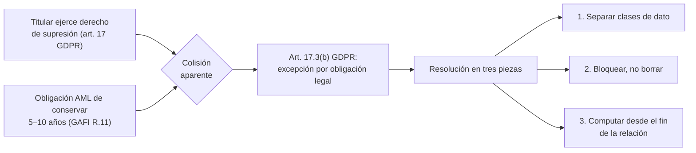
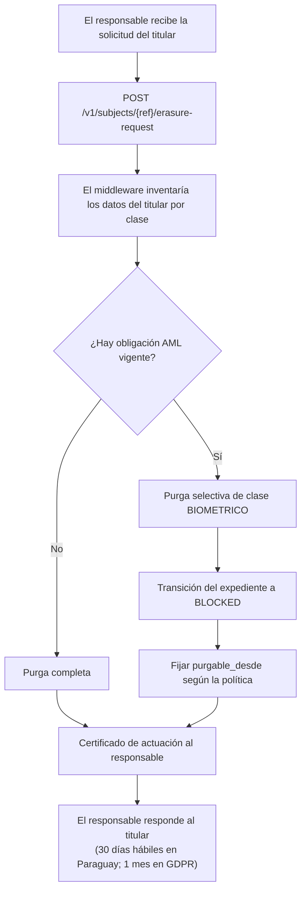

# 12 — Retención y borrado

| Campo | Valor |
|---|---|
| **Estado** | Aprobado |
| **Versión** | 1.1.0 |
| **Última actualización** | 2026-08-21 |
| **Responsable** | Cumplimiento y arquitectura |
| **Audiencia** | Cumplimiento, arquitectura, SRE |
| **Documentos relacionados** | [00 — Índice](00-indice.md) · [03 — Modelo de dominio](03-modelo-de-dominio.md) · [06 — Criptografía](06-criptografia-y-gestion-de-claves.md) · [11 — Cumplimiento normativo](11-cumplimiento-normativo.md) |

**Resumen ejecutivo.** La colisión entre el derecho de supresión y la obligación de conservación AML es aparente, y se resuelve con una decisión de arquitectura de datos: separar el **expediente KYC retenible** de los **datos biométricos minimizables**. El documento contiene la matriz operativa de retención por jurisdicción y clase de dato, el cómputo del plazo y quién lo dispara, el flujo de purga completo —TTL, ciclos de vida del almacén de objetos, borrado en lote, mutex distribuido y crypto-shredding— con su diagrama, y la verificación posterior. La regla que lo gobierna todo: el responsable fija el plazo y el middleware lo implementa, no lo elige.

---

## 1. Las tres afirmaciones que gobiernan este documento

1. **La colisión entre retención AML y derecho de supresión es aparente, no real.** El GDPR la resuelve, pero la resolución hay que implementarla correctamente, y la implementación correcta es una decisión de **arquitectura de datos**, no de redacción legal.
2. **La política la fija el responsable, no el middleware.** Seleccionar unilateralmente el plazo de conservación es decidir sobre medios esenciales del tratamiento, con riesgo de reclasificación a corresponsable.
3. **Ni el TTL de DynamoDB ni el de Firestore sirven como mecanismo de borrado garantizado.** Ambos borran de forma diferida y no transaccional. La purga es un proceso explícito y verificable.

## 2. Clasificación de datos

Toda pieza de dato del sistema pertenece a exactamente una clase, y la clase determina su política de ciclo de vida.

| Clase | Contenido | Sensibilidad | Base de retención | Política por defecto |
|---|---|---|---|---|
| **`EXPEDIENTE_KYC`** | Datos del documento, imágenes del documento, resultado de la verificación, evidencia de auditoría (marca temporal, versión de modelo, umbrales aplicados, veredicto) | Alta | **Obligación legal AML** | 5–10 años según jurisdicción, **desde el fin de la relación** |
| **`BIOMETRICO`** | Selfie, frames de liveness, vídeo de sesión, **plantilla biométrica**, embeddings | **Categoría especial** | Consentimiento o art. 9.2 del GDPR | **Mínima posible.** Purga tras la decisión, salvo necesidad acreditada por el responsable |
| **`EVIDENCIA`** | Registro sellado del resultado de cada paso, sin la muestra biométrica | Alta | Con el expediente | Retención del expediente |
| **`AUDITORIA`** | Quién hizo qué, cuándo, sobre qué sesión. **Sin PII** | Media | Responsabilidad proactiva (art. 5.2) + bitácoras exigidas por CNBV | ≥ retención del expediente |
| **`OPERACIONAL`** | Logs de aplicación, métricas, trazas. **Sin PII por construcción** | Baja | Operación | 30–90 días |
| **`EFIMERO`** | Payloads intermedios, respuestas crudas de proveedor, artefactos de trabajo, claves de idempotencia | Variable | Ninguna | Horas a días |
| **`CONFIGURACION`** | Especificaciones de flujo, catálogo, configuración de tenant | Baja (sin PII) | Trazabilidad de qué proceso se aplicó | Mientras exista un expediente que la referencie |
| **`MATERIAL_CRIPTOGRAFICO`** | Branch keys, DEK envueltas, claves de índice | Crítica | Habilita el descifrado del expediente | Con el expediente; su destrucción **es** el borrado |

### 2.1 La distinción `EXPEDIENTE_KYC` / `BIOMETRICO` es la clave de todo

Es la separación que hace compatibles las dos obligaciones contradictorias. Se sostiene en un hecho normativo concreto:

> **La excepción de retención AML cubre lo *necesario*, no todo lo capturado.** La obligación AML exige conservar el **expediente de identificación**: documento de identidad, datos del titular, evidencia de la verificación practicada. **No exige, en general, conservar la plantilla biométrica ni el vídeo completo de la sesión de liveness.**

Consecuencia operativa: una solicitud de supresión de datos biométricos puede atenderse **afirmativamente** sin incumplir la obligación AML, porque lo que se conserva es el expediente, no el biométrico.

Es la diferencia entre dos respuestas a un titular:

| Respuesta | Sostenibilidad ante una autoridad |
|---|---|
| *"No podemos borrar nada porque la ley nos obliga a conservar."* | ❌ Indefendible |
| *"Hemos borrado sus datos biométricos y conservamos únicamente el expediente de identificación que la normativa de prevención de blanqueo nos obliga a mantener durante N años desde el fin de su relación."* | ✅ Correcta y defendible |

## 3. Matriz de retención por jurisdicción y tipo de dato

### 3.1 Plazos del expediente KYC

| Jurisdicción | Plazo | Cómputo | Fuente normativa | Verificación |
|---|---|---|---|---|
| **GAFI (estándar internacional)** | **≥ 5 años** | Desde la terminación de la relación comercial (expedientes DDC) o desde la transacción (registros de operaciones) | Recomendación 11 | ✅ |
| **Paraguay** | **5 años** | Desde la finalización de la relación comercial o la operación ocasional | Res. SEPRELAD 70/2019, arts. 42 y 43; Ley 1015/1997, art. 18 | ✅ |
| **México** | **10 años** (ampliamente citado) | Desde la terminación de la relación o la celebración de la operación | Disposiciones de carácter general del art. 115 LIC | ❌ <!-- PENDIENTE DE VERIFICAR: no confirmado en fuente primaria. La referencia apunta a la disposición 51ª y a la 62ª Septies. Verificar antes de configurar la política. --> |
| **Bolivia** | **10 años** para libros y documentos contables | Desde la fecha del último asiento contable | Ley 393, art. 34.III | ✅ para materia contable; ❌ para el expediente KYC <!-- PENDIENTE DE VERIFICAR: el plazo del expediente KYC está en el art. 66 del Instructivo UIF, al que remite su art. 39(VII), y ese artículo no fue recuperable. El suelo aplicable es el de 5 años del GAFI, vinculante vía GAFILAT. --> |
| **UE (AML)** | **5 años**, con posibilidad de extensión nacional hasta 10 | Desde el fin de la relación o la transacción ocasional | Directiva (UE) 2015/849, art. 40 | 🟡 |

### 3.2 Matriz operativa completa

| Dato | Bolivia | Paraguay | México | UE |
|---|---|---|---|---|
| **Expediente KYC** (documento, datos, evidencia de verificación) | 10 años ⚠️/❌ | **5 años** ✅ | 10 años ❌ | 5 años (hasta 10) 🟡 |
| **Plantilla biométrica** | Minimizar | Minimizar (dato sensible expreso) | Según instrucción del banco (base propia permitida tras validar contra registros oficiales) | Minimizar (art. 9) |
| **Vídeo de sesión / liveness** | Minimizar | Minimizar | Registro *"íntegro y sin ediciones"* en régimen no presencial 🟡 | Minimizar |
| **Logs de auditoría** (decisión, umbrales, versión de modelo) | Conservar con el expediente | Conservar con el expediente | **Bitácoras exigidas por CNBV** 🟡 | Conservar (responsabilidad proactiva, art. 5.2) |

### 3.3 Configuración resultante por defecto

Valores por defecto del sistema, que **el responsable puede modificar** dentro del rango legal:

```yaml
politica_retencion:
  jurisdicciones:
    BO:
      EXPEDIENTE_KYC: {años: 10, desde: FIN_RELACION}
      BIOMETRICO:     {politica: PURGAR_TRAS_DECISION}
      EVIDENCIA:      {años: 10, desde: FIN_RELACION}
      AUDITORIA:      {años: 11, desde: FIN_RELACION}
    PY:
      EXPEDIENTE_KYC: {años: 5, desde: FIN_RELACION}
      BIOMETRICO:     {politica: PURGAR_TRAS_DECISION}
      EVIDENCIA:      {años: 5, desde: FIN_RELACION}
      AUDITORIA:      {años: 6, desde: FIN_RELACION}
    MX:
      EXPEDIENTE_KYC: {años: 10, desde: FIN_RELACION}
      BIOMETRICO:     {politica: SEGUN_INSTRUCCION_RESPONSABLE, por_defecto: PURGAR_TRAS_DECISION}
      SESION_LIVENESS: {politica: SEGUN_INSTRUCCION_RESPONSABLE, nota: "régimen no presencial: registro íntegro"}
      EVIDENCIA:      {años: 10, desde: FIN_RELACION}
      AUDITORIA:      {años: 11, desde: FIN_RELACION}
    EU:
      EXPEDIENTE_KYC: {años: 5, desde: FIN_RELACION, extensible_hasta: 10}
      BIOMETRICO:     {politica: PURGAR_TRAS_DECISION}
      EVIDENCIA:      {años: 5, desde: FIN_RELACION}
      AUDITORIA:      {años: 6, desde: FIN_RELACION}
  transversales:
    OPERACIONAL: {dias: 90}
    EFIMERO:     {horas: 48}
```

Notas sobre los valores:

- La **auditoría se conserva un año más** que el expediente. Motivo: debe poder demostrarse que la purga del expediente ocurrió conforme a la política, y esa demostración vive en la auditoría.
- **`FIN_RELACION`, no fecha de captura.** Ver §5.
- El biométrico en México es el único caso con `SEGUN_INSTRUCCION_RESPONSABLE` como política nominal, porque la CNBV permite al banco construir bases propias. Aun así, el **valor por defecto es purgar**: el sobrecumplimiento es la posición segura y el responsable debe instruir activamente lo contrario.

## 4. La colisión y su resolución

### 4.1 El conflicto aparente



**Art. 17.3(b) del GDPR** exceptúa el derecho de supresión cuando el tratamiento sea necesario *"para el cumplimiento de una obligación legal que requiera el tratamiento de datos impuesta por el Derecho de la Unión o de los Estados miembros"*. La obligación de conservación AML es exactamente eso.

**Paraguay replica el mecanismo:** la Ley 7593/2025 prevé el derecho de supresión con respuesta en **30 días hábiles**, con **excepciones por obligación legal**.

### 4.2 Los tres límites de la excepción

**Límite 1 — La excepción cubre lo necesario, no todo lo capturado.**

Tratado en §2.1. La implementación es la separación de clases y la posibilidad de purgar `BIOMETRICO` sin tocar `EXPEDIENTE_KYC`.

> ⚠️ **Excepción a considerar: México.** La CNBV permite a los bancos construir bases biométricas propias y la reforma de 2026 exige bitácoras de auditoría, lo que puede justificar una retención biométrica mayor **por parte del banco**. Pero eso es una decisión del responsable, no del middleware — y en todo caso choca con la prohibición de transferir bases biométricas a terceros, lo que refuerza que la base debe residir bajo control del banco.

**Límite 2 — Bloqueo, no borrado, y no uso.**

La técnica correcta durante el período de retención obligatoria es el **bloqueo**: los datos se conservan, su tratamiento se restringe a la única finalidad de cumplir la obligación legal y atender requerimientos de autoridad, y se impide su uso comercial, analítico o de entrenamiento. La LFPDPPP mexicana ha usado tradicionalmente la figura de bloqueo previo a la supresión; el GDPR ofrece el equivalente en la **limitación del tratamiento (art. 18)**.

Implementación: el estado `BLOCKED` de la sesión ([03](03-modelo-de-dominio.md) §3.1), con estas propiedades técnicas:

| Propiedad | Implementación |
|---|---|
| Lectura solo para cumplimiento | El `AuthorizationPort` exige un `scope` específico (`compliance:read-blocked`) que la API normal del requirente no tiene |
| Cada acceso genera evento de auditoría de severidad elevada | El acceso a un expediente bloqueado no es rutina |
| Exclusión de agregados y analítica | Los procesos de métricas filtran por estado |
| Exclusión de cualquier conjunto de evaluación | Ver [08](08-ia-y-extraccion-semantica.md) §7.1 |
| Los datos biométricos ya no están | La purga selectiva ocurrió antes del bloqueo |

**Límite 3 — El reloj arranca al terminar la relación.**

Ver §5.

## 5. El cómputo del plazo

> **Los plazos AML se computan desde la finalización de la relación comercial, no desde el onboarding.** Una retención basada en "N años desde la captura" es **incorrecta en las cuatro jurisdicciones analizadas**.

Esto tiene una consecuencia arquitectónica fuerte: **el middleware no puede gestionar la retención de forma autónoma**, porque solo el requirente sabe cuándo termina la relación con su cliente final.

### 5.1 El contrato de API

```http
POST /v1/subjects/{subject_ref}/relationship-ended
Authorization: Bearer <token con scope subjects:lifecycle>
Idempotency-Key: <uuid>

{
  "ended_at": "2026-08-21T00:00:00Z",
  "reason": "CLIENT_CLOSED_ACCOUNT",
  "external_ref": "cta-99213"
}
```

Efectos:

1. Se registra `relationship_ended_at` en el vínculo del titular.
2. Se calcula `purgable_desde = relationship_ended_at + plazo(jurisdicción, clase)` para cada clase de dato.
3. Todas las sesiones del titular en ese tenant pasan de `RETAINED` a `RETAINED` con fecha de purga fijada.
4. Se emite evento de auditoría.

### 5.2 El caso incómodo: el requirente que nunca notifica

Un requirente puede no llamar nunca a ese endpoint, por olvido o por rotación de sistemas. Sin ese evento, el reloj nunca arranca y los datos se conservan indefinidamente — lo que es un **incumplimiento del principio de limitación del plazo de conservación**, no una postura conservadora segura.

Controles adoptados:

| Control | Descripción |
|---|---|
| **Techo absoluto configurable** | Cada tenant fija un `max_retention_sin_notificacion` (por defecto: plazo de la jurisdicción + 2 años desde la última actividad). Alcanzado, se purga y se notifica |
| **Informe periódico de expedientes sin notificación** | Trimestral, al responsable, listando titulares con actividad antigua y sin evento de fin de relación |
| **Cláusula en el DPA** | La obligación de notificar el fin de la relación es del responsable y consta por escrito |
| **Alarma operativa** | Un tenant activo que nunca ha llamado al endpoint tras seis meses genera alerta comercial |

## 6. Mecanismos de purga

### 6.1 Qué NO se usa como mecanismo de borrado

| Mecanismo | Por qué no |
|---|---|
| **TTL de DynamoDB** | Borrado típico en 48 h tras la expiración, **no garantizado ni transaccional** |
| **TTL de Firestore** | Borrado *"típicamente dentro de 24 h"*, no garantizado; **los documentos expirados siguen apareciendo en consultas** hasta borrarse de verdad. Además, **no borra subcolecciones** |
| **Ciclo de vida de objetos** | Los cambios de configuración tardan **hasta 24 h** en surtir efecto y la ejecución es asíncrona, pudiendo ir muy por detrás del cumplimiento de la condición. Idéntico en ambas nubes |
| **Borrado simple en GCS** | **El soft-delete está activo por defecto y retiene los objetos borrados 7 días.** Un `Delete` no es un borrado. Hay que desactivar la política explícitamente o documentar la ventana. S3 no tiene este comportamiento por defecto |

Los TTL y los ciclos de vida **sí** se usan para la clase `EFIMERO` y para claves de idempotencia, donde la garantía diferida es aceptable.

### 6.2 El proceso de purga

```mermaid
sequenceDiagram
    autonumber
    participant SCH as Programador
    participant PW as purge-worker
    participant MTX as Mutex distribuido
    participant DB as Tabla de dominio
    participant OBJ as Almacén de objetos
    participant KMS as KMS
    participant AUD as Log de auditoría WORM

    SCH->>PW: disparo (diario, por tenant y jurisdicción)
    PW->>MTX: adquirir(purge:{tenant}:{jurisdiccion}, ttl=30min)
    alt Mutex ocupado
        MTX-->>PW: ocupado
        PW-->>SCH: salir sin efecto (idempotente)
    else Mutex adquirido
        MTX-->>PW: adquirido, lease_id
        PW->>DB: consultar candidatos (GSI1: estado RETAINED, purgable_desde <= hoy)
        loop Por cada titular candidato, en lotes
            PW->>MTX: renovar lease (heartbeat)
            PW->>DB: leer inventario del titular (sesiones, artefactos, evidencias)
            PW->>AUD: registrar INICIO_PURGA {subject_ref, inventario_hash}
            PW->>OBJ: borrar objetos de clase BIOMETRICO y EXPEDIENTE_KYC
            OBJ-->>PW: confirmaciones
            PW->>OBJ: verificar ausencia (HEAD) y soft-delete desactivado
            PW->>KMS: destruir DEK envuelta del SubjectKeyBinding
            PW->>DB: borrar registros (transacción por sesión)
            PW->>DB: borrar entradas del índice determinista
            PW->>DB: marcar Session PURGED (conserva id, tenant, fechas; sin PII)
            PW->>AUD: registrar FIN_PURGA {subject_ref, resultado, contadores}
        end
        PW->>MTX: liberar(lease_id)
    end
```

### 6.3 Por qué hace falta un mutex distribuido

La purga es un proceso destructivo, de larga duración y con efectos parciales observables. Sin exclusión mutua:

| Riesgo sin mutex | Manifestación |
|---|---|
| **Ejecución concurrente** | Dos disparos solapados borran el mismo titular; el segundo encuentra objetos ausentes y no distingue "ya borrado" de "fallo de borrado" |
| **Contención de cuota** | Varias purgas concurrentes saturan las cuotas de borrado y de KMS, y compiten con el tráfico productivo |
| **Auditoría inconsistente** | Dos eventos `INICIO_PURGA` sin `FIN_PURGA` correspondiente hacen irreconstruible qué pasó |
| **Interacción con un ejercicio de derechos** | Una purga programada solapada con una supresión bajo petición produce estados intermedios difíciles de explicar a una autoridad |

Implementación del mutex:

```python
def adquirir_mutex(repo, clave: str, ttl_s: int) -> Lease | None:
    """Mutex con lease sobre escritura condicional. Portable a ambos almacenes."""
    ahora = clock.now()
    lease_id = uuid7()
    try:
        repo.put_conditional(
            pk=f"MUTEX#{clave}",
            sk="LOCK",
            item={"lease_id": lease_id, "expires_at": ahora + ttl_s, "holder": host_id()},
            condition="attribute_not_exists(sk) OR expires_at < :ahora",
            values={":ahora": ahora},
        )
        return Lease(lease_id, expires_at=ahora + ttl_s)
    except ConditionalCheckFailed:
        return None
```

Propiedades:

- **Lease con vencimiento**, no bloqueo indefinido: si el worker muere, el mutex se libera solo. Es la misma lección que el `lock_expires_at` de los pasos ([07](07-orquestacion.md) §6.3).
- **Heartbeat** que renueva el lease durante lotes largos.
- **Liberación explícita** al terminar, condicionada al `lease_id` para no liberar el lease de otro.
- **Granularidad por tenant y jurisdicción**: dos tenants purgan en paralelo; el mismo tenant, no.

### 6.4 Orden de las operaciones

El orden no es arbitrario:

| Paso | Por qué en ese orden |
|---|---|
| 1. Registrar `INICIO_PURGA` con el inventario | Si el proceso muere a mitad, el inventario permite reconciliar qué faltó |
| 2. Borrar objetos | Es la operación más lenta y la más propensa a fallo parcial. Hacerla primero deja la tabla como registro de qué debía borrarse |
| 3. **Verificar** ausencia | Un borrado no verificado no es un borrado. Se comprueba con `HEAD` y se confirma que el soft-delete está desactivado en el bucket |
| 4. Destruir la DEK del titular | Tras este paso, cualquier objeto residual es irrecuperable. Es la garantía real |
| 5. Borrar registros de la tabla | Ya no protegen nada |
| 6. Borrar entradas del índice determinista | El HMAC no revela el valor, pero se limpia igualmente |
| 7. Marcar `PURGED` y registrar `FIN_PURGA` | El registro de que la sesión existió y fue purgada **sobrevive**, sin PII |

### 6.5 Crypto-shredding y sus plazos

Detalle completo en [06 — Criptografía](06-criptografia-y-gestion-de-claves.md) §8. Lo esencial para este documento:

| Nivel | Mecanismo | Plazo efectivo |
|---|---|---|
| **DEK del titular** (envuelta, en la tabla) | Borrado directo del registro | **Inmediato** |
| **Branch key del tenant** | Programación de destrucción en el KMS | **AWS: 7–30 días** (mínimo 7). **GCP: 30 días por defecto**, configurable |
| **CMK raíz de jurisdicción** | Idem | Recurso de último extremo, con doble autorización |

**Plazo comprometido con el cliente: 35 días naturales** desde la solicitud efectiva, lo que acomoda la configuración por defecto de GCP con margen. El borrado del almacén primario es **inmediato**; los 35 días cubren las trazas residuales y la destrucción del material de segundo nivel cuando aplica.

<!-- PENDIENTE DE VERIFICAR: el valor mínimo configurable de `destroy_scheduled_duration` en Cloud KMS. Si se confirmara un mínimo de 24 h, el plazo comprometido podría reducirse. La documentación oficial de destrucción y restauración no lo indica. -->

### 6.6 Qué el crypto-shredding no alcanza

| Elemento | Tratamiento |
|---|---|
| Copias de seguridad del propio KMS del proveedor | Se rige por las políticas del proveedor; el compromiso contractual se limita a lo documentado |
| Datos en poder de subencargados | Su borrado se rige por su propio DPA. Por eso el registro de subencargados incluye su SLA de borrado, y la purga dispara la solicitud correspondiente |
| Logs operativos | **No contienen PII por construcción** ([13](13-observabilidad-y-sre.md) §2). Un log con PII sería un dato que el crypto-shredding no alcanza |
| Métricas agregadas | Sin PII |
| El hecho de que la sesión existió | Se conserva deliberadamente en la auditoría, sin PII, para poder demostrar la purga |

## 7. Quién decide la política

> **Regla de oro: la política de retención debe fijarla el responsable (cliente B2B) por escrito en el DPA, y el middleware debe implementarla, no elegirla.** Como encargado, seleccionar unilateralmente el plazo de conservación es decidir sobre medios esenciales del tratamiento, con el riesgo de reclasificación a corresponsable del art. 26 del GDPR.

### 7.1 Reparto explícito

| Decisión | Quién |
|---|---|
| Plazo de retención del expediente | **Responsable**, dentro del rango legal de la jurisdicción |
| Si se conserva la plantilla biométrica y por cuánto | **Responsable**, con instrucción expresa; el valor por defecto es no conservarla |
| Si se conserva el vídeo completo de la sesión de liveness | **Responsable** |
| Cuándo termina la relación comercial | **Responsable** (evento de API) |
| Aceptar o rechazar una solicitud de supresión | **Responsable**; el middleware ejecuta |
| Qué se considera expediente KYC frente a biométrico | **Middleware** (es clasificación técnica, y la propone el diseño) |
| Cómo se implementa el borrado | **Middleware** |
| El plazo técnico mínimo alcanzable | **Middleware** (viene impuesto por el KMS) |
| El techo absoluto ante ausencia de notificación | **Responsable**, sobre un valor por defecto propuesto |

### 7.2 Validación de la política del responsable

El middleware **no acepta cualquier política**. El validador rechaza:

| Configuración rechazada | Motivo |
|---|---|
| Plazo de expediente **inferior** al mínimo de la jurisdicción | Incumplimiento AML: el middleware sería instrumento del incumplimiento |
| Plazo de expediente **superior** al máximo legal, cuando exista | Incumplimiento del principio de limitación del plazo |
| Retención biométrica indefinida | Incompatible con el art. 5.1(e) del GDPR y con el art. 9 |
| Retención biométrica en jurisdicción sin base habilitante clara | Requiere instrucción expresa y motivada del responsable, registrada |
| Ausencia de techo absoluto | Ver §5.2 |
| Retención de auditoría **inferior** a la del expediente | Impediría demostrar que la purga fue conforme |

Un rechazo de política es un error de aprovisionamiento del tenant, visible en el momento de configurar y no meses después.

## 8. Ejercicio de derechos

### 8.1 Flujo de una solicitud de supresión



El certificado de actuación detalla, por clase de dato: qué se borró, qué se conservó, con qué base legal y hasta cuándo. Es el documento que el responsable adjunta a su respuesta al titular.

### 8.2 Otros derechos

| Derecho | Endpoint | Nota |
|---|---|---|
| Acceso | `GET /v1/subjects/{ref}/export` | Expediente en formato legible, incluyendo evidencias y umbrales aplicados |
| Rectificación | `PATCH /v1/subjects/{ref}/fields` | Genera una **evidencia nueva** que supersede, nunca modifica la anterior (invariante I3) |
| Portabilidad | `GET /v1/subjects/{ref}/export?format=portable` | Formato estructurado y de uso común |
| Limitación del tratamiento | `POST /v1/subjects/{ref}/restrict` | Transición a `BLOCKED` |
| Oposición | Se gestiona en el responsable | El middleware no tiene relación con el titular |

**El middleware nunca atiende directamente a un titular.** Todos los derechos se ejercen ante el responsable, que usa la API. Es coherente con el reparto del art. 28 y evita que el encargado establezca una relación con el interesado que no le corresponde.

## 9. Verificación de la purga

Una purga no verificada no es una purga. Controles:

| Control | Frecuencia | Qué comprueba |
|---|---|---|
| **Reconciliación de inventario** | Por purga | Que cada elemento del inventario registrado en `INICIO_PURGA` tiene confirmación en `FIN_PURGA` |
| **Verificación de ausencia de objetos** | Por purga | `HEAD` sobre cada objeto borrado devuelve ausencia, con soft-delete desactivado |
| **Prueba de indescifrabilidad** | Muestreo semanal | Se intenta descifrar un blob residual de un titular purgado; debe fallar |
| **Auditoría de candidatos vencidos** | Diaria | Ningún titular con `purgable_desde` en el pasado permanece sin purgar más de 48 h |
| **Prueba de aislamiento de la purga** | En CI (prueba A-16) | Purgar el tenant A no afecta a la capacidad de descifrar datos del tenant B |
| **Simulacro de purga completa de tenant** | Semestral, en preproducción | Que el procedimiento de terminación de servicio funciona extremo a extremo |
| **Verificación de destrucción de clave** | Al vencer la ventana | Que el estado de la clave es efectivamente destruida |

El resultado de estos controles alimenta el **certificado de borrado** que se entrega al responsable al terminar el servicio, exigido por el art. 28.3(g) del GDPR.

---

## Referencias

- [`docs/referencias/cumplimiento-normativo-y-estandares.md`](referencias/cumplimiento-normativo-y-estandares.md) — sección C completa: plazos de conservación por jurisdicción con su verificación, el art. 17.3(b) del GDPR y su equivalente paraguayo, los tres límites de la excepción, la separación entre expediente KYC y datos biométricos, la técnica de bloqueo, el cómputo desde el fin de la relación, la matriz operativa de retención, y la regla de que la política la fija el responsable.
- [`docs/referencias/gcp-paridad-de-servicios.md`](referencias/gcp-paridad-de-servicios.md) — TTL de Firestore (borrado diferido, sin garantía, sin borrado de subcolecciones), ciclo de vida de objetos (retraso de hasta 24 h), **soft-delete activo por defecto en GCS con 7 días**, crypto-shredding en Cloud KMS (30 días por defecto, mínimo no verificado), Bucket Lock como equivalente WORM.
- [`docs/referencias/aws-arquitecturas-de-referencia.md`](referencias/aws-arquitecturas-de-referencia.md) — TTL de DynamoDB, bloqueo optimista y el fallo del indicador de bloqueo huérfano, incompatibilidad de un TTL corto con los plazos KYC.
- [03 — Modelo de dominio](03-modelo-de-dominio.md) · [06 — Criptografía](06-criptografia-y-gestion-de-claves.md) · [08 — IA y extracción semántica](08-ia-y-extraccion-semantica.md) · [11 — Cumplimiento normativo](11-cumplimiento-normativo.md) · [13 — Observabilidad](13-observabilidad-y-sre.md)
