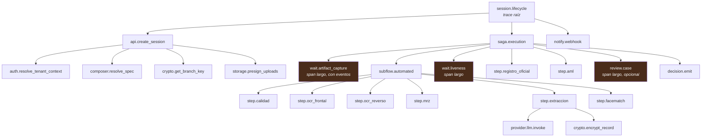

# 13 — Observabilidad y SRE

| Campo | Valor |
|---|---|
| **Estado** | Aprobado |
| **Versión** | 1.1.0 |
| **Última actualización** | 2026-08-21 |
| **Responsable** | SRE |
| **Audiencia** | SRE, ingeniería de plataforma, soporte |
| **Documentos relacionados** | [00 — Índice](00-indice.md) · [05 — Multitenancy](05-multitenancy-y-aislamiento.md) · [07 — Orquestación](07-orquestacion.md) · [14 — Modelo de amenazas](14-modelo-de-amenazas.md) |

**Resumen ejecutivo.** Define la telemetría del producto bajo una regla innegociable: **no hay PII en logs ni en atributos de traza**. Cubre el esquema de logs estructurados con propagación de `correlation_id` y `tenant_id`, el catálogo de métricas técnicas y de negocio —tasa de aprobación automática, tasa de derivación humana, tiempo hasta el veredicto—, los ocho SLI con sus SLO y presupuesto de error, y los runbooks RB-01..RB-06 de los incidentes más probables. Trata además el problema de la retención de historial de 90 días frente a la trazabilidad KYC, que obliga a un rastro propio.

---

## 1. Principios de telemetría

| # | Principio | Consecuencia |
|---|---|---|
| **T1** | **Ningún log contiene PII.** Ni en claro, ni parcialmente redactado, ni en un campo de excepción. | Un log con PII es un dato que el crypto-shredding no alcanza ([12](12-retencion-y-borrado.md) §6.6) |
| **T2** | **Toda señal lleva `tenant_id` y `session_id`.** | Un log sin `tenant_id` no sirve para investigar un incidente de aislamiento |
| **T3** | **OpenTelemetry es la instrumentación única.** | Es el denominador común de ambas nubes; evita dos instrumentaciones y dos modelos de traza |
| **T4** | **Las métricas por tenant se emiten embebidas en el log, sin llamadas API síncronas.** | Emitirlas de forma síncrona desde el camino de la petición añade latencia y consume cuota |
| **T5** | **La telemetría operativa no es el expediente.** | El historial del orquestador retiene 90 días; el expediente regulatorio vive en el log de auditoría y en las evidencias selladas |
| **T6** | **Cada señal tiene un dueño y una acción.** | Una alerta sin runbook es ruido que entrena al equipo a ignorar alertas |

## 2. Logs estructurados

### 2.1 Esquema

```json
{
  "ts": "2026-08-21T14:02:11.482Z",
  "level": "INFO",
  "service": "og-prd-step-worker",
  "capability": "extraction.semantic.v1",
  "tenant_id": "acme",
  "session_id": "01J9X8ZK7QF3M2",
  "step_id": "extraccion",
  "attempt_key": "a3",
  "trace_id": "4bf92f3577b34da6a3ce929d0e0e4736",
  "span_id": "00f067aa0ba902b7",
  "provider": "claude_primario",
  "model_version": "2.1.3",
  "event": "step.completed",
  "outcome": "SUCCEEDED",
  "duration_ms": 3412,
  "confidence_global": 0.94,
  "fields_extracted": 9,
  "fields_null": 1,
  "cache_hit": true,
  "cost_units": 0.0031
}
```

Reglas del esquema:

| Campo | Obligatorio | Nota |
|---|---|---|
| `tenant_id`, `session_id` | Sí | T2 |
| `trace_id`, `span_id` | Sí | Correlación con trazas |
| `event` | Sí | Enumerado cerrado; no texto libre |
| `outcome` | En eventos terminales | Enumerado: `SUCCEEDED`, `NEGATIVE`, `INCONCLUSIVE`, `FAILED`, `SKIPPED` |
| Valores de campos extraídos | **Nunca** | T1 |
| Mensajes de excepción de proveedores | **Sanitizados** | Un mensaje de error de un proveedor puede contener el valor que causó el fallo |

### 2.2 Cómo se hace cumplir T1

La ausencia de PII no se logra con disciplina, se logra con mecanismo:

| Mecanismo | Descripción |
|---|---|
| **Tipo `Redacted[T]` en el dominio** | Los valores PII se envuelven en un tipo cuyo `__repr__` y `__str__` devuelven `<redacted:campo>`. Un `f"{campo}"` accidental no filtra |
| **Formateador de log con lista de permitidos** | El emisor de logs acepta solo un conjunto cerrado de claves. Una clave no declarada se descarta y genera una advertencia |
| **Sanitización de excepciones** | Las excepciones de adaptadores se traducen a la taxonomía del dominio ([02](02-arquitectura.md) §6.1) antes de registrarse; el mensaje original va a un canal separado con retención corta y acceso restringido |
| **Detector de PII en CI (prueba A-18)** | Ejecuta el flujo completo con datos sintéticos marcados y verifica que ningún valor marcado aparece en la salida de telemetría |
| **Detector continuo en producción** | Muestreo de logs contra patrones de documento, nombre y correo. Un acierto es incidente de seguridad |

### 2.3 Retención y destino

| Tipo de log | Retención | Destino |
|---|---|---|
| Aplicación (`OPERACIONAL`) | 90 días | Servicio de logs de la nube |
| Auditoría de dominio (`AUDITORIA`) | Igual o superior a la del expediente | Tabla + almacenamiento WORM |
| Acceso a datos del plano de datos | 400 días en GCP (bucket requerido) / exportado a objetos en AWS | Ver §2.4 |
| Detalle de excepciones de proveedor | 7 días | Canal restringido, acceso auditado |
| Historial del orquestador | 90 días nativos, exportado antes de expirar | Objetos de largo plazo |

### 2.4 Auditoría del plano de datos

> 🔴 **Los Data Access logs están deshabilitados por defecto en GCP** (excepto para el almacén analítico). Si no se habilitan explícitamente sobre Firestore, GCS y KMS, **no hay traza de quién leyó datos de qué tenant**: un fallo de cumplimiento silencioso. En AWS, los eventos de datos de CloudTrail también están apagados por defecto, así que hay paridad — pero es fácil olvidarlo al portar.

Se habilitan en el Terraform base. Consideraciones:

- **El coste puede ser significativo** en un middleware de alto volumen. Se usan filtros de exclusión para reducir ruido, pero **nunca se excluyen accesos a datos de tenant**.
- La retención del bucket requerido de GCP es de **400 días y no es configurable**, lo que **supera** los 90 días del historial de eventos de la alternativa de AWS, donde para plazos mayores hace falta un rastro hacia almacenamiento de objetos.
- La **alerta de desalineación** (accesos cuyo `tenant_id` en la ruta no coincide con el del token) es el control detectivo que compensa parcialmente la brecha de aislamiento en GCP ([05](05-multitenancy-y-aislamiento.md) §6.3, C4).

## 3. Métricas y trazas

### 3.1 Métricas por tenant

Se emiten embebidas en el log (T4), con dimensiones `TenantId` y `Capability`. Ejemplo de emisión en [05](05-multitenancy-y-aislamiento.md) §7.3.

**Cardinalidad:** la dimensión `TenantId` multiplica las series temporales. Con miles de tenants, esto es un problema de coste real. Mitigación: métricas por tenant solo para el conjunto de **uso y salud** (sesiones, llamadas a proveedor, operaciones criptográficas, errores por clase); las métricas de detalle técnico se emiten sin la dimensión de tenant y se correlacionan por traza cuando hace falta.

### 3.2 Catálogo de métricas

| Familia | Métrica | Dimensiones | Uso |
|---|---|---|---|
| **Negocio** | `sessions.started`, `sessions.completed`, `sessions.abandoned`, `sessions.expired` | tenant, país, tipo_doc, tier | Volumen y embudo |
| | `decisions.by_verdict` | tenant, veredicto, motivo | Distribución de resultados |
| | `review.derivation_rate` | tenant, motivo | Calibración de umbrales |
| | `review.queue_depth`, `review.time_in_queue`, `review.time_in_work` | tenant, prioridad | Dimensionado de revisores |
| **Pipeline** | `step.duration`, `step.outcome` | capacidad, proveedor | Rendimiento por paso |
| | `provider.latency`, `provider.errors`, `provider.fallback_activations` | proveedor, capacidad | Salud de proveedores |
| | `provider.circuit_state` | proveedor, capacidad, región | Disyuntores |
| **Extracción** | `extraction.confidence_distribution` | país, tipo_doc | Deriva del modelo |
| | `extraction.hallucination_flags` | país | Métrica bloqueante ([08](08-ia-y-extraccion-semantica.md) §7.2) |
| | `llm.cache_hit_ratio`, `llm.invocations_per_template_per_minute` | tenant, plantilla | Decisión de activar caché ([08](08-ia-y-extraccion-semantica.md) §5.3) |
| **Biometría** | `facematch.similarity_distribution` | tenant, población | Calibración |
| | `liveness.score_distribution`, `liveness.injection_flags` | tenant | Salud del PAD y señales de ataque |
| **Criptografía** | `crypto.unique_data_keys_ratio` | tenant | Salud del caching; alarma > 0,05 |
| | `crypto.kms_calls_per_operation` | tenant | Presión sobre cuota |
| | `crypto.cache_hit_ratio`, `crypto.cache_load_contention` | tenant | Rendimiento |
| | `crypto.decrypt_failures_by_context` | tenant, propósito | **Cualquier valor > 0 es incidente de seguridad** |
| **Orquestación** | `saga.executions_open`, `saga.history_events_estimate` | tenant | Presión sobre cuotas |
| | `saga.suspensions`, `saga.resumptions`, `saga.continuations` | motivo | Salud del patrón de espera larga |
| | `saga.orphan_locks` | — | Ejecutores que mueren |
| **Plataforma** | `compute.cold_starts`, `compute.concurrency`, `compute.throttles` | servicio | Arranque en frío y cuotas |
| | `quota.headroom` | recurso | Ver §6 |
| **Coste** | `cost.per_session` | tenant, país | Presupuesto y detección de fugas |

### 3.3 Trazas

Un `trace_id` por sesión, con la jerarquía de spans reflejando la estructura del flujo:



`step.ocr_frontal` y `step.ocr_reverso` son hermanos concurrentes; el resto del sub-flujo es secuencial. Los tres spans en tono cálido son las esperas largas.

Puntos de diseño:

- **Los spans de espera larga se mantienen abiertos** con eventos periódicos, para que el diagrama refleje el tiempo real de la sesión y no solo el tiempo de cómputo.
- **El `trace_id` se propaga al proveedor** cuando este lo admite, para correlacionar con su lado.
- **En GCP el sub-flujo pierde la visibilidad por estado** que da la orquestación con estados explícitos ([07](07-orquestacion.md) §8.4); se compensa con un span por paso, que es precisamente lo que hace equivalente la observabilidad.
- Cloud Trace no tiene equivalente exacto del mapa de servicios ni de las perspectivas automáticas de la herramienta de AWS. Se compensa con vistas propias construidas sobre las trazas.

## 4. SLI, SLO y presupuesto de error

### 4.1 Los SLI

| # | SLI | Definición | Medición |
|---|---|---|---|
| **SLI-1** | **Disponibilidad de la API** | Peticiones a `/v1/*` con respuesta distinta de 5xx / total, excluyendo 4xx del cliente | Métrica del gateway |
| **SLI-2** | **Latencia de creación de sesión** | p95 de `POST /v1/sessions` | Métrica del gateway |
| **SLI-3** | **Latencia del pipeline automatizado** | p95 desde el *commit* de artefactos hasta el fin del sub-flujo | Traza |
| **SLI-4** | **Tiempo hasta el veredicto (automático)** | p95 desde el *commit* hasta `DECIDED`, excluyendo sesiones derivadas | Dominio |
| **SLI-5** | **Tasa de éxito del pipeline** | Sesiones que alcanzan estado terminal sin `FAILED` / total | Dominio |
| **SLI-6** | **Frescura del veredicto notificado** | p95 desde `DECIDED` hasta webhook entregado con 2xx | Dominio |
| **SLI-7** | **Corrección del aislamiento** | Ejecuciones exitosas de la suite de aislamiento en producción / esperadas | Prueba sintética |
| **SLI-8** | **Cumplimiento de purga** | Titulares purgados dentro de plazo / titulares con `purgable_desde` vencido | Dominio |

SLI-7 y SLI-8 son inusuales como SLI de disponibilidad, y están aquí a propósito: en este producto, **un fallo de aislamiento o de purga es más grave que una caída**.

### 4.2 Los SLO

| SLI | SLO (ventana de 30 días) | Presupuesto de error |
|---|---|---|
| SLI-1 Disponibilidad de la API | **99,9 %** | 43 min 12 s |
| SLI-2 Latencia de creación de sesión | p95 ≤ **400 ms** en el 99 % de los minutos | 7 h 12 min de minutos malos |
| SLI-3 Latencia del pipeline | p95 ≤ **25 s** en el 99 % de los minutos | 7 h 12 min |
| SLI-4 Tiempo hasta veredicto automático | p95 ≤ **90 s** en el 99 % de los minutos | 7 h 12 min |
| SLI-5 Éxito del pipeline | **99,5 %** | 0,5 % de sesiones |
| SLI-6 Frescura del veredicto | p95 ≤ **30 s** en el 99 % de los minutos | 7 h 12 min |
| SLI-7 Corrección del aislamiento | **100 %** | **Cero.** Cualquier fallo es incidente de severidad 1 |
| SLI-8 Cumplimiento de purga | **99,9 %** dentro de las 48 h de la fecha | 0,1 % |

> Los valores de SLI-2 a SLI-6 son **objetivos iniciales sujetos a calibración** con datos de producción. La latencia real depende fuertemente del proveedor de OCR y de LLM contratado por cada tenant. Los SLO por tenant pueden diferir según el contrato.

### 4.3 Política de presupuesto de error

| Consumo del presupuesto | Acción |
|---|---|
| < 50 % | Operación normal; se prioriza funcionalidad |
| 50–75 % | Revisión en la reunión operativa semanal; se identifica la causa dominante |
| 75–100 % | **Congelación de cambios no relacionados con fiabilidad.** Solo despliegues que reduzcan el consumo |
| > 100 % | Congelación total. Revisión post-mortem obligatoria antes de reanudar |
| **SLI-7 con cualquier consumo** | Incidente de severidad 1, con notificación al responsable de cumplimiento |

## 5. Alertas y runbooks

### 5.1 Filosofía de alertas

Tres niveles, y solo el primero despierta a alguien:

| Nivel | Criterio | Canal |
|---|---|---|
| **Página** | Impacto en el usuario en curso, o riesgo de cumplimiento | Localizador, 24×7 |
| **Ticket** | Degradación que requiere acción pero no inmediata | Cola del equipo |
| **Informativo** | Señal para el cuadro de mando | Sin notificación |

Una alerta de página sin runbook **no se despliega**. Es una regla, no una aspiración.

### 5.2 Runbooks de los seis incidentes más probables

---

#### RB-01 — Proveedor externo degradado o caído

**Señales:** `provider.errors` por encima del umbral; `provider.latency` p95 disparada; `provider.circuit_state = OPEN`; aumento de `provider.fallback_activations`.

**Impacto:** si hay fallback, degradación de coste y latencia. Si no lo hay (`biometrics.liveness.v2`), las sesiones que requieran ese paso no pueden completarse.

**Diagnóstico:**
1. Confirmar el alcance: ¿un proveedor, una capacidad, una región, un tenant?
2. Comprobar la página de estado del proveedor y el canal de soporte.
3. Verificar que no es un problema propio: credencial expirada, cuota agotada, cambio de contrato de API (`ProviderContractViolation` en aumento apunta a esto).

**Acciones:**
1. Si hay fallback configurado y el disyuntor está abierto, verificar que el fallback **está absorbiendo** el tráfico y que su proveedor aguanta el volumen adicional.
2. Si no hay fallback: activar el modo de **admisión controlada** para las especificaciones que dependen del paso — responder `503` con `Retry-After` a nuevas sesiones que lo requieran, en lugar de acumular sesiones en `PROCESSING` que van a expirar.
3. Notificar a los tenants afectados por el canal de estado.
4. Para sesiones ya en vuelo con el paso pendiente: extender el plazo de expiración si el flujo lo permite; en caso contrario, derivar a revisión humana con motivo `PROVEEDOR_NO_DISPONIBLE`.

**Verificación de recuperación:** disyuntor cerrado durante 15 minutos, `provider.errors` en línea base, cola de sesiones pendientes drenada.

**Prevención:** segunda fuente cualificada para toda capacidad con `al_fallar != ABORTAR`; revisión trimestral de los presupuestos de reintento.

---

#### RB-02 — Cola de revisión humana desbordada

**Señales:** `review.queue_depth` creciente; `review.time_in_queue` p95 por encima del SLA; casos con `sla_vence_en` en el pasado.

**Impacto:** sesiones bloqueadas, titulares esperando, riesgo de incumplimiento de SLA contractual.

**Diagnóstico:**
1. ¿Es un aumento de volumen o un aumento de la **tasa de derivación**? Comparar `sessions.started` con `review.derivation_rate`.
2. Si es la tasa de derivación: ¿cambió una especificación, un modelo o un proveedor recientemente? Cruzar con el registro de despliegues de especificaciones.
3. ¿Es un tenant concreto o transversal?
4. ¿Hay revisores acaparando casos? Comparar `review.time_in_work` por revisor.

**Acciones:**
1. Si la causa es un despliegue de especificación reciente: **revertir a la versión anterior** (§ de despliegue canario en [04](04-motor-de-composicion.md) §8.2).
2. Si es volumen legítimo: escalar revisores según el procedimiento acordado con el responsable.
3. Repriorizar la cola: casos con SLA próximo a vencer primero.
4. Si hay riesgo de incumplimiento contractual, notificar al tenant **antes** de vencer el SLA, no después.

**Verificación:** profundidad de cola en tendencia descendente durante dos horas; ningún caso con SLA vencido.

**Prevención:** alarma sobre la tasa de derivación con umbral relativo a la línea base de la versión anterior, no absoluto.

---

#### RB-03 — Cuota agotada o *throttling*

**Señales:** `compute.throttles` > 0; errores de límite de tasa de KMS, del almacén o de un servicio gestionado; `quota.headroom` por debajo del 20 %.

**Impacto:** rechazos intermitentes que parecen aleatorios y son difíciles de diagnosticar desde el cliente.

**Diagnóstico:**
1. Identificar la cuota concreta. Las candidatas por orden de probabilidad:
   - **Concurrencia de cómputo**: límite por defecto de **1.000 ejecuciones concurrentes por región**, con *burst* de **1.000 entornos cada 10 s por función**. En Cloud Run, `max_instance_count`, y **Direct VPC egress limita a 100–200 instancias según región**.
   - **Operaciones criptográficas de KMS**: cuota compartida de **100.000 req/s** en us-east-1, us-west-2 y eu-west-1; **20.000** en us-east-2, ap-southeast-1/2, ap-northeast-1, eu-central-1 y eu-west-2; **10.000** en el resto — **compartida con todo lo demás de la cuenta**.
   - **`CreateGrant`: 50 req/s**, cuota independiente. Si aparece aquí, alguien está creando grants en el camino de la petición, lo que viola A7 ([02](02-arquitectura.md) §8).
   - **Cuota del proveedor externo** contratada.
   - **Ejecuciones concurrentes del orquestador**: 10.000 por región y proyecto en GCP.
2. Comprobar si un tenant concreto está causando la presión (`cost.per_session` y volumen por tenant).

**Acciones:**
1. Si es vecino ruidoso: aplicar limitación por tenant en el nivel adecuado ([05](05-multitenancy-y-aislamiento.md) §7.2).
2. Si es cuota de KMS: verificar `crypto.cache_hit_ratio`. Un ratio bajo indica que la caché de material criptográfico no está funcionando — es la causa más probable y la más grave, porque significa que el sistema opera cerca del techo de la cuota compartida.
3. Solicitar ampliación de cuota si la demanda es legítima y sostenida. Anticiparse: la ampliación no es inmediata.
4. Si es `CreateGrant`: es un defecto de código, no un problema de capacidad. Corregir y mover la creación al aprovisionamiento.

**Verificación:** `quota.headroom` por encima del 40 %; `compute.throttles` en cero.

**Prevención:** revisión mensual de `quota.headroom` frente al crecimiento proyectado; alarma al 70 % de consumo, no al 90 %.

---

#### RB-04 — Fallos de descifrado

**Señales:** `crypto.decrypt_failures_by_context` > 0.

**Impacto:** **potencialmente un incidente de seguridad, no solo de disponibilidad.** Un fallo de descifrado es la manifestación esperada de un error de alcance de tenant ([06](06-criptografia-y-gestion-de-claves.md) §1, O1).

**Diagnóstico — en este orden:**
1. **Descartar primero la hipótesis de seguridad.** ¿Los fallos agrupan por par de tenants? ¿Aparece un `tenant` en el contexto que no coincide con el del token de la petición? Si sí → **severidad 1, escalar a seguridad de inmediato.**
2. Si no es cruce de tenants, causas por orden de probabilidad:
   - **Discrepancia en el contexto de cifrado** tras un despliegue: alguien cambió cómo se construye el contexto. Es el fallo más común y se manifiesta **en la lectura**, potencialmente semanas después del cambio.
   - **Branch key destruida o programada para destrucción** que aún tiene datos vivos: cruce con el registro de purgas.
   - **Rotación mal aplicada**: la versión de clave referenciada no existe.
   - **Registro corrupto**: fallo de verificación de firma, no de descifrado. Distinguirlo por el tipo de error.

**Acciones:**
1. Si es cruce de tenants: activar el procedimiento de incidente de seguridad ([14](14-modelo-de-amenazas.md) §7). **No "arreglar" el fallo de descifrado**: es el control funcionando.
2. Si es discrepancia de contexto: revertir el despliegue. **No** intentar descifrar con el contexto antiguo desde código nuevo sin entender el alcance.
3. Si es clave destruida con datos vivos: si la ventana de destrucción sigue abierta, **cancelar la destrucción** (AWS: `CancelKeyDeletion`; GCP: restaurar la versión) y auditar por qué se programó.

**Verificación:** métrica en cero durante 24 h; auditoría del origen documentada.

**Prevención:** el contexto de cifrado se construye en **una sola función**; la suite de contrato incluye un caso de ida y vuelta con contexto desalineado.

---

#### RB-05 — Sesiones atascadas

**Señales:** `GSI1` muestra sesiones en `PROCESSING` o `AWAITING_SUBJECT` por encima del umbral de edad; `saga.orphan_locks` > 0; ejecuciones del orquestador abiertas creciendo sin cerrarse.

**Impacto:** titulares esperando indefinidamente; consumo de cuota de ejecuciones abiertas.

**Diagnóstico:**
1. ¿En qué paso están atascadas? Agrupar por `step_id`.
2. Si es un paso con espera larga: ¿llegó el webhook del proveedor? Comprobar el registro de callbacks y si el `provider_ref` tiene resultado consultable.
3. Si es un paso automatizado: ¿hay bloqueos huérfanos? Un ejecutor que muere tras adquirir el bloqueo y antes de completar deja la tarea bloqueada.
4. ¿Se perdió un token de espera? Un worker que murió antes de persistirlo deja la ejecución esperando un token que nadie tiene.

**Acciones:**
1. Bloqueos huérfanos: verificar que el proceso *reaper* está vivo; si no, ejecutarlo manualmente.
2. Webhook perdido: usar `get_result(provider_ref)` para consultar por la vía alternativa y señalar la saga.
3. Token perdido: dejar que venza el `TimeoutSeconds` del paso, que producirá reintento con nueva `attempt_key`. Si el timeout es demasiado largo para el caso, cancelar y reiniciar la sesión notificando al tenant.
4. Sesiones sin recuperación posible: transición a `FAILED` con motivo, notificación al tenant, y purga según política.

**Verificación:** ninguna sesión en estado no terminal con edad superior al doble del p95 esperado.

**Prevención:** todo Task con token declara `TimeoutSeconds` explícito; `lock_expires_at` con marca temporal absoluta y no un indicador booleano; alarma sobre expiración de bloqueos.

---

#### RB-06 — Degradación de la calidad de extracción

**Señales:** `extraction.confidence_distribution` desplazada; `review.derivation_rate` en aumento por motivos de extracción; `extraction.hallucination_flags` > 0.

**Impacto:** más derivaciones, más coste, peor experiencia. Si hay alucinación, **riesgo de expediente contaminado**.

**Diagnóstico:**
1. ¿Es transversal o de un país o tipo de documento concreto?
2. ¿Cambió la versión del modelo? La versión se registra en cada evidencia: comparar antes y después.
3. ¿Cambió el proveedor de OCR o su comportamiento? Una caída de la confianza del OCR con extracción estable apunta ahí.
4. ¿Cambió el documento físico? Un país que emite un modelo nuevo produce aumento de derivación y de `bbox` fuera de región para ese país.
5. ¿Cambió la población de titulares? Un tenant nuevo con documentos deteriorados desplaza la distribución.

**Acciones:**
1. **Ejecutar el conjunto dorado inmediatamente** y comparar por país con la ejecución anterior.
2. Si es cambio de versión de modelo: fijar la versión anterior si el proveedor lo permite, y abrir revalidación.
3. Si es modelo de documento nuevo: crear plantilla de extracción nueva; es un despliegue de dato, no de código.
4. Si hay alucinación: **bloquear la promoción de cualquier cambio** y auditar los expedientes afectados desde la primera aparición de la señal.

**Verificación:** conjunto dorado con degradación inferior al 2 % en todos los países; tasa de derivación en línea base.

**Prevención:** ejecución semanal programada del conjunto dorado; alarma sobre desplazamiento de la distribución de confianza antes de que se traduzca en derivaciones.

---

### 5.3 Otros runbooks del catálogo

| ID | Incidente | Nota |
|---|---|---|
| RB-07 | Rotación de clave de índice determinista | Operación planificada, no automática: exige reindexación completa con doble escritura |
| RB-08 | Purga vencida sin ejecutar | Riesgo de cumplimiento; verificar mutex huérfano |
| RB-09 | Arranque en frío elevado tras despliegue | Instancias mínimas, tamaño de artefacto, dependencias |
| RB-10 | Webhook al requirente fallando | Reintentos, cola de fallidos, rotación de clave de firma |
| RB-11 | Incidente de aislamiento (SLI-7 en fallo) | Escalado inmediato a seguridad |
| RB-12 | Conmutación de región | Procedimiento activo/pasivo, con la limitación de sesiones en vuelo |

## 6. Gestión de cuotas y arranque en frío

### 6.1 Inventario de cuotas vigiladas

| Recurso | Cuota | Umbral de alarma | Nota |
|---|---|---|---|
| Concurrencia de cómputo (AWS) | 1.000 por región (ampliable) | 70 % | *Burst* de 1.000 entornos cada 10 s por función |
| Instancias de Cloud Run | `max_instance_count` | 70 % | **Direct VPC egress limita a 100–200 según región** |
| Operaciones criptográficas de KMS | 10.000 / 20.000 / 100.000 req/s según región | 50 % | **Compartida con toda la cuenta** |
| `CreateGrant` | 50 req/s | Cualquier uso en el camino de la petición | Es un defecto, no capacidad |
| Ejecuciones abiertas del orquestador | 1.000.000 (AWS, flexible) / 10.000 concurrentes (GCP) | 60 % | |
| Eventos de historial por ejecución | **25.000** | 60 % (estimado por el compilador) | Ver [07](07-orquestacion.md) §7 |
| Lecturas de Secret Manager (GCP) | **600/min por proyecto** | 50 % | Por eso `ConfigPort` está separado |
| Cuota de callbacks de Cloud Workflows | 1.500/min por ubicación | 50 % | |
| Bases de datos Firestore por proyecto | 100 | 80 % | Tope del tier dedicado en GCP |
| Cuota contratada con cada proveedor externo | Variable | 70 % | Por tenant y global |

Revisión mensual de `quota.headroom` frente al crecimiento proyectado. Las ampliaciones de cuota no son inmediatas: se solicitan con antelación.

### 6.2 Arranque en frío

| Plataforma | Comportamiento | Mitigación |
|---|---|---|
| Lambda | Inicialización de hasta 10 s; artefacto descomprimido de hasta 250 MB con capas, o imagen de contenedor de hasta 10 GB | Concurrencia aprovisionada en las funciones de la ruta síncrona; minimizar dependencias del núcleo; el adaptador pesado vive en su propia función |
| Cloud Run | Timeout de arranque de 4 min; arranque en frío con GPU de ~5 s | `min_instances ≥ 1` y arranque acelerado de CPU en rutas síncronas; modelo horneado en la imagen |
| Cloud Run con red privada | ⚠️ **Retrasos de establecimiento de conexión de un minuto o más en el arranque de instancia, y arranques en frío de 30 s o más con NAT** | **Medirlo antes de comprometer SLA de latencia.** Es materialmente peor que el equivalente de AWS |

La última fila es el riesgo operativo más subestimado del despliegue en GCP para APIs síncronas.

### 6.3 Dimensionado de cómputo

- La memoria de Lambda va de **128 MB a 10.240 MB** en incrementos de 1 MB, y la vCPU se asigna proporcionalmente. **No existe ningún requisito de memoria ligado a AVX-512**: la documentación cubre AVX2 (vectores de 256 bits) y `arm64` usa NEON. Se dimensiona por perfil de rendimiento **medido**, no por límites inexistentes ([20](20-fe-de-erratas-del-spec-original.md) §4).
- En Cloud Run la relación CPU↔memoria es **obligatoria**: 8 vCPU exige de 4 a 32 GiB. No hay asignación proporcional automática.
- **El sistema de archivos escribible de Cloud Run es tmpfs y consume memoria.** Un adaptador portado que use archivos temporales asumiendo disco reduce la memoria disponible.

## 7. Pruebas de carga

### 7.1 Objetivos

| Objetivo | Pregunta que responde |
|---|---|
| Capacidad | ¿Cuántas sesiones por segundo sostiene una célula antes de degradar el SLO? |
| Cuota | ¿Qué cuota se agota primero? |
| Vecino ruidoso | ¿Un tenant al 10× de su volumen degrada a los demás? |
| Arranque en frío | ¿Cuál es el p95 en una rampa desde cero? |
| Criptografía | ¿La caché de material aguanta el pico o aparece el fenómeno de estampida? |
| Coste | ¿Cuál es el coste real por sesión bajo carga, incluyendo reintentos y caché? |

### 7.2 Escenarios

| # | Escenario | Perfil | Qué valida |
|---|---|---|---|
| **C-1** | Estado estable | Volumen nominal durante 2 h | Línea base, sin fugas de recursos |
| **C-2** | Rampa | 0 → 3× nominal en 10 min | Arranque en frío, autoescalado, `quota.headroom` |
| **C-3** | Pico | 10× nominal durante 5 min | Limitación por tenant, comportamiento de la limitación, disyuntores |
| **C-4** | **Estampida criptográfica** | Arranque simultáneo de N entornos fríos que necesitan la misma branch key | Que la caché con carga atómica funciona; `crypto.unique_data_keys_ratio` estable |
| **C-5** | Vecino ruidoso | Un tenant al 10×, el resto nominal | Que los demás mantienen su SLO |
| **C-6** | Proveedor degradado | Latencia inyectada de 5 s y 20 % de errores en un proveedor | Disyuntores, fallback, presupuestos |
| **C-7** | Espera larga masiva | 10.000 sesiones simultáneas en `PENDING_REVIEW` | Ejecuciones abiertas, patrón de suspensión, en GCP el patrón de relanzamiento |
| **C-8** | Purga bajo carga | Purga de un tenant grande con tráfico productivo nominal | Que la purga no degrada el servicio; mutex; cuotas de borrado |
| **C-9** | Sostenida de larga duración | Nominal durante 24 h | Fugas de memoria, crecimiento de índices, acumulación de sesiones huérfanas |

### 7.3 Reglas de ejecución

| Regla | Motivo |
|---|---|
| **Datos sintéticos exclusivamente.** Nunca datos de producción de clientes | Art. 28 del GDPR: no hay instrucción para ese uso |
| Los proveedores externos se ejecutan contra **sus entornos de prueba** o contra simuladores con la latencia observada en producción | No consumir cuota contratada ni facturar llamadas reales |
| **En un entorno con la misma forma que producción**, no necesariamente el mismo tamaño; se documenta el factor de escala | Una prueba en un entorno estructuralmente distinto mide otra cosa |
| C-4 y C-8 son **obligatorias antes de cada promoción mayor** | Son los dos escenarios donde un fallo tiene consecuencias de cumplimiento, no solo de disponibilidad |
| Se registra el **coste** de cada ejecución | Es un resultado de la prueba, no un efecto secundario |

---

## Referencias

- [`docs/referencias/aws-arquitecturas-de-referencia.md`](referencias/aws-arquitecturas-de-referencia.md) — métricas embebidas por tenant y su justificación; cuotas de Lambda (memoria 128 MB–10.240 MB, concurrencia y *burst*, inexistencia del requisito de AVX-512); cuotas de KMS por región y `CreateGrant` a 50 req/s; ratio de claves de datos únicas como indicador de salud; cuotas de Step Functions (25.000 eventos, retención de 90 días).
- [`docs/referencias/gcp-paridad-de-servicios.md`](referencias/gcp-paridad-de-servicios.md) — capacidad 12 (**Data Access logs deshabilitados por defecto**, retención de 400 días del bucket requerido, coste y filtros de exclusión, ausencia de mapa de servicios en Cloud Trace, OTel como denominador común); capacidad 3 (arranque en frío, relación CPU↔memoria, tmpfs); capacidad 15 (**retrasos de conexión de un minuto y arranques en frío de 30 s con NAT**, límite de 100–200 instancias con egreso directo, dimensionado de subred); capacidad 13 (600 lecturas/min de Secret Manager); capacidad 2 (cuotas de Workflows y de callbacks).
- [05 — Multitenancy](05-multitenancy-y-aislamiento.md) · [06 — Criptografía](06-criptografia-y-gestion-de-claves.md) · [07 — Orquestación](07-orquestacion.md) · [08 — IA y extracción semántica](08-ia-y-extraccion-semantica.md) · [12 — Retención y borrado](12-retencion-y-borrado.md) · [14 — Modelo de amenazas](14-modelo-de-amenazas.md) · [20 — Fe de erratas](20-fe-de-erratas-del-spec-original.md)
