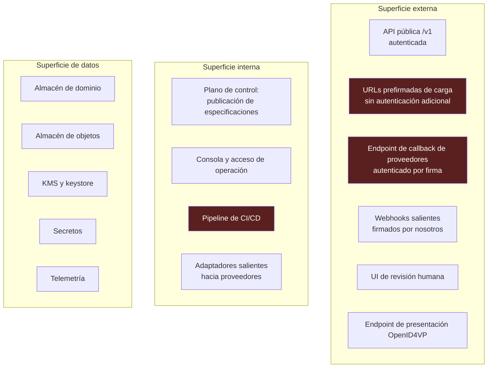
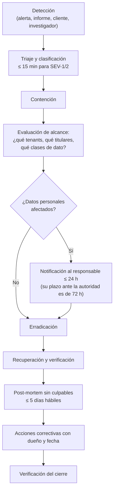

# 14 — Modelo de amenazas

| Campo | Valor |
|---|---|
| **Estado** | Aprobado |
| **Versión** | 1.1.0 |
| **Última actualización** | 2026-08-21 |
| **Responsable** | Seguridad de la plataforma |
| **Audiencia** | Seguridad, arquitectura, SRE, cumplimiento |
| **Documentos relacionados** | [00 — Índice](00-indice.md) · [05 — Multitenancy](05-multitenancy-y-aislamiento.md) · [06 — Criptografía](06-criptografia-y-gestion-de-claves.md) · [09 — Biometría y liveness](09-biometria-y-liveness.md) · [13 — Observabilidad](13-observabilidad-y-sre.md) |

**Resumen ejecutivo.** Aplica STRIDE componente por componente y añade el catálogo de amenazas propias del eKYC que un modelo genérico no captura: inyección de medios en la cámara, *deepfakes*, *replay* de sesión, documentos sintéticos, ataque de tenant a tenant, envenenamiento del Registro de Capacidades e inyección de instrucciones a través del texto OCR del documento. Cada amenaza tiene control asignado y estado. Cierra con la gestión de vulnerabilidades, la respuesta a incidentes y el plan de pruebas de seguridad, incluida la prueba de aislamiento, que es la de mayor valor específico para este producto.

---

## 1. Alcance y supuestos

### 1.1 Activos a proteger

| # | Activo | Impacto de su compromiso |
|---|---|---|
| A1 | **Datos biométricos de titulares** | Categoría especial; irrevocables — un rostro no se puede rotar como una contraseña |
| A2 | **Expedientes KYC** | PII completa; obligación de custodia; sanción regulatoria |
| A3 | **Material criptográfico** (branch keys, DEK, claves de índice) | Compromete A1 y A2 retroactivamente |
| A4 | **Integridad del veredicto** | Un veredicto falseado permite el alta de una identidad fraudulenta: incumplimiento AML |
| A5 | **Log de auditoría** | Sin él no hay demostración de cumplimiento ni investigación posible |
| A6 | **Especificaciones de flujo y umbrales** | Alterarlos degrada silenciosamente todas las verificaciones |
| A7 | **Credenciales de proveedores** | Acceso a servicios facturables y potencialmente a datos en el proveedor |
| A8 | **Disponibilidad del servicio** | Bloqueo del onboarding de los clientes |
| A9 | **Aislamiento entre tenants** | Fuga entre clientes competidores; incumplimiento contractual y regulatorio |

### 1.2 Actores de amenaza

| Actor | Capacidad | Motivación |
|---|---|---|
| **Solicitante fraudulento** | Baja-media; herramientas comerciales de suplantación | Abrir cuenta con identidad falsa, robada o sintética |
| **Fraude organizado** | Alta; automatización, documentos falsificados de calidad, *deepfakes* en tiempo real | Alta masiva de mulas |
| **Tenant malicioso o comprometido** | Credenciales legítimas de la API | Acceder a datos de otro tenant |
| **Interno del operador** | Acceso a infraestructura | Exfiltración, sabotaje, curiosidad |
| **Interno del requirente** (revisor) | Acceso a la cola de revisión | Aprobar casos indebidos, exfiltrar PII |
| **Atacante externo** | Variable | Exfiltración masiva, ransomware, interrupción |
| **Proveedor comprometido** | Acceso al perímetro de datos como subencargado | Cadena de suministro |

### 1.3 Supuestos

- La red es hostil; TLS es obligatorio en todos los saltos.
- El dispositivo del titular **no es de confianza**: puede estar comprometido, emulado o instrumentado.
- El frontend del requirente **no es de confianza** para decisiones de seguridad; toda validación se repite en servidor.
- El proveedor de nube protege el hipervisor y la infraestructura física; el modelo se centra en lo que está bajo control del proyecto.
- Un adaptador de proveedor puede devolver respuestas maliciosas o malformadas.

## 2. Superficie de ataque

Las tres superficies marcadas son las de mayor riesgo relativo:

- **S2 (URLs prefirmadas):** conceden acceso de escritura sin autenticación adicional. Mitigación: caducidad corta, alcance a un objeto único, cabeceras de cifrado fijadas, tamaño y tipo restringidos, y verificación del hash en el *commit*.
- **S3 (callbacks):** un endpoint público que **reanuda ejecuciones**. Es el objetivo más valioso de la superficie externa.
- **S9 (CI/CD):** compromete todo lo demás. Es la vía más rentable para un atacante sofisticado.

## 3. STRIDE por componente

Leyenda: **S**poofing, **T**ampering, **R**epudiation, **I**nformation disclosure, **D**enial of service, **E**levation of privilege.

### 3.1 `api-service`

| STRIDE | Amenaza | Control | Verificación |
|---|---|---|---|
| S | Token falsificado o de otro emisor | Validación de firma, emisor, audiencia y expiración; **fail-closed sin `tenant_id`** | Pruebas A-08, A-09 |
| S | Reutilización de token robado | Vida corta del token; vinculación a IP o cliente cuando el tenant lo permita; anomalía de uso | Auditoría de tokens |
| T | Manipulación del `tenant_id` en el cuerpo de la petición | **El `tenant_id` se toma exclusivamente del contexto del autorizador**, nunca del cuerpo | Prueba A-17 |
| T | Alteración de parámetros del flujo (umbrales, pasos) | Los umbrales vienen de la especificación publicada, **no de la petición** | Revisión de contrato de API |
| R | El tenant niega haber iniciado una sesión | Log de auditoría encadenado con `jti` del token y actor | Reconstrucción de sesión |
| I | Enumeración de sesiones ajenas | `SessionNotFound` en lugar de `Forbidden` — no filtra existencia | Prueba A-07 |
| I | Filtración por mensajes de error detallados | Taxonomía de errores cerrada; sin trazas internas en la respuesta | Revisión de respuestas de error |
| D | Inundación de creación de sesiones | Limitación en tres niveles; presupuesto por tenant; WAF | Escenario de carga C-3 |
| E | Escalada por confusión de contexto bajo concurrencia | `TenantContext` **inmutable y pasado explícitamente**, nunca en estado implícito por hilo | Prueba A-13 |

### 3.2 Carga de artefactos (URL prefirmada)

| STRIDE | Amenaza | Control |
|---|---|---|
| S | Uso de una URL prefirmada de otra sesión | La URL da acceso a **una clave de objeto única** derivada de `(tenant, session, slot)` |
| T | Sustitución del artefacto tras el *commit* | Verificación del `sha256` antes de que ningún paso lo consuma (invariante I6); versionado del bucket |
| T | Carga de contenido que no es una imagen | Validación de tipo real por contenido, no por extensión ni por cabecera declarada; límite de tamaño en la política de la URL |
| I | Enumeración de objetos por nombre | Identificadores opacos; `s3:ListBucket` restringido por prefijo de tenant (prueba A-03) |
| D | Carga masiva de objetos grandes | Tamaño máximo en la política; presupuesto de artefactos por sesión; ciclo de vida agresivo para artefactos sin *commit* |
| E | Escritura fuera del prefijo del tenant | Política ABAC con `${aws:PrincipalTag/TenantID}` en el recurso |

### 3.3 `step-workers` y adaptadores de proveedor

| STRIDE | Amenaza | Control |
|---|---|---|
| S | Respuesta falsificada de un proveedor | TLS con verificación de certificado; **fijación de certificado o de CA** en proveedores críticos; firma cuando el proveedor la ofrece |
| T | **Inyección de prompt desde el contenido del documento** | Defensa en profundidad D1–D8 ([08](08-ia-y-extraccion-semantica.md) §8) |
| T | Respuesta de proveedor que no valida contra el esquema | `ProviderContractViolation` → fallback + alerta de severidad alta |
| R | Disputa sobre qué proveedor y versión ejecutó un paso | Evidencia sellada con proveedor, versión de modelo y umbrales |
| I | Envío de más PII de la necesaria a un proveedor | Minimización explícita por adaptador: solo los campos que la capacidad requiere |
| I | Fuga por logs del adaptador | Sanitización de excepciones; tipo `Redacted[T]`; prueba A-18 |
| D | Agotamiento de la cuota contratada con un proveedor | Presupuesto por sesión y por tenant; disyuntor |
| E | Worker con permisos excesivos | Un rol por capacidad, con acceso solo al secreto de su proveedor y a su prefijo de objetos |

### 3.4 Endpoint de callback

| STRIDE | Amenaza | Control |
|---|---|---|
| S | Callback falsificado que aprueba una sesión | **Verificación de firma del proveedor** con clave rotada; verificación de que el `provider_ref` existe y está vivo |
| T | Alteración del resultado en tránsito | TLS + firma sobre el cuerpo completo |
| T | **Replay** de un callback válido antiguo | Marca de frescura (`timestamp` dentro de ventana), `nonce` de uso único, y **consumo único del token de espera** |
| R | El proveedor niega haber enviado un resultado | Persistencia del cuerpo firmado recibido, en almacenamiento WORM |
| I | Filtración del token de espera | El token se persiste **cifrado** con la clave del tenant y nunca se expone al proveedor |
| D | Inundación de callbacks | Limitación por proveedor; los callbacks con `provider_ref` desconocido se descartan barato, antes de tocar el almacén |
| E | Reanudación de una ejecución ajena | El `provider_ref` resuelve a una única sesión; se verifica que el tenant y el paso coinciden |

### 3.5 Almacén de dominio

| STRIDE | Amenaza | Control |
|---|---|---|
| T | Modificación de eventos de auditoría | `Deny` explícito sobre modificación y borrado del rango de auditoría; encadenamiento de hash; copia en WORM |
| T | Alteración de atributos firmados-no-cifrados (estado, umbrales, versión) | Firma de registro del DB-ESDK (AWS) o MAC sobre serialización canónica (GCP), **verificada en cada lectura** |
| R | Manipulación del expediente sin traza | Encadenamiento + WORM |
| I | **Lectura cruzada entre tenants** | Tres capas: ABAC, repositorio con alcance, y **cifrado con `tenant_id` como AAD** ([05](05-multitenancy-y-aislamiento.md)) |
| I | Fuga de distribución por índices deterministas | No se indexan campos de baja cardinalidad y alta sensibilidad ([06](06-criptografia-y-gestion-de-claves.md) §6.5) |
| D | Partición caliente por un tenant | Dispersión en la PK de ítems de alta frecuencia; capacidad bajo demanda; limitación por tenant |
| E | Uso de credenciales del plano de datos fuera del adaptador | Prueba de arquitectura A-11: la importación del SDK de almacén fuera del adaptador falla la compilación |

### 3.6 KMS y material criptográfico

| STRIDE | Amenaza | Control |
|---|---|---|
| S | Uso del contexto de cifrado de otro tenant | El grant con `EncryptionContextEquals` y las condiciones de la política ABAC lo deniegan |
| T | Cambio de la política de clave | Cambios de política auditados; alarma sobre modificación de políticas de clave |
| R | Acceso a PII sin traza | Cada operación criptográfica queda registrada; el contexto de cifrado aparece en la traza, dando trazabilidad **por propósito** |
| I | **Volcado de memoria con claves de datos en claro** | TTL de material por tier de sensibilidad: 60 s en el tier dedicado, 900 s en el estándar. La ventana de exposición es un parámetro documentado, no un accidente |
| D | Agotamiento de la cuota compartida de operaciones criptográficas | Caché con carga atómica; alarma sobre `crypto.kms_calls_per_operation` |
| E | Destrucción no autorizada de una clave | Doble autorización para la destrucción de branch keys y CMK; la ventana de destrucción (7–30 días en AWS, 30 por defecto en GCP) da margen de reversión |

### 3.7 Revisión humana

| STRIDE | Amenaza | Control |
|---|---|---|
| S | Suplantación de un revisor | Autenticación fuerte; sesión corta; acceso desde red controlada cuando aplique |
| T | Aprobación indebida de un caso | Log WORM de decisiones con actor, motivo y evidencia consultada; muestreo de calidad; segregación entre quien configura umbrales y quien revisa |
| R | El revisor niega su decisión | Registro inmutable firmado |
| I | **Exfiltración de PII por el revisor** | Acceso mínimo: se muestra solo lo necesario para la discrepancia concreta; sin exportación masiva; marca de agua en la UI; registro de cada visualización |
| I | Acaparamiento de casos para acceder a datos | Cuota de casos concurrentes por revisor; alerta sobre patrones anómalos |
| D | Cola saturada | Ver runbook RB-02 |
| E | Revisor con acceso a casos de otro tenant | La cola se filtra por `TenantContext`; prueba A-07 |

### 3.8 Plano de control y CI/CD

| STRIDE | Amenaza | Control |
|---|---|---|
| T | **Publicación de una especificación maliciosa** que baja umbrales | Revisión de cambios obligatoria con doble aprobación; validación V1–V7; despliegue canario con métricas de reversión; auditoría del actor |
| T | Compromiso del pipeline de construcción | Firma de artefactos y verificación en el despliegue; procedencia de la construcción; **exigencia de imágenes firmadas y atestadas antes de desplegar** |
| T | Dependencia comprometida | Fijación de versiones con hash; inventario de componentes; escaneo continuo |
| I | Secretos en el repositorio o en logs de construcción | Escaneo de secretos como puerta bloqueante; ningún secreto en el repositorio; `.env.example` con valores ficticios |
| E | Credenciales de despliegue de larga vida | Federación de identidad de carga de trabajo desde el sistema de CI, sin claves estáticas |
| E | Escalada desde preproducción a producción | Cuentas o proyectos separados por entorno, sin confianza transitiva |

### 3.9 Telemetría

| STRIDE | Amenaza | Control |
|---|---|---|
| I | **PII en logs** | Mecanismos de T1 ([13](13-observabilidad-y-sre.md) §2.2), prueba A-18 y detector continuo |
| I | Correlación de actividad entre tenants por métricas compartidas | Métricas por tenant con dimensión explícita; sin cuadros de mando cruzados accesibles a clientes |
| T | Borrado de logs para ocultar actividad | Retención inmutable de los logs de auditoría; el bucket requerido de GCP retiene 400 días y no es configurable |

## 4. Amenazas específicas de eKYC

Estas son las que no aparecen en un modelo STRIDE genérico y son el núcleo del riesgo del producto.

### 4.1 Catálogo

| # | Amenaza | Descripción | Controles | Residual |
|---|---|---|---|---|
| **E-01** | **Inyección de medios** | Introducción de vídeo o imagen sintética en el pipeline sin pasar por cámara física: cámara virtual, *hooking*, emulador, petición fabricada | Sesión de liveness creada por el servidor con *nonce*; resultado por webhook firmado del proveedor, nunca del cliente; imagen de referencia auditada del proveedor; atestación de aplicación y dispositivo como señal de riesgo; detección de cámara virtual del proveedor | 🟡 Medio. **Fuera del alcance de ISO/IEC 30107-3**; la CNBV lo exige expresamente |
| **E-02** | **Deepfake en tiempo real** | Sustitución facial aplicada sobre una cámara real | PAD del proveedor certificado; análisis de artefactos de generación; coherencia temporal; escalada a reto activo ante duda | 🟡 Medio. Es un vector en evolución rápida |
| **E-03** | **Replay de sesión** | Reenvío de una sesión de liveness válida capturada antes | Reto único por sesión con caducidad corta; *nonce* del servidor; consumo único del token de espera; verificación de frescura del callback | 🟢 Bajo |
| **E-04** | **Ataque de presentación** | Foto impresa, foto en pantalla, vídeo, máscara de papel, resina, látex o impresión 3D | PAD con APCER por especie; escalada a reto activo; calidad de imagen | 🟡 Medio. La certificación acota hasta artefactos de 300 USD |
| **E-05** | **Fraude de identidad sintética** | Identidad construida combinando datos reales y ficticios; el documento puede ser auténtico | Cotejo contra registro gubernamental; *screening* AML; coherencia entre identificadores nacionales; señales de comportamiento; derivación a revisión | 🔴 **Alto.** Es el vector menos resoluble técnicamente desde el middleware |
| **E-06** | **Manipulación de documento** | Alteración de campos sobre un documento auténtico, o falsificación completa | Validación de dígitos de control MRZ (un compuesto inválido con individuales válidos es señal fuerte); `document.tamper.v1`; verificación de elementos de seguridad; cotejo contra la autoridad emisora | 🟡 Medio |
| **E-07** | **Abuso de API** | Uso del servicio para validar documentos robados a escala, o como oráculo de verificación | Limitación por tenant; presupuesto por sesión; **detección de patrones**: alto volumen con alta tasa de rechazo es la firma de un atacante usando el servicio como oráculo | 🟡 Medio |
| **E-08** | **Exfiltración entre tenants** | Un tenant accede a datos de otro | Tres capas de [05](05-multitenancy-y-aislamiento.md); suite A-01…A-18 | 🟢 Bajo en AWS; 🟡 medio en GCP (sin prevención en el plano de datos) |
| **E-09** | **Envenenamiento de la política** | Alteración de umbrales o de la especificación de flujo | Doble aprobación; canario con métricas de reversión; auditoría del actor; **una caída brusca de la tasa de rechazo es alerta**, no una buena noticia |  🟢 Bajo |
| **E-10** | **Compromiso del revisor** | Un revisor aprueba casos fraudulentos | Muestreo de calidad; segregación de funciones; log WORM; detección de anomalías por revisor | 🟡 Medio |
| **E-11** | **Cadena de suministro de proveedor** | Un subencargado comprometido devuelve resultados falsos o exfiltra datos | Verificación de esquema de respuesta; segunda fuente; minimización de datos enviados; DPA con obligaciones de notificación; fijación de certificado | 🟡 Medio |
| **E-12** | **Inyección de prompt desde el documento** | Texto dirigido al modelo, impreso o superpuesto | D1–D8 ([08](08-ia-y-extraccion-semantica.md) §8); el modelo nunca es la última línea de defensa | 🟢 Bajo |

### 4.2 Nota sobre E-05

El fraude de identidad sintética merece una advertencia explícita porque es donde la promesa técnica se agota. Si el documento es auténtico, la persona está viva, y los datos coinciden con un registro que también fue alimentado con la identidad sintética, **el middleware no tiene ninguna señal técnica que emitir**. La detección requiere señales que el middleware no posee: histórico crediticio, comportamiento transaccional, correlación entre solicitudes de distintas entidades.

Consecuencia honesta para el discurso comercial: el producto **eleva sustancialmente el coste** del fraude documental y biométrico, y **contribuye pero no resuelve** el fraude sintético. Prometer lo contrario es exponerse a una reclamación.

## 5. Controles transversales y su mapeo

| Control | Amenazas que mitiga | Documento |
|---|---|---|
| Cifrado de sobre por tenant con AAD | E-08, I de 3.5, I de 3.6 | [06](06-criptografia-y-gestion-de-claves.md) §3 |
| ABAC con `LeadingKeys` y prefijos | E-08, E de 3.2, E de 3.5 | [05](05-multitenancy-y-aislamiento.md) §4 |
| Repositorio único con alcance de tenant | E-08 | [05](05-multitenancy-y-aislamiento.md) §6.3 |
| Fail-closed en la resolución de tenant | S de 3.1 | [05](05-multitenancy-y-aislamiento.md) §3.1 |
| Verificación de firma y frescura de callbacks | E-03, S/T de 3.4 | [07](07-orquestacion.md) §4.2 |
| Consumo único del token de espera | E-03 | [07](07-orquestacion.md) §4.2 |
| Idempotencia por `(session, step, attempt_key)` | D de 3.3, integridad bajo at-least-once | [07](07-orquestacion.md) §6.2 |
| PAD certificado con IAPAR < 0,07 | E-02, E-04 | [09](09-biometria-y-liveness.md) §4 |
| Detección de inyección del proveedor | E-01 | [09](09-biometria-y-liveness.md) §5 |
| Validación de dígitos de control MRZ | E-06 | [08](08-ia-y-extraccion-semantica.md) §3 |
| Cotejo contra registro gubernamental | E-05, E-06 | [04](04-motor-de-composicion.md) §10 |
| Defensa D1–D8 contra inyección de prompt | E-12 | [08](08-ia-y-extraccion-semantica.md) §8 |
| Log de auditoría encadenado en WORM | R de todos los componentes, E-09, E-10 | [03](03-modelo-de-dominio.md) §4.2 |
| Firma de registro verificada en lectura | T de 3.5 | [06](06-criptografia-y-gestion-de-claves.md) §7.3 |
| **Protección antiautomatización**: detección de bots, analítica de comportamiento, WAF, análisis de tráfico | E-07, D de 3.1 | Exigido por NIST SP 800-63A-4 |
| Limitación en tres niveles y presupuesto por sesión | E-07, D de 3.1, D de 3.3 | [05](05-multitenancy-y-aislamiento.md) §7.2 |
| Doble aprobación en publicación de especificaciones | E-09, T de 3.8 | [04](04-motor-de-composicion.md) §8 |
| Canario con reversión por métricas | E-09 | [04](04-motor-de-composicion.md) §8.2 |
| Sin PII en telemetría | I de 3.9 | [13](13-observabilidad-y-sre.md) §2 |
| Privilegio mínimo por capacidad | E de 3.3 | [02](02-arquitectura.md) §3 |
| Perímetro contra exfiltración (VPC-SC en GCP) | Exfiltración con credencial robada | [10](10-multicloud-aws-gcp.md) §5.9 |
| Imágenes firmadas y atestadas antes de desplegar | T de 3.8 | [16](16-guia-de-despliegue-aws.md), [17](17-guia-de-despliegue-gcp.md) |

## 6. Gestión de vulnerabilidades

### 6.1 Superficies y cadencia

| Superficie | Herramienta | Cadencia | Umbral bloqueante |
|---|---|---|---|
| Dependencias del código | Análisis de composición + inventario de componentes | Cada PR y diario | Crítica o alta con explotación conocida |
| Imágenes de contenedor | Escaneo del registro | En cada publicación y diario sobre las etiquetas activas | Crítica |
| Infraestructura como código | Análisis estático de configuración | Cada PR | Cualquier hallazgo de configuración de seguridad |
| Código propio | Análisis estático + reglas de seguridad del linter | Cada PR | Crítica o alta |
| Secretos | Escaneo de secretos en historial y en PR | Cada PR | Cualquier hallazgo |
| Configuración desplegada | Comprobación de desviación frente al IaC | Diaria | Desviación en recursos de seguridad |
| Superficie expuesta | Escaneo externo | Semanal | Puerto o servicio no previsto |

### 6.2 Plazos de remediación

| Severidad | Plazo | Excepción |
|---|---|---|
| Crítica con explotación conocida | **24 h** | Ninguna |
| Crítica | 7 días | Aprobación del responsable de seguridad |
| Alta | 30 días | Idem |
| Media | 90 días | — |
| Baja | Siguiente ciclo | — |

Una excepción de plazo requiere justificación escrita, control compensatorio y fecha de revisión. Las excepciones se revisan mensualmente y no se renuevan indefinidamente.

### 6.3 Consideración específica de licencias

El escaneo de dependencias incluye **verificación de licencia**, no solo de vulnerabilidad. La política de licencias del proyecto está en [15 — Catálogo de proveedores y licencias](15-catalogo-de-proveedores-y-licencias.md) §4, y una licencia prohibida bloquea la construcción igual que una vulnerabilidad crítica. La razón es la misma en ambos casos: es un riesgo que no se puede remediar después de haber distribuido.

## 7. Respuesta a incidentes

### 7.1 Clasificación

| Severidad | Criterio | Ejemplos |
|---|---|---|
| **SEV-1** | Compromiso confirmado o probable de datos personales; fallo de aislamiento; veredictos falseados | Fuga entre tenants confirmada; credencial de KMS comprometida; SLI-7 en fallo |
| **SEV-2** | Riesgo material sin compromiso confirmado; indisponibilidad total | Callback aceptando firmas inválidas; caída completa de una célula |
| **SEV-3** | Degradación con impacto en cliente | Proveedor caído sin fallback; cola de revisión desbordada |
| **SEV-4** | Sin impacto inmediato en cliente | Vulnerabilidad alta sin explotación; desviación de configuración |

### 7.2 Flujo

### 7.3 Compromisos temporales

| Hito | Plazo |
|---|---|
| Acuse de recepción de alerta SEV-1 | 15 min |
| Contención inicial SEV-1 | 1 h |
| **Notificación al responsable de un incidente con datos personales** | **≤ 24 h** — su plazo ante la autoridad es de 72 h, tanto en el GDPR como en la Ley 7593 paraguaya |
| Actualización de estado durante SEV-1 | Cada 2 h |
| Informe post-mortem | 5 días hábiles |

El plazo de 24 h no es una elección conservadora: es lo que hace viable que el responsable cumpla su plazo de 72 h con margen para su propio análisis.

### 7.4 Consideraciones específicas del dominio

| Situación | Acción específica |
|---|---|
| **Compromiso de material criptográfico** | Rotar branch keys afectadas; **no destruir** hasta completar la evaluación de alcance; los datos cifrados con material comprometido se re-cifran con material nuevo |
| **Fallo de aislamiento confirmado** | Determinar qué registros concretos fueron accedidos usando los logs de acceso al plano de datos; notificar a **ambos** tenants (el que accedió y el accedido) |
| **Veredicto falseado detectado** | Identificar todas las sesiones decididas bajo la condición defectuosa; notificar al responsable para que reevalúe las altas correspondientes; es un incumplimiento AML potencial, no solo un defecto |
| **Proveedor comprometido** | Desactivar el adaptador; conmutar a la segunda fuente; evaluar qué datos estuvieron expuestos; el proveedor tiene obligación de notificación en su DPA |
| **Incidente durante una purga** | La purga es destructiva: **detener el mutex** antes de investigar; reconciliar con el inventario de `INICIO_PURGA` |

## 8. Pruebas de penetración

### 8.1 Alcance y cadencia

| Tipo | Cadencia | Alcance |
|---|---|---|
| **Prueba de penetración de aplicación** | Anual, y ante cambio arquitectónico mayor | API pública, carga de artefactos, callbacks, UI de revisión, endpoint OpenID4VP |
| **Prueba de aislamiento multi-tenant** | Anual, **con alcance explícito** | Intento activo de acceso cruzado entre tenants desde una cuenta legítima |
| **Revisión de configuración de nube** | Semestral | IAM, políticas de clave, políticas de bucket, red, perímetros |
| **Prueba de la cadena biométrica** | Anual | Inyección, *replay*, presentación, atestación |
| **Ejercicio de equipo rojo** | Bienal | Objetivo: exfiltrar datos de un tenant; sin restricción de vector |
| **Revisión de código de seguridad** | Continua sobre módulos críticos | `crypto/`, `application/` (autorización), adaptadores de callback |

### 8.2 Requisitos de la prueba de aislamiento

Es la prueba con más valor específico para este producto y por eso se detalla su alcance:

| Requisito | Detalle |
|---|---|
| Se proporcionan **credenciales legítimas de dos tenants** | El escenario realista no es un atacante anónimo, es un cliente curioso o comprometido |
| Objetivos explícitos | (a) leer datos del otro tenant; (b) escribir en su espacio; (c) enumerar sus objetos o sesiones; (d) reanudar una de sus ejecuciones; (e) descifrar uno de sus registros |
| Se prueban **ambas nubes** | Los resultados serán distintos, y el informe debe reflejarlo |
| Se incluye el **plano de datos directo** | No solo la API: si el probador obtiene credenciales de cómputo, ¿qué alcanza? |
| El informe debe pronunciarse sobre la **capa criptográfica** | La pregunta concreta: con acceso al almacén de otro tenant, ¿pudo descifrar algo? |

### 8.3 Requisitos de la prueba biométrica

| Requisito | Detalle |
|---|---|
| Vectores obligatorios | Cámara virtual, emulador, *replay* de sesión, petición fabricada sin SDK, ataques de presentación de nivel 1 y 2 |
| **La prueba se hace contra el sistema completo**, no contra el proveedor | Lo que importa es el IAPAR extremo a extremo, no el APCER del subsistema |
| Se verifica la cadena de evidencia | ¿Puede un atacante desacoplar "persona viva" de "persona que coincide con el documento"? |
| Se prueba la inyección de prompt documental | Con documentos preparados |

### 8.4 Tratamiento de resultados

- Los hallazgos entran en el proceso de gestión de vulnerabilidades con los plazos de §6.2.
- Los hallazgos de aislamiento son **automáticamente críticos**.
- El resumen ejecutivo se pone a disposición de los responsables como parte del paquete de auditoría del art. 28.
- **Ningún hallazgo se cierra sin una prueba automatizada que lo cubra.** Un hallazgo corregido sin regresión automatizada volverá.

### 8.5 Divulgación responsable

Se mantiene un canal de divulgación con acuse en 72 h, evaluación en 10 días hábiles, y compromiso de no emprender acciones legales contra investigadores que actúen de buena fe dentro del alcance publicado. El alcance excluye explícitamente pruebas de denegación de servicio sobre producción y cualquier acceso a datos reales de titulares.

---

## Referencias

- [`docs/referencias/cumplimiento-normativo-y-estandares.md`](referencias/cumplimiento-normativo-y-estandares.md) — ataques de inyección fuera del alcance de ISO/IEC 30107-3 y su exigencia expresa por la CNBV; requisitos antiautomatización de NIST SP 800-63A-4; plazos de notificación de brecha (72 h en GDPR y en la Ley 7593); métricas PAD; obligaciones del encargado en materia de seguridad y auditoría (art. 28 y art. 32 del GDPR).
- [`docs/referencias/aws-arquitecturas-de-referencia.md`](referencias/aws-arquitecturas-de-referencia.md) — patrones de aislamiento y sus modos de fallo; exposición de claves de datos en memoria durante el TTL de caché como control ajustable; ventanas de destrucción de clave.
- [`docs/referencias/gcp-paridad-de-servicios.md`](referencias/gcp-paridad-de-servicios.md) — ausencia de aislamiento en el plano de datos y controles compensatorios; VPC Service Controls como perímetro contra exfiltración; Data Access logs deshabilitados por defecto; exigencia de imágenes firmadas y atestadas antes del despliegue.
- [05 — Multitenancy](05-multitenancy-y-aislamiento.md) · [06 — Criptografía](06-criptografia-y-gestion-de-claves.md) · [08 — IA y extracción semántica](08-ia-y-extraccion-semantica.md) · [09 — Biometría y liveness](09-biometria-y-liveness.md) · [13 — Observabilidad](13-observabilidad-y-sre.md) · [15 — Catálogo de proveedores y licencias](15-catalogo-de-proveedores-y-licencias.md)
