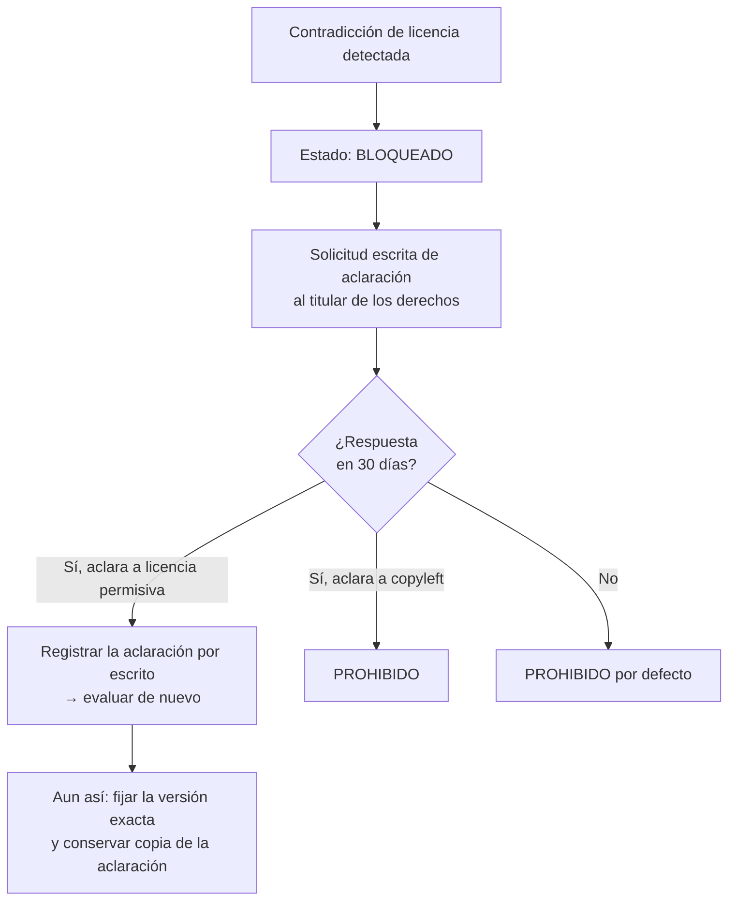
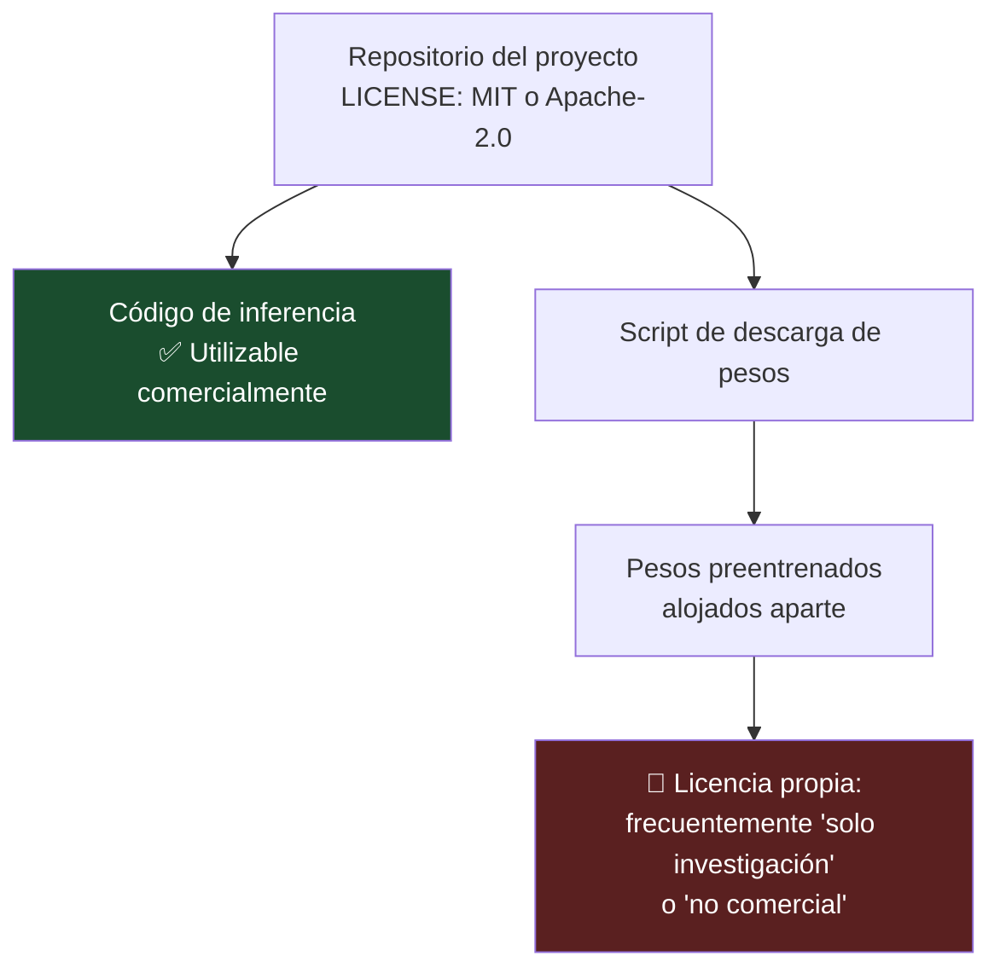

# 15 — Catálogo de proveedores y licencias

| Campo | Valor |
|---|---|
| **Estado** | Aprobado |
| **Versión** | 1.1.0 |
| **Última actualización** | 2026-08-21 |
| **Responsable** | Arquitectura y legal |
| **Audiencia** | Arquitectura, desarrollo, legal |
| **Documentos relacionados** | [00 — Índice](00-indice.md) · [09 — Biometría y liveness](09-biometria-y-liveness.md) · [14 — Modelo de amenazas](14-modelo-de-amenazas.md) · [18 — Desarrollo local](18-desarrollo-local.md) |

**Resumen ejecutivo.** Catálogo de los componentes open source evaluados con su **licencia verificada y su veredicto de aptitud comercial**: cuáles son utilizables, cuáles están prohibidos por copyleft de red o por ausencia de licencia, y cuál está bloqueado por una contradicción entre su archivo de licencia y su README. Fija la política de licencias del proyecto —qué se permite, qué se prohíbe y qué exige revisión legal— y su aplicación técnica en el pipeline. Incluye una advertencia separada y central sobre las **licencias de los pesos de los modelos**, que son independientes de la licencia del código y arrastran restricciones de uso no comercial.

> ⚠️ **Este documento no es asesoramiento jurídico.** Las licencias declaradas se verificaron en agosto de 2026 sobre los repositorios públicos. **Las licencias cambian.** Antes de incorporar cualquier componente, verifique la licencia vigente en el propio repositorio y, ante cualquier duda, escale a revisión legal.

---

## 1. Por qué este documento existe

El producto es un **middleware propietario expuesto por red a terceros**. Esa combinación de tres características determina qué licencias son utilizables y cuáles no:

| Característica del producto | Consecuencia sobre licencias |
|---|---|
| **Propietario** | El copyleft fuerte obliga a liberar el código derivado |
| **Expuesto por red** | El copyleft **de red** (AGPL) se activa aunque no haya distribución de binarios |
| **Ofrecido como servicio a terceros** | Licencias que prohíben ofrecer el software como servicio gestionado quedan excluidas del plano de servicio |

La consecuencia práctica es que un componente técnicamente excelente puede ser **inutilizable** por su licencia, y que ese análisis debe hacerse **antes** de integrar, no después. Una dependencia AGPL descubierta en una auditoría de *due diligence* es un problema que no tiene solución barata.

## 2. Tabla de licencias y aptitud comercial

Verificación de agosto de 2026.

| Componente | Función | **Licencia real** | Aptitud para este producto | Nota crítica |
|---|---|---|---|---|
| `@openeudi/*` | Utilidades EUDI Wallet | **Apache-2.0** | ✅ **Apta** | Relevante para CU-03 |
| `minivision-ai/Silent-Face-Anti-Spoofing` | Antispoofing facial | **Apache-2.0** | ⚠️ **Apta por licencia, NO recomendada por antigüedad** | **Modelo de 2020.** Ver §5 y §3.5 |
| `fbieberly/document_warp` | Rectificación de perspectiva documental | **MIT** | ✅ **Apta como código de referencia** | Ver §3.6 |
| `joellijo32/Document-Scanner-using-OpenCV` | Detección y recorte de documento | **MIT** | ✅ **Apta como código de referencia** | Ver §3.6 |
| `team-idswyft/idswyft-community` | Componentes de eKYC | **MIT** | ✅ **Apta** | Ver §3.7 |
| `fastmrz` | Lectura de MRZ | 🔴 **AGPL-3.0** | ❌ **PROHIBIDA** | **Copyleft de red**: incompatible con un producto propietario expuesto por red |
| `Laligence-Dev/ekyc-system` | Sistema eKYC completo | 🔴 **Sin licencia** | ❌ **PROHIBIDA** | Sin licencia = **todos los derechos reservados**. No hay concesión de uso |
| `YegorCherov/document-scanner` | Escáner documental | 🔴 **Sin licencia** | ❌ **PROHIBIDA** | Ídem |
| `OmniMRZ` | Lectura de MRZ | ⚠️ **Contradicción**: LICENSE dice Apache-2.0, el badge del README dice AGPL-3.0 | ❌ **BLOQUEADA hasta aclaración** | Ver §3.4 |
| Backend de **Ballerine** | Plataforma de KYC/KYB | 🔴 **Elastic License 2.0 por defecto** | ❌ **PROHIBIDA para el plano de servicio** | **Prohíbe ofrecer el software como servicio gestionado a terceros** — que es exactamente el modelo de negocio de este producto |

### 2.1 Resumen

| Veredicto | Componentes |
|---|---|
| ✅ Claramente utilizables | `@openeudi/*`, `fbieberly/document_warp`, `joellijo32/Document-Scanner-using-OpenCV`, `team-idswyft/idswyft-community` |
| ⚠️ Utilizables por licencia, no recomendados por otras razones | `minivision-ai/Silent-Face-Anti-Spoofing` |
| ❌ Prohibidos | `fastmrz`, `Laligence-Dev/ekyc-system`, `YegorCherov/document-scanner`, backend de Ballerine |
| ⏸️ Bloqueados hasta aclaración | `OmniMRZ` |

## 3. Ficha por componente

### 3.1 `@openeudi/*` — utilidades EUDI Wallet

| Campo | Valor |
|---|---|
| **Qué hace** | Utilidades del ecosistema EUDI Wallet |
| **Licencia** | Apache-2.0 |
| **Aptitud** | ✅ Apta |
| **Dónde encaja** | `WalletVerifierPort`, para el rol de *Relying Party* en CU-03 |
| **Cómo se integra** | Como biblioteca dentro del adaptador de verificación de presentaciones. **No** en el núcleo: la forma del puerto la dicta el dominio, no la biblioteca |
| **Riesgos** | Ecosistema en evolución rápida: el ARF v3.0.0 es de julio de 2026 y trajo cambios estructurales. Prever revalidación de la integración ante versiones nuevas del marco. La obligación para el sector privado regulado es del **6 de diciembre de 2027**, así que hay ventana |
| **Alternativa** | Implementación propia de OpenID4VP; el protocolo está especificado y es implementable |

### 3.2 `team-idswyft/idswyft-community`

| Campo | Valor |
|---|---|
| **Qué hace** | Componentes de eKYC de comunidad |
| **Licencia** | MIT |
| **Aptitud** | ✅ Apta |
| **Dónde encaja** | Referencia de diseño y componentes puntuales |
| **Cómo se integra** | Selectivamente, componente a componente, no como plataforma |
| **Riesgos** | Componente de comunidad: verificar mantenimiento activo, cobertura de pruebas y superficie de dependencias antes de depender de él en producción |

### 3.3 Lectura de MRZ: por qué se implementa a mano

Los dos componentes de MRZ evaluados están **descartados**:

| Componente | Problema |
|---|---|
| `fastmrz` | **AGPL-3.0.** Copyleft de red: usarlo en un servicio expuesto por red obligaría a liberar el código del servicio |
| `OmniMRZ` | **Contradicción de licencia**: el archivo LICENSE indica Apache-2.0 y el badge del README indica AGPL-3.0. Ver §3.4 |

**Decisión: `mrz.parse.v1` se implementa a mano.** Es la decisión correcta por tres razones independientes:

1. **Riesgo de licencia eliminado.** No hay dependencia externa que auditar.
2. **El algoritmo está completamente especificado** en ICAO Doc 9303: módulo 10 con pesos 7-3-1, tabla de valores de carácter, y layouts fijos de TD1/TD2/TD3. No hay heurística ni modelo que replicar; es aritmética y desplazamiento de cadenas. La implementación completa cabe holgadamente en un módulo pequeño ([08](08-ia-y-extraccion-semantica.md) §3).
3. **Sin dependencia de nube ni de proveedor.** Es el único componente del sistema con portabilidad perfecta.

Coste: implementar y probar los tres formatos, incluidos los casos límite (dígito compuesto de TD1 con datos opcionales; dígito de número personal `<` en TD3 vacío). Se cubre con los vectores canónicos de la norma.

### 3.4 `OmniMRZ` — el caso de la contradicción

Merece tratamiento separado porque ilustra una regla general.

**Situación:** el archivo `LICENSE` del repositorio declara Apache-2.0; el badge del `README` declara AGPL-3.0.

**Por qué no se resuelve "eligiendo la más favorable":** en una disputa, el titular de los derechos puede argumentar cuál era su intención. Un badge de README es una manifestación de voluntad, aunque no sea el archivo canónico. Un tribunal podría considerar que existe ambigüedad y resolverla contra quien se benefició de ella.

**Procedimiento adoptado ante contradicciones de licencia:**



**Regla general:** ante ambigüedad de licencia, el componente se trata como **la licencia más restrictiva** hasta que exista aclaración escrita del titular.

### 3.5 `minivision-ai/Silent-Face-Anti-Spoofing`

| Campo | Valor |
|---|---|
| **Qué hace** | Antispoofing facial silencioso (liveness pasivo) |
| **Licencia del código** | Apache-2.0 — apta |
| **Aptitud** | ⚠️ **Apta por licencia, no recomendada para producción regulada** |
| **Por qué no se recomienda** | El **modelo es de 2020**. En un dominio donde la generación sintética avanzó de forma radical desde entonces, un modelo de esa antigüedad no es una defensa creíble. Los modelos abiertos de antispoofing son notoriamente débiles frente a ataques de inyección, *deepfakes* y máscaras 3D |
| **Qué le falta frente a un proveedor certificado** | Certificación de conformidad con ISO/IEC 30107-3; APCER por especie de PAI y BPCER reportados; IAPAR extremo a extremo; SDK de captura con integridad; detección de cámara virtual; imagen de referencia auditada; compromiso de mantenimiento |
| **Uso admitido** | Desarrollo local, pruebas y demostraciones. **Nunca** en el adaptador de producción de `LivenessPort` |
| **Dónde encaja** | Adaptador `mock` o `dev` del `LivenessPort`, con una barrera de configuración que impide activarlo en entornos productivos |

> Es exactamente el escenario que motiva la recomendación de [09](09-biometria-y-liveness.md) §7: **usar un proveedor certificado, no modelos abiertos de 2020, para producción regulada**. La arquitectura del `LivenessPort` permite que este componente exista como adaptador de desarrollo sin contaminar la decisión de producción.

### 3.6 `fbieberly/document_warp` y `joellijo32/Document-Scanner-using-OpenCV`

| Campo | Valor |
|---|---|
| **Qué hacen** | Rectificación de perspectiva y detección/recorte de documento en imagen |
| **Licencia** | MIT — apta |
| **Aptitud** | ✅ Apta **como código de referencia** |
| **Dónde encaja** | `capture.quality.v1` (detección de las cuatro esquinas, verificación de recorte completo) y preprocesado antes del OCR |
| **Cómo se integra** | Como **referencia de algoritmo**, no como dependencia. Son ejemplos didácticos: código pequeño, sin garantías de mantenimiento, sin pruebas de robustez frente a la variedad de condiciones de captura reales |
| **Riesgos** | Depender de un repositorio de ejemplo sin mantenimiento es deuda técnica. Copiar la técnica con atribución MIT y probarla contra el conjunto dorado es la vía correcta |
| **Alternativa** | Implementación propia sobre la biblioteca de visión estándar, que es una dependencia de primer nivel con mantenimiento |

### 3.7 Ballerine — la advertencia sobre la Elastic License 2.0

| Campo | Valor |
|---|---|
| **Qué hace** | Plataforma de KYC/KYB con flujos, reglas y UI de revisión |
| **Licencia del backend** | 🔴 **Elastic License 2.0 por defecto** |
| **Aptitud** | ❌ **Prohibida para el plano de servicio** |
| **Por qué** | La Elastic License 2.0 **prohíbe ofrecer el software como servicio gestionado a terceros**. Ese es literalmente el modelo de negocio de este producto: un middleware B2B multi-tenant que otras entidades consumen como servicio |
| **Matiz importante** | La prohibición no es de uso interno. Una entidad podría desplegar Ballerine para su propio KYC. Lo que no puede hacerse es **construir sobre él un servicio para terceros** |
| **Riesgo si se ignora** | Es un riesgo de negocio, no técnico: se materializa en una auditoría de *due diligence*, típicamente en el peor momento (ronda de financiación, adquisición, contrato con banca) |

> **Lección general:** las licencias "source-available" (Elastic License, BSL, SSPL y similares) **no son open source** y suelen estar diseñadas precisamente para impedir el caso de uso de este producto. Su presencia en un repositorio público con aspecto de proyecto abierto es exactamente lo que las hace peligrosas.

### 3.8 Componentes con "sin licencia"

`Laligence-Dev/ekyc-system` y `YegorCherov/document-scanner` **no tienen archivo de licencia**.

**Ausencia de licencia no significa dominio público. Significa todos los derechos reservados.** Sin una concesión expresa, no existe derecho de uso, copia, modificación ni distribución. Que el código esté publicado en un repositorio público **no concede** ninguna licencia más allá de las condiciones de la plataforma de alojamiento (que permiten ver y bifurcar dentro de la plataforma, no usar en un producto).

**Prohibidos sin excepción.** Ni como referencia: leer código sin licencia y reimplementarlo genera un riesgo de obra derivada difícil de defender.

## 4. Política de licencias del proyecto

### 4.1 Clasificación

| Categoría | Licencias | Tratamiento |
|---|---|---|
| ✅ **Permitidas** | **MIT**, **Apache-2.0**, **BSD** (2 y 3 cláusulas), ISC, Python Software Foundation, Zlib, Unlicense, CC0 | Uso directo. Se conservan avisos de copyright y, en Apache-2.0, el archivo `NOTICE` |
| ⚠️ **Requieren revisión legal** | **LGPL** (2.1 y 3.0), **MPL-2.0**, **EPL**, **CDDL**, licencias duales con opción comercial, licencias personalizadas | Caso por caso. Habitualmente aceptables si se usan como biblioteca sin modificar y con enlace dinámico, pero **la decisión no la toma ingeniería** |
| 🔴 **Prohibidas** | **AGPL** (todas las versiones), **GPL** (2 y 3) para código enlazado, **SSPL**, **Elastic License**, **BSL**, **Commons Clause**, cualquier licencia "no comercial", **ausencia de licencia**, licencias contradictorias sin aclaración | Bloquean la construcción |

### 4.2 Justificación de las prohibiciones

| Licencia | Por qué está prohibida aquí |
|---|---|
| **AGPL** | Copyleft **de red**: la sección 13 activa la obligación de ofrecer el código fuente a los usuarios que interactúan con el software **a través de la red**. Un middleware expuesto por red la activa por definición, sin necesidad de distribuir binarios |
| **GPL** (enlazado) | Copyleft fuerte: el código derivado debe liberarse bajo GPL |
| **SSPL** | Exige liberar todo el código de la pila de servicio si se ofrece el software como servicio |
| **Elastic License 2.0 / BSL** | Prohíben ofrecer el software como servicio gestionado a terceros — el modelo de negocio del producto |
| **Commons Clause** | Prohíbe la venta, incluida la venta de servicios cuyo valor derive del software |
| **"No comercial"** | El producto es comercial |
| **Sin licencia** | Todos los derechos reservados: no hay concesión de uso |

### 4.3 Aplicación técnica

| Control | Descripción |
|---|---|
| **Puerta de licencia en CI** | El análisis de composición verifica la licencia de cada dependencia, directa y transitiva, contra la lista de permitidas. Una licencia prohibida **bloquea la construcción**, igual que una vulnerabilidad crítica ([14](14-modelo-de-amenazas.md) §6.3) |
| **Inventario de componentes (SBOM)** | Se genera en cada construcción y se archiva con el artefacto. Es lo que permite responder "¿usamos X?" en minutos en lugar de días |
| **Registro de excepciones** | Toda dependencia de la categoría de revisión legal tiene una entrada con: componente, versión, licencia, quién aprobó, en qué condiciones, y fecha de revisión |
| **Revisión ante cambio de licencia** | Las licencias cambian. El escaneo detecta cambios entre versiones y bloquea la actualización hasta revisar |
| **Fijación de versión con hash** | Evita que una versión nueva con licencia distinta entre silenciosamente |

### 4.4 Cumplimiento de las obligaciones de las licencias permitidas

Usar MIT y Apache-2.0 tampoco es gratis en obligaciones:

| Obligación | Implementación |
|---|---|
| Conservar avisos de copyright y texto de licencia | Archivo `THIRD-PARTY-NOTICES` generado a partir del inventario, distribuido con el producto y accesible desde la documentación |
| `NOTICE` de Apache-2.0 | Se concatena en el archivo de avisos |
| Declaración de modificaciones (Apache-2.0 §4b) | Si se modifica un componente, se declara |
| Sin uso de marcas (Apache-2.0 §6) | El nombre del componente no se usa para promocionar el producto |

## 5. Licencias de pesos de modelos — la advertencia central

> ⚠️ **La licencia del código NO es la licencia de los pesos del modelo. Son artefactos distintos con licencias distintas, y la del repositorio no dice nada sobre la del modelo.**

Es el error de licencias más frecuente y más costoso en proyectos de aprendizaje automático, porque el análisis de composición estándar **no lo detecta**: los pesos no son un paquete, no aparecen en el manifiesto de dependencias, y no tienen metadatos de licencia normalizados.

### 5.1 Casos concretos verificados

Varios conjuntos de pesos de modelos ampliamente usados en reconocimiento facial y análisis forense de imagen **arrastran restricciones de uso no comercial independientes de la licencia del código**. Entre ellos, los conjuntos de pesos preentrenados de las bibliotecas de reconocimiento facial más citadas y de herramientas de detección de manipulación de imagen.

Estructura típica del problema:



El código es utilizable. **Los pesos, no.** Y sin pesos, el código no hace nada.

### 5.2 Procedimiento obligatorio antes de incorporar cualquier modelo

| # | Paso | Detalle |
|---|---|---|
| 1 | **Localizar la licencia de los pesos**, no la del repositorio | Buscar en la tarjeta del modelo, en el conjunto de datos de entrenamiento y en el sitio de descarga |
| 2 | **Verificar la licencia del conjunto de datos de entrenamiento** | Algunos conjuntos de datos faciales tienen restricciones que se propagan a los modelos entrenados sobre ellos. Es el segundo nivel del problema |
| 3 | **Verificar restricciones de uso** | Investigación, no comercial, restricciones de campo de uso, cláusulas de uso ético con obligaciones |
| 4 | **Verificar restricciones de redistribución** | ¿Se pueden hornear los pesos en una imagen de contenedor que se despliega? |
| 5 | **Documentar en el registro de modelos** | Modelo, versión, origen, licencia de pesos, licencia del conjunto de entrenamiento, restricciones, fecha de verificación, quién verificó |
| 6 | **Escalar a revisión legal** si algo no es inequívocamente permisivo | Sin excepciones |

### 5.3 Registro de modelos

Todo modelo en producción tiene una entrada con este formato:

```yaml
modelo: face-embedding-v3
version: "3.1.0"
origen: "<url del artefacto>"
licencia_codigo: "Apache-2.0"
licencia_pesos: "<licencia declarada del artefacto de pesos>"
licencia_dataset_entrenamiento: "<declarada por el autor, o DESCONOCIDA>"
restricciones:
  uso_comercial: <permitido | prohibido | requiere_acuerdo>
  redistribucion: <permitida | prohibida>
  campo_de_uso: "<restricciones declaradas>"
verificado_por: "<persona>"
verificado_en: "2026-08-21"
revision_siguiente: "2027-02-21"
notas: >
  La licencia del repositorio NO es la licencia de los pesos.
  Ambas verificadas por separado.
```

Un modelo con `licencia_pesos: DESCONOCIDA` **no llega a producción**.

### 5.4 Consecuencia estratégica

Esta advertencia es una razón adicional —independiente de las cuatro de [09](09-biometria-y-liveness.md) §7.3— para **usar un proveedor certificado de liveness en lugar de modelos abiertos**: un contrato con un proveedor comercial concede derechos de uso explícitos y verificables, mientras que un conjunto de pesos descargado de un repositorio traslada al integrador toda la carga de verificar una cadena de licencias que a menudo ni siquiera está documentada.

## 6. Criterios de evaluación para proveedores comerciales

Los proveedores SaaS no tienen el problema de licencia, pero tienen otros. Criterios comunes de admisión al catálogo (los específicos de liveness están en [09](09-biometria-y-liveness.md) §8):

| # | Criterio | Umbral |
|---|---|---|
| 1 | Condición de subencargado aceptable | DPA firmable con las obligaciones del art. 28 |
| 2 | Residencia de datos | Procesamiento en la UE para titulares de la UE |
| 3 | Certificaciones | SOC 2 Tipo II o ISO 27001 vigentes |
| 4 | Cobertura declarada | Países y tipos de documento, verificada empíricamente contra el conjunto dorado, no aceptada por catálogo |
| 5 | SLA técnico | Disponibilidad, latencia p95, ventana de mantenimiento |
| 6 | Modelo de integración | API documentada, webhooks firmados con reintentos, entorno de pruebas |
| 7 | **Estabilidad de versiones** | Compromiso de notificación previa ante cambios de modelo, con ventana de revalidación |
| 8 | Notificación de brechas | Plazo compatible con el compromiso de 24 h hacia el responsable |
| 9 | Retención y borrado | Política compatible con [12](12-retencion-y-borrado.md); SLA de borrado documentado |
| 10 | Salida | Portabilidad de datos y procedimiento de terminación |
| 11 | Solvencia | Un proveedor que desaparece es un incidente de continuidad |

El criterio 7 es el que más incidentes causa en producción y el que menos se negocia en la fase comercial.

## 7. Decisiones de "construir o comprar"

| Componente | Decisión | Razón |
|---|---|---|
| Lectura y validación de MRZ | **Construir** | Algoritmo completamente especificado; ambas opciones OSS descartadas por licencia; portabilidad perfecta |
| Calidad de imagen y recorte documental | **Construir** sobre biblioteca de visión estándar | Los ejemplos OSS son referencia, no dependencia |
| OCR | **Comprar** (servicio gestionado) | Paridad razonable entre nubes y precio comparable; construirlo no aporta diferenciación |
| Extracción semántica | **Comprar** (LLM gestionado) + **construir** las plantillas | Las plantillas por país son el activo diferencial y son dato |
| Cotejo facial | **Comprar** en AWS, **construir** el contenedor de inferencia en GCP | Problema resuelto; el riesgo está en la calibración y en la licencia de pesos, no en el algoritmo |
| **Liveness y PAD** | **Comprar a proveedor certificado, en ambas nubes** | Regulatorio, técnico, de alcance y de asimetría ([09](09-biometria-y-liveness.md) §7.3) |
| Revisión humana | **Construir** en ambas nubes | Ambas nubes abandonaron el servicio gestionado; construirlo elimina la asimetría y da mejor trazabilidad regulatoria |
| Orquestación | **Comprar** (servicio gestionado) | Reimplementar reintentos, timeouts y auditoría es trabajo sin diferenciación |
| Motor de composición | **Construir** | **Es el producto** |
| Cifrado de campo | **Comprar** en AWS (biblioteca soportada), **construir** en GCP | No hay equivalente; ver [06](06-criptografia-y-gestion-de-claves.md) §7 |
| Verificación EUDI | **Construir** sobre biblioteca Apache-2.0 | Protocolo especificado; la biblioteca reduce el trabajo, no la responsabilidad |

---

## Referencias

- [`docs/referencias/gcp-paridad-de-servicios.md`](referencias/gcp-paridad-de-servicios.md) — evaluación de alternativas de biometría, incluida la valoración de los modelos abiertos de antispoofing como opción de alto riesgo para producción regulada.
- [`docs/referencias/cumplimiento-normativo-y-estandares.md`](referencias/cumplimiento-normativo-y-estandares.md) — exigencia del GAFI de aseguramiento independiente por tercero, que es lo que un modelo abierto no puede aportar; ICAO Doc 9303 como especificación completa del algoritmo MRZ.
- Verificación de licencias de agosto de 2026 recogida en `CONTEXTO-AGENTES.md` §8 del repositorio.
- [09 — Biometría y liveness](09-biometria-y-liveness.md) · [12 — Retención y borrado](12-retencion-y-borrado.md) · [14 — Modelo de amenazas](14-modelo-de-amenazas.md) · [18 — Desarrollo local](18-desarrollo-local.md)
