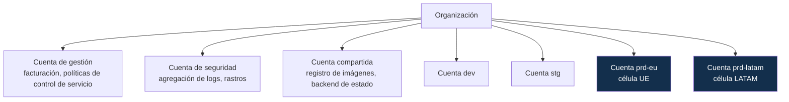
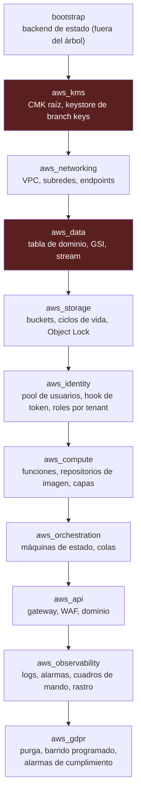
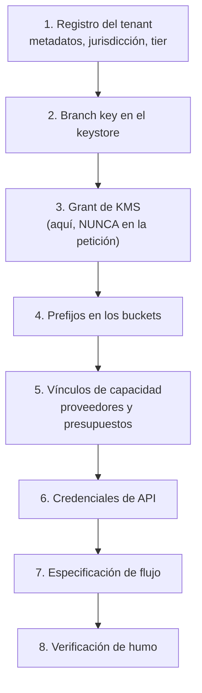

# 16 — Guía de despliegue en AWS

| Campo | Valor |
|---|---|
| **Estado** | Aprobado |
| **Versión** | 1.1.0 |
| **Última actualización** | 2026-08-21 |
| **Responsable** | SRE |
| **Audiencia** | SRE, ingeniería de plataforma, operador de la primera instalación |
| **Documentos relacionados** | [00 — Índice](00-indice.md) · [10 — Multinube](10-multicloud-aws-gcp.md) · [17 — Despliegue GCP](17-guia-de-despliegue-gcp.md) · [18 — Desarrollo local](18-desarrollo-local.md) |

**Resumen ejecutivo.** Procedimiento lineal y verificable para llevar el sistema a producción en AWS: prerrequisitos, topología de cuentas y separación de entornos, bootstrap del backend de Terraform, orden de aplicación de módulos con sus decisiones irreversibles señaladas, alta de un tenant nuevo, construcción y publicación de imágenes, carga de la primera especificación de flujo, prueba de humo de extremo a extremo y lista de verificación de producción. Cada paso indica el comando exacto, el resultado esperado y el diagnóstico del error más frecuente.

> **Cómo leer esta guía.** Es un procedimiento lineal. Los bloques marcados `> **Decisión requerida:**` son puntos donde el operador debe elegir y la elección tiene consecuencias difíciles de revertir. **No los saltee.** Los comandos asumen `bash` y la CLI de AWS versión 2.
>
> La disposición real del IaC es `infra/terraform/envs/{dev,stg,prd}` con módulos en `infra/terraform/modules/aws/*`. Los `README.md` de cada módulo son la fuente autoritativa de sus variables y salidas; esta guía describe el **procedimiento**, no la interfaz de los módulos.

---

## 1. Prerrequisitos

### 1.1 Herramientas

| Herramienta | Versión mínima | Verificación |
|---|---|---|
| Terraform u OpenTofu | 1.6 | `terraform version` / `tofu version` |
| CLI de AWS | 2.15 | `aws --version` |
| Docker | 24 | `docker --version` |
| Python | 3.14 (3.11 en adelante admisible) | `python3 --version` |
| `jq` | 1.6 | `jq --version` |
| `git` | 2.40 | `git --version` |

```bash
# Verificación rápida de todo el conjunto
for c in "terraform version" "aws --version" "docker --version" "python3 --version" "jq --version"; do
  printf '%-22s ' "$c"; $c 2>&1 | head -1
done
```

### 1.2 Conocimiento previo

Esta guía asume familiaridad con IAM, VPC y Terraform. No explica esos conceptos. Si el equipo no los domina, la instalación no debe hacerse desde esta guía.

### 1.3 Lecturas obligatorias antes de empezar

| Documento | Por qué |
|---|---|
| [05 — Multitenancy](05-multitenancy-y-aislamiento.md) | El esquema de claves **no es retrofit-able** |
| [06 — Criptografía](06-criptografia-y-gestion-de-claves.md) §6 | La longitud de beacon es **irreversible** |
| [11 — Cumplimiento normativo](11-cumplimiento-normativo.md) §2 | La región determina la jurisdicción |
| [12 — Retención y borrado](12-retencion-y-borrado.md) §7 | La política de retención la fija el cliente |

## 2. Cuentas y separación de entornos

### 2.1 Topología de cuentas



> **Decisión requerida:** ¿una cuenta por entorno o una cuenta con separación por etiquetas?
>
> **Recomendación firme: una cuenta por entorno, y cuentas separadas por dominio de residencia de datos.** Motivos:
> - **La cuota compartida de operaciones criptográficas de KMS es por cuenta y región.** Compartir cuenta entre producción y preproducción significa que una prueba de carga puede agotar la cuota de producción.
> - La residencia de datos se demuestra mejor con una frontera de cuenta que con una convención de etiquetas.
> - El aislamiento de radio de impacto de un error de IAM es total entre cuentas.
>
> **Si elige cuenta única**, documente por qué, aplique políticas de control de servicio que impidan crear recursos fuera de la región permitida, y acepte que la cuota de KMS es compartida.

### 2.2 Nomenclatura y etiquetas

| Elemento | Convención |
|---|---|
| Recursos | `og-{env}-{componente}` — p. ej. `og-prd-core`, `og-prd-artifacts` |
| Entornos | `dev`, `stg`, `prd` (los tres directorios de `infra/terraform/envs/`) |
| Etiquetas obligatorias | `project=onboarding-generico`, `env`, `owner`, `data-classification`, `cost-center` |

Las etiquetas obligatorias se aplican por defecto con `default_tags` en el proveedor y se **exigen** con una política de control de servicio que deniega la creación de recursos sin ellas.

### 2.3 Creación de perfiles

```bash
aws configure --profile og-prd-eu
# region: eu-west-1
# output: json

aws sts get-caller-identity --profile og-prd-eu
```

> **Decisión requerida:** ¿qué región para cada célula?
>
> Consecuencias de la elección:
> - **La región determina la jurisdicción de los datos.** Titulares de la UE → región de la UE. Ningún país LATAM del alcance tiene decisión de adecuación de la Comisión Europea.
> - **La cuota compartida de operaciones criptográficas de KMS depende de la región:** 100.000 req/s en us-east-1, us-west-2 y eu-west-1; 20.000 en us-east-2, ap-southeast-1/2, ap-northeast-1, eu-central-1 y eu-west-2; 10.000 en el resto. Si prevé volumen alto, esta diferencia es material.
> - La disponibilidad de servicios y modelos varía por región.
>
> **Recomendación:** `eu-west-1` para la célula UE y `us-east-1` para la célula LATAM, salvo que un requisito de residencia específico exija otra cosa.

## 3. Bootstrap del backend de Terraform

El estado de Terraform contiene identificadores de recursos y, potencialmente, valores sensibles. Se aloja fuera del entorno que gestiona.

> **El bucket de estado se aprovisiona FUERA del árbol de Terraform del entorno**, porque no puede depender de sí mismo. En producción vive además en **una cuenta distinta** de la del entorno, para que un incidente en `prd` no comprometa también su estado.

```bash
export OG_ENV=prd
export OG_REGION=eu-west-1
export OG_PROFILE=og-shared
export OG_STATE_BUCKET="og-${OG_ENV}-tfstate-$(aws sts get-caller-identity --profile "$OG_PROFILE" --query Account --output text)"

# 1. Bucket de estado, con versionado y cifrado
aws s3api create-bucket \
  --bucket "$OG_STATE_BUCKET" \
  --region "$OG_REGION" \
  --create-bucket-configuration LocationConstraint="$OG_REGION" \
  --profile "$OG_PROFILE"

aws s3api put-bucket-versioning \
  --bucket "$OG_STATE_BUCKET" \
  --versioning-configuration Status=Enabled \
  --profile "$OG_PROFILE"

aws s3api put-bucket-encryption \
  --bucket "$OG_STATE_BUCKET" \
  --server-side-encryption-configuration \
    '{"Rules":[{"ApplyServerSideEncryptionByDefault":{"SSEAlgorithm":"aws:kms"},"BucketKeyEnabled":true}]}' \
  --profile "$OG_PROFILE"

aws s3api put-public-access-block \
  --bucket "$OG_STATE_BUCKET" \
  --public-access-block-configuration \
    "BlockPublicAcls=true,IgnorePublicAcls=true,BlockPublicPolicy=true,RestrictPublicBuckets=true" \
  --profile "$OG_PROFILE"

# 2. (Opcional) Tabla de bloqueo clásica. Ver la decisión de abajo.
aws dynamodb create-table \
  --table-name "og-${OG_ENV}-tflock" \
  --attribute-definitions AttributeName=LockID,AttributeType=S \
  --key-schema AttributeName=LockID,KeyType=HASH \
  --billing-mode PAY_PER_REQUEST \
  --region "$OG_REGION" \
  --profile "$OG_PROFILE"
```

> **Decisión requerida: ¿bloqueo nativo del bucket o tabla de bloqueo?**
>
> El bloqueo por tabla sigue funcionando, pero desde la versión 5 del proveedor de AWS se prefiere `use_lockfile`, que usa el propio bucket y **evita mantener una tabla adicional**. `backend.tf.example` documenta ambos. **Recomendación: `use_lockfile`**, y omitir el paso 2.

Configuración del backend:

```bash
cd infra/terraform/envs/prd
cp backend.tf.example backend.tf
# Sustituya los marcadores REEMPLAZAR- por los valores reales
terraform init
```

```hcl
# infra/terraform/envs/prd/backend.tf — extracto
terraform {
  backend "s3" {
    bucket       = "og-prd-tfstate-111122223333"
    key          = "onboarding-generico/prd/terraform.tfstate"
    region       = "eu-west-1"
    encrypt      = true
    kms_key_id   = "arn:aws:kms:eu-west-1:111122223333:key/…"
    use_lockfile = true
  }
}
```

También hay que preparar las variables del entorno:

```bash
cp terraform.tfvars.example terraform.tfvars
# Revise cada valor. Los marcados como irreversibles se tratan en §4.2 y §4.3.
```

> ⚠️ **Un mismo directorio de Terraform tiene un solo backend**, aunque despliegue en dos nubes. Use el bloque de S3 **o** el de almacenamiento de GCP, nunca ambos.

**Solución de problemas:**

| Síntoma | Causa | Solución |
|---|---|---|
| `BucketAlreadyExists` | El nombre de bucket es global | El sufijo con el identificador de cuenta ya lo evita; verifique que la variable se expandió |
| `IllegalLocationConstraintException` | `us-east-1` no admite `LocationConstraint` | Omita `--create-bucket-configuration` para `us-east-1` |
| `Error acquiring the state lock` | Ejecución anterior interrumpida | `terraform force-unlock <ID>` **solo** tras confirmar que no hay otra ejecución activa |

## 4. Orden de aplicación de módulos

El orden **importa**: hay dependencias que Terraform no puede inferir entre estados separados, y hay decisiones irreversibles que deben tomarse temprano.



Los dos módulos marcados contienen las decisiones irreversibles, y por eso `aws_kms` va **primero**: la CMK raíz y las longitudes de índice deben existir y estar bien antes de que se escriba el primer registro.

`aws_gdpr` merece una nota: adjunta al rol de la función de purga **los únicos permisos de borrado de todo el sistema**, y añade tres alarmas de cumplimiento (cola de fallos no vacía, errores de la función, y retraso del consumo del stream). Es el módulo que materializa [12 — Retención y borrado](12-retencion-y-borrado.md).

### 4.1 `aws_networking`

```bash
cd infra/terraform/envs/prd
terraform apply -target=module.aws_kms          # primero: contiene decisiones irreversibles (§4.2)
terraform apply -target=module.aws_networking
```

> **Decisión requerida:** ¿VPC privada con endpoints, o funciones sin VPC?
>
> | Opción | A favor | En contra |
> |---|---|---|
> | **Sin VPC** | Sin arranque en frío adicional; sin coste de endpoints; más simple | El tráfico hacia servicios de AWS sale por la red pública de AWS (cifrado, pero sin perímetro privado) |
> | **Con VPC y endpoints** | Perímetro privado demostrable ante auditoría; control de egreso hacia proveedores | Coste de los endpoints de interfaz; NAT para el egreso a internet; más piezas |
>
> **Recomendación:** con VPC y endpoints para producción. La capacidad de demostrar que el tráfico hacia el almacén de datos y hacia KMS no atraviesa internet es un argumento de auditoría que se pide con frecuencia. Para `dev`, sin VPC.

Endpoints necesarios si elige VPC: gateway para el almacén de objetos y para el almacén de dominio; interfaz para KMS, gestor de secretos, registro de imágenes (API y Docker), logs y el orquestador.

### 4.2 `aws_kms` — decisiones irreversibles

```bash
terraform apply -target=module.aws_kms
```

Crea la CMK raíz de la jurisdicción, la tabla de keystore de branch keys, y las políticas de clave.

> **Decisión requerida (1/3): ¿rotación automática de la CMK raíz?**
>
> **Sí, siempre.** `enable_key_rotation = true`. La rotación es anual (365 días), el material antiguo se retiene para descifrar el histórico, y el sobrecoste es del orden de 1 USD al mes por clave. No hay argumento en contra.

> **Decisión requerida (2/3): ¿ventana de espera para la destrucción de claves?**
>
> El rango es de **7 a 30 días**, con mínimo de 7. Consecuencias:
> - Una ventana **corta (7 días)** acelera el crypto-shredding, y deja menos margen para revertir una destrucción errónea.
> - Una ventana **larga (30 días)** es más segura operativamente y alarga el plazo de borrado comprometible.
>
> **Recomendación: 7 días para las branch keys de tenant y 30 días para la CMK raíz.** La destrucción de una branch key es una operación prevista (fin de contrato); la de una CMK raíz sería catastrófica y merece el máximo margen.
>
> Ver [12](12-retencion-y-borrado.md) §6.5 sobre el plazo comprometido de 35 días.

> **Decisión requerida (3/3) — LA MÁS IMPORTANTE: longitudes de beacon.**
>
> 🔴 **Esta decisión es IRREVERSIBLE.** La longitud del beacon se mide **en bits** y **no puede cambiarse después de escribir registros**. Los beacons solo se calculan para registros nuevos: no hay migración barata.
>
> Antes de aplicar este módulo:
> 1. Estime la población de valores únicos **por tenant grande**, no global, para cada campo indexable.
> 2. Aplique `2 ≤ colisiones < √(Población)` con `colisiones = Población × 2^(−longitud)`; la regla simple es `b = log₂(p) − 1`.
> 3. Recuerde el mínimo de **16 valores únicos** de población.
> 4. **No indexe campos de baja cardinalidad y alta sensibilidad** (nacionalidad, condición de PEP, nivel de riesgo): el beacon filtra la distribución.
> 5. Registre la decisión en un ADR.
>
> Valores propuestos por defecto (ver [06](06-criptografia-y-gestion-de-claves.md) §6.3): `correo_normalizado` 19 bits, `numero_documento_normalizado` 19 bits, `telefono_normalizado` 16 bits, `referencia_externa` 19 bits.
>
> **Y todo beacon debe llevar el `tenant_id` como primera parte de su campo virtual**, o el índice queda fuera del perímetro IAM.

```hcl
# infra/terraform/envs/prd/terraform.tfvars — extracto
beacon_lengths = {
  correo_normalizado           = 19
  numero_documento_normalizado = 19
  telefono_normalizado         = 16
  referencia_externa           = 19
}
kms_root_deletion_window_days   = 30
kms_branch_deletion_window_days = 7
```

### 4.3 `aws_data` y `aws_storage` — la otra decisión irreversible

```bash
terraform apply -target=module.aws_data -target=module.aws_storage
```

> **Decisión requerida: esquema de claves.**
>
> 🔴 **`dynamodb:LeadingKeys` no es retrofit-able sin migración de datos.** Toda partition key debe empezar por `TENANT#<tenant_id>` **desde el primer registro**.
>
> Y: **todo GSI debe llevar el tenant en su partition key.** `LeadingKeys` protege la tabla base y los índices locales, pero **no los globales**. Un GSI sin tenant en su clave queda fuera del perímetro IAM.
>
> El módulo crea la tabla con el esquema de [03](03-modelo-de-dominio.md) §4. **No lo modifique** sin releer ese documento entero.

Verificación tras aplicar:

```bash
aws dynamodb describe-table --table-name "og-${OG_ENV}-core" \
  --profile "$OG_PROFILE" --region "$OG_REGION" \
  | jq '{
      pk: .Table.KeySchema,
      gsis: [.Table.GlobalSecondaryIndexes[]? | {name: .IndexName, keys: .KeySchema}],
      billing: .Table.BillingModeSummary.BillingMode,
      pitr: .Table.TableStatus
    }'
```

**Compruebe que las cuatro claves de partición de los GSI empiezan por `TENANT#`.** Si alguna no lo hace, deténgase aquí.

> **Decisión requerida: ¿modo de capacidad bajo demanda o aprovisionada?**
>
> **Recomendación: bajo demanda.** El tráfico de onboarding es irregular por naturaleza (campañas, horarios, estacionalidad) y el coste de aprovisionar para el pico supera al de pagar por uso. Reevalúe cuando el volumen sea estable y predecible.

El módulo `aws_storage` crea los buckets:

| Bucket | Propósito | Configuración crítica |
|---|---|---|
| `og-{env}-artifacts` | Documentos, selfies, frames | Versionado, cifrado con la CMK, sin acceso público, ciclo de vida por clase de dato |
| `og-{env}-evidence` | Evidencias selladas | Ídem + **Object Lock en modo de cumplimiento** |
| `og-{env}-audit` | Log de decisiones WORM | Ídem + Object Lock |

> **Decisión requerida: ¿Object Lock en modo de gobernanza o de cumplimiento?**
>
> - **Gobernanza:** un principal con permiso especial puede eliminar la retención. Útil si se equivoca en la configuración.
> - **Cumplimiento:** **nadie**, ni la cuenta raíz, puede eliminar el objeto antes del plazo.
>
> **Recomendación: cumplimiento en producción, gobernanza en preproducción.** El modo de cumplimiento es lo que sostiene la afirmación de inmutabilidad ante un auditor. Y es irreversible por objeto: pruebe primero en preproducción.

### 4.4 `aws_identity`

```bash
terraform apply -target=module.aws_identity
```

Crea el pool de usuarios, el hook de generación de token y los roles con alcance de tenant.

> **Decisión requerida: ¿un pool de usuarios compartido o uno por tenant?**
>
> | Opción | Cuándo |
> |---|---|
> | **Pool compartido** con `tenant_id` en los claims | Caso general. Más simple, escala sin límite práctico |
> | **Pool por tenant** | Cuando el tenant exige su propio proveedor de identidad federado con configuración específica |
>
> **Recomendación: pool compartido**, con federación por tenant cuando haga falta. El aislamiento no depende del pool sino de los claims y de la política ABAC.

Verificación crítica del comportamiento **fail-closed**:

```bash
# Debe FALLAR: un principal sin tenant asignado no debe obtener token
aws cognito-idp admin-initiate-auth \
  --user-pool-id "$OG_USER_POOL_ID" \
  --client-id "$OG_CLIENT_ID" \
  --auth-flow ADMIN_USER_PASSWORD_AUTH \
  --auth-parameters USERNAME=usuario-sin-tenant,PASSWORD='...' \
  --profile "$OG_PROFILE" 2>&1 | grep -q "error" \
  && echo "OK: fail-closed correcto" \
  || echo "FALLO CRITICO: se emitio token sin tenant"
```

Si esa verificación no pasa, **no continúe**. Un token sin tenant es una credencial de acceso potencialmente universal.

### 4.5 `aws_compute`

```bash
terraform apply -target=module.aws_compute
```

> **Decisión requerida: dimensionado de memoria de las funciones.**
>
> El rango real es de **128 MB a 10.240 MB** en incrementos de 1 MB, y la vCPU se asigna proporcionalmente a la memoria.
>
> ⚠️ **No aplique el límite de 3.008 MB ni ningún requisito ligado a AVX-512.** Ese límite fue el máximo histórico hasta diciembre de 2020 y **no existe ningún requisito de memoria vinculado a AVX-512**: la documentación cubre AVX2 (vectores de 256 bits) y `arm64` usa NEON. Capar a 3.008 MB deja rendimiento y CPU sobre la mesa. Ver [20](20-fe-de-erratas-del-spec-original.md) §4.
>
> **Dimensione por perfil de rendimiento medido**, no por límites inexistentes. Punto de partida:
>
> | Función | Memoria inicial | Nota |
> |---|---|---|
> | `api-service` | 1.024 MB | Latencia sensible |
> | `step-worker-ocr` | 1.024 MB | Espera de red |
> | `step-worker-extraction` | 1.024 MB | Espera de red |
> | `step-worker-facematch` | 3.008–10.240 MB | **Mida**: es el único que se beneficia de CPU alta |
> | `step-worker-mrz` | 256 MB | Cómputo trivial |
> | `purge-worker` | 512 MB | Lote |
> | `token-hook` | 256 MB | En la ruta crítica de autenticación |

> **Decisión requerida: ¿concurrencia aprovisionada?**
>
> Reduce el arranque en frío en la ruta síncrona a costa de un pago fijo. **Recomendación: sí para `api-service` y `token-hook`** en producción, dimensionada al p50 de concurrencia. Para el resto, no.

### 4.6 `aws_orchestration`, `aws_api`, `aws_observability` y `aws_gdpr`

```bash
terraform apply   # ya sin -target: el resto en un solo plan
```

> **Decisión requerida: ¿Standard puro o el patrón anidado Standard + Express?**
>
> **Recomendación: anidado.** El flujo necesita esperas largas y exactly-once sobre acciones no idempotentes, lo que exige Standard en el padre; los pasos automatizados de alto volumen son idempotentes y caben en los 5 minutos de Express.
>
> El ahorro **depende del flujo concreto**: en el ejemplo de referencia, Standard puro con 17 transiciones cuesta 0,42 USD por 1.000 ejecuciones, Express puro 0,01 USD (98 %), y el anidado con padre de 8 transiciones 0,20 USD (**~52 %**). Arrancar un workflow anidado no tiene coste adicional. Calcule con las transiciones reales de su flujo; **no use la cifra de 72,5 % del spec original, que no está respaldada** ([20](20-fe-de-erratas-del-spec-original.md) §2).

Habilitación de auditoría del plano de datos, que **no está activa por defecto**:

```bash
# Eventos de datos de CloudTrail para el almacén de objetos y el de dominio
aws cloudtrail put-event-selectors \
  --trail-name "og-${OG_ENV}-trail" \
  --advanced-event-selectors '[
    {"Name":"DatosDeTenant","FieldSelectors":[
      {"Field":"eventCategory","Equals":["Data"]},
      {"Field":"resources.type","Equals":["AWS::S3::Object","AWS::DynamoDB::Table"]}
    ]}
  ]' \
  --profile "$OG_PROFILE" --region "$OG_REGION"
```

Sin esto **no hay traza de quién leyó datos de qué tenant**, que es un fallo de cumplimiento silencioso.

## 5. Creación del primer tenant

El aprovisionamiento de un tenant es un procedimiento, no un `INSERT`.



```bash
export OG_TENANT=acme

# 1–5: el script de aprovisionamiento ejecuta los pasos en orden y es idempotente
./scripts/provision_tenant.sh \
  --env "$OG_ENV" \
  --profile "$OG_PROFILE" \
  --tenant "$OG_TENANT" \
  --jurisdiction EU \
  --tier REGULADO \
  --retention-policy config/retention/eu-default.yaml
```

> **Decisión requerida: tier de aislamiento del tenant.**
>
> | Tier | Recursos | Cuándo |
> |---|---|---|
> | `STANDARD` | Pool completo, branch key propia | Caso general |
> | `REGULADO` | Pool + branch key + CMK raíz de su jurisdicción | Entidad supervisada |
> | `DEDICADO` | Tabla propia, bucket propio, **CMK propia**, cómputo con concurrencia reservada | El cliente exige segregación demostrable o poder revocar el acceso del operador |
>
> **El tier no se cambia en caliente:** pasar de pool a silo exige migración de datos. Decídalo en el alta.

> **Decisión requerida: política de retención del tenant.**
>
> 🔴 **Esta política la fija el cliente (responsable del tratamiento), no usted.** Seleccionarla unilateralmente es decidir sobre medios esenciales del tratamiento, con riesgo de reclasificación a corresponsable.
>
> Obtenga por escrito, antes de aprovisionar:
> - Plazo de retención del expediente KYC (dentro del rango legal de su jurisdicción).
> - Si conserva plantilla biométrica y por cuánto (**por defecto: no**).
> - Si conserva el vídeo completo de la sesión de liveness.
> - El techo absoluto ante ausencia de notificación de fin de relación.
>
> El validador **rechaza** políticas fuera del rango legal ([12](12-retencion-y-borrado.md) §7.2).

Verificación del grant de KMS:

```bash
aws kms list-grants --key-id "$OG_TENANT_CMK_ARN" --profile "$OG_PROFILE" \
  | jq --arg t "$OG_TENANT" '.Grants[] | select(.Constraints.EncryptionContextEquals.tenant == $t)'
```

> ⚠️ **`CreateGrant` está limitado a 50 req/s**, cuota independiente de la de operaciones criptográficas. Los grants se crean **aquí**, en el aprovisionamiento, **nunca en el flujo de una petición**. Si ve errores de límite de tasa de `CreateGrant` en producción, es un defecto de código, no un problema de capacidad.

### 5.1 Identidad del tenant: grupo y cliente de aplicación

El paso 6 del diagrama crea la identidad con la que el requirente llamará a la API. La pieza que hace funcionar toda la cadena de [05 §3](05-multitenancy-y-aislamiento.md) es que el **grupo lleve el rol tenant-scoped asociado** y que el *hook* de pre-generación de token resuelva el tenant a partir de él.

```bash
# 1. Grupo del tenant en el pool de usuarios, con su rol asociado
aws cognito-idp create-group \
  --user-pool-id "$OG_USER_POOL_ID" \
  --group-name "tenant-$OG_TENANT" \
  --role-arn "$OG_TENANT_ROLE_ARN" \
  --precedence 10 \
  --profile "$OG_PROFILE"

# 2. Cliente de aplicación con client_credentials para el requirente
aws cognito-idp create-user-pool-client \
  --user-pool-id "$OG_USER_POOL_ID" \
  --client-name "og-$OG_ENV-$OG_TENANT" \
  --generate-secret \
  --allowed-o-auth-flows client_credentials \
  --allowed-o-auth-scopes "onboarding/sessions.write" "onboarding/sessions.read" \
  --allowed-o-auth-flows-user-pool-client \
  --profile "$OG_PROFILE"

# 3. Verificación: el token emitido DEBE llevar el claim de tenant
./scripts/verify_tenant_token.sh --tenant "$OG_TENANT" --env "$OG_ENV"
```

**Resultado esperado del paso 3:**

```
[OK] token emitido
[OK] claim tenant_id = acme
[OK] principal_tags.TenantID = acme
[OK] credenciales asumidas con aws:PrincipalTag/TenantID = acme
```

| Error frecuente | Causa | Qué hacer |
|---|---|---|
| El token se emite **sin** `tenant_id` | El *hook* de pre-generación no está asociado al pool, o resolvió `None` y devolvió el evento sin modificar | El *hook* debe **fallar cerrado**: si no hay tenant, no se emite token ([05 §3.1](05-multitenancy-y-aislamiento.md)). Un token sin `tenant_id` es una credencial universal en manos del primer componente que olvide comprobarlo |
| `AccessDenied` al asumir el rol | Falta `sts:TagSession` en la *trust policy* del rol | Ver la *trust policy* de [05 §3.2](05-multitenancy-y-aislamiento.md). Sin ella, las etiquetas no viajan y **la política ABAC no se aplica** |
| El token lleva el claim pero las operaciones fallan | Se está usando el token contra el plano de datos sin asumir el rol | El `TenantContext` se construye del token, pero las credenciales del plano de datos vienen de la asunción de rol |

### 5.2 Registro del tenant en el Registro de Capacidades

El paso 5 vincula qué capacidades puede usar el tenant y con qué proveedor. Es lo que después valida el compilador al publicar una especificación ([04 §6.1](04-motor-de-composicion.md)): una especificación que use una capacidad no vinculada **se rechaza en la publicación**, no en ejecución.

```bash
# Vínculos de capacidad del tenant, con proveedor primario y fallback
./scripts/bind_capabilities.sh \
  --env "$OG_ENV" --profile "$OG_PROFILE" --tenant "$OG_TENANT" \
  --file "config/tenants/$OG_TENANT/capabilities.yaml"

# Verificación: qué puede ejecutar realmente este tenant
aws dynamodb query \
  --table-name "og-$OG_ENV-core" \
  --key-condition-expression "PK = :pk AND begins_with(SK, :sk)" \
  --expression-attribute-values '{":pk":{"S":"TENANT#'"$OG_TENANT"'"},":sk":{"S":"CAP#"}}' \
  --profile "$OG_PROFILE" | jq -r '.Items[] | "\(.SK.S)  ->  \(.proveedor_primario.S)"'
```

**Resultado esperado:** una línea por capacidad vinculada, con su proveedor. Si aparece una capacidad en estado `planificada` ([04 §3.2](04-motor-de-composicion.md)), el vínculo es un error de configuración: el validador rechazará cualquier especificación que la use.

| Error frecuente | Causa | Qué hacer |
|---|---|---|
| `ValidationException` en la consulta | Se está consultando con credenciales tenant-scoped de **otro** tenant | Es el comportamiento correcto: `LeadingKeys` está haciendo su trabajo. Use el perfil de administración para inspeccionar |
| El vínculo se crea pero la especificación se rechaza | Rango de versión de la capacidad incompatible con el vinculado | Compare el rango de la especificación con la versión resuelta ([04 §3.3](04-motor-de-composicion.md)) |

## 6. Construcción y publicación de imágenes

```bash
export OG_ACCOUNT=$(aws sts get-caller-identity --profile "$OG_PROFILE" --query Account --output text)
export OG_ECR="${OG_ACCOUNT}.dkr.ecr.${OG_REGION}.amazonaws.com"

# 1. Autenticación (el token dura 12 h)
aws ecr get-login-password --region "$OG_REGION" --profile "$OG_PROFILE" \
  | docker login --username AWS --password-stdin "$OG_ECR"

# 2. Construcción, etiquetada por commit — nunca por 'latest'
export OG_TAG=$(git rev-parse --short HEAD)
docker build -f deploy/aws/Dockerfile.worker \
  --build-arg PY_VERSION=3.14 \
  -t "${OG_ECR}/og-${OG_ENV}-worker:${OG_TAG}" .

# 3. Publicación
docker push "${OG_ECR}/og-${OG_ENV}-worker:${OG_TAG}"

# 4. Escaneo — bloquear si hay crítico
aws ecr describe-image-scan-findings \
  --repository-name "og-${OG_ENV}-worker" \
  --image-id imageTag="$OG_TAG" \
  --profile "$OG_PROFILE" --region "$OG_REGION" \
  | jq '.imageScanFindings.findingSeverityCounts'

# 5. Actualización de la función
aws lambda update-function-code \
  --function-name "og-${OG_ENV}-step-worker-facematch" \
  --image-uri "${OG_ECR}/og-${OG_ENV}-worker:${OG_TAG}" \
  --profile "$OG_PROFILE" --region "$OG_REGION"
```

> **Decisión requerida: ¿imagen de contenedor o paquete comprimido?**
>
> | Opción | Límite | Cuándo |
> |---|---|---|
> | **Paquete** | 50 MB comprimido, **250 MB descomprimido** incluidas capas | Funciones ligeras: API, MRZ, purga |
> | **Imagen de contenedor** | **10 GB descomprimida** | Adaptadores con modelos o dependencias de visión |
>
> **Recomendación: mixta.** El adaptador de cotejo facial va en imagen; el resto, en paquete. Mezclar es más operación, pero el arranque en frío del paquete es mejor.

**Nunca `latest`.** Etiquete por commit. Una etiqueta móvil hace irreconstruible qué código produjo un veredicto, lo que rompe la trazabilidad regulatoria.

## 7. Carga de la primera especificación de flujo

```bash
# 1. Validar antes de publicar (no crea nada)
curl -sS -X POST "https://${OG_API_HOST}/v1/flows:validate" \
  -H "Authorization: Bearer ${OG_ADMIN_TOKEN}" \
  -H "Content-Type: application/yaml" \
  --data-binary @config/flows/acme-eu-passport-ial2.yaml | jq .

# Respuesta esperada:
# { "valid": true, "resolved_capabilities": [...], "warnings": [] }

# 2. Publicar
curl -sS -X POST "https://${OG_API_HOST}/v1/flows" \
  -H "Authorization: Bearer ${OG_ADMIN_TOKEN}" \
  -H "Content-Type: application/yaml" \
  --data-binary @config/flows/acme-eu-passport-ial2.yaml | jq .

# 3. Verificar la resolución
curl -sS "https://${OG_API_HOST}/v1/flows:resolve?country=ES&document=PASAPORTE&tier=IAL2" \
  -H "Authorization: Bearer ${OG_TENANT_TOKEN}" | jq '{clave, version, hash_contenido}'
```

**Errores frecuentes de validación:**

| Error | Causa | Solución |
|---|---|---|
| `CapabilityNotFound` | La capacidad o el rango de versión no resuelve | `GET /v1/capabilities` para ver las disponibles |
| `CapabilityNotProvisioned` | El tenant no tiene proveedor configurado para esa capacidad | Complete el paso 5 del aprovisionamiento |
| `CapabilityNotApplicable` | El proveedor no cubre el país o documento | Revise la aplicabilidad; recuerde que los procesadores de identidad gestionados cubren esencialmente EE. UU. |
| `CyclicDependency` | El grafo tiene un ciclo | Revise las dependencias |
| `ContractMismatch` | Una referencia apunta a un campo que la capacidad origen no produce | Revise el esquema de salida |
| `IncompletePolicy` | La política de veredicto no cubre alguna combinación | Añada regla o `por_defecto` |
| `ComplianceViolation: BO requires SEÑALES_SOLAMENTE` | `emisor_del_veredicto: MIDDLEWARE` con Bolivia en el alcance | Es correcto que falle: el art. 32(II) del Instructivo UIF prohíbe delegar la DDC |

> **Decisión requerida: ¿despliegue directo o canario?**
>
> **Recomendación: canario para toda especificación que afecte a tráfico existente.** Publique al 5 %, observe durante 24 h las métricas de reversión ([04](04-motor-de-composicion.md) §8.2), y promueva. Una desviación de la tasa de rechazo **en cualquier dirección** superior al 20 % es motivo de reversión: una caída brusca puede significar que un paso está devolviendo éxito por defecto.

## 8. Verificación de humo

```bash
export OG_API="https://${OG_API_HOST}"
export OG_TOKEN="${OG_TENANT_TOKEN}"

# 1. Salud (sin autenticación)
curl -sS "${OG_API}/health" | jq .
# {"status":"ok","version":"1.0.0","cell":"prd-eu"}

# 2. Fail-closed: sin token debe dar 401
curl -sS -o /dev/null -w '%{http_code}\n' "${OG_API}/v1/sessions"
# 401

# 3. Crear sesión
SESSION=$(curl -sS -X POST "${OG_API}/v1/sessions" \
  -H "Authorization: Bearer ${OG_TOKEN}" \
  -H "Content-Type: application/json" \
  -H "Idempotency-Key: $(uuidgen)" \
  -d '{
        "country": "ES",
        "document_type": "PASAPORTE",
        "tier": "IAL2",
        "external_ref": "smoke-001"
      }')
echo "$SESSION" | jq .
SESSION_ID=$(echo "$SESSION" | jq -r .session_id)

# 4. Idempotencia: la misma clave debe devolver la MISMA sesión
# (repita el comando anterior con la misma Idempotency-Key y compare session_id)

# 5. Subir un artefacto con la URL prefirmada
UPLOAD_URL=$(echo "$SESSION" | jq -r '.upload_targets[] | select(.slot=="DOC_FRONT") | .url')
curl -sS -X PUT "$UPLOAD_URL" \
  --upload-file tests/fixtures/passport_front.jpg \
  -H "Content-Type: image/jpeg" \
  -o /dev/null -w 'upload: %{http_code}\n'

# 6. Confirmar
curl -sS -X POST "${OG_API}/v1/sessions/${SESSION_ID}/artifacts:commit" \
  -H "Authorization: Bearer ${OG_TOKEN}" \
  -H "Content-Type: application/json" \
  -d '{"slot":"DOC_FRONT","sha256":"'"$(sha256sum tests/fixtures/passport_front.jpg | cut -d' ' -f1)"'"}' | jq .

# 7. Seguir el estado
watch -n 5 "curl -sS '${OG_API}/v1/sessions/${SESSION_ID}' \
  -H 'Authorization: Bearer ${OG_TOKEN}' | jq '{estado, pasos: [.pasos[] | {id, estado}]}'"

# 8. AISLAMIENTO: con el token del tenant B, la sesión del tenant A debe dar 404
curl -sS -o /dev/null -w 'aislamiento: %{http_code} (esperado 404)\n' \
  "${OG_API}/v1/sessions/${SESSION_ID}" \
  -H "Authorization: Bearer ${OG_OTHER_TENANT_TOKEN}"
```

El paso 8 es el más importante de la verificación. **Debe devolver 404, no 403**: un 403 confirmaría al atacante que la sesión existe.

## 9. Checklist de "listo para producción"

### Seguridad e identidad

- [ ] El hook de token **falla cerrado**: un principal sin tenant no obtiene token (§4.4)
- [ ] La *trust policy* permite **ambas** acciones: `sts:AssumeRoleWithWebIdentity` **y** `sts:TagSession`
- [ ] La política ABAC usa `ForAllValues:` con `dynamodb:LeadingKeys`
- [ ] **Los cuatro GSI tienen `TENANT#` en su partition key**
- [ ] Existe sentencia separada para `s3:ListBucket` con condición sobre `s3:prefix`
- [ ] `Deny` por región activo, con la lista de acciones globales exentas verificada
- [ ] `Deny` de transporte inseguro activo
- [ ] Suite de aislamiento A-01…A-18 ejecutada **contra este entorno**, no solo en CI
- [ ] Ningún secreto en el repositorio; escaneo de secretos activo en CI

### Criptografía

- [ ] Rotación automática activa en la CMK raíz
- [ ] Ventanas de destrucción configuradas y documentadas (7 / 30 días)
- [ ] **Longitudes de beacon registradas en un ADR** y verificadas contra el despliegue
- [ ] **Todos los beacons llevan el `tenant_id` en su campo virtual**
- [ ] Prueba de ida y vuelta con contexto de cifrado desalineado: **falla**
- [ ] Caché de material criptográfico con carga atómica verificada bajo carga (escenario C-4)
- [ ] `crypto.unique_data_keys_ratio` por debajo de 0,05 en la prueba de carga
- [ ] **No se usa `CachingCryptoMaterialsManager`**; se usa hierarchical keyring

### Datos y retención

- [ ] Object Lock en modo de cumplimiento en los buckets de evidencia y auditoría
- [ ] Recuperación a un punto en el tiempo activa en la tabla de dominio
- [ ] Ciclos de vida configurados por clase de dato
- [ ] Política de retención del tenant **obtenida por escrito** y validada
- [ ] Endpoint de fin de relación probado
- [ ] Simulacro de purga ejecutado en preproducción, con verificación de indescifrabilidad

### Orquestación

- [ ] Todo Task con token de espera tiene `TimeoutSeconds` explícito
- [ ] Estimación de eventos de historial por debajo del 60 % de **25.000**
- [ ] Patrón de continuación probado
- [ ] *Reaper* de bloqueos huérfanos activo y verificado
- [ ] Endpoint de callback: firma verificada, frescura verificada, **repetición rechazada**

### Observabilidad

- [ ] Eventos de datos de CloudTrail habilitados sobre el almacén de objetos y el de dominio
- [ ] Prueba A-18 (sin PII en telemetría) en verde, y detector continuo activo
- [ ] Alarmas configuradas para los seis runbooks de [13](13-observabilidad-y-sre.md) §5.2
- [ ] `crypto.decrypt_failures_by_context` con alarma en **cualquier valor > 0**
- [ ] Cuadro de mando de SLI/SLO publicado; presupuesto de error calculado
- [ ] Prueba sintética diaria de la suite de aislamiento en producción

### Cumplimiento

- [ ] DPA firmado con el tenant
- [ ] Registro de subencargados publicado
- [ ] Paquete de asistencia para la DPIA disponible
- [ ] Región coherente con la jurisdicción del tenant
- [ ] Proveedor de liveness **certificado** y su ficha de evaluación completa
- [ ] `emisor_del_veredicto` coherente con las jurisdicciones de la especificación

### Operación

- [ ] Runbooks accesibles al equipo de guardia
- [ ] Escenarios de carga C-1 a C-9 ejecutados, con resultados documentados
- [ ] `quota.headroom` por encima del 40 % en todas las cuotas vigiladas
- [ ] Procedimiento de conmutación de región probado, con la limitación de sesiones en vuelo documentada
- [ ] Imágenes etiquetadas por commit, nunca `latest`
- [ ] Escaneo de imágenes sin hallazgos críticos

## 10. Solución de problemas comunes

| Síntoma | Causa probable | Diagnóstico | Solución |
|---|---|---|---|
| `AccessDeniedException` en toda operación de datos | Rol asumido **sin session tags** | `aws sts get-caller-identity` y verificar los tags de la sesión | Falta `sts:TagSession` en la *trust policy*. Es el fallo más frecuente y el menos intuitivo |
| `AccessDeniedException` solo en consultas a un GSI | El GSI no está en la política, o su clave no lleva `TENANT#` | Comparar el esquema del índice con la política | Corregir el índice (requiere recrearlo) |
| `AccessDeniedException` en `Decrypt`, con `Encrypt` funcionando | **Contexto de cifrado desalineado** entre cifrado y descifrado | Comparar el contexto en los eventos de CloudTrail de ambas operaciones | Revertir el cambio que alteró la construcción del contexto. **No** intentar descifrar con el contexto antiguo desde código nuevo |
| `ValidationException: Query condition missed key schema element` | Consulta a un GSI con la clave de la tabla base | Revisar el índice usado | Usar la clave correcta del índice |
| Errores de límite de tasa de `CreateGrant` | Grants creados en el camino de la petición | Buscar `CreateGrant` en el código de los workers | Moverlo al aprovisionamiento. La cuota es de 50 req/s |
| Latencia p95 alta y errática | Arranque en frío | `compute.cold_starts` | Concurrencia aprovisionada en la ruta síncrona; reducir dependencias |
| Ejecuciones abortadas por historial | Bucles o reintentos excesivos | Causa de la ejecución abortada | Patrón de continuación; revisar la estimación del compilador |
| Sesiones atascadas en un paso con espera | Webhook perdido | Registro de callbacks; `get_result(provider_ref)` | Consultar por la vía alternativa y señalar la saga. Runbook RB-05 |
| El webhook al requirente falla | Certificado, red o firma | Cola de fallidos | Verificar la clave de firma y la rotación con solapamiento |
| `ThrottlingException` intermitente en KMS | Caché de material no efectiva | `crypto.cache_hit_ratio` | Revisar el TTL y la carga atómica. Runbook RB-03 |
| El aislamiento funciona en `dev` y no en `prod` | Políticas divergentes entre entornos | Comparar políticas con el simulador de IAM | Aplicar el mismo módulo; investigar la desviación |
| Terraform quiere recrear la tabla | Cambio en el esquema de claves o en los índices | `terraform plan` con detalle | **Deténgase.** Recrear la tabla destruye los datos. Evalúe migración |
| Object Lock impide borrar en preproducción | Modo de cumplimiento activado por error | Configuración del bucket | En modo de cumplimiento **no hay solución**: hay que esperar al plazo. Por eso preproducción usa gobernanza |

---

## Referencias

- [`docs/referencias/aws-arquitecturas-de-referencia.md`](referencias/aws-arquitecturas-de-referencia.md) — patrones de multi-tenancy (hook de token, *trust policy*, `LeadingKeys` con `ForAllValues:`, GSI fuera del perímetro, prefijos de objeto, grants con contexto de cifrado); cuotas verificadas de Lambda (**128 MB–10.240 MB**, 250 MB descomprimido, 10 GB de imagen, concurrencia), Step Functions (**25.000 eventos**, 1 año, 90 días, 256 KiB, definición de 1 MB), KMS (cuota compartida por región, `CreateGrant` a 50 req/s), y DB-ESDK (longitud de beacon en bits e inmutable, fórmulas de dimensionado).
- [03 — Modelo de dominio](03-modelo-de-dominio.md) · [05 — Multitenancy](05-multitenancy-y-aislamiento.md) · [06 — Criptografía](06-criptografia-y-gestion-de-claves.md) · [12 — Retención y borrado](12-retencion-y-borrado.md) · [13 — Observabilidad](13-observabilidad-y-sre.md) · [17 — Despliegue GCP](17-guia-de-despliegue-gcp.md) · [20 — Fe de erratas](20-fe-de-erratas-del-spec-original.md)
