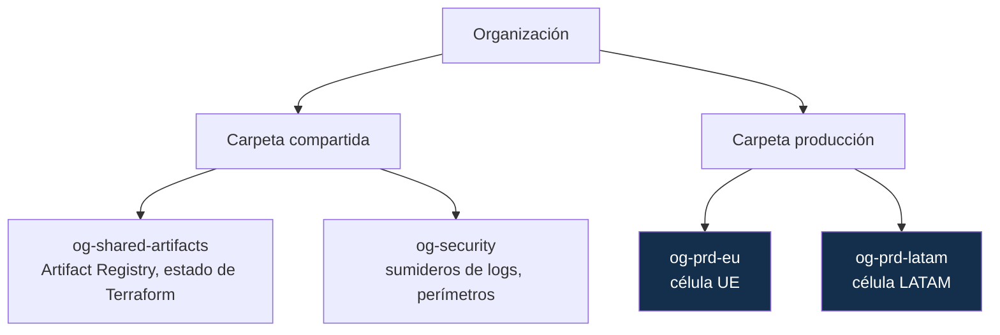
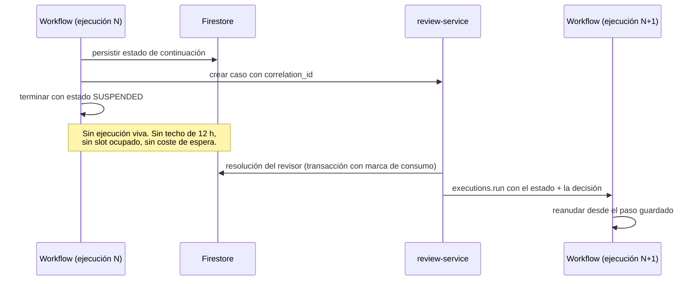

# 17 — Guía de despliegue en GCP

| Campo | Valor |
|---|---|
| **Estado** | Aprobado |
| **Versión** | 1.1.0 |
| **Última actualización** | 2026-08-21 |
| **Responsable** | SRE |
| **Audiencia** | SRE, ingeniería de plataforma |
| **Documentos relacionados** | [00 — Índice](00-indice.md) · [10 — Multinube](10-multicloud-aws-gcp.md) · [16 — Despliegue AWS](16-guia-de-despliegue-aws.md) · [05 — Multitenancy](05-multitenancy-y-aislamiento.md) |

**Resumen ejecutivo.** El equivalente para GCP, escrito como delta de la guía de AWS: sigue la misma estructura y detalla solo lo que difiere. Los apartados marcados 🔴 corresponden a brechas de paridad que **exigen trabajo adicional inexistente en AWS**: el aislamiento de tenant, el cifrado de campo sin DB-ESDK, la orquestación sin tier rápido y sin esperas largas nativas, y la auditoría del plano de datos, que está deshabilitada por defecto. Incluye las verificaciones de humo específicas de GCP, empezando por comprobar que un borrado es realmente un borrado.

> **Antes de empezar.** Esta guía sigue la misma estructura que la de AWS y **solo detalla lo que difiere**. La disposición real del IaC es `infra/terraform/envs/{dev,stg,prd}` con módulos en `infra/terraform/modules/gcp/*`; los `README.md` de cada módulo son la fuente autoritativa de sus variables y salidas. Lea primero [16](16-guia-de-despliegue-aws.md) para el procedimiento general. Los apartados marcados 🔴 corresponden a brechas de paridad que **exigen trabajo adicional** que no existe en AWS.

---

## 1. Resumen de lo que cambia

| Área | Diferencia | Trabajo adicional |
|---|---|---|
| **Aislamiento de tenant** | 🔴 No hay equivalente a la restricción de clave de partición en IAM | Sección §5. Es la diferencia estructural mayor |
| **Cifrado de campo** | 🔴 No existe la biblioteca de cifrado de base de datos | Sección §6 |
| **Orquestación** | 🔴 Sin tier rápido; callbacks de 12 h con un solo slot | Sección §8 |
| **Liveness** | 🔴 Sin servicio gestionado | Proveedor certificado (igual que en AWS por decisión) |
| **Autorización en el borde** | Sin autorizador de código arbitrario | La autorización ya vive en el núcleo: sin trabajo adicional |
| **Auditoría de plano de datos** | Deshabilitada por defecto | Sección §9 |
| **Configuración** | Sin almacén de parámetros separado | Sección §7 |
| **Modelo de IA** | Aceptación manual en el mercado, sin recurso de Terraform | Sección §4.6 |
| **Red** | Arranque en frío materialmente peor con red privada | Sección §3 |

## 2. Prerrequisitos y proyectos

### 2.1 Herramientas

| Herramienta | Versión mínima |
|---|---|
| Terraform u OpenTofu | 1.6 |
| `gcloud` | 480 |
| Docker | 24 |
| Python | 3.14 (3.11 en adelante admisible) |

```bash
gcloud version
gcloud auth login
gcloud auth application-default login
```

### 2.2 Topología de proyectos



> **Decisión requerida: ¿un proyecto por célula, o proyectos por tenant?**
>
> | Opción | Cuándo |
> |---|---|
> | **Proyecto por célula** | Caso general. Los tenants comparten proyecto, con aislamiento por aplicación y criptografía |
> | **Proyecto por tenant** | Tier `DEDICADO`. Es el **único** mecanismo de GCP que reproduce la propiedad de prevención en el plano de datos |
>
> **Recomendación: proyecto por célula**, con proyectos dedicados reservados a tenants que exijan aislamiento demostrable a nivel de plataforma. Requiere una fábrica de proyectos y Terraform generado; presupúntelo si lo va a ofrecer comercialmente.

> **Decisión requerida: región de cada célula.**
>
> Recomendación: `europe-west1` para la célula UE y `us-central1` para la LATAM. **`us-central1` es la región con mejor disponibilidad de GPU** (tanto L4 como la generación superior), lo que importa para el adaptador de cotejo facial.

### 2.3 Habilitación de servicios

```bash
export OG_PROJECT=og-prd-eu
export OG_REGION=europe-west1
gcloud config set project "$OG_PROJECT"

gcloud services enable \
  run.googleapis.com \
  workflows.googleapis.com \
  cloudtasks.googleapis.com \
  firestore.googleapis.com \
  storage.googleapis.com \
  cloudkms.googleapis.com \
  secretmanager.googleapis.com \
  artifactregistry.googleapis.com \
  documentai.googleapis.com \
  aiplatform.googleapis.com \
  apigateway.googleapis.com \
  identitytoolkit.googleapis.com \
  eventarc.googleapis.com \
  cloudtrace.googleapis.com \
  accesscontextmanager.googleapis.com \
  binaryauthorization.googleapis.com
```

> **Nota de nomenclatura.** La plataforma de IA fue renombrada, pero **el endpoint de API sigue siendo `aiplatform.googleapis.com`** y los recursos de Terraform conservan su prefijo anterior. **El puerto del núcleo no se acopla a ningún nombre comercial**: se llama `LlmPort`.

## 3. Red

```bash
cd infra/terraform/envs/prd
terraform apply -target=module.gcp_networking
```

> **Decisión requerida — con consecuencias de latencia reales: ¿egreso directo desde el servicio o conector gestionado?**
>
> | | Conector | Egreso directo |
> |---|---|---|
> | Infraestructura | Máquinas gestionadas que se pagan siempre | Sin recurso intermedio; **escala a cero** |
> | Coste | Fijo por instancia del conector | Solo tráfico |
> | **Instancias máximas** | Mayor | 🔴 **100–200 según región** |
> | Subred | `/28` dedicada | **`/26` o mayor** |
> | Rendimiento | Según el tamaño del conector | Hasta 1 Gbps por instancia |
>
> **El límite de 100–200 instancias con egreso directo es el que más probablemente le muerda.** Si necesita alta escala **y** red privada a la vez, tendrá que usar conectores (coste fijo) o repartir en varios servicios.

> ⚠️ **Advertencia de latencia que debe medir antes de comprometer un SLA.** Con red privada se documentan **retrasos de establecimiento de conexión de un minuto o más en el arranque de instancia**, y **arranques en frío de 30 segundos o más con traducción de direcciones**. Es materialmente peor que el equivalente de AWS. Para APIs síncronas con SLA de latencia, **mídalo en su región antes de decidir**.

**Dimensionado de subred:** en estado estable los servicios consumen el doble de direcciones IP que instancias en ejecución; los jobs consumen una por tarea más siete minutos de retención tras completarse. Un `/26` (64 direcciones) soporta unas 30 instancias. **Sobredimensione.**

### 3.1 Perímetro de servicio

Esta es una **ventaja de GCP sin equivalente en AWS** y forma parte de los controles compensatorios de la brecha de aislamiento:

```bash
terraform apply -target=module.gcp_networking   # incluye el perímetro de servicio
```

El perímetro contiene Firestore, el almacén de objetos, Cloud KMS y el servicio documental, de modo que una credencial robada no pueda exfiltrar datos fuera de él. **Adóptelo**: compensa parcialmente la brecha de §5 a nivel de proyecto.

## 4. Orden de aplicación de módulos

Mismo orden que en AWS, con estas diferencias:

| Módulo | Diferencia |
|---|---|
| `gcp_kms` | Cloud KMS con `destroy_scheduled_duration` explícito; **no hay keystore gestionada de branch keys**: se implementa sobre Firestore |
| `gcp_data` y `gcp_storage` | Firestore Native en colección plana; índices compuestos explícitos; políticas de TTL por grupo de colecciones; **desactivar el borrado reversible en los buckets** |
| `gcp_identity` | Identity Platform con multi-tenancy |
| `gcp_compute` | Servicios y jobs de Cloud Run, y el procesador documental |
| `gcp_orchestration` | Cloud Workflows + Cloud Tasks |
| `gcp_api` | API Gateway con validación declarativa de JWT |
| `gcp_observability` | 🔴 **Habilitación explícita de la auditoría del plano de datos** |
| `gcp_gdpr` | Purga, barrido programado y alarmas de cumplimiento |

### 4.1 `gcp_kms` — claves

> **Decisión requerida: `destroy_scheduled_duration`.**
>
> El valor por defecto es **30 días**. La organización puede forzar un mínimo con una restricción de política.
>
> **Diferencia con AWS:** AWS tiene un rango de 7 a 30 días con mínimo de 7. GCP permite en principio ventanas más cortas, lo que sería una ventaja para el crypto-shredding, pero **el valor por defecto de 30 días es más conservador**.
>
> <!-- PENDIENTE DE VERIFICAR: el valor mínimo configurable de `destroy_scheduled_duration`. Se cita habitualmente 24 h, pero la documentación oficial de destrucción y restauración no lo indica. Verifíquelo antes de comprometer un SLA de borrado. -->
>
> **Recomendación mientras no se verifique el mínimo:** deje 30 días y comprometa el plazo de borrado de **35 días naturales** de [12](12-retencion-y-borrado.md) §6.5.

```hcl
resource "google_kms_crypto_key" "root" {
  name                       = "og-${var.env}-${var.region}-root"
  key_ring                   = google_kms_key_ring.main.id
  rotation_period            = "7776000s"   # 90 días
  destroy_scheduled_duration = "2592000s"   # 30 días — verifique el mínimo antes de reducirlo
  purpose                    = "ENCRYPT_DECRYPT"
}
```

> ⚠️ **El aprovisionamiento automático de claves gestionadas no cubre Firestore.** Soporta 27 servicios, incluidos el almacén de objetos, Cloud Run, Secret Manager y Artifact Registry, pero **Firestore no está en la lista**. Y aunque lo estuviera: **el cifrado gestionado a nivel de servicio no es cifrado de campo**. Si el requisito es que el operador de la plataforma no pueda leer datos de un tenant, necesita cifrado de aplicación (§6); el cifrado gestionado es defensa en profundidad adicional, no sustituto.

### 4.2 `gcp_data` y `gcp_storage` — Firestore y buckets

```bash
terraform apply -target=module.gcp_data -target=module.gcp_storage
```

Puntos específicos:

| Punto | Detalle |
|---|---|
| **Colección plana** | Identificadores de documento compuestos `TENANT#<tid>__SESSION#<sid>`; las consultas de rango sobre el nombre reproducen la búsqueda por prefijo |
| **Sin subcolecciones bajo la sesión** | 🔴 **El TTL no borra subcolecciones**: quedarían huérfanas |
| **Índices compuestos explícitos** | Hay que replicar los campos de índice como campos del documento |
| **Desactivar la indexación de campos no consultados** | El límite de **40.000 entradas de índice por documento** se alcanza antes que el de tamaño con mapas anidados grandes |
| **TTL** | Un solo campo TTL por grupo de colecciones; máximo 1.000 configuraciones a nivel de campo. Se usa **solo** para artefactos efímeros y claves de idempotencia |

> 🔴 **Decisión requerida: desactivar el borrado reversible de los buckets.**
>
> **El borrado reversible está activo por defecto y retiene los objetos borrados 7 días.** Para el derecho de supresión, esto significa que un borrado **no es un borrado**. **S3 no tiene este comportamiento por defecto**, así que es un olvido fácil al portar.
>
> Debe desactivarlo explícitamente o documentar la ventana en su política de privacidad.

```hcl
resource "google_storage_bucket" "artifacts" {
  name     = "og-${var.env}-artifacts"
  location = var.region

  soft_delete_policy {
    retention_duration_seconds = 0   # DESACTIVADO — un borrado es un borrado
  }

  uniform_bucket_level_access = true
  public_access_prevention    = "enforced"
  versioning { enabled = true }
  encryption { default_kms_key_name = google_kms_crypto_key.root.id }
}
```

Verificación tras aplicar:

```bash
gcloud storage buckets describe "gs://og-${OG_ENV}-artifacts" \
  --format="json(soft_delete_policy, versioning, encryption)"
```

**El equivalente del bloqueo de objetos** es la política de retención del bucket con bloqueo (`retention_policy` con `is_locked = true`) para los buckets de evidencia y auditoría.

### 4.3 `gcp_identity`

> **Decisión requerida: instrumento de facturación en Identity Platform.**
>
> ⚠️ **Con instrumento de facturación los tenants son ilimitados; sin él, solo 2 tenants por proyecto.** Es un límite que sorprende en pruebas de concepto y bloquea la demostración.
>
> Límites de tasa relevantes: 45.000 inicios de sesión por minuto con token personalizado, 18.000 intercambios de token por minuto, y **creación de cuentas limitada a 100 por hora y por dirección IP**.

**Diferencia con AWS que afecta al código:** los claims personalizados se establecen mediante la API de gestión de usuarios, no con el mecanismo de grupos de Cognito. **El puerto debe normalizar a un `TenantContext` propio**, que es lo que ya hace por diseño. Nótese que Identity Platform no soporta funciones de bloqueo por tenant, por lo que el equivalente al hook de generación de token **vive en el servicio de Cloud Run**, no en el proveedor de identidad — lo que hace aún más crítica la verificación fail-closed en el núcleo.

### 4.4 `gcp_compute` — Cloud Run

> **Decisión requerida: dimensionado.**
>
> **Cloud Run es superior a la alternativa serverless de AWS en recursos**: hasta **32 GiB y 8 vCPU** por instancia, **60 minutos** de timeout en servicios y **168 horas** en jobs, GPU disponible, y **sin límite documentado de tamaño de imagen**.
>
> Pero hay tres diferencias que cambian el código, no solo la configuración:
>
> | Diferencia | Consecuencia |
> |---|---|
> | **Relación CPU↔memoria obligatoria** | 1 vCPU hasta 4 GiB; 4 vCPU de 2 a 16 GiB; **8 vCPU de 4 a 32 GiB**. No hay asignación proporcional automática |
> | **El sistema de archivos escribible es tmpfs y consume memoria** | Un adaptador portado que use archivos temporales asumiendo disco **reduce la memoria disponible para el modelo**. Alternativas: montaje de volumen de almacenamiento de objetos, o sistema de archivos en red |
> | **Concurrencia de hasta 1.000 peticiones por instancia** | Cambia el modelo de ejecución. Para inferencia pesada, **fije la concurrencia entre 1 y 4** o saturará la CPU. Y el `TenantContext` **nunca** puede vivir en estado implícito por hilo |

Dimensionado inicial:

| Servicio | vCPU | Memoria | Concurrencia | Instancias mínimas |
|---|---|---|---|---|
| `og-{env}-api` | 2 | 2 GiB | 80 | **1** (evita el arranque en frío) |
| `og-{env}-worker-ocr` | 2 | 4 GiB | 20 | 0 |
| `og-{env}-worker-extraction` | 2 | 4 GiB | 20 | 0 |
| `og-{env}-worker-facematch` | 8 | 16 GiB (+GPU) | **2** | **1** |
| `og-{env}-review` | 2 | 2 GiB | 80 | 1 |
| `og-{env}-purge` (job) | 4 | 8 GiB | — | — |

> **Decisión requerida: ¿GPU para el cotejo facial?**
>
> Disponibilidad y requisitos:
>
> | GPU | VRAM | CPU mínima | Memoria mínima |
> |---|---|---|---|
> | L4 | 24 GB | 4 | 16 GiB (32 recomendado) |
> | Generación superior | 96 GB | 20 | 80 GiB |
>
> - Cuota inicial automática: **3 unidades L4** o **3.000 miliGPU** por proyecto; más requiere solicitud.
> - **Arranque en frío con GPU de aproximadamente 5 segundos** (controladores preinstalados) — competitivo.
> - **Una GPU por instancia**, con facturación por instancia.
>
> <!-- PENDIENTE DE VERIFICAR: la investigación de referencia detectó una inconsistencia documental — el requisito de 80 GiB de memoria de la GPU superior contradice el máximo documentado de 32 GiB por instancia. No se pudo reconciliar. Verifíquelo antes de dimensionar sobre esa GPU. -->
>
> **Recomendación: L4 si el volumen lo justifica.** Con volumen bajo, la CPU basta y evita la cuota y el coste de instancia mínima con GPU.

**El modelo se hornea en la imagen**, no se descarga en el arranque. La ausencia de límite de tamaño de imagen es una ventaja real frente a los 10 GB de la alternativa.

### 4.5 `gcp_orchestration`

Ver §8 para el detalle. Aquí lo esencial de la configuración:

```bash
terraform apply -target=module.gcp_orchestration
```

Se crean: el workflow padre, las colas de tareas para el trabajo asíncrono, y los disparadores de eventos.

### 4.6 🔴 Paso manual: aceptación del modelo de IA

> **Decisión requerida — Y ES UN PASO MANUAL SIN RECURSO DE TERRAFORM.**
>
> Activar el modelo de lenguaje en el catálogo de modelos **requiere aceptar un acuerdo en el mercado de la plataforma**. **No hay recurso de Terraform que lo haga.** Es un paso manual que debe quedar documentado en el runbook de arranque y ejecutarse **antes** del primer despliegue funcional, o los pasos de extracción fallarán con un error de permisos poco informativo.

```bash
# Verificación de que el modelo está disponible antes de continuar
gcloud ai models list --region="$OG_REGION" 2>/dev/null | head
# Si el modelo no aparece, acepte el acuerdo en la consola del catálogo de modelos.
```

Notas de configuración:

- **Endpoint:** el endpoint global está disponible de forma general y es el recomendado. Para residencia de datos en la UE, **fije el endpoint europeo explícitamente**.
- **Payload máximo: 30 MB** por petición.
- **Retención cero de datos** disponible en algunos modelos: relevante para el análisis de subencargados del DPA.
- Los mínimos de tokens de caché son **los mismos que en la otra nube**, así que el portaje no cambia los umbrales ([08](08-ia-y-extraccion-semantica.md) §5.2).

### 4.7 Servicio documental (dentro de `gcp_compute`)

```bash
terraform apply -target=module.gcp_compute   # incluye el procesador documental
```

> ⚠️ **Use solo el procesador de OCR genérico.** Los procesadores de identidad **cubren esencialmente Estados Unidos** y no sirven para LATAM ni para Europa. Además, hay procesadores de identidad heredados que se apagaron el **30 de junio de 2026**.
>
> **El procesador está regionalizado** (`us`, `eu`, `asia`) y la región va en su nombre. **Para residencia de datos en la UE, fíjela explícitamente.** Límites: OCR en línea hasta 15 páginas, por lotes hasta 500. **Diseñe el uso como asíncrono.**

## 5. 🔴 Aislamiento de tenant: el trabajo adicional

Este es el apartado que no tiene equivalente en la guía de AWS, y el motivo por el que un despliegue en GCP requiere verificación adicional.

### 5.1 Lo que NO puede hacer

**No existe equivalente a la restricción de clave de partición en IAM.** Ninguno de los atributos de condición de IAM permite condicionar sobre el prefijo de una clave de fila o el identificador de un documento, y Firestore no expone condiciones a nivel de documento.

**Las reglas de seguridad de Firestore no le sirven.** Las bibliotecas de servidor las eluden por completo y se autentican con credenciales de aplicación por defecto. Protegen SDK de cliente móvil y web, no un backend.

**Consecuencia sin adornos: si el proceso tiene la cuenta de servicio de Firestore, puede leer todos los tenants. La barrera es el código.**

### 5.2 Los cuatro controles compensatorios, y cómo verificarlos

| # | Control | Verificación tras el despliegue |
|---|---|---|
| **C1** | Repositorio único con alcance de tenant | Ejecute la prueba de arquitectura A-11: la importación del cliente de Firestore fuera del adaptador debe fallar |
| **C2** | **Cifrado de sobre por tenant con `tenant_id` como Associated Data** | Ejecute A-06: descifrar un blob del tenant A con material de B **debe fallar**. **Es el control determinante** |
| **C3** | Base de datos o proyecto dedicado para tenants de alto valor | Solo para tier `DEDICADO`; tope de **100 bases de datos por proyecto** |
| **C4** | Auditoría del plano de datos con alerta de desalineación | §9 |

```bash
# Verificación de C2 — el control que de verdad cambia el resultado
python -m onboarding_generico.tools.verify_isolation \
  --backend gcp --project "$OG_PROJECT" \
  --tenant-a acme --tenant-b globex
# Esperado:
#   [OK] cifrado tenant A -> descifrado tenant A: correcto
#   [OK] cifrado tenant A -> descifrado tenant B: FALLO CRIPTOGRAFICO (esperado)
#   [OK] repositorio con contexto cruzado: SessionNotFound
```

### 5.3 Identidad federada con atributo de tenant

El análogo más cercano a las etiquetas de sesión: la federación de identidad de carga de trabajo mapea claims del token externo a hasta **50 atributos personalizados** y concede roles a conjuntos de principales por atributo.

**Lo que consigue:** gobierna a qué **recursos de GCP** puede acceder la identidad.
**Lo que NO consigue:** no gobierna **filas dentro de una base de datos**.

Es útil para el tier `DEDICADO` (una base de datos o proyecto por tenant) y para el acceso de CI, no para el aislamiento en el plano de datos del caso general.

### 5.4 Lo que debe decirle al cliente

Formulación que se sostiene en una auditoría:

> *"El aislamiento se aplica en tres niveles: la aplicación garantiza el alcance por construcción, verificado con pruebas automatizadas; la criptografía garantiza que un texto cifrado de otro tenant es indescifrable con su clave, incluso si un error de aplicación lo devolviera; y la auditoría detecta cualquier acceso desalineado. Lo que GCP no ofrece, y AWS sí, es una barrera en el plano de datos aplicada por el proveedor de nube que rechace la consulta antes de ejecutarla. Para tenants que requieran esa propiedad, ofrecemos base de datos o proyecto dedicado."*

La formulación que **no** se sostiene es "está aislado igual que en AWS".

## 6. 🔴 Cifrado de campo: el trabajo adicional

**No existe equivalente a la biblioteca de cifrado de base de datos.** Hay que construir tres cosas:

| Pieza | Qué hay que hacer | Documento |
|---|---|---|
| **Cifrado de sobre** | Tink `KmsEnvelopeAead` con `tenant_id\|record_id` como Associated Data. Es directo | [06](06-criptografia-y-gestion-de-claves.md) §7.2 |
| **Caché de material** | 🔴 **Tink no la trae.** Hay un problema de rendimiento conocido del Envelope AEAD sobre Cloud KMS por la latencia por operación. **La caché con carga atómica no es opcional: es requisito de viabilidad** | [06](06-criptografia-y-gestion-de-claves.md) §5.2 |
| **Firma de registro** | MAC sobre serialización canónica versionada, verificada **en cada lectura** | [06](06-criptografia-y-gestion-de-claves.md) §7.3 |
| **Índice determinista** | HMAC truncado, con la longitud impuesta **por proceso** (ADR + prueba), porque ninguna biblioteca la impone | [06](06-criptografia-y-gestion-de-claves.md) §7.4 |

> 🔴 **Decisión requerida: longitud del índice determinista.**
>
> **Es irreversible por las mismas razones que en AWS**, pero con un agravante: **aquí ninguna biblioteca se lo impide**. Puede cambiarla por accidente y romper todos los índices existentes en silencio.
>
> Controles obligatorios:
> 1. La longitud vive en un **ADR** y en una constante del código.
> 2. Una prueba verifica que la longitud desplegada coincide con la del ADR.
> 3. La normalización del valor está **versionada** y también verificada.
> 4. La rotación de la clave de índice es una **operación planificada con reindexación completa**, no un cambio de configuración.

Verificación de rendimiento antes de dar por bueno el despliegue:

```bash
python -m onboarding_generico.tools.bench_crypto \
  --backend gcp --project "$OG_PROJECT" --tenant acme --ops 10000 --threads 32
# Esperado:
#   kms_calls_per_operation   < 0.05
#   cache_hit_ratio           > 0.95
#   p95_encrypt_ms            < 5
#   unique_data_keys_ratio    < 0.05
```

Si `kms_calls_per_operation` está cerca de 1, la caché no está funcionando y **el sistema no es viable en producción**.

## 7. Secretos y configuración

> 🔴 **No hay almacén de parámetros separado.** Todo va a Secret Manager, todo se cobra, y el límite de **600 lecturas por minuto a nivel de proyecto** lo hace inadecuado como almacén de configuración.
>
> **Decisión requerida: dónde vive la configuración no sensible.**
>
> | Opción | Cuándo |
> |---|---|
> | **Variables de entorno inyectadas por Terraform** | Configuración estática por entorno. **Recomendado** |
> | **Documento de configuración con caché en proceso** | Configuración que cambia sin desplegar |
> | Secret Manager | **No.** El límite de lecturas es un cuello de botella real |

Límites de Secret Manager: **64 KiB** por versión; `AccessSecretVersion` a 90.000 por minuto y proyecto; **lecturas y escrituras a 600 por minuto y proyecto**; 50 alias por secreto.

> ⚠️ **La rotación no es gestionada.** Solo hay **notificaciones de rotación** por mensajería; **el rotador lo escribe usted**. Es una diferencia de esfuerzo significativa respecto de AWS, donde existen funciones de rotación provistas para servicios gestionados.

**Fije la versión del secreto en producción.** Referenciar la versión más reciente provoca cambios no auditados en el comportamiento.

Los secretos regionales son útiles para residencia de datos en la UE.

## 8. 🔴 Orquestación: el trabajo adicional

### 8.1 Sin tier rápido

No existe un equivalente al tier de baja latencia. El sub-flujo automatizado se implementa como **orquestación en proceso dentro del servicio de Cloud Run**, con la cola de tareas para los pasos que requieren reintento con espera prolongada.

Se pierde la visibilidad por estado; se compensa con un span de traza por paso ([13](13-observabilidad-y-sre.md) §3.3).

Límites de la cola de tareas: tarea de **1 MiB**; despacho de **500 tareas por segundo y cola**; programación hasta **30 días** en el futuro; retención **31 días**; deduplicación hasta 24 h; 1.000 colas por región; **deadline HTTP de 10 minutos por defecto y 30 minutos máximo**.

### 8.2 Esperas largas: el patrón obligatorio

> 🔴 **Los callbacks nativos NO sirven para revisión humana.** Tres limitaciones:
> 1. **Timeout por defecto de 43.200 s (12 h)**. Una revisión que cruce un fin de semana no cabe.
> 2. **Un solo slot pendiente por endpoint**: un segundo callback recibe **HTTP 429**.
> 3. **Sin heartbeat.**
>
> Cuota adicional: 1.500 peticiones de callback por minuto y ubicación.

**Patrón obligatorio: persistir, terminar y relanzar.**



Beneficio colateral: **el mismo patrón resuelve el límite de eventos de historial en AWS**, así que la lógica de continuación es compartida por ambos adaptadores.

### 8.3 Límites que el compilador debe respetar

| Límite | Valor | Verificación |
|---|---|---|
| **Datos acumulados por ejecución** | **512 KB** | 🔴 El límite dominante. Solo punteros, y liberar variables tras su último uso |
| Respuesta HTTP | 2 MB | Los workers devuelven referencias |
| **Ramas por paso paralelo** | **10** | Fan-out en olas si el DAG tiene más |
| Anidamiento paralelo | 2 niveles | |
| Longitud de expresión | **400 caracteres** | Partición automática en pasos de asignación |
| Tamaño del código fuente | 128 KB | Umbral de partición del workflow |
| Ejecuciones concurrentes | 10.000 por región y proyecto | |
| Retención de ejecuciones | 90 días | Insuficiente para trazabilidad regulatoria: el expediente vive en el log de auditoría |

## 9. 🔴 Auditoría del plano de datos

> 🔴 **Los registros de acceso a datos están deshabilitados por defecto** (excepto para el almacén analítico). Si no los habilita explícitamente sobre Firestore, el almacén de objetos y Cloud KMS, **no tiene traza de quién leyó datos de qué tenant**. Es un fallo de cumplimiento silencioso, y es el control detectivo que compensa parcialmente la brecha de §5.

```hcl
resource "google_project_iam_audit_config" "firestore" {
  project = var.project_id
  service = "firestore.googleapis.com"
  audit_log_config { log_type = "DATA_READ" }
  audit_log_config { log_type = "DATA_WRITE" }
}

resource "google_project_iam_audit_config" "storage" {
  project = var.project_id
  service = "storage.googleapis.com"
  audit_log_config { log_type = "DATA_READ" }
  audit_log_config { log_type = "DATA_WRITE" }
}

resource "google_project_iam_audit_config" "kms" {
  project = var.project_id
  service = "cloudkms.googleapis.com"
  audit_log_config { log_type = "DATA_READ" }
}
```

Verificación:

```bash
gcloud projects get-iam-policy "$OG_PROJECT" --format=json \
  | jq '.auditConfigs[] | {service, types: [.auditLogConfigs[].logType]}'
```

> ⚠️ **El coste puede ser significativo** en un middleware de alto volumen. Use filtros de exclusión para reducir ruido, pero **nunca excluya accesos a datos de tenant**.

**Ventaja de GCP:** la retención del bucket de logs requerido es de **400 días y no es configurable**, lo que **supera** los 90 días del historial de eventos de la alternativa de AWS, donde plazos mayores exigen exportación explícita.

**Alerta obligatoria:** accesos cuyo `tenant_id` en la ruta del documento no coincida con el del token. Es detección, no prevención — dígalo así.

## 10. Publicación de imágenes

```bash
export OG_AR="${OG_REGION}-docker.pkg.dev/${OG_PROJECT}/og-${OG_ENV}"

gcloud auth configure-docker "${OG_REGION}-docker.pkg.dev"

export OG_TAG=$(git rev-parse --short HEAD)
docker build -f deploy/gcp/Dockerfile.worker -t "${OG_AR}/worker:${OG_TAG}" .
docker push "${OG_AR}/worker:${OG_TAG}"

gcloud run services update "og-${OG_ENV}-worker-facematch" \
  --image "${OG_AR}/worker:${OG_TAG}" \
  --region "$OG_REGION"
```

Diferencias respecto de AWS:

| Aspecto | Diferencia |
|---|---|
| **Nomenclatura** | `<region>-docker.pkg.dev/<project>/<repo>/<image>:<tag>` — hay un nivel jerárquico extra (repositorio → imagen) que no existe en ECR. **Parametrice la URI en el módulo, no la construya en el código** |
| **Autenticación en CI** | Use federación de identidad de carga de trabajo desde el sistema de CI, **no claves de cuenta de servicio** |
| **Ventajas** | Multiformato (contenedores, paquetes de varios lenguajes) en un solo servicio; repositorios remotos con caché y virtuales; políticas de limpieza declarativas |

> **Decisión requerida: ¿autorización binaria?**
>
> **Recomendación: sí en producción.** Permite exigir imágenes **firmadas y atestadas** antes de desplegar en Cloud Run, y es más maduro que el equivalente de AWS. Para un middleware de eKYC merece la pena adoptarlo.

## 11. Verificación de humo

Idéntica a la de [16](16-guia-de-despliegue-aws.md) §8, con dos verificaciones adicionales específicas de GCP:

```bash
# GCP-1: el borrado reversible está desactivado
gcloud storage buckets describe "gs://og-${OG_ENV}-artifacts" \
  --format='value(soft_delete_policy.retentionDurationSeconds)'
# Esperado: 0 (o vacío). Cualquier otro valor significa que un borrado NO es un borrado.

# GCP-2: la auditoría del plano de datos está activa
gcloud projects get-iam-policy "$OG_PROJECT" --format=json \
  | jq -e '.auditConfigs[] | select(.service=="firestore.googleapis.com")' >/dev/null \
  && echo "OK: auditoria de Firestore activa" \
  || echo "FALLO: sin traza de acceso a datos"

# GCP-3: aislamiento criptográfico (el control determinante)
python -m onboarding_generico.tools.verify_isolation --backend gcp --project "$OG_PROJECT"
```

## 12. Checklist adicional de "listo para producción" en GCP

Además del checklist completo de [16](16-guia-de-despliegue-aws.md) §9:

- [ ] 🔴 **Borrado reversible desactivado** en todos los buckets de datos personales
- [ ] 🔴 **Auditoría del plano de datos habilitada** sobre Firestore, almacén de objetos y KMS
- [ ] 🔴 **Alerta de desalineación tenant/token** configurada
- [ ] 🔴 **Prueba A-06 (aislamiento criptográfico) en verde**: es el control que sustituye a la barrera de plataforma
- [ ] 🔴 **Prueba A-11 (arquitectura)**: el cliente de Firestore no se importa fuera del adaptador
- [ ] 🔴 **Rendimiento criptográfico verificado**: `kms_calls_per_operation` < 0,05 con caché de carga atómica
- [ ] 🔴 **Longitud del índice determinista en un ADR** y verificada por prueba
- [ ] **Modelo de IA aceptado en el mercado** (paso manual)
- [ ] Perímetro de servicio configurado y probado
- [ ] Retención de bucket con bloqueo en evidencia y auditoría
- [ ] **Latencia de arranque en frío con red privada medida** en la región elegida, y el SLA fijado en consecuencia
- [ ] Dimensionado de subred verificado contra las instancias máximas previstas
- [ ] Sin subcolecciones bajo la sesión en Firestore
- [ ] Indexación desactivada en campos no consultados
- [ ] Instrumento de facturación activo en Identity Platform (si no, tope de 2 tenants)
- [ ] Autorización binaria activa
- [ ] Consumidores de eventos verificados como **idempotentes y reentrantes** (sin orden garantizado, sin replay)

## 13. Solución de problemas específicos de GCP

| Síntoma | Causa | Solución |
|---|---|---|
| Los pasos de extracción fallan con error de permisos | El modelo no está aceptado en el mercado | §4.6. **No hay recurso de Terraform**: es manual |
| Latencia p95 muy superior a la esperada en la ruta síncrona | Arranque en frío con red privada (**un minuto o más de establecimiento de conexión**) | `min_instances ≥ 1`; considere si necesita red privada en esa ruta |
| El servicio no escala por encima de ~100 instancias | Límite del egreso directo (**100–200 según región**) | Conector, o repartir en varios servicios |
| Un objeto "borrado" sigue accesible | **Borrado reversible activo por defecto** (7 días) | Desactivar la política. §4.2 |
| Documentos expirados aparecen en consultas | El TTL borra de forma diferida y **no transaccional** | Es esperado. La purga real es el proceso explícito de [12](12-retencion-y-borrado.md) §6 |
| Subcolecciones huérfanas tras expirar un caso | **El TTL no borra subcolecciones** | Colección plana. §4.2 |
| Error de límite de entradas de índice al escribir | **40.000 entradas de índice por documento** con mapas anidados | Desactivar la indexación de campos no consultados |
| Latencia alta en cada operación de cifrado | **La caché de material no está funcionando** | Es el problema de rendimiento conocido del Envelope AEAD sobre Cloud KMS. §6 |
| Consultas al índice determinista sin resultados tras un despliegue | Cambió la normalización o la longitud del HMAC | 🔴 **Compruébelo antes de reindexar**: puede haber corrompido el índice. Restaure la constante y verifique contra el ADR |
| Callback devuelve HTTP 429 | **Un solo slot por endpoint** | Es el motivo por el que no se usan callbacks para espera larga. §8.2 |
| Ejecución del workflow falla por tamaño | **512 KB acumulados por ejecución** | Solo punteros; liberar variables tras su último uso |
| Solo se pueden crear 2 tenants en Identity Platform | Sin instrumento de facturación | §4.3 |
| Un job largo se corta a mitad | Los jobs de más de 1 hora pueden sufrir cortes en mantenimiento | Diseñarlos reanudables con reintentos idempotentes |
| No hay traza de quién leyó un documento | Auditoría del plano de datos deshabilitada | §9. Habilítela; **no se puede recuperar el pasado** |

---

## Referencias

- [`docs/referencias/gcp-paridad-de-servicios.md`](referencias/gcp-paridad-de-servicios.md) — fuente de todos los límites y comportamientos citados: API Gateway e Identity Platform (tope de 2 tenants sin facturación, límites de tasa); Cloud Workflows (512 KB acumulados, 10 ramas, 400 caracteres, callbacks de 12 h con un slot); Cloud Run (32 GiB / 8 vCPU / 60 min, relación CPU↔memoria, tmpfs, concurrencia, GPU y su inconsistencia documental, arranque en frío); Firestore (TTL sin subcolecciones, 40.000 índices por documento, 100 bases de datos); almacenamiento (**borrado reversible por defecto**, bloqueo de bucket); Cloud KMS (30 días por defecto, mínimo no verificado, aprovisionamiento automático sin Firestore); ausencia de aislamiento en plano de datos y controles compensatorios; Document AI (cobertura estadounidense, regionalización, límites de páginas, deprecaciones); modelo de IA (aceptación manual, endpoints, payload de 30 MB); auditoría (**deshabilitada por defecto**, 400 días de retención); Secret Manager (64 KiB, 600 lecturas/min, sin rotación gestionada); Artifact Registry y autorización binaria; red (egreso directo con 100–200 instancias, retrasos de conexión, dimensionado de subred, perímetro de servicio).
- [05 — Multitenancy](05-multitenancy-y-aislamiento.md) · [06 — Criptografía](06-criptografia-y-gestion-de-claves.md) · [07 — Orquestación](07-orquestacion.md) · [10 — Multinube](10-multicloud-aws-gcp.md) · [12 — Retención y borrado](12-retencion-y-borrado.md) · [16 — Despliegue AWS](16-guia-de-despliegue-aws.md)
