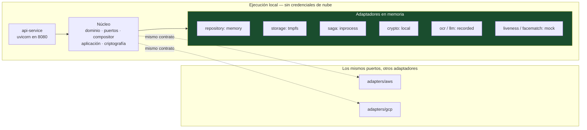

# 18 — Desarrollo local

| Campo | Valor |
|---|---|
| **Estado** | Aprobado |
| **Versión** | 1.1.0 |
| **Última actualización** | 2026-08-21 |
| **Responsable** | Ingeniería de producto |
| **Audiencia** | Desarrollo |
| **Documentos relacionados** | [00 — Índice](00-indice.md) · [02 — Arquitectura](02-arquitectura.md) · [04 — Motor de composición](04-motor-de-composicion.md) · [15 — Catálogo de proveedores y licencias](15-catalogo-de-proveedores-y-licencias.md) |

**Resumen ejecutivo.** Todo el sistema debe poder ejecutarse en un portátil, sin credenciales de nube, con adaptadores en memoria: no es una comodidad, es la prueba más barata de que el núcleo es agnóstico de la nube. La guía cubre la instalación, la configuración por perfiles, el recorrido completo de una sesión en local, la ejecución de las pruebas —incluidas las de arquitectura y las de contrato de puertos—, y las convenciones de contribución. Su sección más usada es el procedimiento paso a paso para **añadir un adaptador de proveedor nuevo**, que es la tarea más frecuente del equipo.

---

## 1. Filosofía del entorno local

**Todo el sistema debe poder ejecutarse en un portátil, sin credenciales de nube, con adaptadores en memoria.** No es una comodidad: es una consecuencia directa de la arquitectura hexagonal, y la prueba más barata de que el núcleo es realmente agnóstico de la nube.

| Propiedad | Consecuencia práctica |
|---|---|
| Sin credenciales de nube | Un desarrollador nuevo es productivo el primer día |
| Adaptadores en memoria completos | La suite de contrato se ejecuta en segundos |
| Los mismos casos de uso, los mismos puertos | Si funciona en local y falla en la nube, el problema está en el adaptador, no en el dominio |
| Sin datos reales, nunca | Los datos de producción de clientes no se usan para desarrollo ni pruebas ([11](11-cumplimiento-normativo.md) §4) |

Si algo **solo** puede probarse contra la nube, es una señal de que la abstracción está mal puesta.



## 2. Instalación

```bash
git clone https://github.com/segurolotengopy/OnboardingGenerico.git
cd OnboardingGenerico

python3.12 -m venv .venv
source .venv/bin/activate     # Windows: .venv\Scripts\activate

pip install --upgrade pip
pip install -e ".[dev]"
```

Verificación:

```bash
python -c "import onboarding_generico; print(onboarding_generico.__version__)"
pytest --collect-only -q | tail -1
ruff check .
mypy src/onboarding_generico/domain
```

## 3. Extras de dependencias

El proyecto declara extras opcionales para no arrastrar los SDK de ambas nubes en cada instalación.

| Extra | Contenido | Cuándo instalarlo |
|---|---|---|
| *(base)* | Núcleo: dominio, puertos, compositor, aplicación, criptografía, adaptadores en memoria | Siempre |
| `[aws]` | SDK de AWS, biblioteca de cifrado de base de datos, utilidades | Trabajo en adaptadores de AWS |
| `[gcp]` | SDK de GCP (Firestore, almacenamiento, KMS, workflows), Tink | Trabajo en adaptadores de GCP |
| `[cv]` | Visión por computador y ejecución de modelos | Trabajo en calidad de imagen o cotejo facial |
| `[dev]` | `pytest`, `ruff`, `mypy`, `pytest-cov`, herramientas de arquitectura | Siempre en desarrollo |
| `[all]` | Todo lo anterior | Integración completa |

```bash
pip install -e ".[dev]"              # mínimo para contribuir al núcleo
pip install -e ".[aws,dev]"          # trabajo en adaptadores de AWS
pip install -e ".[gcp,cv,dev]"       # adaptador de cotejo facial en GCP
```

> **Por qué importa esta separación.** Si el núcleo puede instalarse **sin** `[aws]` ni `[gcp]` y las pruebas del núcleo pasan, la independencia de nube está demostrada por construcción. Una importación accidental de un SDK en `domain/` rompe la instalación base, y eso es exactamente lo que se quiere que ocurra.

## 4. Configuración

```bash
cp .env.example .env
```

`.env.example` contiene valores ficticios y comentados. **Nunca hay secretos en el repositorio.**

```bash
# Perfil de ejecución: local | aws | gcp
OG_PROFILE=local

# Adaptadores (en local, todos en memoria)
OG_REPOSITORY_ADAPTER=memory
OG_OBJECT_STORAGE_ADAPTER=tmpfs
OG_SAGA_ADAPTER=inprocess
OG_CRYPTO_ADAPTER=local
OG_OCR_ADAPTER=recorded
OG_LLM_ADAPTER=recorded
OG_LIVENESS_ADAPTER=mock
OG_FACEMATCH_ADAPTER=mock

# Tenant de desarrollo
OG_DEV_TENANT=devtenant
OG_DEV_JURISDICTION=EU

# Observabilidad
OG_LOG_LEVEL=DEBUG
OG_LOG_FORMAT=pretty        # 'json' en la nube
OG_OTEL_EXPORTER=console
```

> ⚠️ **`OG_LIVENESS_ADAPTER=mock` no tiene equivalente productivo.** El adaptador de desarrollo basado en modelos abiertos existe únicamente para desarrollo, y una barrera de configuración impide activarlo cuando `OG_PROFILE != local`. Ver [15](15-catalogo-de-proveedores-y-licencias.md) §3.5.

## 5. Ejecución de la API local

```bash
make run-local
# equivalente a:
# uvicorn onboarding_generico.adapters.http.app:create_app --factory --reload --port 8080
```

Salida esperada:

```
INFO  perfil=local adaptadores={repository: memory, storage: tmpfs, saga: inprocess, ...}
INFO  catálogo de capacidades cargado: 14 capacidades
INFO  especificaciones cargadas desde config/flows/: 3
INFO  tenant de desarrollo aprovisionado: devtenant (EU, STANDARD)
INFO  escuchando en http://127.0.0.1:8080
```

### 5.1 Recorrido completo en local

```bash
export OG_API=http://127.0.0.1:8080
export OG_TOKEN=$(python -m onboarding_generico.tools.dev_token --tenant devtenant)

# 1. Crear sesión
SESSION=$(curl -sS -X POST "$OG_API/v1/sessions" \
  -H "Authorization: Bearer $OG_TOKEN" \
  -H "Content-Type: application/json" \
  -H "Idempotency-Key: $(uuidgen)" \
  -d '{"country":"ES","document_type":"PASAPORTE","tier":"IAL2","external_ref":"local-001"}')
SESSION_ID=$(echo "$SESSION" | jq -r .session_id)

# 2. Subir artefactos (en local, la URL prefirmada apunta al propio servidor)
UPLOAD=$(echo "$SESSION" | jq -r '.upload_targets[] | select(.slot=="DOC_FRONT") | .url')
curl -sS -X PUT "$UPLOAD" --upload-file tests/fixtures/passport_front.jpg

# 3. Confirmar
curl -sS -X POST "$OG_API/v1/sessions/$SESSION_ID/artifacts:commit" \
  -H "Authorization: Bearer $OG_TOKEN" -H "Content-Type: application/json" \
  -d "{\"slot\":\"DOC_FRONT\",\"sha256\":\"$(sha256sum tests/fixtures/passport_front.jpg | cut -d' ' -f1)\"}"

# 4. Avanzar el reloj y ejecutar la saga en proceso, paso a paso
python -m onboarding_generico.tools.dev_saga --session "$SESSION_ID" --step-through

# 5. Ver el estado y la evidencia
curl -sS "$OG_API/v1/sessions/$SESSION_ID" -H "Authorization: Bearer $OG_TOKEN" | jq .
```

`--step-through` ejecuta la saga paso a paso mostrando entradas y salidas, lo que hace depurable un flujo que en la nube es asíncrono y difícil de seguir.

### 5.2 Respuestas grabadas de proveedores

Los adaptadores `recorded` reproducen respuestas reales capturadas y **sanitizadas**:

```
tests/recordings/
├── ocr/
│   ├── ES_PASAPORTE_clean.json
│   ├── MX_INE_2019_glare.json
│   └── PY_CEDULA_blurry.json
├── llm/
│   ├── ES_PASAPORTE_clean.json
│   └── MX_INE_2019_low_confidence.json
└── liveness/
    ├── pass.json
    └── injection_detected.json
```

Reglas de las grabaciones:

| Regla | Motivo |
|---|---|
| **Solo documentos sintéticos o de prueba** | Nunca datos de titulares reales |
| Sanitizadas: sin identificadores del proveedor ni cabeceras de autenticación | Evita filtrar credenciales o metadatos |
| Versionadas con el contrato de la capacidad | Un cambio de contrato invalida las grabaciones y debe detectarse |
| Con casos límite, no solo el camino feliz | El camino feliz no encuentra defectos |

```bash
# Regrabar contra un proveedor real (requiere credenciales; nunca en CI)
python -m onboarding_generico.tools.record \
  --capability ocr.document.v1 --provider textract \
  --fixture tests/fixtures/passport_front.jpg \
  --out tests/recordings/ocr/ES_PASAPORTE_clean.json --sanitize
```

## 6. Ejecución de pruebas

```bash
make test              # unitarias + contrato en memoria (segundos)
make test-contract     # contrato contra los tres backends disponibles
make test-arch         # pruebas de arquitectura
make test-isolation    # suite de aislamiento
make test-golden       # conjunto dorado de extracción (lento)
make test-all
```

### 6.1 Organización

```
tests/
├── unit/              # dominio puro, sin E/S. Deben ser instantáneas
├── contract/          # una suite, parametrizada por backend
├── architecture/      # reglas estructurales (importaciones, firmas)
├── isolation/         # suite A-01…A-18
├── integration/       # contra emuladores
└── golden/            # evaluación de extracción por país
```

### 6.2 Pruebas de arquitectura

Son las que mantienen viva la arquitectura hexagonal:

```python
def test_domain_no_importa_infraestructura():
    """El dominio no conoce la nube, ni HTTP, ni el almacén."""
    prohibidos = {"boto3", "google", "httpx", "fastapi", "pydantic"}
    for modulo in modulos_de("onboarding_generico.domain"):
        assert not (importaciones(modulo) & prohibidos), \
            f"{modulo} importa infraestructura"


def test_cliente_de_almacen_solo_en_su_adaptador():
    """No hay rutas alternativas de acceso al plano de datos."""
    for modulo in modulos_de("onboarding_generico"):
        if "adapters.aws.repository" in modulo or "adapters.gcp.repository" in modulo:
            continue
        assert "boto3.resource" not in fuente(modulo)
        assert "google.cloud.firestore" not in importaciones(modulo)


def test_todo_caso_de_uso_recibe_tenant_context():
    """Ningún caso de uso queda fuera del perímetro de aislamiento."""
    for caso in casos_de_uso():
        params = inspect.signature(caso.execute).parameters
        assert "ctx" in params and params["ctx"].annotation is TenantContext, \
            f"{caso.__name__} no recibe TenantContext"


def test_repositorio_no_expone_primitivas_de_almacen():
    """Si el puerto acepta PK/SK, el adaptador de Firestore es inviable."""
    prohibidos = {"pk", "sk", "begins_with", "filter_expression", "key_condition"}
    for metodo in metodos_publicos(SessionRepositoryPort):
        params = set(inspect.signature(metodo).parameters)
        assert not (params & prohibidos), f"{metodo.__name__} acoplado al almacén"
```

Estas cuatro pruebas detectan las cuatro formas más frecuentes de erosionar la arquitectura, y lo hacen en el momento de la revisión de código y no seis meses después.

### 6.3 Linters y verificación de tipos

```bash
ruff check .            # lint
ruff check . --fix
ruff format .           # formato

mypy src/onboarding_generico/domain \
     src/onboarding_generico/ports \
     src/onboarding_generico/composer \
     src/onboarding_generico/application \
     src/onboarding_generico/crypto
```

> **`mypy` en modo estricto se aplica exclusivamente al núcleo**: `domain`, `ports`, `composer`, `application` y `crypto`. Los adaptadores quedan fuera del modo estricto porque los SDK de nube tienen anotaciones de calidad desigual y perseguirlas produce ruido sin valor.
>
> La consecuencia es deseable: **el núcleo tiene un contrato de tipos fuerte y los adaptadores lo satisfacen**. Si un adaptador no encaja, el error aparece en la frontera, que es donde debe aparecer.

Configuración en `pyproject.toml`; no se pasan opciones por línea de comandos.

### 6.4 Cobertura

```bash
pytest --cov=onboarding_generico --cov-report=term-missing --cov-report=html
```

| Módulo | Cobertura mínima |
|---|---|
| `domain/` | **95 %** |
| `composer/` | **90 %** |
| `application/` | **90 %** |
| `crypto/` | **95 %** |
| `adapters/` | 70 % |
| Global | 85 % |

El umbral alto en `crypto/` y `domain/` no es arbitrario: son los módulos donde un defecto tiene consecuencias de seguridad o de cumplimiento, no solo de disponibilidad.

## 7. Añadir un adaptador de proveedor, paso a paso

Ejemplo: un proveedor nuevo de OCR llamado `acmeocr`.

### Paso 1 — Confirmar que el puerto no cambia

Un proveedor nuevo **no debería** exigir cambiar el puerto. Si lo exige, la interfaz está mal diseñada o el proveedor ofrece una capacidad distinta que merece su propia entrada en el catálogo.

```python
# src/onboarding_generico/ports/document_ocr.py  (NO se toca)
class DocumentOcrPort(Protocol):
    def extract_text_and_geometry(
        self, ctx: TenantContext, artifact_ref: str, pagina: Page,
        hints: Mapping[str, str] | None = None,
    ) -> OcrResult: ...
```

### Paso 2 — Crear el adaptador

```python
# src/onboarding_generico/adapters/providers/acmeocr/adapter.py
from onboarding_generico.ports.document_ocr import DocumentOcrPort
from onboarding_generico.domain.ocr import OcrResult, TextBlock, BoundingBox
from onboarding_generico.domain.errors import (
    ProviderUnavailable, ProviderThrottled, InvalidInput,
    InconclusiveResult, ProviderContractViolation,
)


class AcmeOcrAdapter(DocumentOcrPort):
    """Adaptador de AcmeOCR. Cinco responsabilidades y ninguna más."""

    def __init__(self, secretos: SecretPort, config: AcmeOcrConfig,
                 telemetria: TelemetryPort) -> None:
        self._secretos = secretos
        self._config = config
        self._telemetria = telemetria

    def extract_text_and_geometry(self, ctx, artifact_ref, pagina, hints=None) -> OcrResult:
        with self._telemetria.span("provider.acmeocr.ocr", tenant=ctx.tenant_id):
            # (2) Autenticación desde el puerto de secretos, nunca de variables sueltas
            token = self._secretos.get(ctx, "acmeocr/api-key")

            # (1) Traducción de contrato: dominio -> proveedor
            peticion = {
                "image_url": self._presign(artifact_ref),
                "side": {"FRONT": "front", "BACK": "back"}[pagina.name],
            }

            # (3) Resiliencia: timeout, reintento con jitter, disyuntor
            try:
                respuesta = self._http.post(
                    self._config.endpoint, json=peticion,
                    headers={"Authorization": f"Bearer {token}"},
                    timeout=self._config.timeout_s,
                )
            except TimeoutError as e:
                raise ProviderUnavailable("acmeocr", causa=e) from e

            # (4) Normalización de errores a la taxonomía del dominio
            if respuesta.status_code == 429:
                raise ProviderThrottled("acmeocr",
                                        retry_after=respuesta.headers.get("Retry-After"))
            if respuesta.status_code == 422:
                raise InvalidInput("imagen no procesable")
            if respuesta.status_code >= 500:
                raise ProviderUnavailable("acmeocr")

            datos = respuesta.json()
            if not self._valida_esquema(datos):
                raise ProviderContractViolation("acmeocr", "esquema inesperado")
            if datos.get("confidence", 0) < self._config.min_confianza:
                raise InconclusiveResult("acmeocr", confianza=datos["confidence"])

            # (1) Traducción de vuelta: geometría SIEMPRE normalizada a 0–1
            bloques = [
                TextBlock(
                    texto=b["text"],
                    bbox=BoundingBox.from_absolute(b["box"], datos["width"], datos["height"]),
                    confianza=b["conf"],
                )
                for b in datos["blocks"]
            ]

            # (5) Evidencia: proveedor, versión, umbrales, latencia
            return OcrResult(
                bloques=bloques,
                idioma_detectado=datos["lang"],
                evidencia=ProviderEvidence(
                    proveedor="acmeocr",
                    version_modelo=datos["engine_version"],
                    umbrales={"min_confianza": self._config.min_confianza},
                    latencia_ms=respuesta.elapsed_ms,
                ),
            )
```

### Paso 3 — Registrar el proveedor en el catálogo

```yaml
# config/capabilities/ocr.document.v1.yaml
proveedores:
  - id: acmeocr
    nubes: [aws, gcp]
    clase_implementacion: "onboarding_generico.adapters.providers.acmeocr:AcmeOcrAdapter"
    secretos_requeridos: ["acmeocr/api-key"]
    aplicabilidad:
      paises: ["ES", "MX", "PY"]     # NO declare cobertura que no haya verificado
      documentos: ["*"]
```

> ⚠️ **La aplicabilidad se verifica empíricamente contra el conjunto dorado, no se copia del catálogo comercial del proveedor.** Es el error más caro de esta sección: un proveedor que declara cobertura de un país y falla en producción produce derivaciones masivas.

### Paso 4 — Pasar la suite de contrato

```bash
pytest tests/contract/test_document_ocr.py --provider=acmeocr
```

**Sin excepciones ni marcadores de fallo esperado.** Si un contrato no pasa, el adaptador no está listo. Si el contrato es incorrecto, se corrige el contrato con un ADR, no se añade una excepción por conveniencia.

### Paso 5 — Grabar respuestas

```bash
python -m onboarding_generico.tools.record \
  --capability ocr.document.v1 --provider acmeocr \
  --fixture-dir tests/fixtures/documents/ --sanitize
```

### Paso 6 — Evaluar contra el conjunto dorado

```bash
make test-golden PROVIDER=acmeocr
```

El informe se compara con el proveedor actual **por país**. Un proveedor con mejor media global y peor rendimiento en un país concreto **no se promueve** sin decisión explícita.

### Paso 7 — Documentar

- Ficha del proveedor con los criterios de [15](15-catalogo-de-proveedores-y-licencias.md) §6.
- Actualización del registro de subencargados: **un proveedor nuevo es un subencargado nuevo** y activa el derecho de objeción de los responsables ([11](11-cumplimiento-normativo.md) §4.2).

### Paso 8 — Desplegar

El adaptador está en el código; **activarlo para un tenant es configuración**:

```bash
curl -X PATCH "$OG_API/v1/tenants/acme/capabilities/ocr.document.v1" \
  -H "Authorization: Bearer $OG_ADMIN_TOKEN" \
  -d '{"primary":"acmeocr","fallback":["textract"]}'
```

## 8. Añadir un país o un tipo de documento

Este es el flujo que **no requiere desplegar código** si las capacidades existentes lo cubren.

### Paso 1 — Verificar la cobertura

```bash
python -m onboarding_generico.tools.check_coverage --country CO --document CEDULA
```

Salida típica:

```
ocr.document.v1          ✓ textract, document_ai_ocr
mrz.parse.v1             ✓ propio (sin dependencia de nube)
extraction.semantic.v1   ✗ falta plantilla CO/CEDULA
biometrics.facematch.v1  ✓
registry.verify.v1       ✗ sin adaptador de registro para CO
```

Solo lo marcado con ✗ requiere trabajo. `registry.verify.v1` requiere código (adaptador nuevo); la plantilla, no.

### Paso 2 — Crear la plantilla de extracción

```yaml
# config/templates/CO/CEDULA.yaml
plantilla: CO/CEDULA
descripcion: "Cédula de ciudadanía de Colombia"
caras: [FRONT, BACK]
campos_esperados:
  - {clave: nombre_completo,  cara: FRONT, region_aprox: [0.28, 0.20, 0.95, 0.34], obligatorio: true}
  - {clave: numero_documento, cara: FRONT, formato: "^[0-9]{6,10}$", obligatorio: true}
  - {clave: fecha_nacimiento, cara: BACK,  obligatorio: true}
  - {clave: sexo,             cara: BACK,  obligatorio: true}
mrz:
  presente: false
notas_de_extraccion:
  - "El número aparece con separadores de miles; normalizar quitando puntos."
  - "El apellido precede al nombre en el diseño."
```

### Paso 3 — Construir los casos dorados

Mínimo **200 documentos** por combinación país × tipo de documento, con cobertura de degradaciones (reflejo, sombra, desenfoque, recorte, rotación, baja resolución) y de casos adversarios. **Sintéticos o con consentimiento explícito de uso para evaluación**; nunca datos de producción.

```bash
make test-golden COUNTRY=CO DOCUMENT=CEDULA
```

### Paso 4 — Crear o extender la especificación de flujo

Si la plantilla base LATAM ya cubre la estructura ([04](04-motor-de-composicion.md) §10), basta con añadir `CO` a la resolución. Si el flujo difiere, es una especificación nueva.

### Paso 5 — Validar y publicar

```bash
curl -X POST "$OG_API/v1/flows:validate" --data-binary @config/flows/global-latam-base.yaml
curl -X POST "$OG_API/v1/flows" --data-binary @config/flows/global-latam-base.yaml
```

### Paso 6 — Canario

Publicar al 5 % y observar 24 h las métricas de reversión ([04](04-motor-de-composicion.md) §8.2).

> **Lo que sí requiere código:** un adaptador de registro gubernamental nuevo, una capacidad nueva, o un cambio en la máquina de estados. Todo lo demás es dato.

## 9. Convenciones de commits y ramas

### 9.1 Idioma

| Elemento | Idioma |
|---|---|
| Documentación y comentarios | **Español latinoamericano, sin voseo** |
| Identificadores de código, nombres de archivo, ramas, commits | **Inglés** |

### 9.2 Ramas

```
main                          # protegida; siempre desplegable
feat/<área>-<descripción>     # feat/composer-country-resolution
fix/<área>-<descripción>      # fix/crypto-context-mismatch
docs/<descripción>
chore/<descripción>
```

Ramas de vida corta. Una rama de más de una semana es una señal de que el cambio es demasiado grande.

### 9.3 Commits

Formato convencional:

```
<type>(<scope>): <subject in English, imperative, lowercase>

<body: qué y por qué, no cómo>

<footer: BREAKING CHANGE, refs>
```

Tipos: `feat`, `fix`, `docs`, `refactor`, `test`, `chore`, `perf`, `build`, `ci`.

Ámbitos: `domain`, `ports`, `composer`, `application`, `crypto`, `adapters-aws`, `adapters-gcp`, `adapters-providers`, `api`, `infra`, `docs`.

```
feat(composer): add country-level fallback in flow resolution

Resolution now falls back from tenant-specific to global specs before
failing. Prevents 422 for tenants that rely on the base LATAM template.

Refs: #142
```

```
fix(crypto): keep encryption context construction in a single function

Two call sites built the AAD independently and drifted, causing decrypt
failures on records written after the 1.4.0 deploy. Consolidated into
crypto.context.build() and added a round-trip test with mismatched context.

BREAKING CHANGE: records written between 1.4.0 and 1.4.3 require the
migration script in scripts/migrations/0007_rebuild_aad.py
```

### 9.4 Puertas obligatorias antes de fusionar

| Puerta | Bloquea |
|---|---|
| `ruff check` y `ruff format --check` | Sí |
| `mypy` estricto sobre el núcleo | Sí |
| Pruebas unitarias y de contrato en memoria | Sí |
| Pruebas de arquitectura | Sí |
| Suite de aislamiento | Sí |
| Umbrales de cobertura | Sí |
| Escaneo de secretos | Sí |
| **Verificación de licencias de dependencias** | Sí ([15](15-catalogo-de-proveedores-y-licencias.md) §4.3) |
| Escaneo de vulnerabilidades | Crítica y alta con explotación conocida |
| Revisión de un par | Sí |
| **Doble aprobación** para cambios en `crypto/`, en políticas IAM o en el esquema de claves | Sí |

### 9.5 Cuándo hace falta un ADR

| Cambio | ¿ADR? |
|---|---|
| Firma de un puerto | **Sí** |
| Longitud de beacon o de índice determinista | **Sí, obligatorio** — es irreversible |
| Esquema de claves o índices | **Sí** |
| Excepción nueva en la suite de contrato entre nubes | **Sí** |
| Adopción de una dependencia de la categoría de revisión legal | **Sí** |
| Cambio en la máquina de estados de la sesión | **Sí** |
| Adaptador de proveedor nuevo | No, salvo que cambie un puerto |
| Plantilla o especificación nueva | No |

Los ADR viven en `docs/adr/` y **no son propiedad de este documento**.

## 10. Depuración

| Situación | Herramienta |
|---|---|
| Seguir un flujo completo paso a paso | `dev_saga --step-through` |
| Ver la especificación resuelta y compilada | `python -m onboarding_generico.tools.explain_flow --tenant X --country Y --document Z` |
| Reproducir un fallo de producción con datos sintéticos | `dev_replay --plan <plan.json> --recordings <dir>` |
| Verificar aislamiento localmente | `verify_isolation --backend memory` |
| Comprobar que un log no filtra PII | `pytest tests/isolation/test_no_pii_in_telemetry.py` |
| Medir el coste teórico de un flujo | `explain_flow --with-cost` |
| Validar un MRZ a mano | `python -m onboarding_generico.tools.mrz --parse "P<UTOERIKSSON<<ANNA<MARIA<<<..."` |

```bash
# Ejemplo: por qué una sesión se resolvió con una spec y no con otra
python -m onboarding_generico.tools.explain_flow \
  --tenant acme --country MX --document INE_2019 --tier IAL2 --verbose

# Salida:
#   candidatas evaluadas:
#     1. acme:MX:INE_2019:IAL2 v3.2.1   [especificidad 4]  <- SELECCIONADA
#     2. acme:MX:*:IAL2       v2.0.0    [especificidad 3]
#     3. GLOBAL:*:*:IAL2      v1.0.0    [especificidad 1]
#   capacidades resueltas: ocr.document.v1@1.4.2, extraction.semantic.v1@2.1.3, ...
#   pasos: 9 (padre: 5, sub-flujo: 4)
#   transiciones estimadas del padre: 8
#   eventos de historial estimados (peor caso): 312 / 25.000
```

---

## Referencias

- [`docs/referencias/aws-arquitecturas-de-referencia.md`](referencias/aws-arquitecturas-de-referencia.md) y [`docs/referencias/gcp-paridad-de-servicios.md`](referencias/gcp-paridad-de-servicios.md) — límites y comportamientos que los adaptadores deben respetar y que la suite de contrato verifica.
- `CONTEXTO-AGENTES.md` — decisiones de herramientas y convenciones transversales del repositorio.
- [02 — Arquitectura](02-arquitectura.md) · [04 — Motor de composición](04-motor-de-composicion.md) · [08 — IA y extracción semántica](08-ia-y-extraccion-semantica.md) · [10 — Multinube](10-multicloud-aws-gcp.md) · [11 — Cumplimiento normativo](11-cumplimiento-normativo.md) · [15 — Catálogo de proveedores y licencias](15-catalogo-de-proveedores-y-licencias.md)
