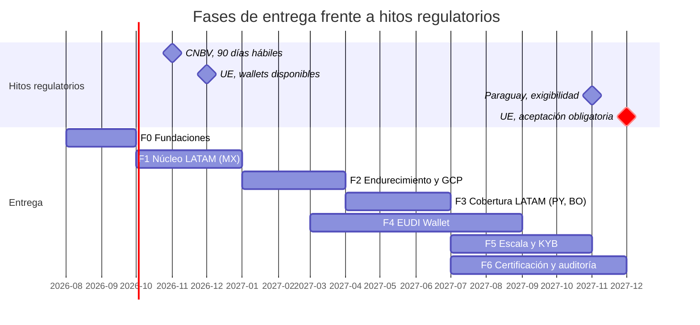

# 19 — Roadmap

| Campo | Valor |
|---|---|
| **Estado** | Aprobado |
| **Versión** | 1.1.0 |
| **Última actualización** | 2026-08-21 |
| **Responsable** | Producto |
| **Audiencia** | Producto, arquitectura, comercial, dirección |
| **Documentos relacionados** | [00 — Índice](00-indice.md) · [01 — Visión y alcance](01-vision-y-alcance.md) · [11 — Cumplimiento normativo](11-cumplimiento-normativo.md) · [10 — Multinube](10-multicloud-aws-gcp.md) |

**Resumen ejecutivo.** El plan no lo dicta el producto: lo dictan las fechas regulatorias verificadas —la reforma de la CNBV en México, la exigibilidad de la Ley 7593 de Paraguay hacia noviembre de 2027 y la obligatoriedad del EUDI Wallet para el sector privado el 6 de diciembre de 2027—. Sobre ellas se ordenan siete fases con entregables y **criterios de salida verificables**, el plan de incorporación incremental de países y formatos de documento, la matriz de riesgos del proyecto con su exposición, y las decisiones abiertas que bloquean mercado.

---

## 1. Las fechas que gobiernan el plan

El roadmap **no lo dicta el producto: lo dictan cuatro fechas regulatorias verificadas**. Todo lo demás se ordena alrededor de ellas.

| Fecha | Hito | Consecuencia |
|---|---|---|
| **02/07/2026 + 90 días hábiles** | Entrada en vigor de la reforma de la CNBV mexicana y plazo de implementación para los bancos | **Ventana comercial abierta ahora.** Los clientes mexicanos necesitan la capacidad de forma inmediata |
| **06/12/2026** | Los Estados miembros de la UE deben ofrecer al menos un EUDI Wallet | Inicio del ecosistema; ventana para las primeras pruebas de interoperabilidad |
| **~noviembre de 2027** | Exigibilidad plena de la Ley 7593/2025 de Paraguay | Los tenants paraguayos deben estar sobre estándar tipo GDPR |
| **06/12/2027** | El sector privado regulado de la UE **debe** aceptar el EUDI Wallet | **Fecha límite dura.** Un middleware que ese día no soporte presentación de credenciales queda funcionalmente incompleto para el mercado europeo |

> **Las dos últimas coinciden en ventana: es un único ciclo de trabajo 2026–2027.** El horizonte efectivo de desarrollo de la capacidad europea es 2026 y el primer semestre de 2027.

## 2. Fases de entrega

### F0 — Fundaciones (ago–sep 2026)

**Objetivo:** que las decisiones irreversibles estén tomadas correctamente y que el esqueleto sea desplegable.

| Entregable | Hito verificable |
|---|---|
| Núcleo hexagonal con puertos y adaptadores en memoria | La suite de contrato pasa contra los adaptadores en memoria; las pruebas de arquitectura están en verde |
| Modelo de dominio y máquina de estados | Recorrido completo de una sesión en local, con evidencia por paso |
| **Esquema de claves definitivo** | Tabla desplegada con `TENANT#` en la clave de partición y en los cuatro índices |
| **Longitudes de beacon decididas y registradas en ADR** | ADR aprobado; prueba que verifica la longitud desplegada |
| Cifrado de sobre por tenant con AAD | **Prueba A-06 en verde**: descifrado cruzado entre tenants falla |
| IaC de AWS aplicable de extremo a extremo | `terraform apply` limpio en un entorno nuevo |
| Verificación de humo | El recorrido de [16](16-guia-de-despliegue-aws.md) §8 completo, incluido el paso 8 de aislamiento |

> **Por qué las decisiones irreversibles van en F0.** Las longitudes de beacon **no pueden cambiarse tras escribir registros**, y `dynamodb:LeadingKeys` **no es retrofit-able** sin migración de datos. Equivocarse aquí es el error más caro posible del proyecto.

---

### F1 — Núcleo LATAM, primer mercado: México (oct–dic 2026)

**Objetivo:** un flujo de eKYC completo y productivo para México, aprovechando la ventana abierta por la reforma de la CNBV.

| Entregable | Hito verificable |
|---|---|
| Motor de composición completo | Añadir un flujo nuevo sin desplegar código; validación V1–V7 operativa |
| Orquestación híbrida en AWS | Sesión completa con espera larga y reanudación por callback |
| OCR + extracción semántica con plantillas MX | **Conjunto dorado con exactitud ≥ 0,98 en campos obligatorios y tasa de alucinación ≤ 0,001** |
| Validación MRZ conforme a ICAO 9303 | Vectores canónicos de TD1, TD2 y TD3 en verde, incluido el dígito compuesto |
| Integración con proveedor de liveness certificado | Ficha de evaluación de [09](09-biometria-y-liveness.md) §8 completa, con **IAPAR < 0,07** y detección de inyección acreditada |
| Cotejo facial calibrado para población mexicana | **FMR ≤ 10⁻⁴ y FNMR ≤ 10⁻²** en el conjunto de calibración, con paridad demográfica ≤ 25 % |
| Cotejo contra registros oficiales mexicanos | Integración funcional y auditada |
| Revisión humana con log WORM | Caso derivado, resuelto y sellado |
| Observabilidad y los seis runbooks | Alarmas activas; simulacro de RB-01 y RB-04 ejecutado |
| Primer tenant productivo en México | Sesiones reales; SLI/SLO medidos |

> ⚠️ **Bloqueante de F1:** el umbral de coincidencia biométrica exigido por la CNBV **no está verificado** — las fuentes dan 90 % y 98 %. Es un parámetro de configuración directo. **Debe resolverse en fuente primaria antes del cierre de F1** ([11](11-cumplimiento-normativo.md) §8, punto 2).

---

### F2 — Endurecimiento y paridad GCP (ene–mar 2027)

**Objetivo:** que GCP sea una alternativa real, y que la seguridad esté verificada por terceros.

| Entregable | Hito verificable |
|---|---|
| Adaptadores completos de GCP | **La suite de contrato pasa en ambas nubes**, con la lista de excepciones declarada y con ADR |
| Cifrado de campo en GCP: sobre, firma de registro, índice determinista | Ida y vuelta, detección de manipulación e índice funcional; `kms_calls_per_operation` < 0,05 |
| Patrón de espera larga en GCP | Sesión suspendida y reanudada por relanzamiento tras más de 12 h |
| Controles compensatorios de aislamiento en GCP | A-06 y A-11 en verde; auditoría del plano de datos con alerta de desalineación |
| Suite de aislamiento completa en producción | Prueba sintética diaria con tenant sintético |
| **Prueba de penetración de aplicación y de aislamiento** | Informe sin hallazgos críticos abiertos; **cada hallazgo cerrado con prueba automatizada** |
| Pruebas de carga C-1 a C-9 | Resultados documentados; C-4 (estampida criptográfica) y C-8 (purga bajo carga) obligatorias |
| Procedimiento de purga verificado | Simulacro completo con verificación de indescifrabilidad |
| Informe de paridad semanal | Publicado y sin divergencias no declaradas |

---

### F3 — Cobertura LATAM: Paraguay y Bolivia (abr–jun 2027)

**Objetivo:** los otros dos mercados del alcance, con sus particularidades regulatorias resueltas.

| Entregable | Hito verificable |
|---|---|
| Plantillas y conjunto dorado para PY y BO | ≥ 200 documentos por combinación país × documento; métricas por país |
| Cotejo contra el registro boliviano | Integración funcional |
| **`emisor_del_veredicto: SEÑALES_SOLAMENTE` forzado para Bolivia** | El validador **rechaza** una spec con `MIDDLEWARE` y `BO` en el alcance |
| Régimen simplificado y ampliado de Paraguay | Especificaciones distintas por tier, conforme a los arts. 26 y 28 de la Res. SEPRELAD 70/2019 |
| Adecuación a la Ley 7593 paraguaya | Régimen de encargado, EIPD, transferencias, 30 días hábiles de respuesta a supresión |
| **Consulta regulatoria formal en Bolivia** | Respuesta de ASFI o UIF sobre el art. 32(II) respecto de proveedores tecnológicos |
| Entrada por el sandbox de ASFI | Solicitud presentada, o decisión documentada de no entrar |

> ⚠️ **Bloqueante comercial de F3:** la interpretación del art. 32(II) del Instructivo UIF **determina la viabilidad del modelo de negocio en Bolivia**. Es la consulta regulatoria prioritaria y debe iniciarse en F2, no en F3, por los plazos de respuesta.

---

### F4 — EUDI Wallet (mar–ago 2027)

**Objetivo:** llegar al 6 de diciembre de 2027 con la capacidad probada, no recién entregada.

| Entregable | Hito verificable |
|---|---|
| Rol de *Relying Party* registrado | Certificado de acceso obtenido y registro completado |
| **Verificador OpenID4VP** | Presentación verificada de extremo a extremo contra un wallet de referencia |
| **Parsers duales**: mDoc/CBOR (ISO 18013-5) y SD-JWT VC | Ambos formatos verificados |
| Validación contra listas de confianza y listas de entidades de confianza | Con estado de revocación |
| Divulgación selectiva y minimización | Se solicitan **solo** los atributos necesarios; es obligación reforzada del Reglamento |
| **Flujo CU-03 completo** | Sesión resuelta **sin captura biométrica ni MRZ** |
| Pruebas de interoperabilidad | Contra al menos dos wallets de Estados miembros distintos |
| Célula UE en producción | Con residencia de datos verificada |

> **Por qué F4 empieza en marzo de 2027 y no después.** El ARF v3.0.0 es de julio de 2026 e introdujo cambios estructurales; el ecosistema estará en movimiento. Llegar a diciembre de 2027 con una integración recién terminada, sin haber probado contra wallets reales, es un riesgo que no se puede recuperar: **la fecha no se mueve**.

---

### F5 — Escala y KYB (jul–oct 2027)

| Entregable | Hito verificable |
|---|---|
| Flujo KYB (CU-04) | Persona jurídica con representantes y beneficiarios finales; umbral de participación >10 % en PY |
| Re-verificación y DDC continuada (CU-05) | Sesión que reutiliza el expediente y ejecuta solo los pasos caducados |
| Tier `DEDICADO` operativo | Tabla, bucket y CMK propios en AWS; base de datos o proyecto propio en GCP |
| Autoservicio de tenants | Aprovisionamiento sin intervención manual, con las validaciones de política |
| Cuadro de mando para el responsable | Métricas, exportaciones, gestión de derechos |
| Optimización de coste por sesión | Reducción medida frente a la línea base de F1 |

---

### F6 — Certificación y auditoría (jul–nov 2027)

| Entregable | Hito verificable |
|---|---|
| Certificación ISO 27001 o SOC 2 Tipo II | Informe emitido |
| Paquete completo de asistencia para DPIA | Entregado y aceptado por al menos un responsable europeo |
| Registro de subencargados publicado y versionado | Con notificación operativa de cambios |
| Ejercicio de equipo rojo | Objetivo: exfiltrar datos de un tenant. Informe con acciones cerradas |
| Documentación de auditoría | Mapeo CT-01…CT-28 verificado por un auditor externo |
| Procedimiento de terminación con certificado de borrado | Ejecutado en un simulacro completo |

## 3. Matriz de riesgos

Escala: probabilidad y impacto de 1 (muy bajo) a 5 (muy alto). Exposición = probabilidad × impacto.

### 3.1 Riesgos regulatorios

| # | Riesgo | P | I | Exp. | Mitigación | Dueño |
|---|---|---|---|---|---|---|
| R-01 | **El art. 32(II) boliviano se interpreta como prohibición de usar proveedores tecnológicos** | 2 | 5 | **10** | Consulta formal en F2; posicionamiento como herramienta con `SEÑALES_SOLAMENTE`; entrada por el sandbox. **Plan B: no entrar en Bolivia** — el mercado no justifica un riesgo legal para el cliente | Cumplimiento |
| R-02 | **El umbral de la CNBV resulta ser 98 % y no 90 %** | 3 | 3 | 9 | Verificación en el DOF antes de cerrar F1; el umbral es configuración, no código, así que el impacto es de calibración y de tasa de derivación | Cumplimiento |
| R-03 | **Deslizamiento del ecosistema EUDI**: los wallets no están operativos en la fecha legal | 3 | 3 | 9 | Los propios análisis señalan riesgo de deslizamiento. **La obligación de aceptar no se mueve aunque el ecosistema vaya lento**: hay que estar listo igualmente | Producto |
| R-04 | **La ley boliviana de datos se aprueba con período de adecuación corto** | 3 | 3 | 9 | Aplicar en Bolivia el estándar de la UE desde el inicio. Coste marginal cero; elimina el riesgo de rehacer | Arquitectura |
| R-05 | La reglamentación de la ley mexicana introduce requisitos nuevos | 3 | 3 | 9 | Seguimiento de la publicación; el diseño ya trata la biometría como sensible por defecto | Cumplimiento |
| R-06 | **La reglamentación paraguaya (24 meses) introduce requisitos no previstos** | 2 | 3 | 6 | El diseño GDPR cubre el modelo; seguimiento de la ANDP | Cumplimiento |
| R-07 | Un supervisor exige localización estricta en un país sin región de nube | 2 | 4 | 8 | Estrategia de células por residencia; en el peor caso, despliegue sobre infraestructura local del cliente — fuera del alcance actual | Arquitectura |
| R-08 | Sanción por tratamiento biométrico sin base de licitud sólida en la UE | 2 | 5 | **10** | Rama alternativa no biométrica (CT-24); asistencia a la DPIA; la finalidad antifraude por sí sola no legitima | Cumplimiento |

### 3.2 Riesgos técnicos

| # | Riesgo | P | I | Exp. | Mitigación | Dueño |
|---|---|---|---|---|---|---|
| R-09 | **Longitud de beacon mal dimensionada** (irreversible) | 2 | 5 | **10** | Decisión en F0 con ADR; cálculo por campo y por población de tenant; prueba que verifica la longitud desplegada. **Si se descubre tarde, la solución es reescribir todos los registros** | Arquitectura |
| R-10 | **Fuga entre tenants en GCP por ausencia de barrera de plataforma** | 2 | 5 | **10** | Cuatro controles compensatorios; A-06 como control determinante; auditoría con alerta; prueba de penetración específica en F2 | Seguridad |
| R-11 | **La caché de material criptográfico no funciona y el sistema no escala** | 3 | 4 | **12** | Escenario C-4 obligatorio antes de cada promoción mayor; métrica `crypto.unique_data_keys_ratio` con alarma; **no usar `CachingCryptoMaterialsManager`** | Arquitectura |
| R-12 | **Arranque en frío con red privada en GCP incompatible con el SLA de latencia** | 3 | 3 | 9 | Medirlo en F2 antes de comprometer SLA; instancias mínimas; evaluar si la ruta síncrona necesita red privada | SRE |
| R-13 | Un proveedor cambia la versión de su modelo sin aviso y descalibra los umbrales | 4 | 3 | **12** | Criterio 12 de la ficha de evaluación (notificación previa); versión registrada en cada evidencia; conjunto dorado semanal | Producto |
| R-14 | **Tasa de alucinación del LLM por encima del umbral en un país** | 3 | 4 | **12** | Métrica bloqueante ≤ 0,001; validación cruzada con MRZ y con formato; el modelo nunca es la última línea de defensa | Ciencia de datos |
| R-15 | El límite de eventos de historial aborta sesiones en revisión larga | 2 | 4 | 8 | Estimación del compilador con advertencia al 60 %; patrón de continuación probado en F1 | Arquitectura |
| R-16 | El límite de 512 KB acumulados rompe un flujo en GCP | 3 | 3 | 9 | Solo punteros por diseño; liberación de variables; verificación en la compilación | Arquitectura |
| R-17 | Un flujo compila por encima del límite de definición de la máquina de estados | 2 | 2 | 4 | Partición automática en padre e hijos por el compilador | Arquitectura |
| R-18 | Vecino ruidoso degrada a otros tenants | 3 | 3 | 9 | Limitación en tres niveles; escenario C-5; concurrencia reservada en tiers altos | SRE |
| R-19 | Deriva silenciosa de la calidad de extracción | 3 | 3 | 9 | Conjunto dorado semanal; alarma sobre desplazamiento de la distribución de confianza antes de que se traduzca en derivaciones | Ciencia de datos |

### 3.3 Riesgos de negocio y proveedor

| # | Riesgo | P | I | Exp. | Mitigación | Dueño |
|---|---|---|---|---|---|---|
| R-20 | **El proveedor de liveness sube precios o cambia condiciones** | 3 | 4 | **12** | `LivenessPort` con segunda fuente cualificada en el catálogo. **Pero el cambio implica trabajo de frontend**: presupuestarlo | Producto |
| R-21 | **Un componente OSS cambia a licencia copyleft o source-available** | 2 | 4 | 8 | Puerta de licencia en CI; fijación de versión con hash; inventario de componentes; revisión ante cada actualización | Ingeniería |
| R-22 | **Los pesos de un modelo resultan tener licencia no comercial** | 3 | 4 | **12** | Registro de modelos con verificación **separada** de la licencia de código y la de pesos; un modelo con licencia desconocida no llega a producción | Ingeniería + Legal |
| R-23 | Un subencargado sufre una brecha | 2 | 5 | **10** | DPA con obligación de notificación; minimización de datos enviados; segunda fuente; procedimiento de incidente | Seguridad |
| R-24 | Fraude de identidad sintética no detectado | 4 | 4 | **16** | **Riesgo residual alto y declarado.** El middleware contribuye pero no resuelve; se comunica explícitamente en el discurso comercial ([14](14-modelo-de-amenazas.md) §4.2) | Producto |
| R-25 | Un cliente exige aislamiento a nivel de plataforma en GCP | 3 | 2 | 6 | Tier `DEDICADO` con proyecto o base de datos propia; tope de 100 bases por proyecto | Comercial |
| R-26 | Concentración de proveedor de nube | 2 | 3 | 6 | La arquitectura hexagonal es precisamente la mitigación; el informe de paridad la mantiene viva | Arquitectura |

### 3.4 Los seis riesgos de mayor exposición

| Riesgo | Exp. | Naturaleza |
|---|---|---|
| **R-24** Fraude sintético | 16 | **Residual aceptado y declarado** |
| **R-11** Caché criptográfica | 12 | Técnico, mitigable con pruebas |
| **R-13** Cambio de modelo del proveedor | 12 | Contractual, mitigable con cláusula |
| **R-14** Alucinación del LLM | 12 | Técnico, con métrica bloqueante |
| **R-20** Proveedor de liveness | 12 | Contractual, con coste de frontend |
| **R-22** Licencia de pesos de modelo | 12 | Legal, con control de proceso |

Cinco de los seis son mitigables con controles ya diseñados. El primero es residual y se comunica como tal.

## 4. Decisiones abiertas

Decisiones que **no** se han cerrado y que deben resolverse con dueño y fecha.

| # | Decisión abierta | Impacto | Fecha límite | Dueño |
|---|---|---|---|---|
| **D-01** | **Umbral de coincidencia biométrica de la CNBV: ¿90 % o 98 %?** | Configuración directa del producto y tasa de derivación en México | Cierre de F1 | Cumplimiento |
| **D-02** | **Interpretación del art. 32(II) boliviano respecto de proveedores tecnológicos** | Viabilidad del modelo de negocio en Bolivia | Inicio de F3 (consulta en F2) | Cumplimiento |
| **D-03** | Plazo de retención KYC en México: ¿confirma la fuente primaria los 10 años? | Configuración de la política de retención | Cierre de F1 | Cumplimiento |
| **D-04** | Plazo de conservación del expediente KYC en Bolivia (art. 66 del Instructivo UIF) | Configuración de la política; el suelo del GAFI es de 5 años | Cierre de F3 | Cumplimiento |
| **D-05** | Combinaciones de evidencia para IAL2 en la revisión 4 de la norma | Qué nivel de aseguramiento puede reclamarse contractualmente | Cierre de F2 | Arquitectura |
| **D-06** | Rango exacto del dígito compuesto de TD1 | Corrección de la implementación MRZ | Cierre de F1 | Ingeniería |
| **D-07** | ¿Admite el timeout de callback de GCP valores por encima de 12 h? | Marginal: el patrón de relanzamiento se adopta igualmente por el límite de un slot | Cierre de F2 | Arquitectura |
| **D-08** | Valor mínimo configurable de la ventana de destrucción en Cloud KMS | Permitiría reducir el plazo de borrado comprometido por debajo de 35 días | Cierre de F2 | Arquitectura |
| **D-09** | ¿Se elimina formalmente ACER en la edición de 2023 de la norma PAD? | Redacción de las fichas de proveedor; la posición ya es no aceptar ACER | Cierre de F2 | Cumplimiento |
| **D-10** | Estado normativo de la parte 4 de la norma sobre ataques de inyección | Base de certificación para el requisito mexicano | Cierre de F3 | Cumplimiento |
| **D-11** | Fechas de transición entre los formatos de imagen facial | Roadmap del lector de chip, si se incorpora | Antes de comprometer lectura de chip | Producto |
| **D-12** | **¿Se incorpora lectura de chip de documento electrónico al alcance?** | Ampliaría la cobertura y elevaría el nivel de aseguramiento, con coste de SDK cliente | Cierre de F4 | Producto |
| **D-13** | ¿Segunda fuente de liveness activa, o solo cualificada en el catálogo? | Coste de integración frente a mitigación de R-20 | Cierre de F2 | Producto |
| **D-14** | ¿Se ofrece el tier `DEDICADO` con proyecto por tenant en GCP? | Requiere fábrica de proyectos y Terraform generado | Cierre de F5 | Arquitectura |
| **D-15** | ¿Se soporta Gemini como alternativa en el `LlmPort`? | Segunda fuente para extracción; el puerto ya está diseñado para permitirlo | Cierre de F5 | Arquitectura |
| **D-16** | ¿Se incorporan mercados fuera del alcance actual (Colombia, Perú, Chile)? | Cada país nuevo es plantilla más adaptador de registro; el marco ya lo soporta | Cierre de F5 | Comercial |

### 4.1 Las dos decisiones que bloquean mercado

**D-01** y **D-02** son cualitativamente distintas del resto: no son ajustes de diseño, son condiciones de entrada a un mercado.

- **D-01** tiene solución conocida (consultar el texto del DOF) y bajo riesgo: el umbral es configuración.
- **D-02** no tiene solución conocida hasta que el regulador responda, y el resultado puede ser que **el modelo de negocio no sea viable en Bolivia por la vía ordinaria**. El plan B —entrar por el sandbox, o no entrar— debe estar decidido antes de comprometer trabajo de F3.

## 5. Criterios de salida por fase

Ninguna fase se da por cerrada sin estos criterios transversales:

| Criterio | Aplica a |
|---|---|
| La suite de aislamiento A-01…A-18 está en verde en el entorno de la fase | Todas |
| Ninguna prueba de contrato tiene excepción sin ADR | F2 en adelante |
| El checklist de "listo para producción" está completo | F1, F2, F3, F4 |
| Los runbooks de los incidentes nuevos introducidos están escritos y probados | Todas |
| Los `<!-- PENDIENTE DE VERIFICAR -->` de la fase están resueltos o reasignados con fecha | Todas |
| La documentación está actualizada | Todas |
| El presupuesto de error del período anterior no está agotado | F2 en adelante |

El quinto criterio merece énfasis: **un punto pendiente de verificar que se arrastra de fase en fase deja de ser un pendiente y se convierte en un supuesto no declarado**, que es la peor categoría de riesgo.

---

## Referencias

- [`docs/referencias/cumplimiento-normativo-y-estandares.md`](referencias/cumplimiento-normativo-y-estandares.md) — cronología de cambios 2025–2026, calendario del EUDI Wallet, plazo de 90 días hábiles de la CNBV, *vacatio legis* paraguaya, inventario de puntos no verificados con su prioridad.
- [`docs/referencias/gcp-paridad-de-servicios.md`](referencias/gcp-paridad-de-servicios.md) — brechas críticas que definen el trabajo de F2, y puntos no verificados que alimentan D-07 y D-08.
- [`docs/referencias/aws-arquitecturas-de-referencia.md`](referencias/aws-arquitecturas-de-referencia.md) — irreversibilidad de la longitud de beacon (R-09) y el problema de la caché criptográfica (R-11).
- [01 — Visión y alcance](01-vision-y-alcance.md) · [09 — Biometría y liveness](09-biometria-y-liveness.md) · [10 — Multinube](10-multicloud-aws-gcp.md) · [11 — Cumplimiento normativo](11-cumplimiento-normativo.md) · [14 — Modelo de amenazas](14-modelo-de-amenazas.md) · [15 — Catálogo de proveedores y licencias](15-catalogo-de-proveedores-y-licencias.md)
